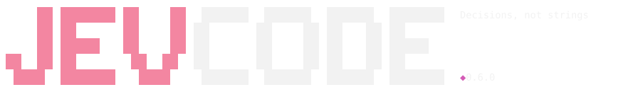
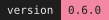
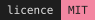
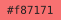

<div align="center">

<picture>
  <source media="(prefers-color-scheme: dark)" srcset="docs/media/wordmark-dark.svg">
  <source media="(prefers-color-scheme: light)" srcset="docs/media/wordmark-light.svg">
  
</picture>

<br>

**A fast, streaming terminal coding agent: the code model does the work, and your tests decide what lands.**

<br>

<!-- generated by scripts/gen-brand.mjs from package.json + src/tui/theme.ts; `npm run brand` after a
     version or engines bump. Local files, so they render with no network: in an editor preview, in a
     clone, and on npmjs.com (npm resolves relative paths against "repository"). -->





<br><br>

<picture>
  <source media="(prefers-color-scheme: dark)" srcset="docs/media/rule-dark.svg">
  
</picture>

</div>

## Install

```sh
npm install -g jevcode     # once the first release is on npm
npx jevcode                # same, without installing
```

<details>
<summary><b>Today: build it from the checkout</b> — the package is gated but not published yet</summary>

<br>

The first release has not shipped, so `registry.npmjs.org/jevcode` is still a 404. Until it lands,
this is the line that runs:

```sh
git clone https://github.com/coasty-ai/JevCode && cd JevCode
npm ci && npm run build && npm link
```

Progress and the remaining steps are in [docs/RELEASE.md](docs/RELEASE.md).

</details>

**Every channel** gives you the same `jevcode`:

| channel | command |
| --- | --- |
| npm | `npm i -g jevcode` |
| run without installing | `npx jevcode` · `bunx jevcode` · `pnpm dlx jevcode` |
| Homebrew | `brew install coasty-ai/jevcode/jevcode` |
| Arch Linux (AUR) | `yay -S jevcode` |
| Nix | `nix run github:coasty-ai/JevCode` |
| mise | `mise use -g npm:jevcode` |

npm, the one-shot runners and mise open with the first release. Homebrew and the AUR also need a
one-time setup by the maintainers (the tap, the AUR key), and Nix needs the first `flake.lock`, so
they can come later; the [install guide](docs/getting-started/install.md#install-channels) says which ones are live.
`jevcode upgrade` upgrades through whichever channel installed it (for mise, the AUR and Nix it
prints the command instead).

**Requirements.** Node 22.12 or newer — the launcher checks it and exits with a clear message on
anything older. macOS and Linux. On Windows use WSL 2: the sandbox and the machinery that runs your
tests both depend on POSIX features.

### First run

One key is enough. `OPENROUTER_API_KEY` runs the code model (and the few quick routing calls Jev
makes); any of the seven providers' keys works with `--provider`:

```sh
export OPENROUTER_API_KEY=…    # or a .env file in the directory you run jevcode from
jevcode
```

With **no key at all**, just run `jevcode`. The wordmark appears, then a one-field wizard takes the
key at a masked prompt — never echoed, never accepted as a command-line argument. Keys land in
`~/.config/jevcode/config.json`, written `0600` in a `0700` directory.

Then just talk. It is one conversation: every message gets a reply from the code model, streamed as
it is written — say hi, ask what it can do, ask who made it. Describe a change and the same reply
turns into work: you watch it read, edit and run your tests, with a small spinning donut in the
status bar while it thinks. It acts on its own (`autonomy: full`): nothing asks, every command runs
in the sandbox, and `/undo` reverts any step. `jevcode --autonomy review` asks before destructive
or unrecognised commands instead.

Without a terminal — `--no-input`, `--json`, or a pipe — JevCode never prompts. It exits `2` and
prints the exact environment variable or `jevcode login` command that would fix it.

### Try it in 60 seconds

`examples/demo-py` in the checkout is a small Python package with two planted bugs:

```sh
cp -r examples/demo-py /tmp/demo && cd /tmp/demo
git init -q && git add -A && git commit -qm init
python3 -m venv .venv && .venv/bin/pip -q install pytest
jevcode run "Fix the failing tests in tests/test_core.py without changing the tests."
```

<div align="center">
<picture>
  <source media="(prefers-color-scheme: dark)" srcset="docs/media/rule-dark.svg">
  
</picture>
</div>

## How it works

**The model drives.** The code model — `z-ai/glm-5.3-flash` through OpenRouter by default, or any
of seven providers — reads, searches, edits and runs commands through native tool calls, several
per reply. Reads run in parallel; edits and commands run one at a time.

**Everything streams.** Prose appears as it is written, a line before it is finished; each step
leaves one row (`Read …`, `Edit calc/core.py (+1 −1)`, `Bash python -m pytest -q · 7 passed`).

**The harness keeps it honest.** Every command runs in a sandbox with a pre-image of what it may
change, so `/undo` works per step. The run is `complete` only when the harness has seen your own
test command pass after the last change; if the model stops without running it, the harness runs
it.

**Jev makes a few quick routing calls.** Jev, a calibrated decision model, is asked at most one
quick question in a normal run, never decides what runs or whether you are done, and is optional.

Depth: [The agent loop](docs/architecture/agent-loop.md) ·
[the design](docs/AGENT-LOOP-DESIGN.md).

<!-- default model: src/config/defaults.ts (DEFAULT_MODEL). default mode: src/config/defaults.ts (DEFAULT_MODE).
     the loop: src/agent/driver.ts; the engine seam: src/loop/stages/agent.ts; Jev placements: src/agent/jev.ts.
     launcher guard: bin/jevcode.js:11-15. sandbox is macOS-only seatbelt or nothing:
     src/sandbox/seatbelt.ts (detectSandboxLevel). badges: src/config/defaults.ts (MODE_BADGE_WORD). -->

## Options

### Modes

`--mode <name>`, or `mode` in the config file, or `JEVCODE_MODE`.

| Mode | Badge | What runs | Keys it needs |
| --- | --- | --- | --- |
| `agent` *(default)* | `agent` | The code model works through tools, tests verify, Jev makes a few quick routing calls. | code model (+ Jev optional) |
| `jev-only` | `jev-only` | No generating LLM at all: the synthesizer proposes, Jev decides, tests verify. | Jev only |

`llm-jev`, `jev-on` and `jev-off` are [legacy modes](#legacy-modes), still accepted for saved
configs, resume and the bench (`/mode legacy` lists them).

### Commands

| | |
| --- | --- |
| `jevcode` · `chat` | open the TUI session |
| `jevcode run "<task>"` | one task, start to finish |
| `jevcode doctor` | read-only diagnostics: version, install method, paths, sandbox level, whether `pytest` imports for the Python the sandbox runs |
| `jevcode config` | every setting with the source it came from |
| `jevcode login` · `logout` | re-run the key wizard · forget stored keys |
| `jevcode sessions` · `report` · `why` | resume a run · bundle one for a bug report · explain one decision |
| `jevcode models` · `import` · `agents` | list models · pull in an existing config · manage delegates |
| `jevcode bench` · `perf` · `calibration` | the measurement harnesses |
| `jevcode completion <bash\|zsh\|fish>` | print a static completion script |
| `jevcode upgrade` | delegate to whichever package manager installed it |

### Flags worth knowing

| Flag | Effect |
| --- | --- |
| `--mode <name>` | the table above |
| `--model <id>` · `--provider <name>` | the code model and who serves it (default `z-ai/glm-5.3-flash` on OpenRouter) |
| `--autonomy <full\|review>` | `full` (default): nothing asks; `review`: a y/n card before destructive or unrecognised commands |
| `--theme <dark\|light\|daltonized\|ansi>` | colour theme; no auto-detect |
| `--sandbox <auto\|seatbelt\|none>` | macOS seatbelt, or nothing |
| `--plain` · `--json` · `--no-input` | readline instead of the TUI · machine-readable · never prompt |
| `--spend-cap <usd>` | hard stop on spend (default `$10`, or `$1` under `jev-only`) |

Full tables: [docs/COMMANDS.md](docs/COMMANDS.md) (slash commands) ·
[docs/KEYS.md](docs/KEYS.md) (key bindings) · `man jevcode`.

### Colour

Four themes, every one of them checked for contrast, and **every colour paired with a text marker**
so a frame reads the same with colour off — `NO_COLOR`, `--no-color` and `TERM=dumb` lose nothing
but the hue. Pink is brand, never meaning: `[block]` is red *and* says `[block]`.

| Role | Dark | Light | Marker |
| --- | --- | --- | --- |
| brand / accent |  |  | — |
| selected / active |  |  | `[you]`, `live` |
| ok |  |  | `✓` |
| review |  |  | `[review]` |
| block / error |  |  | `[block]` |

`daltonized` moves the block/error family off red onto blue; `ansi` is the ANSI-16 twin for
terminals without 256 colours. `/theme` swaps live. The wordmark at the top of this page is
generated from these same tables and from the splash grid by
[`scripts/gen-brand.mjs`](scripts/gen-brand.mjs); `npm run brand -- --check` fails if the two
have drifted apart.

<div align="center">
<picture>
  <source media="(prefers-color-scheme: dark)" srcset="docs/media/rule-dark.svg">
  
</picture>
</div>

## Legacy modes

Before 2026-09-23 the default let Jev decide every step. Those modes stay one `--mode` away.

| Mode | Badge | What runs |
| --- | --- | --- |
| `llm-jev` | `llm+jev · verified` | The code model writes candidate patches inside a search, tests verify them, Jev arbitrates. |
| `jev-on` | `jev+llm` | The code model writes one action per step and Jev decides every step. |
| `jev-off` | `llm-only` | The code model alone in the step loop: the control arm of the bench. |

### Jev-driven modes (2026-09)

Measured on `llm-jev` while it was the default; the agent loop has been verified live, not
benchmarked.

- On a 28-task development set, same build, one run per arm: 28/28 solved against a plain
  generator-only loop's 21/28 (p = 0.0078), at 0.225× the wall clock on the tasks both finished —
  in sample, on tasks some thresholds were tuned on.
- Out of sample: 14/18 against a tuned loop's 9/18 (p = 0.031) on single-file bugs; on a wider
  slice with multi-hunk and repository tasks, 13/22 against 12/22, not significant.

Every number, with its caveats: [Measurements](docs/measurements/README.md).

## Documentation

- [Documentation index](docs/README.md) — everything below, plus the full research record
- [Install and first run](docs/getting-started/install.md)
- [How it works](docs/architecture/agent-loop.md) — the loop, the tools, streaming, safety, where Jev sits
- [Measurements](docs/measurements/README.md) — every number on this page, with its run
- [Decisions](docs/DECISIONS.md) — what was chosen, and what was given up for it
- [Releasing](docs/RELEASE.md) — how a version gets to npm and the Homebrew tap
- [Contributing](CONTRIBUTING.md)
- [Security](SECURITY.md) — how to report a problem, and what the sandbox does not protect you from
- [MIT licence](LICENSE)

<div align="center">
<br>
<picture>
  <source media="(prefers-color-scheme: dark)" srcset="docs/media/rule-dark.svg">
  
</picture>
<br><br>
<sub><b>Decisions, not strings.</b></sub>
</div>
