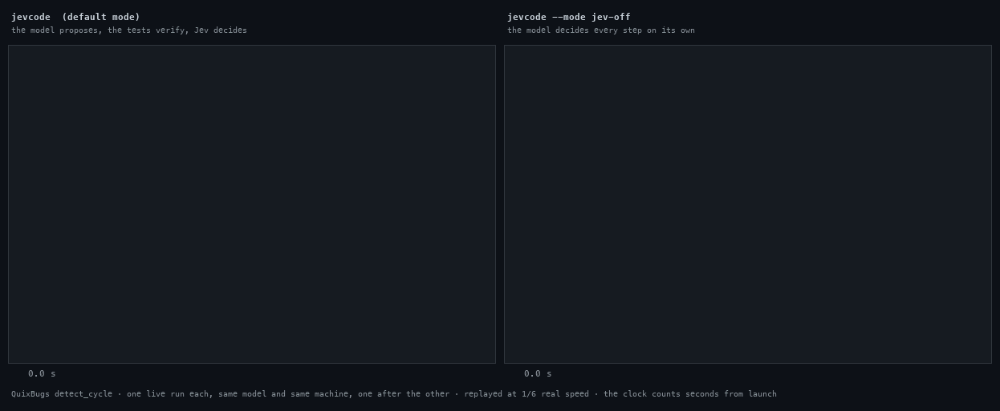

```
    ██ ███████ ██    ██  ██████  ██████  ██████  ███████
    ██ ██      ██    ██ ██      ██    ██ ██   ██ ██
    ██ █████   ██    ██ ██      ██    ██ ██   ██ █████
██  ██ ██       ██  ██  ██      ██    ██ ██   ██ ██
 ████  ███████   ████    ██████  ██████  ██████  ███████
```

**Decisions, not strings.**

JevCode is a coding agent that runs in your terminal, and it splits the work between two models.
Jev is a calibrated decision model: it answers every control question — what this step is for,
which files matter, whether an action is safe to run, whether the output succeeded, whether the
task is done. A code model writes the code. In the default mode the patch you get is picked by a
synthesizer that runs inside JevCode: it builds candidate fixes, runs your test suite against each
one, and calls the code model only when the search needs the help. Your tests decide what landed,
not a model's confidence. The default code model is `z-ai/glm-5.3-flash` through OpenRouter;
Anthropic models are an option, not a requirement. The synthesizer covers Python workspaces that
have a test runner JevCode can detect — anywhere else the agent falls back to a plain
write-it-and-check-it step loop, still with Jev deciding each step.

<!-- default model: src/config/defaults.ts:8 (DEFAULT_MODEL). default mode: src/config/defaults.ts:60.
     synthesizer applicability: src/synth/index.ts:299 (synthesizerHandles). -->



Same task, same code model, one run each, recorded in real time: on the left JevCode in its default
mode, on the right the same model driven by a plain LLM loop (`--mode jev-off`). Method, raw
captures and numbers: [docs/media/side-by-side.md](docs/media/side-by-side.md).

## Install

```sh
npm install -g jevcode                                    # once the first release is on npm
npx jevcode                                               # same, without installing
git clone https://github.com/coasty-ai/JevCode && cd JevCode && npm ci && npm run build && npm link
```

The first two work once the first release is on npm — the package is built and gated but not
published yet, so today the third line is the one that runs.

Node 22.12 or newer, checked by the launcher, which exits with a clear message on anything older.
macOS and Linux. On Windows use WSL 2: the sandbox and the machinery that runs your tests both
depend on POSIX features.

<!-- launcher guard: bin/jevcode.js:11-15. sandbox is macOS-only seatbelt or nothing:
     src/sandbox/seatbelt.ts:275 (detectSandboxLevel). -->

## First run

One key is enough. `OPENROUTER_API_KEY` serves both Jev and the code model:

```sh
export OPENROUTER_API_KEY=…    # or put it in a .env file next to your project
jevcode
```

With no key at all, just run `jevcode` in a terminal. The wordmark appears first, then a two-step
wizard asks which provider writes the code (OpenRouter or Anthropic), takes the key at a masked
prompt — never echoed, never accepted as a command-line argument — and then offers to reuse that
same key for Jev. It can verify the keys before you start, and tells you the price of doing so
first (free health checks plus one Jev decision, about $0.0001). It asks once whether you trust
this project's `AGENTS.md`. Keys land in `~/.config/jevcode/config.json`, written `0600` in a
`0700` directory. Then the session opens and you type your first task.

Without a terminal — `--no-input`, `--json`, or a pipe — JevCode does not prompt. It exits with
code 2 and prints the exact environment variable or `jevcode login` command that would fix it.

`jevcode login` re-runs the wizard. `jevcode config` prints every setting with the source it came
from. `jevcode doctor`, which checks your setup in one pass, arrives in the next release.

Try it in 60 seconds on the bundled demo workspace, a small Python package with two planted bugs:

```sh
cp -r examples/demo-py /tmp/demo && cd /tmp/demo
git init -q && git add -A && git commit -qm init
python3 -m venv .venv && .venv/bin/pip -q install pytest
jevcode run "Fix the failing tests in tests/test_core.py without changing the tests."
```

## Measured

Three claims, each with the run behind it. The caveats are part of the claim, not a disclaimer
under it.

- **Solves more, faster, cheaper than a plain LLM loop.** On a 28-task development set, same build
  and same code model, one run per arm: 28/28 solved against a plain generator-only loop's 21/28
  (one-sided sign test, p = 0.0078); 0.225× the wall clock on the 21 tasks both arms finished; and
  0.245× the dollars — where 78 % of JevCode's cost figure is estimated or rate-card against 0 % of
  the baseline's, because the Jev endpoint returns no cost. Passing the tests and being the right
  fix are scored separately: 26/28 behaviourally correct against the baseline's 20/28, with two
  tasks where the baseline was right and JevCode was not. The guard thresholds were tuned on some
  of those very programs, which is exactly why the next row exists.
  [Measurements](docs/measurements/README.md)
- **It holds up out of sample.** On a fresh 18-task slice that nothing was fitted against, and
  against a *tuned* generator-only loop rather than a naive one: 14/18 against 9/18, p = 0.031, at
  flat cost. On easy single-file bugs a tuned loop is slightly faster than JevCode, so "faster" is
  a claim about the plain loop only, never a general one.
  [Measurements](docs/measurements/README.md)
- **It installs as one file and starts instantly.** Zero runtime dependencies — `npm install
  jevcode` adds exactly one package — a 1 MB tarball, and a first frame in about 130 ms in a real
  terminal with the network untouched, against a design budget of 300 ms.
  [Measurements](docs/measurements/README.md)

## Modes

`--mode <name>`, or `mode` in the config file, or `JEVCODE_MODE`.

| Mode | Badge | What runs | Keys it needs |
| --- | --- | --- | --- |
| `llm-jev` *(default)* | `llm+jev · verified` | The code model writes candidate patches, tests verify them, Jev arbitrates. | code model + Jev |
| `jev-on` | `jev+llm` | The code model writes the code and Jev decides every step. | code model + Jev |
| `jev-only` | `jev-only` | No generating LLM at all: the synthesizer proposes, Jev decides, tests verify. | Jev only |
| `jev-off` | `llm-only` | The generator alone, no Jev. This is the baseline the numbers above are measured against. | code model |

<!-- modes: src/core/types.ts:808. badges: src/config/defaults.ts:62 (MODE_BADGE_WORD).
     sentences: src/chat/facts.ts:125-130 (MODE_SENTENCE). -->

## Documentation

- [Documentation index](docs/README.md) — everything below, plus the full research record
- [Install and first run](docs/getting-started/install.md)
- [How it works](docs/architecture/overview.md) — the step loop, the synthesizer, the sandbox
- [Measurements](docs/measurements/README.md) — every number on this page, with its run
- [Decisions](docs/DECISIONS.md) — what was chosen, and what was given up for it
- [Contributing](CONTRIBUTING.md)
- [Security](SECURITY.md) — how to report a problem, and what the sandbox does not protect you from
- [MIT licence](LICENSE)
