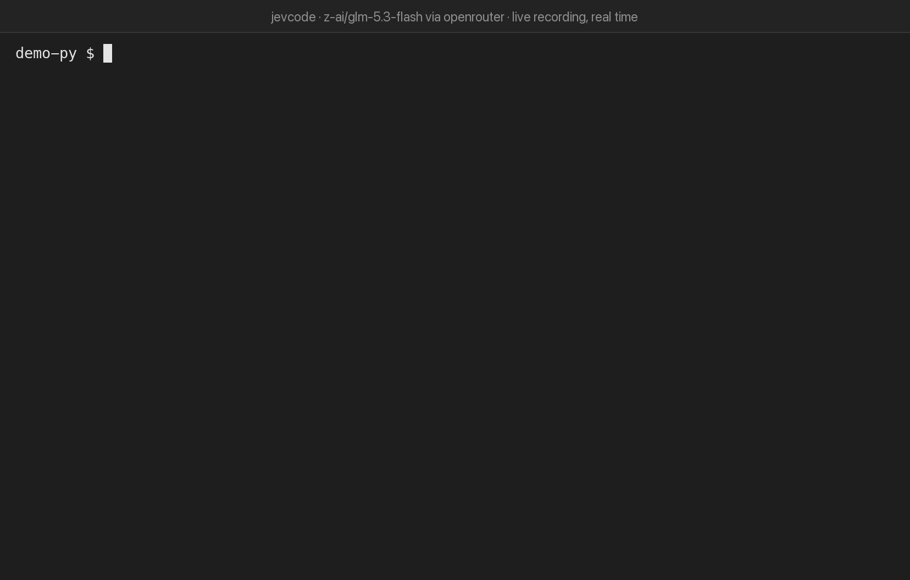

<div align="center">

<picture>
  <source media="(prefers-color-scheme: dark)" srcset="docs/media/wordmark-dark.svg">
  <source media="(prefers-color-scheme: light)" srcset="docs/media/wordmark-light.svg">
  
</picture>

<br><br>

<!-- badges: generated by scripts/gen-brand.mjs (`npm run brand`), local files so they render with no network -->


</div>

JevCode is a coding agent that runs in your terminal. You chat with it, and when you ask for a
change it reads, edits and runs your code itself.

<p align="center">
  
  <br>
  <sub>A real session at real speed: two bugs fixed in under ten seconds, for about a tenth of a cent. <a href="docs/media/demo.md">How it was recorded</a>.</sub>
</p>

## Install

```sh
npm i -g @coasty/jevcode     # install
npx @coasty/jevcode          # or try it without installing
```

You need Node 22.12 or newer on macOS, Linux or WSL 2. For Homebrew, AUR, Nix and mise, see the
[install guide](docs/getting-started/install.md#install-channels), which says when each one is
available.

## Quick start

Run `jevcode` in your project. The first time, it asks for an OpenRouter key and saves it; to use
another provider, see [Bring your own model](#bring-your-own-model) below. Then just talk to it.
Ask a question and it answers; ask for a change and it does the work.
[Try it on the demo project](docs/getting-started/first-run.md#try-it-on-the-demo-project).

It acts without asking, and `/undo` reverts a step's changes to your files. Start it with
`jevcode --autonomy review` to approve risky commands first, or use `jevcode run "<task>"` to run
one task and exit.

## Bring your own model

OpenRouter is the default. To use another provider, set its key and pass `--provider` (and
`--model` to pick a model):

| `--provider` | Key |
| --- | --- |
| `openrouter` (default) | `OPENROUTER_API_KEY` |
| `openai` | `OPENAI_API_KEY` |
| `anthropic` | `ANTHROPIC_API_KEY` |
| `xai` | `XAI_API_KEY` |
| `fireworks` | `FIREWORKS_API_KEY` |
| `meta` | `META_API_KEY` |
| `gemini` | `GEMINI_API_KEY` |

Export the key, put it in a `.env` file, or save it with `jevcode login`. More in
[Keys](docs/getting-started/keys-and-providers.md).

## How it works

- **It streams.** Replies appear as they are written.
- **It works through tools.** The model reads, searches, edits and runs commands. Reads run in
  parallel.
- **It checks its own work** with the fastest test or typecheck that covers the change. Add
  `--agent-verify tests` to have JevCode run your whole test suite as well.
- **Jev helps on the side.** Jev is a small decision model that makes a few quick calls. On models
  where it helps, it spots a simple question so the reply comes back faster. It never blocks
  anything, and its key is optional.

More in [The agent loop](docs/architecture/agent-loop.md).

## Links

[Documentation](docs/README.md) · [Configuration](docs/operations/configuration.md) ·
[Commands](docs/reference/cli.md) · [Contributing](CONTRIBUTING.md) · [Security](SECURITY.md) ·
[MIT licence](LICENSE)
