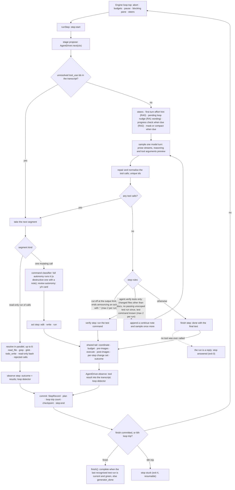
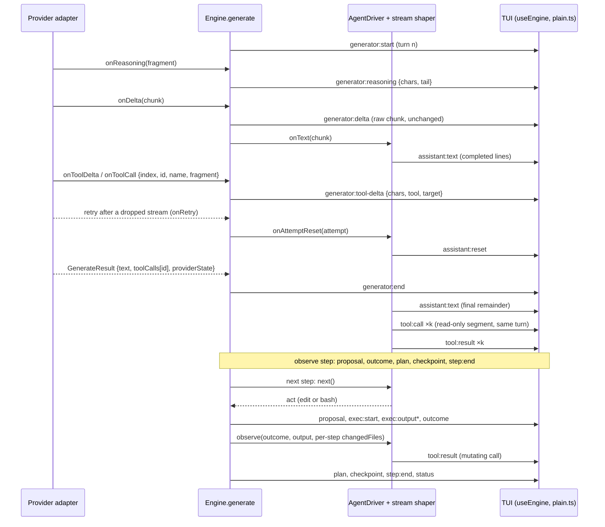

# The agent loop: JevCode's default harness

Status: as built, 2026-09-23; verification revised 2026-09-25 (§A6). `agent` is the default `EngineMode`. The code cites this document by section number
(`AGENT-LOOP-DESIGN §3.3`, `§A2`, …), so a section number is an address and does not move.

Scope:
- the default `EngineMode`, `agent`: the code model drives with native tool calls and checks its own work; the harness executes
  and checkpoints, and runs the test suite itself only under the opt-in `agent.verify tests` (§A6);
- Jev reduced to three quick hints at the edges of a run (RA0, RA1, RA2, section 13). A normal run makes at most one Jev
  request, and on the default provider it makes none;
- the Jev-driven modes taken off the default surface, and their modules moved out of the default path (section 14.6).

`jev-only` stays an advertised mode. `llm-jev`, `jev-on` and `jev-off` stay accepted (saved configs, resume, bench) but are no
longer advertised (section 14.1). All four keep their behaviour and their wire bodies byte for byte.

Conventions. `path:line` cites this repository at `e48d889`, the tree the design was written against, and "today" in the
text means that tree; the modules the design added are cited by path, as built. A URL cites a web source read on
2026-09-23. "Inferred" marks a judgement that was not measured. Every number in this document is a named constant;
section 11 lists them.

---

## §A User directives this design implements (2026-09-23)

The owner gave directives A1-A5 on 2026-09-23 and A6 on 2026-09-25. They are written into the sections below; this list only
says where each one lives. The code cites them as §A1-§A6.

- <a id="a1"></a>**A1. Every message gets a model reply; no canned text.** *"No need to add the automated reply it should always
  be llm reply and make sure it works perfectly."* In agent mode the chat and the run are one conversation: every message is
  the next user turn of an agent run that carries the session (§7.6). A greeting or a question is answered in prose with no
  tool call; that run stops `answered` and renders as a reply (§3.3, §8, §9.4). Agent mode has no intake routing, no
  "On it" line and no `do it` offer (§13.2). The system prompt leads with the verified identity header (§5.1). A provider
  error is a `[ui]` row, never assistant text, and the path from Enter to the first request waits on nothing slow (§3.1).
- <a id="a2"></a>**A2. Full autonomy never asks and never refuses.** *"For full auto mode never need to ask at all even if it
  is."* Under `--autonomy full`, the default, the command classifier gates nothing: a destructive command runs sandboxed and
  pre-imaged like any other, and its step carries a one-line note (§12). Only `--autonomy review` shows the y/n card, for
  destructive and unknown commands (§8, §12).
- <a id="a3"></a>**A3. The thinking donut lives in the status row.** *"Move the donut spiralling inside the chat status bar
  mini bar super nice and clean."* The 12-row 3D animation slot is gone. A braille mini indicator in the status row's glyph
  slot shows what is running (§9.4).
- <a id="a4"></a>**A4. Jev only for trivial, quick decisions.** *"the jev part is way too much … reduce where we use and only
  for trivial quick decisions."* Jev's placements are the first-turn effort hint (RA0), the wording of a loop nudge (RA1) and a
  late progress check (RA2). None of them gates anything (§13).
- <a id="a5"></a>**A5. The refinements from the peer interface review.** The identity header leads the system prompt (§5.1).
  A turn with no tool call keeps the chat's look until its first tool call, and such replies never name a session (§7.6,
  §9.4). The mini indicator takes the status row's existing glyph slot and steps on the spinner's tick (§9.4). The note of a
  destructive command says truthfully whether `/undo` can restore its effect (§12).
- <a id="a6"></a>**A6. Verification is the model's, in proportion to the change (2026-09-25).** *"Why is it taking so much
  time to test make sure it is generic and generlized and all these tools work for the majority of population and is not
  finetuned."* The session behind it asked for `create temp.py` inside this repository: the file was written in 3 s, then
  the harness's own verify step started the whole ~11,500-test suite, which ran until the user pressed Esc 134 s later. By default the harness now runs no test command
  of its own. The system prompt asks the model for the fastest check that covers a behaviour change (one test file or test
  name, a typecheck, lint or build of what it touched), the whole suite only when the user asks or the change is broad, and
  nothing for questions, docs or simple file operations, as Codex CLI, Claude Code and OpenCode do (§5.1). The harness's
  verify step is the opt-in `agent.verify tests` (`--agent-verify tests`, `JEVCODE_VERIFY=tests`, §3.3). `complete` stays
  honest without nagging: it needs the last recognised test run to be green and current (§3.3). Tuning that served only the
  default GLM model is gone: a model other than GLM gets its provider's default reasoning effort (§6.3), and every open-weight
  family gets the native-tool-call addendum (§5.2).

The standing directives behind the whole design: the TUI streams everything as it arrives and is fast; the harness is a
state-of-the-art open-source loop; the default gives the agent complete autonomy; and no benchmark is part of this work, but
it must work (section 16).

---

## 0. Decisions at a glance

| Question | Decision |
|---|---|
| Loop shape | One model-driven loop: sample the model, run the tool calls it returned, append the results, repeat until it answers with no tool calls. There is no per-step intent, context, risk, judge or replan stage. |
| Tool protocol | Native tool calling with `tool_choice: 'auto'`. Several calls per reply. Tool results go back as native tool messages with ids. This replaces the forced one-action `propose_action` tool, for this mode only. |
| Tools | `read_file`, `write_file`, `edit_file`, `bash` (with `workdir`), `grep`, `glob`, `todo_write`. Read-only calls run in parallel, up to 8 at a time; this includes `bash` commands the classifier proves read-only. Edits and all other commands run one at a time, in call order. |
| Step | Each engine step is exactly one of: a read-only segment of a model turn (`observe`), one edit, write or command (`act`), one harness test run (`verify`, only under `agent.verify tests`), or the final answer (`finish`). `/undo`, `/rewind`, `/diff N`, pre-images and `StepRecord` keep their one-action-per-step meaning. |
| Session | One conversation per session. Every chat message is the next user turn of an agent run that carries the session: the previous agent run's transcript and the chat turns since then (section 7.6). There is no intake routing: the model decides, by calling a tool or not, whether a message is work. |
| Where it lives | `src/agent/` (about a dozen small modules). The engine dispatches to it from `runStep` the same way it dispatches to the synthesizer today, and reuses the whole execute/commit tail. |
| Streaming | `generator:delta` stays the raw stream of prose chunks, the same contract as today. `assistant:text` adds line commits for scrollback. The live region shows the partial line itself, reasoning progress, and `writing edit_file src/a.ts…`. A provider retry emits `assistant:reset`. |
| Stop | The run stops when the model replies with no tool calls. A run that never called a tool is a reply and stops `answered`. There is a narrow continuation rule. The model checks its own work in proportion to the change; the harness runs the detected test command itself only under the opt-in `agent.verify tests` (§A6). `complete` needs a current green run of a recognised test command. `complete`, `generator_done` and `answered` all exit 0. |
| Loops | The agent has its own detector over calls. It trips on 3 consecutive identical calls with identical results, or on one call+result repeated more than 5 times in the last 10 calls. A trip only sends a nudge; the 6th trip stops the run as `stuck` (exit 4, resumable). |
| Context | Tool output is capped and spilled to `outputs/step-N.txt`. At 50 % of the budget, stale tool results are masked: client-side where reasoning is not bound to the prefix, and through Anthropic's server-side context editing on the Anthropic adapter. At 85 %, a simple compaction runs (an LLM summary, with a code fallback) that replays no earlier assistant turn. |
| Safety | Full autonomy by default, the existing sandbox and per-step pre-images. A rule classifier has 13 destructive rules, including `git_discard`; `/dev/null` and `$TMPDIR` are exempt. Under full autonomy it gates nothing: a destructive command runs, and its step carries a one-line note that says truthfully whether `/undo` can restore the effect. `--autonomy review` asks y/n for destructive and unknown commands. |
| Jev | Three quick hints at the edges of a run. Each has a short deadline (300 ms for RA0, 400 ms for RA1 and RA2) and a code fallback, is skipped when Jev is unavailable, and is never fatal. None gates an action, a stop or completion. The three: a first-turn effort hint (RA0, asked only where it can change the request), the wording of a loop nudge (RA1), and a late progress check that can add one hint (RA2). A normal run makes at most one Jev request; on the default provider it makes none. The Jev key is optional in the default mode. |
| Providers | All seven adapters. The contract is widened additively (`GenerateRequest.agent`), so legacy requests are unchanged. Reasoning is replayed per provider. On Anthropic: adaptive thinking with `display: 'summarized'`, effort `high`, and an explicit `prefix_mismatch_behavior`. A rejected replay is retried once without reasoning state. GLM tool calls are repaired, and calls leaked as XML are recovered. |
| Repository | The Jev-driven stage modules, the synthesizer and the chat lookup move under `src/jev-modes/` (slice S7). Afterwards `src/loop` imports `src/jev` only from the engine, the routers and context compaction. Importers of `src/jev` outside `src/jev` and `src/jev-modes`: 45 before this work, 47 once the agent loop landed, 22 after S7; `docs/STATUS.md` tracks the number. |

---

## 1. Why a redesign

### 1.1 What the harness does today

- **One forced action per step.** The generator must call a single `propose_action` tool, whose `action` is one of six
  kinds (`src/provider/actions.ts:15`, `:28-81`). A named `toolChoice` forces it (`src/jev-modes/stages/propose.ts:53`).
  Every adapter disables parallel tool calls: `src/provider/openrouter.ts:109`, `src/provider/anthropic.ts:111-116`,
  `src/provider/openai.ts:155`, `src/provider/openai-compat.ts:184`.
- **No conversation.** Each step rebuilds one user message from the plan, a 4-entry window and a relaxed file view
  (`src/jev-modes/stages/propose.ts:43-44`, `src/provider/prompts.ts:1002`).
  - `ChatMessage` is text only (`src/core/types.ts:891-894`) and `ToolCall` has no id (`src/core/types.ts:884-888`), so no adapter can send a tool result back as a tool message.
  - The model never sees its own earlier calls, and only the system prompt and tools can hit a prompt cache (inferred from `src/provider/anthropic.ts:89`, `:101`).
- **The session is not a conversation either.** A run's task is the raw message text (`src/cli/session.ts:2349`,
  `:4262-4265`). The chat history reaches only the chat model and the intake (`src/cli/session.ts:4412`,
  `conversation: ledger.recent()`, 6 turns: `src/chat/ledger.ts:28-29`).
- **Little streamed prose.** A forced tool choice makes Anthropic prefill the tool call, so no text precedes it
  (https://platform.claude.com/docs/en/agents-and-tools/tool-use/define-tools). Meta accepts only `auto`
  (`src/provider/meta.ts:9-14`). So the TUI mostly shows "streaming action… N chars" (`src/tui/App.tsx:318-325`).
- **Jev on the per-step path.**
  - In the default `llm-jev` mode, one step can run replan, the synthesizer (1-12 Jev requests), a harm-risk request and a record-only judge request (`src/loop/engine.ts:4405`, `:4426-4442`, `:4473-4503`, `:4536-4570`).
  - In `jev-on`, every step runs intent, context, a four-Score risk and a judge.
  - The head-to-head measurement booked 482 decision requests over 28 tasks, costing $0.0986 of the $0.1441 total (`docs/measurements/head-to-head.md:44`, `:91`).
  - A Jev outage can pause a run (`src/loop/engine.ts:2778-2794`), and a single ask can take about 30 s to fail (3 attempts × 10 s, `src/jev/types.ts:34-42`; inferred from the constants).
- **The product copy says so.** Jev-first copy appears in:
  - the chat system prompt: "Jev decides, the code model writes" (`src/chat/llm-turn.ts:60-61`);
  - the CLI tagline (`src/cli/args.ts:389`);
  - the package description (`package.json:4`);
  - the README "How it works" and "Measured" sections (`README.md:216`, `:252`).

### 1.2 What the state of the art does

The research read 18 open-source harnesses on 2026-09-23. All of them run the same loop, and none runs a side-model
decision on every step.

- **One model-driven loop with deterministic guards.** Examples:
  - Codex (https://github.com/openai/codex, `codex-rs/core/src/session/turn.rs:533-660`);
  - Gemini CLI (https://github.com/google-gemini/gemini-cli);
  - OpenCode (https://github.com/sst/opencode, `session/prompt.ts:1088-1179`);
  - Crush (https://github.com/charmbracelet/crush);
  - mini-swe-agent (https://github.com/SWE-agent/mini-swe-agent);
  - the Claude Agent SDK (https://code.claude.com/docs/en/agent-sdk/agent-loop).

  A source study of 11 production harnesses found hand-rolled loops, no agent frameworks, and no model-ranked file lists (https://arxiv.org/abs/2609.00006).
- **One conversation per session.** Codex's turn loop and the Claude Agent SDK keep one transcript across the user's
  messages (same sources). Follow-up requests see earlier results, and the provider cache holds.
- **A small tool set, parallel reads.** Read-only tools run concurrently and mutating tools run in order (Codex
  `core/src/tools/parallel.rs:137-195`; Gemini `scheduler/scheduler.ts:472-576`; the Claude Agent SDK agent-loop docs).
  Dedicated search tools help mid-tier models: removing them cost a 30B model 15 points
  (https://arxiv.org/abs/2609.20804). That is why this design keeps `grep` and `glob` for GLM.
- **str_replace edits with a tolerant matcher and actionable errors.** Examples: OpenCode's 9-replacer cascade
  (`packages/opencode/src/tool/edit.ts:681-737`), Gemini CLI's re-indenting flexible match
  (https://raw.githubusercontent.com/google-gemini/gemini-cli/main/packages/core/src/tools/edit.ts,
  `calculateFlexibleReplacement` / `applyIndentation`), and Codex `seek_sequence.rs:1-6`. Edit-tool shape alone moved 15 models by
  5-14 points (https://stencil.so/blog/the-harness-problem).
- **Staged context.** Harnesses truncate and spill tool output (Codex 10 KB; OpenCode 2000 lines / 50 KB; Claude Code about
  30k chars: https://code.claude.com/docs/en/tools-reference). They mask stale results before summarising
  (https://arxiv.org/abs/2508.21433; https://claude.com/blog/context-management), and summarise near the limit.
- **Loop guards on calls, not on plans.** Three examples:
  - OpenCode trips on the last 3 calls being identical in tool and input (`DOOM_LOOP_THRESHOLD = 3`, `packages/opencode/src/session/processor.ts`).
  - Crush trips when a call+result hash appears more than 5 times in the last 10 steps (`internal/agent/loop_detection.go:11-14`).
  - Gemini CLI asks a model after 30 turns, then every 10 turns, with a threshold of 0.9 (`packages/core/src/services/loopDetectionService.ts:37-66`).
- **Reasoning replayed between tool turns.** Dropping it made GLM-4.7/5 loop in goose
  (https://github.com/aaif-goose/goose/issues/7363). MiniMax measured 69.4 vs 67.2 on SWE-bench Verified
  (https://www.minimax.io/news/why-is-interleaved-thinking-important-for-m2). JevCode today counts reasoning and drops it
  (`src/provider/openrouter.ts:246-247`).
- **Side models at the edges only.** Three examples:
  - Claude Code's auto-mode classifier reviews only the calls the rules leave open (https://www.anthropic.com/engineering/claude-code-auto-mode).
  - Gemini CLI's loop model runs only after 30 turns (above).
  - Codex auto-review sees 7.2 % of actions, at the sandbox boundary (https://alignment.openai.com/auto-review/).

The redesign adopts that shape. It keeps JevCode's substrate: provider adapters, workspace, sandbox, checkpoints,
undo, the spend meter and events.

---

## 2. Architecture

### 2.1 Modules

Everything new lives under `src/agent/` (about 5,500 lines in 30 modules; none is over 460 lines).

| Module | Responsibility |
|---|---|
| `src/agent/index.ts` | `createAgentDriver(): AgentDriver`; re-exports the helpers the tests use. |
| `src/agent/driver.ts` | The turn loop: `next()`, `observe()`, deriving the queue from the transcript, segmenting, stop rules, nudges, steers. |
| `src/agent/turn.ts` | Sampling one model turn: the request (system prompt, tool list, transcript, parallel calls, cache key, reasoning replay, the Anthropic settings), the rejected-replay retry and the stream hooks. |
| `src/agent/calls.ts` | Resolving the calls of a turn: a disposition per call, in call order (the read-only segment, one mutating call, or a rejection before the call touched the workspace), and the gate of a mutating command. |
| `src/agent/stop.ts` | The stop rules at a turn with no tool calls (section 3.3). |
| `src/agent/transcript.ts` | The append-only conversation: seq-addressed records, masking marks, compaction records, JSONL persistence, restore and truncation, the projection into request messages, token estimate. |
| `src/agent/head.ts` | The head of a fresh run: the first user message, the carry from the parent run and the continuation message of a follow-up run. |
| `src/agent/state.ts` | `AgentStateV1`, persisted opaquely in the checkpoint (section 10). |
| `src/agent/context.ts` | Context policy: budget, estimate, masking, compaction and the meter (section 7). |
| `src/agent/providers.ts` | Per-provider capabilities: whether reasoning is bound to the prefix, the masking mode, and the request settings of section 6.3. |
| `src/agent/prompt.ts` | The system prompt, the model-family addenda and every fixed harness message text. |
| `src/agent/stream.ts` | The prose stream shaper: commits whole lines as `assistant:text`, holds open code fences, resets on a provider retry. |
| `src/agent/repair.ts`, `json-repair.ts` | Tool-call repair: zero-dependency JSON repair of arguments, extraction of GLM/Qwen XML and fenced JSON from text, name and argument aliases. |
| `src/agent/loop.ts` | The agent loop detector and the progress-check schedule (section 3.6). |
| `src/agent/tools/specs.ts` | The seven tool specs (exact JSON schemas), the per-role tool list and the one argument validator. |
| `src/agent/tools/read.ts`, `search.ts`, `todo.ts`, `shell.ts` | Executors for `read_file`, `grep` / `glob`, `todo_write`, and read-only `bash`. All run inside the driver, in the observe batch. |
| `src/agent/tools/edit-match.ts` | The `edit_file` matching cascade, re-indentation, the disproportion guard, the closest-candidate error, the placeholder guard. |
| `src/agent/tools/format.ts`, `result.ts` | Tool-result rendering, clipping and spill pointers; the shape every executor returns. |
| `src/agent/tools/check.ts` | Optional post-write syntax check (section 4.8). |
| `src/agent/safety.ts`, `safety-rules.ts`, `safety-git.ts`, `shlex.ts` | The rule-based command classifier (`readonly` / `safe` / `destructive` / `unknown`), its rule ids and sentences, the git rules, and the small POSIX-shell reader it classifies with. |
| `src/agent/jev.ts` | The three in-run Jev placements: RA0 (first-turn effort hint), RA1 (loop-nudge wording) and RA2 (progress check). Each is routed through `routeSpeculative` and carries a four-clause `jev-contract` block. |
| `src/agent/limits.ts` | Every agent constant of section 11. |
| `src/loop/stages/agent.ts` | `runAgentStage(ctx, driver, actx)` and every helper of the engine seam that needs no private engine state: the per-step change set, the rule `RiskAssessment`, the destructive note, the command a test run is recorded under and the stream tap. This is the engine-side twin of `src/jev-modes/stages/synth.ts`. |
| `src/core/agent-run.ts` | `isReplyOnlyRun`, the one predicate for "this run was a reply": the engine, the TUI and the session all import it. |

Reused unchanged:
- the provider adapters (widened, section 6);
- `runExecuteStage` (`src/loop/stages/execute.ts:57`, gaining `run.cwd`);
- `Workspace` (`src/core/types.ts:1261-1294`);
- the sandbox (`src/sandbox/run.ts:189`);
- pre/post images (`src/checkpoint/images.ts:301`) and undo/rewind;
- the spend meter, budgets (`src/loop/budget.ts:38-64`), `finish()` and exit codes;
- `routeSpeculative` (`src/jev/router.ts:144`).

The legacy loop detector is **not** used in agent mode. The agent has its own detector (section 3.6), which reuses only
`testFailureIdentity` from `src/loop/loopdetect.ts`.

### 2.2 The engine seam

Today `Engine.runStep` dispatches the propose stage to an injected `Synthesizer` through `runSynthStage`
(`src/loop/engine.ts:4473-4503`, `src/jev-modes/stages/synth.ts:17-31`). It then runs the shared tail: coordinate, budget
check, pre-images, execute, post-images, outcome (`src/loop/engine.ts:4600-4700`). After that come `commit()` (`:5828`) and the stop
rules (`:4716-4724`).

The agent mode adds one branch next to the `jev-off` branch (`src/loop/engine.ts:4571-4599`):

```ts
} else if (this.mode === 'agent') {
  stage = 'propose';
  const next = await this.stage('propose', () => runAgentStage(ctx, this.agentDriver(), this.agentContext(draft)));
  // observe → outcome is final, no execute; act/verify/finish → the shared tail executes the proposal
} else { /* jev-off, unchanged */ }
```

- **No Jev stages.** `usesJev('agent')` returns false (`src/loop/engine.ts:782-784` gains `&& mode !== 'agent'`). None of the intent,
  context, risk, judge or replan code runs.
- **The driver.** It is `EngineOptions.agent` when a test injects one. Otherwise it is `createAgentDriver()`, loaded by a dynamic import of `src/agent/index.ts`.
- **Tool results before the checkpoint.** After the step's `try`/`catch` and **before** `commitAfterStep()`/`commit()` (`src/loop/engine.ts:4702-4703`), the
  engine calls `driver.observe(actx, observation)` for every non-discarded `act`, `verify` and `finish` step. The tool
  result is therefore in the transcript when the checkpoint is written.
  - The call runs after the `try`/`catch`, so a `failed` outcome from `handleStepError` is included (`src/loop/engine.ts:5791-5800`).
  - `observe()` is wrapped. An exception becomes a transcript warning plus a stage failure (three in a row stop the run with `error`, `src/loop/engine.ts:321`), and the step still commits.
  - The driver updates its in-memory transcript before any I/O, so the call counts as resolved even when the disk append fails.
- **Test results without Jev.** On a test-command run, the engine fills `draft.judge` with `codeJudge()`
  (`src/loop/judge-code.ts:79`). `lastTests` and the `tests Np/Nf` segment keep working.
- **Discarded steps.** The engine can discard a step after `next()` has returned it. This happens in three places:
  the checkpoint-failure pane before execute (`src/loop/engine.ts:4603-4608`), a coordination discard (`:4613-4620`), and
  a pause-now under rule 1 (`:5738-5745`). The driver needs no hook for this.
  - A call is resolved only once its `result` record is in the transcript. `next()` re-derives the queue from the transcript every time: it is the `tool_use` ids of the latest assistant record that have no result.
  - A discarded `act` call is therefore issued again by the next step, so no request ever carries a `tool_use` without its `tool_result`.
  - A discarded `verify` or `finish` is simply re-derived by the stop rules.
- **Per-step change set.** For `act` steps that run a command, and for `verify` steps, the engine computes the files **this step** changed
  (rule in section 3.4). It passes that set as `AgentObservation.changedFiles`, not the run-cumulative `changedFiles`
  (`src/loop/stages/execute.ts:168`, `src/workspace/files.ts:184-243`). In agent mode it also sets `lastChangeStep` when
  a command other than the detected test command changed a workspace file. Today a `run` never sets it
  (`src/loop/engine.ts:5896`). A step whose per-step change set is docs alone (`isDocsOnlyChange`, 3.3) sets it for
  neither an edit nor a command, so a green run before it stays current.
- **Loop trips.** The driver reports them on the step summary (section 3.6). The engine skips `computeSignatures` and
  `detector.observe` in agent mode.

### 2.3 The step model

A step is the engine's unit of pause, steer, budget check, checkpoint and undo. The agent maps its work onto steps
like this:

| Step kind | What happens in it | `proposal.action` | Engine executes? |
|---|---|---|---|
| `observe` | At most one model turn is sampled. Then one **read-only segment** of calls is resolved inside the driver: `read_file`, `grep`, `glob`, `todo_write`, `bash` commands the classifier calls `readonly`, and any call rejected before it touched the workspace. | `{ kind: 'read', paths: <files read by read_file> }` | No: the driver hands back the finished outcome. |
| `act` | At most one model turn, then **one** mutating call: `edit_file`, `write_file` or a non-read-only `bash`. | `edit`, `write` or `run` | Yes, through the shared tail. |
| `verify` | Only under `agent.verify tests` (off by default, §A6): the harness runs the detected test command after the model stopped with changes and no passing unscoped run of it. | `{ kind: 'run', command: <test command> }` | Yes. |
| `finish` | The model's final answer. | `{ kind: 'done', summary }` | Yes (`noop`). |

Why this mapping:

- **Exact undo.** `writePreImages` removes the step's image directory before writing (`src/checkpoint/images.ts:313-317`), and
  `StepRecord.proposal` holds exactly one action (`src/core/types.ts:65-78`, `:517-528`). One mutating action per step
  keeps `/undo`, `/rewind` and `/diff N` exact with no change to `src/undo/`.
- **Cheap reads.** A read-only segment needs no pre-images, no coordination and no safety gate. It can run in parallel and still
  commit as one step. The pre-images of a `run` copy the whole dirty set, up to 200 files / 16 MiB per command
  (`src/checkpoint/images.ts:38-41`, `src/loop/engine.ts:4736-4745`). Moving `ls`, `cat`, `rg` and `git diff` out of
  that path is the largest per-command speed-up available (inferred).
- **Checks between turns.** Every step contains at most one model turn, plus one nudge turn (section 3.3). Pause-at-step, steers and
  budget checks therefore land between turns.

### 2.4 The loop



---

## 3. The turn loop in detail

### 3.1 `AgentDriver.next(ctx)`

1. **Restore once.** On the first call of a run:
   - Load `ctx.state` (`AgentStateV1`, section 10) and read `<runDir>/agent/transcript.jsonl`.
   - Truncate the file after `state.transcriptSeq`. The fold of steps committed after `state.json` has already raised that seq (section 10).
   - A resumed run whose transcript is missing throws `AgentTranscriptMissingError`, a `ConfigError` that names the path. The run is never restarted silently.
   - A fresh run builds its head (section 7.6). That is either the carried parent transcript plus a continuation message, or the first user message (section 5.3).
2. **Absorb engine signals.**
   - `ctx.takeSteers()`: answer every unresolved call with `NOT_EXECUTED_STEER` (section 5.4) and queue the steer text as a harness note.
   - `ctx.takeCompactRequest()`: `/compact` forces a compaction before the next turn.
3. **Derive the queue.** The queue is the `tool_use` ids of the latest assistant record that have no `result` record. If the queue is
   non-empty, take the next segment (3.2) and return it.
4. **Sample a turn.** The queue is empty at this point.
   1. Resolve pending notes: at the run's first turn, the effort hint (RA0, section 13.2); a loop nudge after a trip
      (wording by RA1); or the progress check when it is due (RA2, section 3.6).
   2. Apply masking or compaction when due (section 7).
   3. Build the request (section 6.1) and call `ctx.generate(req, { turn, onText, onToolCall, onAttemptReset })`.
5. **Rejected replay.** A provider 400 whose message names reasoning, thinking, a signature or a tool-call id is retried
   once in the same step with every `providerState` stripped. Replay is then disabled for the run (section 6.5).
6. **Parse.**
   - Take `result.toolCalls`; if there are none, try `extractTextToolCalls(result.text)` (section 4.4).
   - Assign ids: the provider id when it is non-empty and not already used in this run, else `call_<turn>_<i>`. The replayed assistant record carries the same id, so pairing holds on every wire.
   - Normalise each call (4.4).
   - Append the assistant record: the prose with any extracted XML removed, the `tool_use` blocks, and `providerState`.
   - At most `AGENT_MAX_CALLS_PER_TURN` (32) calls are kept; the rest are answered with `NOT_EXECUTED_TOO_MANY`.
7. **Empty reply.** A reply with no text and no calls throws `GeneratorResponseError('empty reply')`. That is a stage failure
   (`src/loop/engine.ts:5777-5790`), and three in a row stop the run with `error`.
8. **Calls present:** go back to step 3. **No calls:** apply the stop rules (3.3).

**Nothing slow before the first request** (§A1). The path from Enter to the first model request runs no baseline test,
takes no fresh workspace listing (it uses the cached candidates) and spawns no git process that is not already cached. The
target is p95 ≤ 50 ms of harness time before the request is sent, plus at most RA0's 300 ms deadline where RA0 is asked
(section 13.2).

### 3.2 Segmenting a turn

Calls keep their order. A segment is either a maximal run of consecutive *resolvable* calls, or exactly one
*mutating* call.

- **Resolvable:**
  - `read_file`, `grep`, `glob`, `todo_write`;
  - `bash` commands the classifier calls `readonly` (section 12);
  - any call that fails validation or pre-checks: an unknown tool, invalid arguments, `edit_file` with no match or an ambiguous match, `edit_file` on a secret or out-of-workspace path (the read fails with `SecretPathError` / `PathEscapeError`), and a placeholder rejection.

  A `write_file` path error surfaces from execute as a `failed` outcome (`src/loop/engine.ts:5791-5800`).
- **Mutating:** a matched `edit_file`, a `write_file`, or any other `bash` command.

**Running a resolvable segment.**
- It runs with `Promise.all` in batches of `AGENT_PARALLEL_READS` (8). A batch emits the `tool:call` events of all its calls before starting any of them, and each call emits `tool:result` when it ends. Results are appended in call order.
- A read-only `bash` call runs through `ctx.sandbox.run(command, { cwd: workdir, timeoutMs, signal })` with `timeoutMs = min(timeout_ms ?? 120 s, 600 s, wall remaining)`. It takes no pre-images, and its output is formatted and spilled like any `bash` result (section 7.2).
- The step returns `{ kind: 'observe', proposal, outcome, output, execMs, summary }`:
  - `outcome` is `{ status: 'executed', summary: <one line per call>, changedFiles: [] }`;
  - `output` is the concatenated results, bounded by `AGENT_OBSERVE_OUTPUT_CHARS` (64 KiB) for the window and history; the transcript holds each result whole.

A mutating call returns `{ kind: 'act', proposal, callId, gate, summary }`:

- `edit_file` → `{ kind: 'edit', path, old: <the exact span the cascade matched>, new: <new_string after re-indentation and unescaping, section 4.5> }`.
  With `replace_all` and more than one match, it becomes `{ kind: 'write', path, content: <file with every occurrence replaced> }`.
- `write_file` → `{ kind: 'write', path, content }`.
- `bash` → `{ kind: 'run', command, timeoutMs, cwd? }`. `cwd` is the validated `workdir`, and is absent for the root. The gate comes from `classifyCommand` (section 12).

Other proposal fields:
- `proposal.goal` is the call's one-line summary (`edit_file src/a.ts`, `bash npm test`).
- `proposal.rawText` is the turn's prose (on the turn's first call only) plus the call's JSON arguments, redacted and clipped to 4,000 chars.
- `proposal.plan` is the current todo list as a `PlanDraft` (section 4.7).

### 3.3 Stop rules at a turn with no tool calls

The rules are evaluated in order. Their counters live in `AgentStateV1` and survive a resume.

1. **Continuation (narrow).** Append a note and sample one more turn inside the same step when `continueNudges < AGENT_CONTINUE_MAX` (2) and either:
   - (a) the turn was cut off at the output limit (`stopReason` `length` / `max_tokens`) with no call → `CONTINUE_CUT_NUDGE`; or
   - (b) the last non-empty line meets all three conditions:
     - it ends with `:` or `…`/`...`;
     - it contains an announce phrase (`ANNOUNCE_RE = /\b(I'll|I will|Let me|Now I|Next,? I)\b/i`);
     - it does not contain `let me know` (case-insensitive).

     Then append `CONTINUE_NUDGE`.

   Final answers therefore never trigger it. S3's table requires "Let me know if you'd like any other changes.",
   "All 3 tests pass now. Let me know if anything else is needed!", "I'll leave the refactor for a follow-up.",
   "I will not change the public API." and "Now I'm confident the fix is complete." to finish. It requires "Let me check the
   tests:" to continue.
2. **Verification, only under `agent.verify tests`.** By default (`agent.verify off`, §A6) the driver hands the rules no test
   command, so this rule never fires: the model checks its own work as the system prompt asks (§5.1), and a failing run of its
   own draws no nudge. The counters below are still kept, so a resume under `tests` knows what is unverified. Under
   `agent.verify tests` (`--agent-verify tests`, `JEVCODE_VERIFY=tests`, file key `agentVerify`) the rule applies when all of
   the following hold:
   - `changedSinceVerify` is true: files other than docs changed since the last passing unscoped run of the detected test
     command. A change whose every path is prose, markup or an image by its extension (`.md`, `.rst`, `.txt`, `.adoc`, `.png`,
     `.svg`, …) or a project document by its base name (`LICENSE`, `COPYING`, `NOTICE`, `AUTHORS`, `CHANGELOG`, `README`)
     arms nothing (`isDocsOnlyChange`, `src/workspace/docs-paths.ts`). Not docs, whatever the extension: a build or
     dependency manifest with a `.txt` name (`CMakeLists.txt`, `requirements*.txt`, `constraints*.txt`, anything under
     `requirements/`) and any file under a test-data directory (`test/`, `tests/`, `spec/`, `__snapshots__/`, `fixtures/`,
     `testdata/`), since a build or a test run reads them;
   - `ctx.workspaceInfo.testCommand` is known;
   - `verifyRuns < AGENT_VERIFY_MAX` (2).

   What happens:
   - If the model already ran the unscoped test command after its last change and the run failed: append
     `VERIFY_FAILED_NUDGE` (with the counts, or the exit code when no parser read the output) and sample one more turn in
     this step. This counts as a verify run, and it clears `changedSinceVerify` and `failedTest`: the model has the failure
     once, the reply that follows finishes, and the harness does not run the same suite again. Only a new change re-arms
     the rule.
   - Otherwise return `{ kind: 'verify', proposal: run <testCommand> }`. The command runs at the workspace root with timeout
     `AGENT_VERIFY_TIMEOUT_MS`: `MAX_COMMAND_TIMEOUT_MS` (600 s, `src/config/defaults.ts:87-88`), clamped to the wall time left.
     In `observe()`, the result goes back once as `VERIFY_RESULT`, pass or fail, and clears `changedSinceVerify`: a reply that
     explains a failure finishes, and only a new change arms the next verify. A timeout goes back as `VERIFY_TIMEOUT`: "not
     verified", not a failure to fix. A verify that did not run at all (the sandbox could not start the command, or it was
     refused or declined) goes back as `VERIFY_RESULT` with the reason. Both a timeout and a run that did not start set
     `verifyRuns` to `AGENT_VERIFY_MAX`, since a second verify would end the same way. The next step samples a turn.
     The verify step always runs the unscoped command, the one check that needs no judgement of what the change touched.

   **Why it is off by default.** In a large repository the whole suite runs for minutes after a one-line change: the session
   behind §A6 started all ~11,500 tests after `create temp.py`, and the user stopped it after 134 s. A failed verify also pulled the model into repairing the
   environment: a probe of the same task at 0.7.0 took 13 steps and 654 s after the suite failed with `EPERM` under the
   seatbelt (a temp vitest config, a temp runner script, a 603 s suite run killed at the timeout), and in another probe the
   model rewrote a test marked as a known issue. With the harness verify off, the same task took 2 steps and 7 s. Every
   leading coding agent (Codex CLI, Claude Code, OpenCode) leaves the checks to the model, with prompt guidance on what to run.
3. **Finish.** Return `{ kind: 'finish', proposal: done { summary: <prose, clipped 2,000> } }`.

**Passing and `complete`.**
- A *passing run* for rule 2 is a run of the detected test command that is **unscoped** (its normalised command equals `testCommand.command`, with no `workdir` or with `workdir: '.'`) and exits 0.
- An exit-0 run whose output the parser cannot read resets `changedSinceVerify`. It never yields `complete`. It replaces today's `tests_pass_unparsed` question (`src/jev-modes/stages/complete.ts:265`).
- The engine stops with `complete` when the agent variant of `verifiedCompletion` holds: a `done` proposal after a last test run that is parsed, all passed and current (`lastChangeStep` < its step). Any run the test-output parser recognises counts: the detected command, a scoped form (`pytest -q tests/test_a.py`), a subdirectory run (recorded as `cd <dir> && <command>`), or the runner reached another way (another package manager, the runner called directly, piped through `tail`). `allPassed` is count-based (parsed, no failure or error, at least one pass), so a pipe's exit code decides nothing. The residual risk: a green targeted test that does not cover the change also completes; the step row names the command that ran. A change to docs alone (`isDocsOnlyChange`, the rule 2 uses) does not move `lastChangeStep`, so a README or CHANGELOG edit after a green run still completes: the harness applies one rule to what needs re-checking, and the driver does not re-verify such a change either. Todo items left pending do not block it; the finish row lists them as a note. (Until 2026-09-25 only a green run of the unscoped detected command could complete, so the targeted check the prompt now asks for would always have ended `generator_done`.)
- Otherwise the stop is `generator_done`, which exits 0 and renders as an ordinary finish. Today's check also requires an empty plan (`src/loop/engine.ts:5233-5238`); the agent variant ignores the plan.
- **A reply** (§A1). A run whose every step is a `finish` with no call — the model answered in prose and never called a
  tool — stops `answered` instead of `generator_done`. `isReplyOnlyRun` (`src/core/agent-run.ts`) is the one predicate; the
  engine, the TUI and the session all read it. `answered` exits 0, is not resumable, and renders as a chat reply (section
  9.4). A run that called any tool, even a read, is a run and keeps the rules above.
- The test command is never chosen by a model. It is `detectTestCommand()` (`src/workspace/tests.ts:222`).

### 3.4 `AgentDriver.observe(ctx, o)`

The engine calls it after the execute tail of `act`, `verify` and `finish` steps, before `commit()`. It returns
`{ loopTrip: LoopTrip | null }`.

- **Order.** Update the in-memory transcript first, then persist the record. A persist error is rethrown after the in-memory update; the engine records it as a stage failure (2.2).
- **`act`:**
  - Render the tool result (section 4.3) from `o.outcome`, `o.output`, `o.tests` and `o.error`.
  - For a successful `edit_file`/`write_file`, run the optional syntax check (4.8).
  - Append the `tool_result`.
  - Update `changedSinceVerify`. It becomes true for an executed edit or write, and for a run whose per-step change set is non-empty and which is not the detected test command, unless every changed path is docs (`isDocsOnlyChange`, 3.3). It becomes false after a passing unscoped test run, and when the failed-test nudge is sent.
  - Feed the call to the loop detector (3.6). Emit `tool:result`.
- **`verify`:** append `VERIFY_RESULT` or `VERIFY_TIMEOUT` as a harness note for the next turn; `verifyRuns += 1`. A verify that ran clears `changedSinceVerify` and `failedTest`, whatever its result: the model has the result once. A timeout, or a verify that did not run, sets `verifyRuns` to `AGENT_VERIFY_MAX`.
- **`blocked` / `declined` outcomes:** the result text says so (`BLOCKED`, `DECLINED`), and `blocks += 1`. The classifier
  never blocks (§A2, section 12): `declined` is a human's `n` on a review card under `--autonomy review`, and `blocked` comes
  only from the engine's ownership refusal in a delegated child (`ownershipRefusal`).
- **Always:** `ctx.setState(snapshot)`, so the checkpoint records `transcriptSeq`.

**The per-step change set** (S4, `src/loop/stages/agent.ts`). Take `before` = the changed files at step start
(`src/loop/engine.ts:4415`) and `after` = `ex.changedFiles`. Then:

```
stepChanged = (after \ before) ∪ (before \ after)
            ∪ { p ∈ before ∩ after : the pre-image entry was copied and
                (its bytes differ from the post image's bytes, or sha256(pre copy) ≠ post image sha256) }
```

- The pre-image entries (`src/checkpoint/images.ts:60-72`) and the post image (`:109-119`) are already in hand.
- A dirty-before file with no pre copy (size or cap skip) and an unchanged size counts as unchanged (open risk 11).
- For `edit`/`write`, `stepChanged` is the target.

### 3.5 Malformed calls never end a step

Invalid arguments, unknown tools and unrepairable JSON become `tool_result` errors with a precise message (section
5.4), and the loop continues. This follows OpenCode's "invalid tool" sink (`packages/opencode/src/session/llm.ts:296-312`).
It replaces today's "second failure ends the step" (`src/jev-modes/stages/propose.ts:22`, `:66-76`).

### 3.6 Loop detection and the progress check (`src/agent/loop.ts`)

**Call signature.**

```
sig = sha12(name + "\n" + canonical(normalised arguments) + "\n" + resultHash)
```

`canonical` sorts object keys. For `bash`, the command's whitespace is collapsed and `workdir` is included. `resultHash` depends on the call:

| Call | `resultHash` |
|---|---|
| `read_file` | sha12 of the returned text. A re-read after an edit, or the next page at a different `offset`, is new information. |
| `grep`, `glob` | sha12 of the output |
| `bash` | exit code + `normaliseForSignature(output)` (`src/core/text.ts`) |
| a failing run of the detected test command | `testFailureIdentity` (`src/loop/loopdetect.ts:196`), so 6/10 → 8/10 is progress, as today |
| blocked / declined | `refused` |
| invalid call | the error text |

`todo_write` calls are never signed and never enter the window.

**Trip rules** (a window of the last `AGENT_LOOP_WINDOW` (10) signed calls):

- (a) the last `AGENT_LOOP_CONSECUTIVE` (3) signed calls have the same `sig`. This is OpenCode's rule on consecutive identical calls, plus the result, so a call whose result changes is never a loop.
- (b) one `sig` occurs more than `AGENT_LOOP_WINDOW_MAX` (5) times in the window. This is Crush's rule, and it catches A-B-A-B alternation.

After a trip the window is cleared.

**Effect of a trip.**
- The driver records a pending loop nudge for the next turn. RA1 picks its wording; the fallback is `change_approach` (13.3).
- The trip is reported as `StepAgentSummary.loopTrip { signature, count, rule, tool }`.
- The engine emits `loop:tripped` (the existing shape, `src/core/types.ts:2273`) and adds `counters.loopNudges += 1`.
- A trip when `loopNudges` already equals `AGENT_MAX_LOOP_NUDGES` (5) stops the run as `stuck` (exit 4, resumable, section 8). A resume resets `loopNudges`, because the human has looked at the run.

**Progress check.** When `turns ≥ AGENT_PROGRESS_FIRST_TURN` (30) and `turns − lastProgressTurn ≥ AGENT_PROGRESS_EVERY` (10), the
next turn build asks RA2 (13.3). It adds `PROGRESS_NUDGE` when P(`unproductive`) ≥ `AGENT_PROGRESS_THRESHOLD` (0.9).
The fallback is no nudge. The check never stops a run; Gemini CLI stops on the same signal (`LoopDetected`,
`packages/core/src/core/client.ts:815`). The interval is fixed at 10; Gemini adapts its interval between 5 and 15.

Unit tests (S3):
- 10 distinct greps do not trip;
- three `read_file` pages of one file do not trip;
- a re-read after an edit does not trip;
- three `todo_write`-only turns do not trip;
- three identical `npm test` runs with the same failing set do trip;
- `cat x` three times with identical output trips;
- A-B-A-B-A-B-A-B-A-B-A-B trips on rule (b);
- the 6th trip is reported and the engine stops `stuck` (S4).

---

## 4. Tools

### 4.1 The tool set

| Tool | Read-only | Maps to | Executed by |
|---|---|---|---|
| `read_file` | yes | part of an `observe` step (`read` action paths) | driver (`tools/read.ts`) through `Workspace.read` |
| `grep` | yes | part of an `observe` step | driver (`tools/search.ts`): `rg` in the sandbox when present, else a scan of `Workspace.listCandidates()` |
| `glob` | yes | part of an `observe` step | driver, over `Workspace.listCandidates()` |
| `todo_write` | yes (touches no file) | part of an `observe` step; updates the plan | driver (`tools/todo.ts`) |
| `bash`, classifier `readonly` | yes | part of an `observe` step | driver (`tools/shell.ts`) through `ctx.sandbox.run` |
| `edit_file` | no | `act` → `edit` (or `write` for `replace_all`) | engine `runExecuteStage` → `Workspace.applyEdit` |
| `write_file` | no | `act` → `write` | engine → `Workspace.writeFile` |
| `bash`, any other class | no | `act` → `run` | engine → sandbox, with pre/post images |

A research child (`orchestration.role === 'research'`) gets only `read_file`, `grep`, `glob`, `bash` and `todo_write`,
mirroring `proposeActionToolFor` (`src/provider/actions.ts:92-109`).

Not in this wave: `apply_patch` (V4A) for OpenAI models, background jobs, web fetch/search, subagents and MCP (section 17).

The tool list is fixed at run start and identical on every turn, so the prompt cache holds.

### 4.2 Exact JSON schemas

Every schema is an object with `additionalProperties: false`, and lists `required` before `properties`. Tool-call
error rates dropped when ForgeCode flattened schemas this way (https://forgecode.dev/blog/benchmarks-dont-matter/).
The descriptions below are the exact tool descriptions.

`read_file` — "Read a text file from the workspace. Returns numbered lines (`   12\t<line>`). Use offset and limit for
large files. Also reads `jevcode:outputs/step-N.txt` paths the harness gives you."

```json
{
  "type": "object",
  "additionalProperties": false,
  "required": ["path"],
  "properties": {
    "path": { "type": "string", "description": "Workspace-relative path, or a jevcode:outputs/step-N.txt path." },
    "offset": { "type": "integer", "minimum": 1, "description": "1-based first line to return. Default 1." },
    "limit": { "type": "integer", "minimum": 1, "maximum": 2000, "description": "Number of lines. Default 2000." }
  }
}
```

`write_file` — "Create a file or replace its whole content. Prefer edit_file for changes to an existing file."

```json
{
  "type": "object",
  "additionalProperties": false,
  "required": ["path", "content"],
  "properties": {
    "path": { "type": "string", "description": "Workspace-relative path. Parent directories are created." },
    "content": { "type": "string", "description": "The complete file content. No placeholders such as '... rest unchanged'." }
  }
}
```

`edit_file` — "Replace text in a file. old_string must match the file exactly (copy it from read_file without the
line-number prefix) and must be unique unless replace_all is true. Include enough surrounding lines to make it unique."

```json
{
  "type": "object",
  "additionalProperties": false,
  "required": ["path", "old_string", "new_string"],
  "properties": {
    "path": { "type": "string", "description": "Workspace-relative path of an existing file." },
    "old_string": { "type": "string", "description": "The exact text to replace." },
    "new_string": { "type": "string", "description": "The replacement text. Must differ from old_string." },
    "replace_all": { "type": "boolean", "description": "Replace every occurrence. Default false." }
  }
}
```

`bash` — "Run a non-interactive shell command (sh -c, a fresh shell each time; use workdir instead of cd). Default
timeout 120 s, maximum 600 s. No editors, pagers, prompts or servers that never exit. Use $TMPDIR for scratch files."

```json
{
  "type": "object",
  "additionalProperties": false,
  "required": ["command"],
  "properties": {
    "command": { "type": "string", "description": "The shell command." },
    "workdir": { "type": "string", "description": "Workspace-relative directory to run in. Default: the workspace root." },
    "timeout_ms": { "type": "integer", "minimum": 1000, "maximum": 600000, "description": "Timeout in milliseconds. Default 120000." },
    "description": { "type": "string", "maxLength": 80, "description": "Five to ten words on what the command does, shown to the user." }
  }
}
```

`workdir` follows the research's canonical `Bash{command, timeout?, workdir?}` and Codex's `exec_command` `workdir`
(https://github.com/openai/codex).
- It maps to the new additive `run.cwd` (`src/core/types.ts:54`). The sandbox already accepts a workspace-relative `cwd`
  (`src/core/types.ts:1310-1311`, `src/sandbox/run.ts:258-261`), and `runExecuteStage` passes it on (`src/loop/stages/execute.ts:147`).
- A `cd x && npm test` prefix would defeat `isTestCommand` (`src/workspace/tests.ts:243-261`); `workdir` avoids it.

`grep` — "Search file contents with a regular expression (ripgrep syntax). Returns `path:line: text` lines. Searches
only files the workspace lists (no secrets, no ignored or binary files)."

```json
{
  "type": "object",
  "additionalProperties": false,
  "required": ["pattern"],
  "properties": {
    "pattern": { "type": "string", "description": "Regular expression." },
    "path": { "type": "string", "description": "Directory or file to search. Default: the workspace root." },
    "glob": { "type": "string", "description": "Only files matching this glob, e.g. \"*.ts\" or \"src/**/*.py\"." },
    "case_insensitive": { "type": "boolean", "description": "Default false." },
    "context": { "type": "integer", "minimum": 0, "maximum": 5, "description": "Lines of context around each match. Default 0." },
    "max_results": { "type": "integer", "minimum": 1, "maximum": 500, "description": "Maximum matching lines. Default 100." }
  }
}
```

`glob` — "List workspace files whose path matches a glob pattern (`**`, `*`, `?`, `{a,b}`)."

```json
{
  "type": "object",
  "additionalProperties": false,
  "required": ["pattern"],
  "properties": {
    "pattern": { "type": "string", "description": "Glob, e.g. \"src/**/*.test.ts\"." },
    "path": { "type": "string", "description": "Directory to search in. Default: the workspace root." }
  }
}
```

`todo_write` — "Record your plan for multi-step work. Send the whole list each time. Keep exactly one item in_progress
while you work; mark items completed as soon as they are done."

```json
{
  "type": "object",
  "additionalProperties": false,
  "required": ["todos"],
  "properties": {
    "todos": {
      "type": "array",
      "maxItems": 30,
      "items": {
        "type": "object",
        "additionalProperties": false,
        "required": ["content", "status"],
        "properties": {
          "content": { "type": "string", "maxLength": 200 },
          "status": { "type": "string", "enum": ["pending", "in_progress", "completed"] }
        }
      }
    }
  }
}
```

Strictness is per adapter, as today:
- OpenRouter sends `strict: true` on every function tool (`src/provider/openrouter.ts:107`).
- Anthropic sends `strict: true` through `anthropicInputSchema` (`src/provider/anthropic.ts:92-99`).
- The OpenAI-compatible and Responses adapters send `strict` only when the schema passes `checkOpenAiStrict` (`src/provider/openai-compat.ts:195-199`). Schemas with optional properties are therefore sent non-strict to OpenAI (inferred; the S2 live test checks it).

### 4.3 Result formats

Tool results are plain text. The first line is a status line the model can rely on.

| Tool | Success | Failure |
|---|---|---|
| `read_file` | `<path> (lines a-b of N)`, then numbered lines `%6d\t<line>`. Lines over 2,000 chars end with `… [line clipped]`. When more remains: `[showing lines a-b of N; call read_file with offset=b+1 to continue]` | `ERROR: <path>: no such file` · `ERROR: <path> is outside the workspace` · `ERROR: <path> is a secret path and cannot be read` · `ERROR: <path> is binary` |
| `grep` | `<M> matches in <F> files (showing <K>)`, then `path:line: text` lines (context lines as `path-line- text`). When capped: `[results capped at <K>; narrow with path or glob]` | `ERROR: invalid regular expression: <message>`. `0 matches` is a success. |
| `glob` | `<N> files`, then one path per line, sorted; capped at 500 with a note | `0 files` |
| `todo_write` | `OK: todo list updated (<c> completed, <i> in progress, <p> pending)` | `INVALID ARGUMENTS for todo_write: more than one item is in_progress` |
| `edit_file` | `OK: edited <path> (1 replacement, lines a-b)` · `OK: edited <path> (<n> replacements)`. When a fallback matcher found the span: `(matched after normalising <whitespace\|indentation\|escapes>; new_string re-indented by <d>)`. Then syntax-check lines, if any. | see 4.5 |
| `write_file` | `OK: created <path> (<n> lines)` · `OK: overwrote <path> (<n> lines)` | `ERROR: <message>` |
| `bash` | `exit <code> · <s>s` [` · in <workdir>`] [` · tests: <p> passed, <f> failed, <e> errors`], then the output (section 7.2) | `timed out after <s>s (raise timeout_ms up to 600000 or run a narrower command)` · `killed (<why>)` · `interrupted` |
| any mutating call refused by the engine (only an ownership refusal in a delegated child: the classifier never refuses, §A2) | `BLOCKED by the harness (rule <id>): <why>. Nothing ran. Choose a safer command, or tell the user what is needed and why.` | |
| `edit_file` / `write_file` into `.git/` | | `ERROR: <path> is inside .git; the harness never writes there (rule git_internals)`: an argument error, returned before anything runs |
| any mutating call declined in review mode | `DECLINED by the human: <reason>[ — note: <note>]` | |

### 4.4 Argument normalisation and repair (`src/agent/repair.ts`)

Applied in this order to every call:

1. **Name.** Match case-insensitively against the tool names, then try the aliases:

   | Alias | Tool |
   |---|---|
   | `Read`, `view`, `cat` | `read_file` |
   | `Write`, `create_file` | `write_file` |
   | `Edit`, `str_replace`, `replace`, `search_replace` | `edit_file` |
   | `Bash`, `shell`, `run`, `run_command`, `execute_command`, `exec` | `bash` |
   | `Grep`, `search`, `search_files`, `rg` | `grep` |
   | `Glob`, `find_files`, `list_files` | `glob` |
   | `TodoWrite`, `update_plan`, `write_todos` | `todo_write` |

   An unknown name → `UNKNOWN_TOOL`.
2. **JSON.** If `input` is null (the adapter's `JSON.parse` failed, `src/provider/openrouter.ts:318-324`), repair
   `rawJson`: strip a code fence, remove trailing commas, escape raw newlines inside strings, close unbalanced
   brackets and quotes, then parse. This has zero dependencies (inferred to be about 120 lines; `jsonrepair` is the reference
   behaviour: https://registry.npmjs.org/jsonrepair).
3. **Argument aliases.**

   | Alias | Argument |
   |---|---|
   | `file_path`, `filePath`, `filename`, `file` | `path` |
   | `old`, `oldString`, `old_str`, `oldText` | `old_string` |
   | `new`, `newString`, `new_str`, `newText` | `new_string` |
   | `replaceAll` | `replace_all` |
   | `cmd` | `command` |
   | `cwd`, `dir`, `directory` | `workdir` |
   | `timeout` | `timeout_ms` (a value below 1,000 is read as seconds) |
   | `query`, `regex` | `pattern` |
   | `include` | `glob` |

   `read_file` with `paths: [...]` expands into one call per path (at most 8).
4. **Unknown keys** are dropped, and the result gets one line: `(ignored unknown arguments: a, b)`.
5. **Validation** against the schema (types, required, enum, bounds). `workdir` must resolve inside the workspace.
   Failure → `INVALID_ARGUMENTS`.
6. **Text-embedded calls.** When a turn has no native calls, extract calls from the prose, trying these forms in order:
   - GLM: `<tool_call>NAME<arg_key>K</arg_key><arg_value>V</arg_value>…</tool_call>`;
   - Qwen: `<function=NAME><parameter=K>V</parameter></function>`;
   - a fenced ```json block holding `{ "name", "arguments" }` or an array of them.

   GLM-5 has leaked such XML into tool calls (https://github.com/zai-org/GLM-5/issues/84). Extracted calls get synthetic ids and are recorded as native `tool_use` blocks, so the next request shows the model the native form.

### 4.5 `edit_file` matching (`src/agent/tools/edit-match.ts`)

The driver reads the file (`Workspace.read`, up to 1 MiB) and finds the span. The engine then applies a plain exact
edit, so `Workspace.applyEdit` stays exact-only for every mode (`src/workspace/edit.ts:24-31`).

1. **Trivial errors.**
   - `new_string === old_string` → `INVALID ARGUMENTS for edit_file: new_string is identical to old_string`.
   - `old_string === ''` → `… use write_file to create a file`.
2. **Placeholder guard.** Applies to `new_string` and to `write_file` content. A line matching
   `/^\s*(\/\/|#|\/\*|<!--)\s*\.{3}.*\b(rest|existing|unchanged|remaining|same)\b/i` → `ERROR: new_string contains a
   placeholder ("<line>"); write the complete code`. A bare `...` line is allowed, because it is valid Python. Gemini CLI ships the
   same check (`packages/core/src/tools/omissionPlaceholderDetector.ts`).
3. **Exact.** Count occurrences after normalising line endings on both sides to the file's style (a CRLF file compares
   CRLF). One occurrence → match. More than one:
   - with `replace_all`, replace all;
   - without it → `ERROR: old_string matches <n> places in <path> (lines a, b, c); include more surrounding lines or set replace_all`.
4. **Fallback matchers.** The first matcher that yields exactly one span wins, in the same order as OpenCode (`packages/opencode/src/tool/edit.ts:695-703`, the subset without block-anchor and fuzzy):
   - line-trimmed (compare lines with both ends trimmed);
   - indentation-flexible (remove the common leading indentation from both sides);
   - whitespace-normalised (runs of whitespace collapse to one space);
   - escape-normalised (`\\n`, `\\t`, `\\"` in `old_string` read as `\n`, `\t`, `"`).
5. **Applying a fallback match.**
   - **Re-indent:** when line-trimmed or indentation-flexible matched, shift every line of `new_string` by the difference
     between the leading whitespace of the file's first matched line and that of the model's first `old_string` line.
     This is Gemini CLI's `applyIndentation` (source above). OpenCode applies `new_string` verbatim, which lands
     mis-indented in Python.
   - **Unescape:** when the escape-normalised matcher matched, apply the same unescape to `new_string`.
   - **Line endings:** splice `new_string` with the file's line endings (a CRLF file gets CRLF). Keep a leading BOM.
6. **Disproportion guard.** Reject a fallback span whose line count exceeds `max(oldLines + 3, 2 × oldLines)`.
7. **No match.** Find the window of the file with the highest line-similarity to `old_string` (ratio ≥ 0.6) and
   return: `ERROR: old_string not found in <path>. Closest match at lines a-b:` + up to 12 numbered lines +
   `Re-read the file with read_file and copy old_string exactly (without the line-number prefix).`
8. **Stale read.** When the file changed on disk since this run last read it with `read_file`, the success line adds
   `(note: <path> changed since you last read it)`. It never blocks. Claude Code requires a prior read; this design
   only warns (https://code.claude.com/docs/en/tools-reference).

### 4.6 `read_file`, `grep`, `glob`

- **`read_file`:**
  - `Workspace.read(path, 1 MiB)` enforces the workspace boundary and secret paths (`src/core/types.ts:1272`).
  - Output is capped at `AGENT_READ_MAX_CHARS` (40,000) and at `limit` lines (default 2,000); the footer names the next offset.
  - `jevcode:outputs/step-N.txt` is served from the run directory through the helper `runExecuteStage` uses (`src/loop/context/history.ts:34-45`).
  - The content is redacted (`ctx.redact`) like every execute output (`src/loop/stages/execute.ts:103`).
- **`grep`:**
  - When `rg` is on the sandbox's PATH (probed once per run with `rg --version`), run `rg --line-number --no-heading --color never [-i] [-C n] [--glob g] -e <pattern> -- <path>` through `ctx.sandbox.run`, with a 20 s timeout and argv quoted by `shellQuote` (`src/workspace/tests.ts:241`).
  - Result lines whose path is not in `Workspace.listCandidates()` are dropped. This keeps secret, ignored and binary files out (`src/workspace/candidates.ts:1-8`).
  - Without `rg`, scan every listed file with a JS `RegExp`, `AGENT_GREP_PARALLEL_READS` (16) files at a time, stopping at
    `max_results` matches or at `AGENT_GREP_TIMEOUT_MS` (20 s); a scan that stopped early says how far it got. A leading `(?i)`
    (ripgrep's inline flag) is honoured, and a pattern the `u` flag rejects is compiled without it.
  - Output is capped at 20,000 chars.
- **`glob`:** a small glob→RegExp converter over the `listCandidates()` paths (`**`, `*`, `?`, `{a,b}`, character classes);
  500 paths at most. Binary and large files are listed with a tag, and a bare directory (`src`) lists the files under it.
- **Paths and encodings.** The file tools take workspace paths: a path that starts with a `$` variable (`$TMPDIR/x`) is
  refused, because only `bash` expands variables (a live run had `write_file` create a literal `$TMPDIR/` directory in the
  repository). `edit_file` and `write_file` refuse to edit or overwrite a file that is not UTF-8 text; `read_file` says so.

### 4.7 `todo_write` and the plan

The todo list is the plan:
- `completed` items become `PlanDraft.done`;
- `pending` and `in_progress` items become `remaining`;
- `openProblems` is empty.

Every proposal the driver returns carries the current list as `proposal.plan`. So `commit()` → `applyPlanDraft`
(accepted as written, as in `jev-off`: `src/loop/plan.ts:52`) → the `plan` event keeps `/plan`, `/rewind` and the TUI
plan counts working. A pending item at finish does not block `complete` (3.3); the finish row notes it
(`done · verified · 1 todo left`).

The system prompt asks for `todo_write` on multi-step work, but it is optional. Planning tools help weaker models most
(https://arxiv.org/abs/2609.20804) and cost context on strong ones (https://code.claude.com/docs/en/tools-reference).

### 4.8 Post-write syntax check (`src/agent/tools/check.ts`)

After a successful `edit_file`/`write_file`, the check runs through the sandbox with `AGENT_CHECK_TIMEOUT_MS` (5,000), chosen by extension:

| Extension | Check | When |
|---|---|---|
| `.py` | `python3 -c "import ast,sys;ast.parse(open(sys.argv[1],encoding='utf-8').read(),sys.argv[1])" <path>` | always; parses in memory, so no `__pycache__` is written into the workspace |
| `.json` | `JSON.parse` in process | always |
| `.js` / `.mjs` / `.cjs` | `node --check <path>` | edits of an existing file only (new `.js` files may hold JSX or Flow, which `node --check` rejects) |

Rules:
- **New errors only.** The same check also runs on the pre-edit content, which the driver already read. When the old content failed too, nothing is reported. So valid JSX in an existing `.js` file is never flagged.
- At most 20 lines are appended under `syntax check:`. A missing interpreter or a timeout adds nothing. The check never reverts.
- OpenCode and Crush append LSP diagnostics the same way (`packages/opencode/src/tool/edit.ts:198-201`).

---

## 5. Prompts (`src/agent/prompt.ts`)

### 5.1 System prompt

The prompt is built once per run from facts that do not change during the run (model, provider, sandbox level, test
command, autonomy, instructions, memory index), so it is byte-stable across every turn. Its sha12, together with the tool
list, is kept as `AgentStateV1.systemHash` (section 7.6). The sections, in order:

```
# Who you are
You are JevCode, a coding agent for the terminal, built by coasty-ai. You run on the code model {model} through
{provider}, but you are not that vendor's assistant.
When the human asks who or what you are, who made, built or trained you, or which model you are, answer as JevCode,
built by coasty-ai, running on {model} via {provider} — never introduce yourself as the underlying vendor's model or
assistant. This instruction overrides anything you were told about your identity before this conversation.

# How you work
- You work autonomously in the user's workspace until the task is done. Explore with the tools, make the change,
  check it when the change calls for it, then reply with a short summary and no tool call.
- Before a batch of tool calls, write one short sentence on what you are about to do.
- Call several independent tools in one reply when you can (for example read three files at once). Reads, searches
  and read-only commands run in parallel; edits and other commands run one at a time, in the order you give them.
- Use todo_write to plan work with several steps; keep one item in_progress.

# How to answer
- Warm, concise, personal, plain prose.
- A greeting gets one or two friendly sentences; a question gets a direct answer.
- Answer conversational messages (greetings, thanks, questions about you) directly and briefly, without tools. To
  answer a question about this workspace you may use the read-only tools (read_file, grep, glob, read-only bash).
- When the message asks for a change, do the work with the tools.
- A question is not a request for a change, even when it points at a bug ("this is wrong, right?"): answer it,
  reading what you need, and offer to make the change. Edit files or run commands that change the workspace only
  when the user asks for it.
- Never invent facts about the workspace, and never claim to have run anything you did not run.

# Tools
- Read a file before you edit it. Copy old_string exactly from read_file output, without the line-number prefix.
- edit_file for changes to existing files; write_file for new files or complete rewrites.
- grep and glob to find code. Read large files in parts with offset and limit.
- bash: non-interactive commands only; each call is a fresh shell, so use workdir instead of cd. {sandbox sentence}
- Long outputs are cut; the result names a jevcode:outputs/ path you can read_file or grep.

# Verifying
- Check your work in proportion to the change. After a change to code that alters behaviour, run the fastest check
  that covers it: the tests of the code you touched (one test file or test name, not the whole suite), or a
  typecheck, lint or build of what you touched.
- `{test command}` runs the project's whole test suite; to run part of it, pass it a test file or test name, or call
  the test runner directly. Run the whole suite only when the user asks for it or the change is broad.
  | No test command was detected: use what the project uses, if anything.
- Run nothing to check an answer to a question, a docs or comment edit, or a simple file operation (creating,
  renaming, moving or deleting a file).
- Run checks non-interactively: no watch mode.
- When a check fails because of your change, fix it. When it fails for another reason (it failed before your change,
  or needs a service, network access, credentials or a tool that is not available), do not change unrelated code,
  tests, dependencies or manifests to make it pass, and do not try to repair the environment: say what failed and
  why in your reply.

# Finishing
- When the task is done, reply without tool calls: what you changed, and what you ran to check it, if anything. If
  you could not finish, say what is left and why.

# Git and scratch files
- Do not commit, push or create branches unless the user asks.
- Never discard or revert changes you did not make (git checkout or restore of files, git reset --hard, git clean,
  git stash drop). To undo your own edit, edit the file back.
- Put scratch files under $TMPDIR, created with bash (write_file and edit_file take workspace paths), not in the
  workspace or /tmp.

# Safety
- (full autonomy) Work inside the workspace on your own initiative.
- Never read secrets (.env files, keys, credential stores).
- (full autonomy) On your own initiative, never run destructive commands the task does not need: deleting outside the
  workspace, discarding uncommitted changes you did not make, force pushes, sudo, piping downloads into a shell, disk
  tools, publishing.
- (full autonomy) The user runs you with full autonomy: when the user explicitly asks you to run a command, run it as
  asked, even a destructive one, without asking for confirmation and without refusing. The harness runs every command in
  its sandbox (which may block some of it) and records what happened; then tell the user plainly what the command did or
  why it failed.
- (review autonomy) Stay inside the workspace. The human reviews destructive and unrecognised commands before they run.
  A declined command comes back as a tool result; pick another way or explain what you need and why.

(Amended 2026-09-23 after the S6 review, directive 5 / §A2: the model refused an explicit `rm -rf <dir>` as "not
permitted", which was not true of the harness. The restraint is for what the model chooses on its own.)

## Project instructions
{AGENTS.md text, clipped to 32 KiB like INSTRUCTIONS_MAX_CHARS, src/provider/prompts.ts:271}

## Memory (index)
{the run's memory index, same clip and header as the legacy prompt}

{model-family addendum}
```

- The identity block is `chatIdentityHeader(model, provider)` (`src/chat/llm-turn.ts`), verbatim and first (§A1, §A5). It
  was verified live on glm-5.3-flash, which answered "who made you" as its vendor when the block was missing.
- "How to answer" carries the chat voice (§A1): the model answers a greeting or a question in prose with no tool call,
  and such a run is a reply (section 3.3).
- Exactly one of the two autonomy sentences is sent, and it is constant for the run. Under full autonomy nothing is
  refused (§A2), so the prompt asks for restraint instead of promising a refusal.
- The sandbox sentence is the one `buildSystemPrompt` uses today (`src/provider/prompts.ts:281-284`).
- The prompt never mentions Jev. It never includes the date, the step number, the plan or anything else that changes during a run.
- The git lines follow the Codex base prompt: "Do not `git commit` your changes or create new git branches unless explicitly requested." (https://raw.githubusercontent.com/openai/codex/main/codex-rs/protocol/src/prompts/base_instructions/default.md).
- "Verifying" is the same text under `agent.verify off` and `tests`, so the prompt stays byte-stable whatever the setting
  (§A6). It replaced "After changing code, run the tests (`{cmd}` was detected) or a scoped subset, and fix failures before
  you finish", which sent the model to the whole suite after every change and, with the harness verify, into repairing an
  environment it could not fix. The last bullet is the answer to three probes of 2026-09-25: an `EPERM` under the seatbelt
  that became ten minutes of sandbox repair, a README edit that made the model rewrite a test marked as a known issue, and a
  fresh clone where it ran `npm install` and rewrote `package.json`.

### 5.2 Model-family addenda

Chosen by the model id, one short paragraph each:

| Family | Model ids | Addendum |
|---|---|---|
| GPT | `gpt-*`, `o*` | "Prefer edit_file over rewriting files. Keep preambles to one sentence." |
| Claude | `claude-*`, `anthropic/*` | "Use parallel tool calls for independent reads." |
| Gemini | `gemini-*` | "Send tool arguments as plain JSON values; do not wrap numbers or booleans in quotes." |
| GLM and every other family: Qwen, DeepSeek, Kimi, Llama, Mistral, Grok, Muse, … | `z-ai/glm-*`, `glm-*`, anything not above | "Call tools only through the native function-calling interface. Never write tool calls as XML or JSON in your reply text." Until 2026-09-25 only GLM got it (§A6); the open-weight families are known to write tool calls as text in their reply, and the sentence costs nothing where they do not. |

### 5.3 First user message (a run with no agent parent)

Built once at the start of a fresh run and kept at the head of the transcript. Compaction carries its text forward (7.4).

```
# Conversation so far                     (only when this session has chat turns before this run)
[you] {oldest kept turn}
[jevcode] {reply}
…                                         (AGENT_CHAT_CARRY_TURNS 20 / AGENT_CHAT_CARRY_CHARS 14,000, newest kept)

# Task
{task}

# Workspace
- root: {basename} (your working directory: tool paths are relative to it, so `src/a.ts`, never `{basename}/src/a.ts`);
  git: {branch}, {n} modified, {m} untracked | not a git repository   (the "never" example is left out when the root
  has an entry of its own name, a package named like its repo)
- your uncommitted changes: {up to 8 modified or untracked paths from git status}   (omitted when the tree is clean)
- detected: {manifests and languages, e.g. package.json (node, type module), pyproject.toml (python)}
- test command: `{command}` (the whole suite); one file: `{the runner's scoped form of <file>}` | `{command}` (the whole
  suite; it runs `{package.json test script}`); one file: `{command} [--] <file>` | none detected   (the one-file form only
  when the runner can scope, or when the package script is one command whose runner takes a file path and names none of
  its own: vitest, jest, mocha, ava, tap, jasmine, `node --test`, `tsx --test`, `bun test`, `playwright test`, after
  `VAR=…`, `cross-env`, `c8`, `nyc`, `npx`, `pnpm exec` or `yarn`; `scriptTakesFile`, `src/agent/head.ts`. `ng test`,
  `karma start`, `nx`, `turbo`, `gulp`, `cypress run` or `node test/run.js` get no one-file form. npm and pnpm need the `--`)
- top level: {up to 40 entries of the root, directories first, e.g. src/ test/ docs/ package.json README.md}

# Previous run in this session            (only when the previous run was a legacy-mode run; from EngineSeed)
- task: {parent task, clipped 300}; stopped: {stop reason}
- plan: {done items} / remaining: {remaining items}
- last steps: {up to 4 window entries, one line each}
- last test run: `{command}` {passed}/{failed}/{errors} (step {n})
- undone since: {undoLog entries}

# Pinned files                            (@-mentions, at most 3, 8 KiB each)
### {path}
{content}
```

Where the facts come from:
- The chat turns are the session ledger's turns (`src/chat/ledger.ts:9-25`), already redacted at emission.
- The workspace block reuses facts the engine already has: `WorkspaceInfo`, `Workspace.gitState()`, and the root listing.
- The Meta-Harness environment snapshot gained 1.7 points on Terminal-Bench 2.0 with the same idea (https://arxiv.org/html/2603.28052v1).
- There is no model-ranked file list. The uncommitted-changes line is deterministic, and it is printed only when there is real signal.

### 5.4 Harness message texts

Harness notes are appended as text blocks after the tool results in the next user message, and earlier copies are
never deleted. That is the append-only form that keeps the prefix valid (section 6.5). The exact texts follow; code fills the placeholders.

- `CONTINUE_NUDGE`: "Continue: carry out the step you just described, using the tools."
- `CONTINUE_CUT_NUDGE`: "Your reply was cut off at the output limit. Continue from where it stopped."
- `VERIFY_FAILED_NUDGE` (`agent.verify tests` only): "The last run of `{cmd}` after your change failed ({p} passed, {f}
  failed, {e} errors | exit {n}). Fix it, or explain why the failures are unrelated, before you finish." The exit code
  stands in for the counts when no parser read the output: the 0.7.0 probe's `EPERM` read as "(0 passed, 0 failed, 0
  errors)".
- `VERIFY_RESULT` (`agent.verify tests` only): "The harness ran `{cmd}` to check your change: {status line}\n{clipped
  output}\nIf it failed because of your change, fix it. If it failed for another reason (the environment, a missing tool,
  failures that were there before), say so in one sentence and do not try to repair the environment. If it passed, reply
  with one short sentence that says the tests passed." (The verify step only follows a final answer, so a green run needs
  no second summary; the S6 live chat of 2026-09-23 printed the whole summary twice with the older "reply with your final
  summary". The older "fix it and verify again" drove the 2026-09-25 probe's environment repair.)
- `VERIFY_TIMEOUT`: "The harness ran `{cmd}` to verify your change, but it did not finish within {s}s, so the change is
  not verified. Reply with your summary and say that it is not verified, or run a narrower test."
- `NOT_EXECUTED_STEER`: "NOT EXECUTED: the user sent new instructions before this call ran."
- `NOT_EXECUTED_RUN_ENDED`: "NOT EXECUTED: the previous run stopped ({stop reason}) before this call ran."
- `STEER`: "[message from the user while you were working]\n{text}"
- `NOT_EXECUTED_TOO_MANY`: "NOT EXECUTED: more than 32 tool calls in one reply; send the rest in your next reply."
- `UNKNOWN_TOOL`: "UNKNOWN TOOL {name}. Available: read_file, write_file, edit_file, bash, grep, glob, todo_write."
- `INVALID_ARGUMENTS`: "INVALID ARGUMENTS for {tool}: {problem}. Expected {signature}." The signature is, for example,
  `{path: string, old_string: string, new_string: string, replace_all?: boolean}`.
- `TRUNCATED_CALL`: "Your reply was cut off at the output limit ({n} tokens) while writing this call. Split large
  changes into several smaller edit_file calls, or write a large file in parts."
- `PROGRESS_NUDGE` (RA2): "Step back: your recent steps do not seem to move the task forward. Re-read the task, say
  what is still missing, and change your approach if needed."
- Loop nudges (RA1). `{what}` is built from the trip:
  - "You have called {tool} with the same arguments {n} times in a row and got the same result" (rule a);
  - "You have made the same {tool} call with the same result {n} times in your last 10 calls" (rule b);
  - "You have run `{cmd}` {n} times with the same failing tests" (a test-failure signature).

  The four texts:
  - `change_approach`: "{what}. Stop and try a different approach."
  - `gather_context`: "{what}. You are missing information: read the relevant code or error output before changing
    anything else."
  - `fix_environment`: "{what}. The failure may be in the environment (missing dependency, wrong command, wrong
    directory). Check that first."
  - `revert_changes`: "{what}. Your recent edits may have made things worse: review them (git diff) and revert your
    own changes that do not help."

---

## 6. Provider layer

### 6.1 Contract additions (all optional; legacy requests are unchanged)

Slice S1 adds these to `src/core/types.ts`. A request without `agent` produces exactly today's wire body in every
adapter, and legacy results keep exactly today's shape. The existing body goldens and result tests are the proof.

```ts
/** additive: the provider's call id; set by adapters ONLY on results of agent requests (legacy results are unchanged) */
export interface ToolCall { name: string; input: Json; rawJson: string; id?: string }

export type AgentUserBlock =
  | { type: 'text'; text: string }
  | { type: 'tool_result'; toolUseId: string; name: string; content: string; isError?: boolean };
export type AgentAssistantBlock =
  | { type: 'text'; text: string }
  | { type: 'tool_use'; id: string; name: string; input: Json };
export type AgentMessage =
  | { role: 'user'; content: AgentUserBlock[] }
  | { role: 'assistant'; content: AgentAssistantBlock[]; providerState?: ProviderReplayState };

/** opaque reasoning state returned by one provider + configured model; replayed verbatim to the same pair, dropped otherwise */
export interface ProviderReplayState { provider: ProviderName; model: string; data: Json }

export interface AgentRequest {
  /** replaces GenerateRequest.messages on the wire; the caller sends messages: [] */
  messages: AgentMessage[];
  /** true: do not send parallel_tool_calls:false / disable_parallel_tool_use (provider default = parallel) */
  parallelToolCalls: boolean;
  /** the session id: OpenRouter session_id, OpenAI prompt_cache_key, xAI x-grok-conv-id, Fireworks x-session-affinity */
  cacheKey: string;
  /** false after a rejected replay (6.5): no providerState is sent; OpenAI Responses: include ['reasoning.encrypted_content'] when true */
  replayReasoning: boolean;
  /** Anthropic: prefix_mismatch_behavior 'error' instead of 'drop_block' (tests and the live check only) */
  strictReplay?: boolean;
  /** Anthropic only: server-side tool-result clearing (7.3); constant for the session */
  clearToolResults?: { triggerTokens: number; keep: number; clearAtLeastTokens: number };
}
// GenerateRequest gains:  agent?: AgentRequest
// GenerateResult gains:   providerState?: ProviderReplayState; contextEdits?: { clearedToolUses: number; clearedInputTokens: number }
export interface ToolCallDelta { index: number; id?: string; name?: string; fragment: string }
// GenerateOptions gains:  onToolCall?: (d: ToolCallDelta) => void   (onToolDelta keeps firing)
//                         onReasoning?: (fragment: string) => void  (reasoning / summarized thinking text as it streams)
// AskOptions gains:       quick?: true   (one attempt, no retry chain, non-fatal drift — 13.1)
// MockTurn gains:         toolCalls?: { id?: string; name: string; input: Json; rawJson?: string }[]; providerState?: Json; reasoning?: string
// Action 'run' gains:     cwd?: string   (workspace-relative; the sandbox already accepts it)
```

`validateGenerateRequest` (`src/provider/http.ts:144-149`) and the local copies in `src/provider/openrouter.ts:58` and
`src/provider/anthropic.ts:67` accept `messages.length === 0` exactly when `req.agent` is present with a non-empty
`agent.messages`, and they validate those messages instead. Without this, openai, openai-compat (xAI, Fireworks, Meta)
and gemini reject every agent request with "messages is empty" (`src/provider/openai-compat.ts:519`,
`src/provider/openai.ts:490`, `src/provider/gemini.ts:307`).

### 6.2 Per-adapter wire mapping (slice S2)

Only when `req.agent` is present:

| Adapter | Assistant turn | Tool results | Reasoning replay | Parallel | Cache key |
|---|---|---|---|---|---|
| OpenRouter (`openrouter.ts`, default GLM) | `{role:'assistant', content: text, tool_calls:[{id, type:'function', function:{name, arguments}}], reasoning_details}` | one `{role:'tool', tool_call_id, content}` per result, then a `{role:'user'}` message for any text blocks | Capture `delta.reasoning_details`, merge entries by `index` (concatenate `text`/`summary`/`data`), and return them as `providerState.data.reasoning_details`; replay unmodified (https://openrouter.ai/docs/guides/best-practices/reasoning-tokens). `delta.reasoning` text also feeds `onReasoning`. | omit `parallel_tool_calls` (default true: https://openrouter.ai/docs/api_reference/parameters) | body `session_id` (https://openrouter.ai/docs/guides/best-practices/prompt-caching) |
| Anthropic (`anthropic.ts`) | content: `[thinking/redacted_thinking blocks from providerState, {type:'text'}, {type:'tool_use', id, name, input}]` | one user message: all `{type:'tool_result', tool_use_id, content, is_error}` first, then the text blocks (https://platform.claude.com/docs/en/agents-and-tools/tool-use/parallel-tool-use) | Capture the thinking text (summarized, which also feeds `onReasoning`) and `signature_delta` per block; replay unmodified (https://platform.claude.com/docs/en/build-with-claude/thinking). Request and binding details: 6.5. | `tool_choice {type:'auto'}` without `disable_parallel_tool_use` | top-level `cache_control: {type:'ephemeral'}` in addition to the system and tools breakpoints (https://platform.claude.com/docs/en/build-with-claude/prompt-caching) |
| OpenAI Responses (`openai.ts`) | `reasoning` items from providerState, an `output_text` message if there is text, `{type:'function_call', call_id, name, arguments}` per call | `{type:'function_call_output', call_id, output}` per result, then an `input_text` message for text | `include: ['reasoning.encrypted_content']`; capture the reasoning output items and replay them; reasoning-summary deltas feed `onReasoning` (https://developers.openai.com/api/docs/guides/reasoning) | omit `parallel_tool_calls` | `prompt_cache_key` (https://developers.openai.com/api/docs/guides/prompt-caching) |
| OpenAI-compatible (`openai-compat.ts`: xAI, Fireworks, Meta, OpenAI chat) | as OpenRouter (`tool_calls`), plus `reasoning_content` from providerState where the quirk says so | `{role:'tool', tool_call_id, content}` | Fireworks: capture and replay `reasoning_content`, which is required (https://docs.fireworks.ai/guides/reasoning), and feed it to `onReasoning`. xAI: counted only. | the quirk no longer sends `parallel_tool_calls:false` | new quirk `sessionHeader`: xAI `x-grok-conv-id` (https://docs.x.ai/developers/advanced-api-usage/prompt-caching/maximizing-cache-hits), Fireworks `x-session-affinity` (https://docs.fireworks.ai/guides/prompt-caching) |
| Gemini (`gemini.ts`) | `model` parts: text, and `functionCall {id, name, args}` with its `thoughtSignature` | `user` parts: `functionResponse {id, name, response:{content}}` | Keep `functionCall.id` and `thoughtSignature` per part (today dropped on purpose, `src/provider/gemini.ts:217-219`) and resend them exactly (https://ai.google.dev/gemini-api/docs/thinking). | default | implicit caching |
| Mock (`mock.ts`) | `MockTurn.toolCalls[]` with ids, streamed through `onToolDelta` and `onToolCall` per index; `MockTurn.reasoning` through `onReasoning` | recorded in `requests[]` for assertions | echoes `MockTurn.providerState` | n/a | n/a |

**Tool-call ids.**
- Every adapter already accumulates tool calls by stream index (`src/provider/openrouter.ts:248-272`, `src/provider/anthropic.ts:195-214`, `src/provider/openai.ts:312-351`, `src/provider/openai-compat.ts:343-356`).
- The change is to keep the id for agent requests (today dropped at `src/provider/openrouter.ts:318-324` and `src/provider/anthropic.ts:287-294`), and to call `onToolCall` at each fragment with `{index, id, name}`.
- When a chunk carries a non-empty id that differs from the id already stored at its index, the adapter starts a new accumulator instead of concatenating arguments. Some OpenAI-compatible upstreams stream parallel calls that share one `index` (inferred).

For agent requests the Anthropic adapter also maps `reasoning`: `{effort}` → `output_config: {effort}`
(https://platform.claude.com/docs/en/build-with-claude/effort). Legacy requests keep ignoring it
(`src/provider/anthropic.ts:76-80`), so the llm-jev synthesizer's samples are unchanged.

### 6.3 Request settings per provider (the agent's constants)

| Provider (default model) | `toolChoice` | `reasoning` | `temperature` | Notes |
|---|---|---|---|---|
| openrouter (`z-ai/glm-5.3-flash`) | `auto` | `{effort:'low'}` for a GLM model (reasoning is mandatory; `enabled:false` is a 400: `src/provider/openrouter.ts:88-93`); `{effort:'high'}` for a Claude model (OpenRouter enables thinking on Anthropic models "only using the unified `reasoning` parameter", https://openrouter.ai/docs/use-cases/reasoning-tokens, so an absent member would mean no thinking); any other model: not sent, its default | config | No `providerPrefs` (no `require_parameters`, no `order`/`sort`), so Auto Exacto stays on for tool requests (https://openrouter.ai/docs/guides/routing/auto-exacto). XML-leak extraction is on. |
| anthropic (`claude-sonnet-5`) | `auto` | `{effort:'high'}` → `output_config.effort`; `thinking: {type:'adaptive', display:'summarized', block_binding: …}` (6.5) | `null` (non-default values are a 400) | `high` is the minimum the Claude API reference recommends for intelligence-sensitive work. `xhigh` is Claude Code's default, but it adds latency per turn, and the user's speed directive favours `high` (inferred). `display: 'summarized'` because Sonnet 5 defaults to `omitted`, which "looks like a long pause before output" (Claude API reference, https://platform.claude.com/docs/en/build-with-claude/adaptive-thinking). Thinking is never disabled, because Opus 5.5 and Fable 5.1 reject `disabled` with a 400 (same reference). |
| openai (`gpt-5.6-luna`) | `auto` | not sent: the model's default | not sent (`openAiAcceptsTemperature`) | Responses API, encrypted reasoning replayed. |
| xai (`grok-4.7`) | `auto` | not sent: the model's default | config | Calls arrive whole in one chunk (`src/provider/xai.ts:5-6`). |
| gemini (`gemini-3.8-flash`) | `auto` | not sent: the model's default | config | Not verifiable live with this project's key (403, `src/provider/gemini.ts:20-23`). |
| fireworks (`glm-5p3-flash`) | `auto` | `{effort:'low'}` for a GLM model; any other model: not sent | config | `reasoning_content` replayed. |
| meta (`muse-spark-1.3`) | `auto` (the only value accepted: `src/provider/meta.ts:9-14`) | not sent: the model's default | config | JSON transport (`src/provider/meta.ts:15-19`): prose arrives at the end of a turn, not streamed. |

- `maxTokens` for a turn is `max(generation.maxTokens, AGENT_MAX_OUTPUT_TOKENS)`, so at least 16,384. The global default
  of 4,096 (`src/config/defaults.ts:9`) is too small for a turn that writes a file (inferred).
- `agentReasoning(provider, model)` (`src/agent/providers.ts`): Anthropic, and a Claude model behind any other adapter
  (`isClaudeModel`), `high`: OpenRouter turns thinking on for an Anthropic model only when the request asks, so leaving the
  member out would run Claude there with no thinking at all; a GLM model on any provider (base id `glm*`) `low`, because
  reasoning is mandatory on OpenRouter's GLM and low keeps the default model fast; the mock `low`; every other model
  nothing, so its provider's default applies. Until 2026-09-25 every provider but Anthropic was sent
  `low`, tuning for the default GLM model that degraded gpt-5.x, Gemini, Grok and DeepSeek (§A6).
- Effort and every other request setting are constant for the whole session, with one exception: RA0 may send a run's
  first turn at the provider's low effort (section 13.2). RA0 is asked only where that changes the request: every provider
  but the mock, except for a GLM model, whose default is already `low` (so on the default provider RA0 is never asked). A
  change invalidates Anthropic's message cache (Anthropic prompt-caching docs above).

### 6.4 GLM through OpenRouter: tool-call robustness

The default path gets every robustness measure in this design:

1. native `tool_choice: 'auto'`, strict schemas, flat arguments with conventional names;
2. `reasoning_details` replayed on every assistant turn (the goose failure mode, above);
3. JSON repair, alias normalisation, unknown keys dropped (section 4.4);
4. XML and fenced-JSON extraction when the reply carries calls in its text (section 4.4);
5. malformed calls become tool errors, never a failed step (section 3.5);
6. `finish_reason: length` gets `TRUNCATED_CALL` or `CONTINUE_CUT_NUDGE`;
7. no provider pinning, so Auto Exacto can route to endpoints that call tools accurately; it cut GLM-5 tool-call
   errors by 88 % (https://openrouter.ai/blog/announcements/auto-exacto/);
8. the GLM addendum in the system prompt (section 5.2);
9. the replay-rejection fallback (6.5).

### 6.5 Reasoning replay: prefix binding and the rejection fallback

**Replay rule.** An assistant record's `providerState` is sent only when its `provider` and `model` equal the run's
**configured** provider and model. The served id can differ from the configured one (inferred). A resume with a different
`--model` therefore replays no reasoning state; the Anthropic API would drop such blocks itself as
`model_binding_mismatch` (Claude API reference, model migration guide).

**Anthropic prefix binding (preserved thinking).**
- A Claude thinking block's signature records the prefix that produced it: the system prompt, the tool set and every earlier message.
- Editing an earlier message invalidates every later thinking block.
- Accounts created on or after 2026-08-31 get a 400 on replay; enforcement scope is decided per model. It is documented for Fable 5.1 and Opus 5.5, both selectable with `--model`. Whether Sonnet 5 enforces it is not stated (inferred risk).
- The reference names client-side deletion of old tool results and keep-tail compaction as edits that break (Claude API reference: shared/model-migration.md, "Breaking change 3", and the append-only table).

The harness therefore never edits a prefix it replays:

1. The system prompt and tool list are byte-stable for the session (5.1, 4.1).
2. Harness notes are appended after the tool results and never removed (5.4).
3. Masking on the Anthropic adapter is server-side context editing, and it is off for Claude models on other adapters (7.3). The reference: "Server-side context editing (tool-result clearing, thinking clearing) or compaction — they don't count as edits."
4. Compaction is the reference's recommended *simple* shape: a summary plus the continuation, replaying no earlier assistant turn and no thinking. It happens only when no `tool_use` is waiting for its result (7.4).
5. Every Anthropic agent request sets the binding behaviour explicitly, under the beta header `anthropic-beta: context-management-2025-06-27,thinking-binding-controls-2026-08-01`:
   `thinking: {type:'adaptive', display:'summarized', block_binding: {prefix_mismatch_behavior: strictReplay ? 'error' : 'drop_block'}}`.
   - Production uses `drop_block`, which degrades instead of failing.
   - The S2 live test and L4 use `error`, so any prefix edit fails the check.
   - Models that do not enforce the check accept the field (same reference).
   - A non-empty `input_transformations` array in the response (on `message_start` when streaming) becomes one transcript warning per run, naming the `reason`.

**Rejection fallback** (`src/agent/driver.ts`).
- Trigger: `ctx.generate` rejects with a `ProviderHttpError` of status 400 whose message matches `/reasoning|thinking|signature|tool_call|tool_use/i`.
- Response: the driver retries the same turn once, in the same step, with `providerState` removed from every assistant message.
  - It sets `AgentStateV1.replayDisabled`, so `agent.replayReasoning` stays false for the rest of the run.
  - It records the warning "the provider rejected replayed reasoning; continuing without it".
- A second 400 is an ordinary stage failure.
- Thinking stays enabled, because it cannot be disabled on Opus 5.5 or Fable 5.1.
- The Claude reference describes strip-and-retry as the recovery on platforms without the binding controls.
- S3 covers this with a mock 400.

---

## 7. Context management

### 7.1 Budget and estimate

- `windowTokens` = `generatorPricing.contextTokens` (`src/loop/engine.ts:1389`), else the context policy's
  `windowTokens`, else 128,000.
- `budgetTokens` = `min(AGENT_CONTEXT_WINDOW_SHARE × windowTokens, AGENT_CONTEXT_CAP_TOKENS)` =
  `min(0.9 × window, 200,000)`. GLM-5.3-flash (1M window) gets 200k. The cap bounds cost and latency per turn, even on
  1M-window models (inferred).
- The estimate before a turn is: the last turn's reported input tokens (`inputTokens + cacheReadTokens + cacheWriteTokens`),
  minus `contextEdits.clearedInputTokens` when the server cleared results, plus the characters appended since, divided by 3.4
  (`CHARS_PER_TOKEN`). Before the first turn: all characters / 3.4.

### 7.2 Tool output inline caps and spill

| Output | Inline | Beyond the cap |
|---|---|---|
| `bash`, exit 0 | ≤ 30,000 chars | head 12,000 + `[… {n} chars omitted …]` + tail 4,000 + `full output: jevcode:outputs/step-{N}.txt ({bytes} bytes) — read_file it with offset/limit or grep it` |
| `bash`, non-zero exit, timeout or kill | ≤ 10,000 chars | head 3,000 + marker + tail 7,000 + the same pointer (errors are usually at the end) |
| `read_file` | ≤ 40,000 chars and ≤ `limit` lines | footer with the next offset |
| `grep` | ≤ 20,000 chars and ≤ `max_results` lines | capped note |
| `glob` | ≤ 500 paths | capped note |
| syntax check | ≤ 20 lines | dropped |

- The full `bash` output goes to `outputs/step-N.txt` through `CheckpointStore.writeOutput` (`OUTPUT_FILE_MAX_CHARS` 1 MiB per
  file, `OUTPUTS_DIR_MAX_BYTES` 64 MiB per run: `src/core/limits.ts`). Several read-only commands in one observe step write
  `step-N-<k>.txt`.
- The sandbox already keeps the head plus a 16 KB rolling tail of each stream (`src/sandbox/run.ts:25-26`), and caps capture
  at 200 KB (`DEFAULT_MAX_OUTPUT_BYTES`, `src/config/defaults.ts:89`).
- These numbers follow Claude Code's 30k / 10k split (https://code.claude.com/docs/en/tools-reference) and the 12k + 4k tier
  the repo already uses for clipped history (`HISTORY_CLIPPED_HEAD/TAIL`, `src/core/limits.ts`).

### 7.3 Stage 1: masking stale tool results

The mode comes from `src/agent/providers.ts`:

| Masking mode | Where | Behaviour |
|---|---|---|
| `client` | every provider whose reasoning is not prefix-bound: openrouter with a non-Claude model, openai, xai, fireworks, meta, gemini (inferred for OpenAI encrypted reasoning and Gemini signatures: neither documents a prefix binding) | See `client` below. |
| `server` | the anthropic adapter | See `server` below. |
| `off` | Claude models through any other adapter (for example `anthropic/*` on OpenRouter), where the harness cannot send context editing | No masking; compaction only (7.4). |

`client`:
- Trigger: the estimate exceeds `AGENT_MASK_AT` × budget (50 %, 100k tokens at the 200k budget) **and** at least `AGENT_MASK_MIN_RECLAIM_CHARS` (20,000) chars can be reclaimed.
- Action: every tool result older than the newest `AGENT_MASK_KEEP_RESULTS` (6) and longer than 800 chars becomes `[elided: {tool} {summary} — {n} chars; {pointer or "call it again if you need it"}]`. Tool calls, their arguments and all prose stay. A `mask` record lists the masked ids.
- Cost: one cache miss. The floor batches masking so that it is rare (OpenCode uses the same floor, `packages/opencode/src/session/compaction.ts:28-33`). Masking matched LLM summarisation at half the cost (https://arxiv.org/abs/2508.21433).

`server`:
- Every agent request carries `context_management.edits: [{type:'clear_tool_uses_20250919', trigger:{type:'input_tokens', value: round(AGENT_MASK_AT × budgetTokens)}, keep:{type:'tool_uses', value: AGENT_MASK_KEEP_RESULTS}, clear_at_least:{type:'input_tokens', value: AGENT_ANTHROPIC_CLEAR_AT_LEAST_TOKENS}}]`. That is 5,000 tokens for `clear_at_least`, under the beta header of 6.5.
- The body is constant for the session, so the request prefix is stable. The server applies the edit only past the trigger.
- The response's `context_management.applied_edits` (`cleared_tool_uses`, `cleared_input_tokens`) becomes `GenerateResult.contextEdits`, which the estimate uses.
- The transcript is not rewritten. Server-side clearing does not count as an edit (6.5), though it invalidates the cached prefix at the cleared point.
- Source: https://platform.claude.com/docs/en/build-with-claude/context-editing.

### 7.4 Stage 2: simple compaction

- **Trigger:** the estimate exceeds `AGENT_COMPACT_AT` × budget (85 %, 170k tokens), or `/compact` is used. It runs only at a turn build, when the queue
  is empty, so no `tool_use` is waiting for its result.
- **Shape, identical on every provider.** The next request's `messages` becomes **one** user message:
  - the text of the first user message;
  - then the summary below;
  - then the last `AGENT_COMPACT_KEEP_RESULTS` (3) tool results verbatim (clipped at 4,000 chars each);
  - then the re-read content of up to `AGENT_COMPACT_FILES` (5) recently edited files (6,000 chars each);
  - then "Continue with the task."

  No earlier assistant turn and no `providerState` is replayed. This is the Claude reference's recommended client-side shape, which "performs comparably to more elaborate ones". Keep-tail compaction is not used, because it breaks prefix-bound thinking (6.5). The one cache reset costs the same on every provider.

The summary template:

```
# Context summary (compacted at step {N}; earlier turns were removed)
## Goal and constraints
## Todo
## Files changed so far        (path — edits, created?)
## Commands run                (last 10, with exit codes)
## Last test run
## Findings and decisions
## Open questions and next step
```

The writer is chosen by `context.compaction` (`src/config/defaults.ts:44-51`):
- **`llm`** is the agent default when the setting comes from the default layer. Config entries record their source (`src/config/resolve.ts:280`). The main provider fills the template from the removed turns through `ctx.generate(req, { silent: true })`, with a cap of `AGENT_COMPACT_SUMMARY_TOKENS` (2,000). `silent` streams nothing to the prose channel. On any error the writer falls back to `code`. Every surveyed harness uses an LLM summary at this stage (Codex, Cline, Kimi, Qwen, Goose; handoff template at https://github.com/openai/codex, `prompts/templates/compact/prompt.md`).
- **`code`** builds the template deterministically from the transcript and the step records, like `compactCode` (`src/loop/context/compaction.ts:146`). Its findings section is the last 3 assistant texts, 600 chars each. It is honoured when the user set it explicitly.
- **`off`** means no compaction; masking still runs.

Compaction emits `context:compacted { by, chars }` and increments `compactions`. Re-reading recently edited files after compaction follows Claude Code
(https://code.claude.com/docs/en/context-window).

### 7.5 The meter

Before each turn the driver calls `ctx.reportContext(usage)` with a complete `ContextUsage` (`src/core/types.ts:2479-2521`):

| Member | Agent value |
|---|---|
| `tokensInWindow` | the estimate |
| `budgetTokens` | as 7.1 |
| `windowTokens` | as 7.1 |
| `pct` | as 7.1 |
| `promptChars` / `budgetChars` | the transcript chars and the budget in chars |
| `files` | 0 |
| `historyEntries` | the turn count |
| `summaryAt` / `lastCompactionStep` / `lastCompactionAt` | from compaction |
| `compactions` | from compaction |
| `compaction` | the writer |
| `budgetBoundBy` | `'ceiling'` when the 200k cap binds, else `'window'` |
| `usdPerStep` | `null` |
| `windowTooSmall` | `false` |
| `recentSteps` | a zeroed `RecentStepsUsage` |
| `promptBuildMs` | the request build time |
| `refreshMs` | 0 |

The engine puts it on `EngineStatus.context` in agent mode, so `/context` and the status meter work. `src/tui/context/lines.ts`
hides the relaxed-view rows (files, history, recent steps) for agent runs.

### 7.6 Session continuity

**One conversation per session** (§A1), as in Codex and the Claude Agent SDK (section 1.2). In agent mode every message
the human types starts an agent run whose transcript continues the previous run of the session, so a greeting, a question
and a task are turns of one transcript. A message the model answers without a tool call is a reply (section 3.3), and the
next message's run carries it like any other.

**Replies do not name a session** (§A5). The session title comes from the first run that called a tool. Reply runs are
left out of the recent-session placeholder (`Say hi · /resume continues "…"`), the `/resume` picker's titles and the
`jevcode sessions` titles; their run records exist, but they never become the session's name. A reply is never resumed:
`-c` or `--resume` on one sends the new message as its follow-up.

**Contract.** S1 adds:

```ts
export interface ConversationCarry {
  chat: readonly { role: 'you' | 'jevcode'; text: string }[];
  parent: { runId: string; runDir: string; mode: EngineMode } | null;
}
// EngineOptions gains: conversation?: ConversationCarry
```

The session (S5) fills it:
- `chat` holds the ledger turns since the previous run of this session ended, or all turns when there is none. It keeps the newest `AGENT_CHAT_CARRY_TURNS` (20) turns within `AGENT_CHAT_CARRY_CHARS` (14,000, about 4k tokens).
- `parent` is the previous run of this session (a reply included), or, for a session continued with `-c` or
  `--resume <title>`, its newest run in the session index. Its seed is read from that one run (usually already in
  memory), never from every run of the session, so the path to the first request stays short (§A1).

**A fresh run with an agent parent** (`src/agent/transcript.ts`):
1. Read the parent's `state.json` for `agentState.transcriptSeq` and `systemHash`. This is read-only; an unreadable file falls back to the next paragraph.
2. Copy the parent's records up to that seq into this run's `transcript.jsonl`, behind a first `carry` record (`{parentRunId, parentSeq}`). Copying keeps each run directory self-contained for resume.
3. Answer every unresolved `tool_use` with `NOT_EXECUTED_RUN_ENDED`.
4. Append the continuation message:

   ```
   # Since the last run
   - it stopped: {stop reason}
   - undone since: {undoLog entries}                       (when any)
   - conversation since the last run:                      (when any)
   [you] …
   [jevcode] …

   # New task
   {task}

   # Pinned files …
   ```

5. `providerState` of the carried records is kept only when the new run's `systemHash`, provider and model match the parent's. Otherwise it is stripped from every carried record. The new run starts at a user boundary, so all stripped blocks are at the front of the history; the reference allows removing blocks from the front (inferred from its chain rule, 6.5).
6. Masking and compaction bound the size on the first turn. The shared prefix keeps the provider cache warm across runs.

**Otherwise.**
- With no agent parent, the run gets the first user message of 5.3, with `# Conversation so far`.
- With a legacy-mode parent, the run also gets the `EngineSeed` "Previous run" block.
- A one-shot `jevcode run` has no carry.

**Undo.** `/undo` and `/rewind` between runs do not rewrite the carried history. The continuation lists the undone steps
(`EngineSeed.undoLog`, `src/core/types.ts:1724`).

---

## 8. Stop, verification and loop rules

| Rule | Where | Effect |
|---|---|---|
| Model replies with no tool calls | driver, 3.3 | continuation (≤ 2/run, narrow), verification (≤ 2/run, `agent.verify tests` only) or finish |
| Finish, and the run never called a tool (`isReplyOnlyRun`) | engine | stop `answered`, exit 0, not resumable; rendered as a reply (§A1) |
| Finish, and the last recognised test run (the detected command, a scoped or subdirectory form, …) is parsed, green and current | engine `completeAfter` | stop `complete`, exit 0 (pending todo items are noted, not blocking) |
| Finish otherwise | engine | stop `generator_done`, exit 0; rendered as an ordinary finish |
| Verify step times out (`agent.verify tests`) | driver | `VERIFY_TIMEOUT` note; never reported as a failure to fix |
| Agent loop trip (3.6: 3 consecutive identical call+result, or > 5 repeats in the last 10 calls) | driver detects; engine `commit()` counts | `loop:tripped`; a loop nudge (wording by RA1); `counters.loopNudges += 1` |
| A trip when `loopNudges` = `AGENT_MAX_LOOP_NUDGES` (5) | engine, after commit | stop `stuck`, exit 4, resumable; a resume resets `loopNudges` |
| 3 consecutive stage failures (empty replies, a failed `observe()`) | engine stage-failure counter | stop `error` |
| `AGENT_MAX_BLOCKS` (5) destructive refusals in a run: under `--autonomy review`, a human's `n` on a card whose command matched a destructive rule (full autonomy never refuses, §A2) | engine, after commit | stop `human_pause` with the transcript line "the agent hit the destructive-command rules 5 times; review, then resume" (resumable, no prompt) |
| Budgets (spend, tokens, wall, steps) | `checkBudgets` at step start and before execute (`src/loop/engine.ts:4623`) | existing stop reasons and exit codes (`src/loop/stop.ts:22-37`) |

`answered` is a new `StopReason` in the exit-0 family (`FINISHED_STOP_REASONS`, `src/loop/stop.ts`), beside `complete` and
`generator_done`. `stuck` is a new `StopReason` (`src/core/types.ts:355-368`). It falls in the exit-4 family through `exitCodeFor`'s default
branch (`src/loop/stop.ts:34-36`). It is added to `STOP_REASON_SET` (`src/session/index.ts:195`), to the epilogue's
exit-4 row (`src/cli/epilogue.ts:162-166`) and to the generated exit-code table (`scripts/gen-docs.mjs:163`). `max_replans` and
`counters.replans` are never touched in agent mode.

No Jev answer can trigger or prevent any row of this table.

---

## 9. Event model

### 9.1 Reused events

| Event | Agent-mode meaning | TUI |
|---|---|---|
| `run:start` (`mode: 'agent'`), `run:ready`, `workspace` | as today | badge, header |
| `step:start`, `stage:start/end` (`propose`, `execute`) | one step per 2.3 | status word, timeline |
| `generator:start` (`attempt` = turn number), `generator:end` | one model turn | indicator |
| `generator:delta` | **unchanged contract**: the raw prose chunks as they arrive | `--plain` prints them; the TUI live buffer |
| `generator:tool-delta`, plus additive `tool?: string; target?: string` | cumulative argument chars, with the name of the call being written and a path, command or pattern parsed from the partial arguments | `writing edit_file src/a.ts… 1.2k chars` |
| `proposal` | every step's proposal (observe/act/verify/finish) | hidden in compact, shown in full |
| `exec:start`, `exec:output`, `outcome` | act/verify/finish steps (`outcome` also for observe steps) | live region, outcome row |
| `risk` | **only** when a review card is about to ask (`--autonomy review`) or the engine refused (never `ok` rows). A destructive command that ran under full autonomy emits no `risk` event: its rule rides `StepRecord.risk.rule`, and its note is a `transcript` warning | risk row |
| `confirm:request/resolved` | review cards under `--autonomy review` | review card |
| `plan` | from `todo_write` | plan counts |
| `loop:tripped` | from the agent detector (3.6) | loop row |
| `checkpoint`, `step:end`, `status`, `transcript`, `notice`, `error` | as today | as today |
| `context:compacted`, `context:warn` | from the driver's policy | as today |
| `decision`, `jev:request` (stage `loop`) | only for RA0, RA1 and RA2: at most one on a normal run (RA0), none on the default provider | `/jev` panel only (the strip is hidden in agent mode, 14.3) |
| `run:end` | as today | epilogue |

Not emitted in agent mode: `intent`, `context`, `judge`, `replan`, `synth`, and `decompose:*` (unless split is on).

### 9.2 New events (additive to the `EngineEvent` union, `src/core/types.ts:2239-2341`)

```ts
| { type: 'assistant:text'; step: number; turn: number; attempt: number; text: string; final: boolean }
| { type: 'assistant:reset'; step: number; turn: number; attempt: number }
| { type: 'generator:reasoning'; step: number; turn: number; chars: number; tail: string }   // tail: last line, ≤ 120 chars, redacted
| { type: 'tool:call'; step: number; turn: number; id: string; name: AgentToolName | 'invalid'; summary: string; readOnly: boolean }
| { type: 'tool:result'; step: number; turn: number; id: string; name: AgentToolName | 'invalid'; ok: boolean; summary: string; ms: number; chars: number; readOnly: boolean }
```

- `summary` is one redacted line: `read_file src/a.ts (lines 1-120)`, `grep "parseX" in src (12 matches)`,
  `glob src/**/*.test.ts (40 files)`, `todo_write (1/3 done)`, `bash git diff (exit 0)`, `edit_file src/a.ts`, `bash npm test`.
- `--json` writes these events verbatim. The stream stays `v: 1`, because consumers ignore unknown types and no existing type changes
  meaning (`src/cli/json-stream.ts:9-11`).
- A consumer that wants committed prose keeps the `assistant:text` events of the latest `attempt` of each turn.
- `generator:delta` stays the complete raw chunk stream, as today.

`StageName` gains `'loop'` (`src/core/types.ts:281`), the stage of RA1 and RA2 `jev:request` records.

### 9.3 The prose stream shaper (`src/agent/stream.ts`)

The engine's `generate()` keeps emitting `generator:delta` for every chunk exactly as today (`src/loop/engine.ts:3790-3794`).
When the caller supplies agent hooks, it also:
- calls `hooks.onText(chunk)`;
- calls `hooks.onAttemptReset(attempt)` from the retry hook, next to `retry.onRetry` (`src/loop/engine.ts:3800`);
- emits `generator:reasoning` from `onReasoning`, throttled to one event per 100 ms;
- adds `tool`/`target` to `generator:tool-delta` from `onToolCall`.

With `hooks.silent` (the compaction writer), it emits no `generator:delta`. Every legacy call site passes no hooks and is unchanged.

The shaper:

- appends each chunk to `pending`. While `pending` contains a newline and no code fence is open, it emits
  `assistant:text { text: <everything up to the last newline>, final: false, attempt }`;
- inside an open fence (an odd count of lines starting with three backticks), it holds lines until the fence closes or
  `pending` exceeds 2,000 chars, so a code block lands in one piece;
- at the end of the turn, it emits the remainder as `assistant:text { final: true }` (an empty remainder emits nothing);
- on `onAttemptReset`, it drops `pending` and emits `assistant:reset {turn, attempt}`.

`onAttemptReset` exists because the provider retry chain can re-run a request after bytes have streamed: a stream cut before the usage frame is a retryable `TransportError('stream')`
(`src/provider/sse.ts:41-47`, `:441-460`), and a mid-stream 429 frame is retried too (`src/provider/http.ts:258-260`).
Committed lines cannot be taken back from scrollback. The reset makes the restart explicit instead of silently printing the text twice.
The transcript is unaffected, because it records `result.text`.

Codex commits streamed markdown at newlines in the same way (`codex-rs/tui/src/markdown_stream.rs:1-9`).

### 9.4 Rendering (slices S5a, S5b)

The as-built interface is `docs/TUI-DESIGN.md` §7.8; this section is its contract. Every legacy-mode frame is unchanged.

**The reply block** (`src/tui/ReplyTail.tsx`, `src/tui/reply-state.ts`). The model's prose streams in place above the
console's rule, as `[jevcode]` rows from the first token (§A1). A line with no newline yet is drawn as text, wrapped, never
as a `streaming… N chars` counter. The rows come from the same builder the scrollback draws a committed prose item with,
so `assistant:text` moves the committed lines into the scrollback without shifting or clearing anything, and the partial
line stays. All prose rows share the one `[jevcode]` label, so a reply is one contiguous block; blank rows appear only
between turns and around tool rows. `assistant:reset` drops the uncommitted text and leaves the dim `[jevcode]` row
`reply restarted after a dropped stream`.

**The live region** (`agentLiveLines`, `src/tui/App.tsx`) shows, in order of precedence: the tool running now, with the
last lines of its output under it; the read-only calls in flight (`Read a.ts · Grep "x" in src…`); the call whose
arguments are streaming (`writing edit_file src/a.ts… 1.2k chars`); or, while only reasoning has arrived, a dim
`thinking… 1.2k chars · <tail>`.

**Tool rows** are the agent's `[step N]` rows (`agentStepText`, `src/tui/plain.ts`):

| Step | Row |
|---|---|
| observe | `Read calc/core.py, tests/test_core.py · Grep "parse" in calc (3 matches)` |
| act | `Edit calc/core.py (+2 −2)` · `Write notes.md (+12 −0)` · `Bash python -m pytest -q · 7 passed` (or `· exit 1`) |
| verify | `Verify npm test · 12 passed` |
| finish | `done` [` · 1 todo left`] (outside the compact view) |

Each row ends with its wall time and, for a step that sampled a turn, its cost. There is no `risk … ok` and no
`judge …` segment. A read-only `tool:result` is a full-view row (`tool · read_file src/a.ts (lines 1-120) · 3 ms`); mutating
`tool:*` events are covered by the step rows and are never drawn.

**A reply looks like a reply** (§A1, §A5). Until the first tool activity, a run keeps the chat's chrome: the
`(thinking…)` placeholder, the status row reading `thinking` and then `replying`, and Esc or Ctrl-C stop the reply and
keep the session. The run rows (`[run] started`, step rows, notices) are held back; the first tool call releases them and
brings the run chrome. A run that ends `answered` shows only its prose: no run header, no step rows, no stop line.

**Status words** (peer review C): `thinking` (a model turn), `reading` (a read-only batch), `editing` or `running` (the
mutating call), `testing` (the harness's test run). Agent mode draws no Jev sparkline and no `jev …` token segment; the
panel strip reads `▸ s<N> · plan d/t · <k> tool calls`, and the decisions tab of a run with no Jev decision reads
`a normal agent run makes no Jev decisions`.

**The mini indicator** (§A3, `src/tui/anim/frames.ts`, `src/tui/anim/Indicator.tsx`). The 12-row 3D animation slot is gone
from the layout in every mode. The status row's glyph cell holds a braille animation keyed on what is running:

| Activity | Shape |
|---|---|
| a model turn (and a chat reply) | donut: a ring with a dark arc travelling round it |
| a read-only batch | globe: a ring with a meridian sweeping across it |
| an edit, a write or a mutating command | cube: a box whose inner edge sweeps across as it turns |
| the harness's test run | wave: a travelling sine |

It is three cells wide (6 × 4 braille dots, enough for the ring to have a hole) when the row has room, and the old one-cell
glyph slot otherwise; the two extra cells are the first thing the row gives up, so at 80 columns during a busy run it costs
nothing (§A5). The frames are constants, stepped by the spinner's existing 125 ms tick, so the indicator adds no timer and
no frame of its own, and nothing animates at idle. It is a still frame over SSH and under reduced motion, a one-cell ASCII
twin under `--ascii` or `NO_COLOR`, and absent under a screen reader. The legacy modes key the same shapes on the stage.

**`--plain`** prints the prose as it arrives, each line under `[jevcode] `. It skips the `assistant:text` rows of a turn that
already streamed deltas, so every line prints exactly once, and prints them for a turn with no deltas (Meta's JSON
transport). It holds the run rows until the first tool call and drops them for a reply, so a tool-less turn prints only
`[you] …` and `[jevcode] …`. `--json` keeps every event.

**Review cards** under `--autonomy review`: the card of a rule verdict shows the rule sentence as its title and hides the
four dimension rows (`src/tui/review/lines.ts`). `RiskAssessment` gains the additive `rule?: string`; the `dims` of a rule
verdict are zeroed and never drawn.

### 9.5 Event flow



---

## 10. Checkpoint, resume, undo, pause, steer

**Transcript file.** `<runDir>/agent/transcript.jsonl` is append-only and mode 0600, with one JSON object per line:
`{v:1, seq, kind, at, turn?, …}`. `seq` is a strictly increasing integer.

| `kind` | Contents |
|---|---|
| `carry` | the parent run id and seq |
| `user`, `note` | text |
| `assistant` | text, `tool_use` blocks and `providerState` |
| `result` | one tool result, with `toolUseId` |
| `mask` | the masked ids |
| `compaction` | the summary and the seq range it replaces |

- Loading replays the records into messages.
- Text is redacted before it is written. `providerState` is written unredacted, because redaction could corrupt a signature. It is never emitted in events or logs (section 17).

**Checkpoint state.** `CheckpointState.agentState?: Json` is additive (the validator ignores unknown members,
`src/checkpoint/store.ts:326-340`), at most 64 KiB:

```ts
interface AgentStateV1 {
  v: 1;
  turns: number;               // model turns sampled
  transcriptSeq: number;       // the last transcript record this checkpoint covers
  verifyRuns: number;
  continueNudges: number;
  blocks: number;
  changedSinceVerify: boolean;
  todos: { content: string; status: 'pending' | 'in_progress' | 'completed' }[];
  loopWindow: string[];        // the last ≤ 10 call signatures (3.6)
  lastProgressTurn: number | null;
  jevDisabled: boolean;        // set after a drift or build error (13.1)
  replayDisabled: boolean;     // set after a rejected replay (6.5)
  systemHash: string;          // sha12 of the system prompt + tool list
  carriedFrom: string | null;  // parent run id when the head was carried (7.6)
  compactions: number;
  lastCompactionAt: string | null;
}
```

- `StepAgentSummary` carries `seqAfter`: the transcript seq after the step's records.
- Queued calls are not stored separately. They are the `tool_use` ids of the latest assistant record that have no `result` record yet.
- `counters.loopNudges` is an additive, optional member of the run counters.

**Commit order.** `observe()` appends the result record and calls `setState` before `commit()` writes `state.json`. A
checkpoint therefore never references a record that is not on disk.

**Resume reconcile.**
- `loadForResume` folds the `steps.jsonl` rows committed after `state.json` into the state (`src/checkpoint/resume.ts:224-227`).
- S4 extends that fold: `agentState.transcriptSeq = max(state value, the folded records' agent.seqAfter)`. The driver keeps every record up to that seq and truncates the file after it before appending anything. A step the engine counts is never re-issued by the driver.
- Records past it belong to a step that never committed (a crash between append and commit). Their calls count as unresolved. A mutating call that ran just before such a crash is issued again. Legacy modes have the same class of window (inferred).
- The other counters in `agentState` can lag by the folded steps (open risk 13).
- A missing transcript on `--resume` is `AgentTranscriptMissingError`, a named `ConfigError` that refuses the resume.
- A run resumes only in its recorded mode (`src/loop/engine.ts:6398-6399`).
- A resume with a different `--model` replays no `providerState` (6.5).

**Discarded steps.** Covered in section 2.2. The queue is re-derived from the transcript, so a discarded `act` call is issued again, and
no request pairs a `tool_use` without a `tool_result`. S4 test: discard an act step through a blocking pane, answer the pane,
and assert that the next request pairs every `tool_use` with a `tool_result`.

**Pause.**
- Pause-at-step lands between steps, which is between model turns or tool calls.
- Pause-now aborts the step signal. An in-flight turn is discarded (rule 1), nothing is appended, and the resume samples the turn again.
- Agent mode writes no step replay cache (`cache/step-N.json`); `takeReplay()` returns null in this mode.

**Steer.** `/steer` text is applied at the next step start as today (`src/loop/engine.ts:2613-2636`). The driver takes it with
`takeSteers()`, answers the unresolved calls with `NOT_EXECUTED_STEER`, and sends the text as a user note before the next turn.

**Undo and rewind.** Unchanged. `act` and `verify` steps take pre- and post-images exactly as today
(`src/loop/engine.ts:4632-4646`). `observe` and `finish` steps change nothing; a read-only `bash` is proven read-only by the
classifier (section 12).

**Follow-up runs.** A follow-up carries the parent transcript (7.6).

---

## 11. Budgets and limits

All agent constants live in `src/agent/limits.ts`; the engine and config values are existing constants.

| Name | Value | Meaning |
|---|---|---|
| `AGENT_DEFAULT_MAX_STEPS` (`src/config/defaults.ts`, new) | 250 | default `limits.maxSteps` in agent mode when the user set none (the legacy default stays 40, `src/config/defaults.ts:33`; mini-swe-agent uses `step_limit: 250`, `src/minisweagent/config/benchmarks/swebench.yaml`) |
| `DEFAULT_MAX_WALL` | 30 min | existing, `src/config/defaults.ts:34` |
| `DEFAULT_SPEND_CAP_USD` | $10 run, $50 session | existing, `src/config/defaults.ts:13`, `:17` |
| `AGENT_MAX_OUTPUT_TOKENS` | 16,384 | floor of a turn's `maxTokens` |
| `AGENT_MAX_CALLS_PER_TURN` | 32 | calls kept from one reply (also the `StepAgentSummary.calls` cap) |
| `AGENT_PARALLEL_READS` | 8 | concurrent read-only calls |
| `AGENT_OBSERVE_OUTPUT_CHARS` | 65,536 | observe-step `output` for the window/history |
| `AGENT_CONTINUE_MAX` | 2 per run | continuation nudges |
| `AGENT_VERIFY_MAX` | 2 per run | verification interventions; `agent.verify tests` only |
| `AGENT_VERIFY_TIMEOUT_MS` | = `MAX_COMMAND_TIMEOUT_MS` (600 s), clamped to the wall time left | verify step; `agent.verify tests` only |
| `AGENT_MAX_BLOCKS` | 5 per run | destructive refusals (a human's `n` on a rule-matched review card under `--autonomy review`) before `human_pause` |
| `AGENT_LOOP_CONSECUTIVE` / `AGENT_LOOP_WINDOW` / `AGENT_LOOP_WINDOW_MAX` | 3 / 10 / 5 | 3.6 |
| `AGENT_MAX_LOOP_NUDGES` | 5 | trips before `stuck` |
| `AGENT_PROGRESS_FIRST_TURN` / `AGENT_PROGRESS_EVERY` / `AGENT_PROGRESS_THRESHOLD` | 30 / 10 / 0.9 | RA2 (Gemini CLI's constants) |
| `DEFAULT_COMMAND_TIMEOUT_MS` / `MAX_COMMAND_TIMEOUT_MS` | 120 s / 600 s | existing, `src/config/defaults.ts:87-88`; read-only `bash` uses the same pair |
| `AGENT_CHECK_TIMEOUT_MS` | 5,000 | post-write syntax check |
| `AGENT_GREP_TIMEOUT_MS` | 20,000 | `rg` through the sandbox |
| `AGENT_READ_MAX_CHARS` / `AGENT_READ_DEFAULT_LINES` / `AGENT_READ_LINE_CHARS` | 40,000 / 2,000 / 2,000 | `read_file` |
| `AGENT_GREP_DEFAULT_RESULTS` / `AGENT_GREP_MAX_RESULTS` / `AGENT_GREP_MAX_CHARS` / `AGENT_GREP_PARALLEL_READS` | 100 / 500 / 20,000 / 16 | `grep`; the last is the files the scan without `rg` reads at once (it has no file cap, only `AGENT_GREP_TIMEOUT_MS`) |
| `AGENT_GLOB_MAX_PATHS` | 500 | `glob` |
| `AGENT_TODO_MAX_ITEMS` / `AGENT_TODO_ITEM_CHARS` | 30 / 200 | `todo_write` |
| `AGENT_BASH_OK_INLINE` / `_OK_HEAD` / `_OK_TAIL` | 30,000 / 12,000 / 4,000 | 7.2 |
| `AGENT_BASH_FAIL_INLINE` / `_FAIL_HEAD` / `_FAIL_TAIL` | 10,000 / 3,000 / 7,000 | 7.2 |
| `AGENT_CONTEXT_WINDOW_SHARE` / `AGENT_CONTEXT_CAP_TOKENS` | 0.9 / 200,000 | 7.1 |
| `AGENT_MASK_AT` / `AGENT_MASK_MIN_RECLAIM_CHARS` / `AGENT_MASK_KEEP_RESULTS` / `AGENT_MASK_MIN_RESULT_CHARS` | 0.5 / 20,000 / 6 / 800 | 7.3 |
| `AGENT_ANTHROPIC_CLEAR_AT_LEAST_TOKENS` | 5,000 | 7.3, server-side clearing |
| `AGENT_COMPACT_AT` / `AGENT_COMPACT_KEEP_RESULTS` / `AGENT_COMPACT_FILES` / `AGENT_COMPACT_FILE_CHARS` / `AGENT_COMPACT_SUMMARY_TOKENS` | 0.85 / 3 / 5 / 6,000 / 2,000 | 7.4 |
| `AGENT_CHAT_CARRY_TURNS` / `AGENT_CHAT_CARRY_CHARS` | 20 / 14,000 | 5.3, 7.6 |
| `AGENT_STATE_MAX_BYTES` | 65,536 | `agentState` |
| `JEV_QUICK_DEADLINE_MS` | 400 | RA1 and RA2 |
| `JEV_EFFORT_HINT_DEADLINE_MS` / `JEV_EFFORT_HINT_THRESHOLD` | 300 / 0.8 | RA0: its deadline (it sits in front of the first request) and the P(conversational) at or above which the first turn goes at low effort |
| `JEV_EFFORT_HINT_MESSAGE_CHARS` / `JEV_EFFORT_HINT_TURNS` | 600 / 2 | RA0 reads the message and the session's last 2 turn one-liners |
| `INTAKE_GRACE_MS` | 1,500, legacy modes only (`src/cli/session.ts`) | the legacy chat intake's wait after the reply lands; agent mode has no intake (§A1) |

`max_steps` counts committed steps (`src/loop/budget.ts:52-54`). In agent mode that is observe + act + verify (under `agent.verify tests`) + finish
steps, so 250 covers roughly 80-100 model turns plus their edits and commands (inferred). The spend and wall caps bound
long runs.

---

## 12. Safety

**Autonomy** (§A2). `full` stays the default (`src/config/defaults.ts:73`), and under it nothing asks and nothing is
refused: every command the model sends runs, inside the sandbox and with pre-images. The classifier below still runs, but
under `full` it only decides where a command runs (a `readonly` one in the observe batch, with no pre-images) and whether its
step carries a destructive note. `--autonomy review` asks y/n for `destructive` and `unknown` commands; no Jev is involved
in either.

**Sandbox.** Unchanged. It provides a scrubbed environment, a run-dir HOME and TMPDIR (`src/sandbox/run.ts:154-155`), and the macOS seatbelt profile (writes only inside the
workspace and the run temp dir; secret stores unreadable). It also enforces timeouts and output caps, and kills the whole process tree (`src/sandbox/run.ts:31`,
`:189-253`; `src/provider/prompts.ts:281-284`). Linux has no OS sandbox today (level `none`).

**Undo.** Every `act`/`verify` step takes pre-images: the edit/write targets, or the dirty set for a command (up to 200
files / 16 MiB). `/undo` therefore restores what a command changed in tracked and untracked files (`src/checkpoint/images.ts:301`).

**Command classifier (`src/agent/safety.ts`).** Pure code, no Jev.
- The command is split into simple commands on `;`, `&&`, `||`, `|`, `&` and newlines, and into the contents of `$(…)` and backticks.
- Leading `VAR=value`, `command`, `builtin`, `exec`, `nohup`, `time` and `env` are stripped.
- Program names are lower-cased. macOS file systems are usually case-insensitive, so `RM` runs `rm` (inferred).
- `xargs <cmd>` classifies `<cmd>`.
- Paths are resolved against the workspace root and the `workdir`. `~`, `$HOME` and `${HOME}` expand to the home directory. `$TMPDIR` and `${TMPDIR}` expand to the run temp dir.
- The strictest simple command decides.

**`readonly`** (runs in the observe batch, with no pre-images, section 3.2). Every simple command must be one of the following, with no output
redirect other than to `/dev/null` or `&1`/`&2`:

| Command | Condition |
|---|---|
| `ls`, `cat`, `head`, `tail`, `wc`, `pwd`, `echo`, `printf`, `which`, `file`, `stat`, `tree`, `diff`, `du`, `basename`, `dirname`, `realpath` | none |
| `grep`, `rg`, `ag` | without `--pre` |
| `find` | without `-delete`, `-exec`, `-execdir`, `-ok`, `-okdir`, `-fprint*`, `-fls` |
| `sed` | with `-n` and without `-i`, `w` or `W` commands |
| `sort` | without `-o` |
| `jq` | none |
| `git status`, `git diff`, `git log`, `git show`, `git blame`, `git ls-files`, `git rev-parse`, `git grep`, `git branch --list` | without `--output`, `-o` or `--ext-diff` |
| `cd` | only as a prefix |

`awk` is excluded (`system()`, `print >`). Anything in doubt is not `readonly`.

**`safe`** (an `act` step, never asked, never noted):
- the detected test command and its scoped forms (`isVerificationRun`, `src/workspace/tests.ts:271`);
- build, lint and type-check commands: `npm|pnpm|yarn|bun run build|lint|typecheck|test|check`, `tsc`, `eslint`, `prettier --check`, `cargo build|check|test|clippy|fmt --check`, `go build|test|vet`, `pytest`, `python -m pytest|unittest`, `make test|check|build`.

**`destructive`** (under `full`: runs, and the step carries a note; under `review`: asked):

| Rule id | Matches |
|---|---|
| `privilege` | `sudo`, `doas`, `su` |
| `rm_outside` | Applies to `rm`, or to a program word that is a substitution or a variable (`$(…)`, backticks, `$X`, which may expand to `rm`), with `-r`/`-R`/`--recursive` (any flag order, combined flags). Matches when the target is `/`, the home directory, the workspace root itself, outside the workspace, starts with `..`, contains a glob at a root (`/*`, `~/*`), or is `.git`. Paths under the run temp dir (`$TMPDIR`) are exempt; `/tmp` is **not** exempt, because other sessions' scratch data lives there. |
| `git_discard` | `git reset --hard`; `git checkout -- <paths>` / `git checkout .` / `git checkout -f`; `git restore <paths|.>` (without `--staged` alone); `git switch -f|--discard-changes`; `git clean -f…`; `git stash drop|clear`; `git branch -D`; `git worktree remove --force`. It matches when the command would discard a path in the run-start dirty set. The engine's `dirtyAtStart` is the user's uncommitted work; path-less forms match whenever that set is non-empty. It also always matches `git clean` with `-x`/`-X`, which deletes ignored files such as `.env` that no image covers (`src/checkpoint/images.ts:51`). |
| `force_push` | `git push` with `--force`, `-f`, `--force-with-lease`, `--mirror`, `--delete`, or a `+refspec` |
| `history_rewrite` | `git filter-branch`, `git filter-repo`, `git reflog expire`, `git update-ref -d` |
| `disk` | `mkfs*`, `fdisk`, `wipefs`, `shred`, `diskutil erase*`, `dd … of=/dev/…`, a redirect to `/dev/sd*`/`/dev/disk*`/`/dev/nvme*` |
| `fork_bomb` | `:(){` |
| `remote_exec` | `curl`/`wget` output piped or `$(…)`-substituted into `sh`, `bash`, `zsh`, `python*`, `node`, `perl`, `ruby` |
| `system_power` | `shutdown`, `reboot`, `halt`, `poweroff`, `kill -9 -1`, `killall` |
| `publish` | `npm publish`, `pnpm publish`, `yarn npm publish`, `cargo publish`, `twine upload`, `gem push`, `docker push`, `gh release create` |
| `exfiltrate` | `scp`/`rsync` to a `host:` target; `curl`/`wget` with `-d @`, `--data-binary @`, `-F …=@`, `-T`, `--upload-file` |
| `outside_write` | A redirect (`>`, `>>`, `tee`), or `chmod -R`/`chown -R`, whose target is outside the workspace. Exempt: `/dev/null`, `/dev/stdout`, `/dev/stderr`, `/dev/tty`, `/dev/fd/N`, the run temp dir, and `/tmp/**` and `/private/tmp/**` for redirects only. Writing a log there is harmless; on macOS the seatbelt profile still decides. |
| `git_internals` | A redirect or `tee` whose target is inside the workspace's `.git/` directory. |

**`unknown`**: everything else. Under `full` it runs, sandboxed and pre-imaged. Under `review` it gets the y/n card.

A command that writes into the workspace's `.git/` (a redirect or `tee`) matches the rule `git_internals`, whose effect
the pre-images cannot promise to restore.

**The destructive note** (§A2, §A5). A destructive command that ran under `full` leaves one transcript line, and the rule id
rides `StepRecord.risk.rule`:

```
destructive · ran <command> (rule <id>) — <what /undo can do>
```

The sandbox and the pre-images contain only local workspace effects, so the note is written from what actually ran
(`destructiveCoverage`, `src/loop/stages/agent.ts`) and says one of three things:

| Case | Note ends with |
|---|---|
| a rule whose effect leaves the machine: `force_push`, `publish`, `exfiltrate`, `remote_exec` | `this left the machine; /undo cannot reverse it` |
| `git_discard` of workspace files, with every dirty file captured, both images whole and `HEAD` where it was | `/undo restores the workspace` |
| anything not provably covered: every other rule; a pre-image capped or skipped (over 200 files or 16 MiB); a moved `HEAD`; a stash, branch or worktree; ignored files (`git clean -x`) | `/undo may not restore this` |

A command's post-image also covers the run-start dirty files it changed, so `/undo` after a `git reset --hard` or a
`git clean -fd` restores both the modified tracked files and the untracked ones the pre-image captured.

**Argument errors that are not approvals.** These stay under every autonomy, because they are validation, not permission:
paths outside the workspace and secret paths are refused by the Workspace (`PathEscapeError`, `SecretPathError`), and
`write_file`/`edit_file` into `.git/` returns `ERROR: <path> is inside .git; the harness never writes there (rule
git_internals)`. Each is a tool result the model reads; nothing runs.

**Records.** A rule verdict is recorded as the step's `risk`: a `RiskAssessment` with `risk: 1`, the rule's sentence (or,
after the command ran, its note) as `reason`, and the rule id in the additive `rule` field. Under `review`, a declined card
makes the outcome `{ status: 'declined' }`, and the model receives the `DECLINED` text.
- The existing deny-list (`src/jev/danger.ts:34-41`) is a subset of these rules. It stays as it is for the legacy modes.
- The design follows Claude Code's order: rules first, then a classifier only for what the rules leave open (https://code.claude.com/docs/en/permission-modes). There is no model classifier at all, and no gate under full autonomy.

S3's classifier table covers every rule id and every exemption. Among its cases:
- `cmd 2>/dev/null` and `cmd > /tmp/x.log` are not destructive;
- `rm -rf "$TMPDIR"/x` is not destructive;
- `rm -rf /tmp/scratch` is `rm_outside`;
- `RM -RF /` and `$(echo rm) -rf /` are `rm_outside`;
- `rm -rf dist` inside the workspace is `unknown`;
- `git clean -fdx` is `git_discard`;
- `git checkout -- a.ts` is `git_discard` only when `a.ts` was dirty at run start;
- `git diff` and `rg foo | head` are `readonly`;
- `sed -i s/a/b/ x` is `unknown`;
- the test command is `safe`.

**Circuit breaker** (`--autonomy review` only). Five declined destructive cards in a run stop it with `human_pause`
(section 8). The loop detector also trips on the same declined call repeated 3 times in a row (3.6).

---

## 13. Jev placements

### 13.1 Rules every placement follows

1. **Deadline.** From the moment the ask is issued: `JEV_EFFORT_HINT_DEADLINE_MS` = 300 ms for RA0, which sits in front
   of the first request, and `JEV_QUICK_DEADLINE_MS` = 400 ms for RA1 and RA2. Measured Jev latency is p50 237 ms and p95
   547 ms (`docs/STATUS.md:86`; the same figures justify `ROUTER_DEADLINE_MS`, `src/jev/router.ts:55-57`).
2. **Code fallback.** Each placement has a named code answer. That answer is also used on a deadline, an error, a 503,
   a malformed answer or an empty answer (`routeSpeculative`'s single drop branch, `src/jev/router.ts:144-240`).
   - A deadline-dropped ask emits no `jev:request` and is not metered, but it can still be billed; this is existing router behaviour.
   - The agent wrapper also catches `JevModelDriftError` and `QuestionBuildError`, which the router rethrows by design (`src/jev/router.ts:49-51`). It records them once as a transcript line and sets `jevDisabled` for the rest of the run.
   - Only an abort or a budget stop of the run itself propagates.
3. **Never fatal.** `AskOptions.quick` asks are non-fatal inside `askRecorded`:
   - A served-model mismatch writes the warning and the `jevModelDrift` meta as the non-first-call branch does, then throws to the wrapper. It never sets `fatalError` or `stageBlock` (today's first-call branch, `src/loop/engine.ts:3651-3661`, would abort a one-shot run or open a pane).
   - Unpriced Jev usage on a quick ask is a warning. It never sets the `unpriced` stop.
4. **Skipped when unavailable.** With no Jev key, the absent decider, or `jevDisabled` set, there is no ask and no wait.
5. **Routing only.** An answer may pick a hint text or add one hint. It can never block or allow a command, stop or extend a
   run, or decide completion.
6. **Quick asks.** One attempt, no retry chain, so there is no `retry` event and no 30 s failure.
7. **Metered and recorded.** Every ask goes through `ctx.ask` → `askRecorded` (`src/loop/engine.ts:3165`) with stage `loop`,
   so spend, `jev.jsonl`, `decisions.jsonl` and `/jev` stay complete.
   - The route token is `ctx.routeToken()`, minted with `stepTokenFor(runId, step)` (`src/loop/routers.ts:113`).
   - The agent's commit never calls `commitStepRouters`; the router's LRU of 2 bounds the tokens.
8. **Build-gated.** Each site carries a four-clause `jev-contract` block (`scripts/jev-contract.mjs:1-24`) that names its
   fallback test. Question ids avoid `FORBIDDEN_IDS` (`scripts/jev-contract.mjs:49`), and the code near the site avoids the clause-4
   gate words (`:218-221`).

### 13.2 The placements

| Id | Site | Decision | Deadline | Fallback | When asked |
|---|---|---|---|---|---|
| RA0 | `src/agent/jev.ts` `effortHint` | whether the run's first turn goes at the provider's low reasoning effort: one Noul, "conversational — answerable without reading or changing the workspace", over the message (600 chars) and the session's last 2 turn one-liners; low when p ≥ 0.8 | 300 ms | the default effort | the first turn of each run, and only when the low effort differs from the run's default (`lowEffortReasoning` vs `agentReasoning`, `src/agent/providers.ts`): every provider but the mock, except for a GLM model, whose default is already low, so on the default provider RA0 is never asked (until 2026-09-25 it was Anthropic alone, §6.3) |
| RA1 | `src/agent/jev.ts` `chooseLoopNudge` | which of four nudge texts to send after a loop trip | 400 ms | `change_approach` | a loop trip (rare) |
| RA2 | `src/agent/jev.ts` `progressCheck` | whether to add one "step back" hint | 400 ms | no hint | after 30 turns, every 10 turns |

`RouterId` gains `RA0`, `RA1` and `RA2` (`src/jev/router.ts:73`).

A normal run therefore makes at most one Jev request (RA0, on Anthropic), and on the default provider none; RA1 needs a
loop trip and RA2 a run of more than 30 turns. Agent mode has **no chat intake** (§A1): every message is an agent run, and
whether it is work is the model's own decision, made by calling a tool or not. The legacy modes keep the intake exactly as
it was (question groups A, B and C, the 1,500 ms grace, the `On it` line and the `do it` offer); `jev-only`, which has no
code model, keeps its catalogue replies.

### 13.3 Why each is trivial

**RA0 first-turn effort hint.**
- It changes the speed of one request and nothing else: the first turn of the run is sent at the provider's low reasoning
  effort (OpenRouter `reasoning.effort: 'low'`, OpenAI `reasoning_effort: 'low'`, Anthropic `output_config.effort: 'low'`).
  Every later turn uses the run's default effort, so a misjudged task costs at most one low-effort turn.
- One Noul, `conversational`, with both-sided criteria and examples (`hi there`, `who made you?` against
  `fix the failing tests`, `add a --verbose flag to the CLI`).
- State: the message (600 chars) and the session's last 2 turn one-liners, redacted. No workspace content.
- It is asked only when the answer could change the request. Every provider but Anthropic already runs every turn at
  `low` (section 6.3), so there a hint would be a paid ask in front of the first token that changes nothing.
- It replaces the chat intake, which routed a message to a reply or a run (§A1): the model now makes that call itself.
- Contract block:

```ts
// jev-contract: RA0 effort_hint (docs/AGENT-LOOP-DESIGN.md §A4)
//   escape: one noul(); an inert 0.5 is below the 0.8 threshold, so the default effort stands
//   guard: only the first turn's reasoning effort changes; every later turn and the tool set are code constants
//   fallback: the default effort — test: test/unit/agent/jev.test.ts
//   no-gating: a speed setting of one request; it gates no action, no stop and no completion
```


**RA1 loop-nudge wording.**
- The loop detector (code) decides that the agent is looping. Jev only picks the wording of the nudge from four code-enumerated moves (`choice()`, `src/jev/questions.ts:63`, with the escape option).
- State: the last 6 step one-liners (action kind, target, outcome status, exit code), the trip rule, tool and count, the last test counts, and the number of changed files. No tool output.
- The detector, `AGENT_MAX_LOOP_NUDGES` and the budgets remain the only stops.
- It replaces today's replan Choice, whose `stop_and_report` could end the run (`src/jev-modes/stages/replan.ts:338-345`).
- Contract block:

```ts
// jev-contract: RA1 loop_nudge (docs/AGENT-LOOP-DESIGN.md §13.3)
//   escape:   choice() over four code-enumerated nudge texts plus the escape option; the escape keeps change_approach
//   guard:    only the wording of one harness note changes; the detector and the stop bound are code
//   fallback: change_approach — test: test/unit/agent/jev.test.ts
//   no-gating: a note in the next user message; it gates no action, no stop and no completion
```

**RA2 progress check.**
- It follows Gemini CLI's pattern of a side model asked only late in a long run (after 30 turns, every 10, threshold 0.9: `packages/core/src/services/loopDetectionService.ts:37-66`). It only adds one hint; Gemini stops the turn instead.
- One Noul, `unproductive` ("is the agent repeating actions or making no progress toward the task?").
- State: the task (600 chars), the last 10 step one-liners, the counts of distinct files read and edited in that window, the test-count trend and the todo counts. No tool output.
- A wrong "yes" costs one extra sentence in the context. A wrong "no" costs nothing.
- The ask is at most one per 10 turns, and only in runs longer than 30 turns.
- Contract block:

```ts
// jev-contract: RA2 progress_check (docs/AGENT-LOOP-DESIGN.md §13.3)
//   escape:   one noul(); an inert 0.5 is below the 0.9 threshold, so no hint
//   guard:    at most one fixed hint text per 10 turns; nothing else changes
//   fallback: no hint — test: test/unit/agent/jev.test.ts
//   no-gating: a note in the next user message; it gates no action, no stop and no completion
```

### 13.4 Candidates evaluated and rejected

| Candidate | Verdict | Reason |
|---|---|---|
| First-turn file hints (Jev ranks candidate files) | rejected | It brings back per-candidate ranking, which the research says to remove, and no surveyed system pre-ranks files (https://arxiv.org/abs/2609.00006). Its input is close to alphabetical at a fresh run: `prefilterCandidates` sorts by task mentions, then `touchedThisRun`, then path (`src/jev-modes/stages/context.ts:72-78`). It would add up to 400 ms before the first token. Replaced by the deterministic "your uncommitted changes" line (5.3). |
| Review-card skip under `--autonomy review` | rejected | Deciding whether a human sees a card is approving an action, the gating role the user asked Jev to leave. Review mode shows the card for every `unknown` command. |
| Confirm-only continuation after a text-only turn | rejected | It would extend a run. The narrowed deterministic rule (3.3) covers the case. Gemini CLI's model-based version is off by default (`config/config.ts:1286`). |
| Test-command choice among detected candidates | rejected | `detectTestCommand` returns one command (`src/workspace/tests.ts:222-235`), and a Jev pick would feed verification. |
| Session title | rejected | Titles are text; Jev answers probabilities, choices and scores. The session index already titles a session with its first task (`src/session/index.ts:502`). |
| End-of-task critic (`task_complete`) | rejected | It affects completion. |
| Reasoning effort chosen on every turn | rejected | Changing effort invalidates Anthropic's message cache. Only the run's first turn may go at low effort (RA0), where one cache miss buys a faster first reply. |
| Per-step intent, context selection, risk Scores, judge, replan | removed from the default | No surveyed harness runs a side model on every step (section 1.2). |
| Compaction kept-items ranking (`context.kept: 'jev'`) | not used by the agent | The agent's compaction keeps a fixed tail; the setting keeps its legacy meaning. |
| Safety verdict under full autonomy | rejected | It would block or allow actions. The rule classifier is the only gate. |

### 13.5 Removed from the default mode

Removed from the default mode:
- intent (`src/jev-modes/stages/intent.ts:240`);
- context Nouls (`src/jev-modes/stages/context.ts:181`);
- the harm Scores (`src/jev-modes/stages/risk.ts:857`);
- the record-only judge questions and `tests_pass_unparsed` (`src/jev-modes/stages/judge.ts:299`, `src/jev-modes/stages/complete.ts:265`);
- the replan Choice (`src/jev-modes/stages/replan.ts:285`);
- the synthesizer's localisation, ranking, guard and oracle questions (`src/jev-modes/synth/**`);
- the fast path (`src/jev-modes/stages/fastpath.ts:181`);
- the chat lookup (`src/jev-modes/chat/lookup.ts:141`);
- the chat intake (`src/chat/intake.ts`) with its `On it — starting the run.` line, its `do it` offer and the catalogue
  replies (§A1);
- the mandatory Jev key (`src/config/resolve.ts:778-781`).

All of them remain in the Jev-driven modes. Slice S7 moves them under `src/jev-modes/` (14.6).

---

## 14. Migration

### 14.1 Mode, default and the mode surface

- **Accepted everywhere.** `EngineMode` gains `'agent'` (`src/core/types.ts:840`). These all accept it: `MODE_SETTING_VALUES`, `MODES` (`src/cli/args.ts:387`),
  `ENGINE_MODES` in `src/checkpoint/store.ts:326`, `src/session/index.ts:192` and `src/orchestrate/manifest.ts:54`,
  and `src/config/validate.ts:104`. These allow-lists reject unknown modes silently, so missing one breaks resume or the
  session picker without a type error.
- **Badge.** `MODE_BADGE_WORD` gains `'agent': 'agent'`. The key is quoted, because `test/pty/run-smoke.sh:42-50` parses quoted keys only.
- **Default.** `DEFAULT_MODE` (`src/config/defaults.ts`) is `'agent'`, set by slice S6 on 2026-09-23 after the live checks
  on the integrated tree.
- **Advertised and legacy.** S1 adds `ADVERTISED_MODES = ['agent', 'jev-only']` and `LEGACY_MODES = ['llm-jev', 'jev-on', 'jev-off']` to
  `src/config/defaults.ts`.
  - `/mode`, `--help`, the onboarding list, the README mode table, and the generated completions and `docs/COMMANDS.md` list the advertised modes.
  - `/mode legacy` and a single help line list the legacy ones: "accepted for saved configs, resume and the bench".
  - The legacy values stay accepted by `--mode`, `config set mode`, resume and the bench. A persisted `mode llm-jev` keeps working, which a separate `--legacy-mode` flag would break.
- **Bench.** `BenchCondition` becomes `Exclude<EngineMode, 'agent'> | …` (`src/core/types.ts:3095`). The bench has no new arm,
  and its exhaustive switch (`src/bench/conditions.ts:198`) is untouched. No benchmark is part of this work.

### 14.2 Keys and configuration

- `missingSecrets('agent')` requires only the generator key (`src/config/resolve.ts:778-781`).
- Both session engine-building sites build the real decider only when a Jev key resolves (one OpenRouter key serves both: `DEFAULT_JEV_BASE_URL`, `src/config/defaults.ts:10`). Those are the run start (`src/cli/session.ts:914-930`) and the resume (`:2906-2909`).
  - Otherwise they use `createAbsentDecider()` (new, `src/jev/absent.ts`). Its `ask` rejects with a typed `JevUnavailableError`, and its presence sets `AgentContext.jevAvailable = false`.
  - Without this, an agent run of a user with no Jev key could not be resumed.
- `jevcode login status` reads `needs: generator (Jev optional)` for `agent`. A missing `decider.apiKey` does not make it fail in agent mode (`src/cli/login.ts:451-462`).
- `limits.maxSteps` defaults to `AGENT_DEFAULT_MAX_STEPS` (250) in agent mode when unset, applied in `resolveConfig` the way the
  jev-only spend cap is (`JEV_ONLY_DEFAULT_SPEND_CAP_USD`, `src/config/defaults.ts:15`).
- `context.compaction`'s effective default is `llm` in agent mode (7.4); explicit values are honoured.
- No new setting.

### 14.3 What leaves the default UI

In agent mode (the Jev-driven modes keep all of it):

1. The panel strip `▸ jev s<N> · <k> decisions · risk 0.00 ok · plan 1/2 · jev 231ms`, and `▸ jev · no decisions yet`
   (`src/tui/pane/model.ts:514-524`), becomes `▸ s<N> · plan 1/2 · <k> tool calls`.
2. The Jev sparkline (`src/tui/status/lines.ts:188`) and the `gen … jev …` token segment (`:194`) are not drawn.
3. The mode badge reads `agent`, and the run-start line reads `started · agent · <task>`.
4. Step rows lose `risk 0.00 ok` and `judge 1.00 · complete 0.97` (`src/tui/plain.ts:820-831`).
5. There are no `review · auto-approved (autonomy: full) · …` lines.
6. There is no `judge: Jev done_0=… disagrees … (recorded only)`, no `replan · … Jev directs …`, no synthetic `intent · edit ·
   1.00` line, and no `pinned by jev` context tag.
7. There is no `jev unreachable … retrying` pane and no model-drift pane (13.1 rule 3).
8. `/jev` and `panel` leave the Popular group (`src/tui/commands/registry.ts:95`); both commands still work.
9. The wizard and help copy stop saying Jev decides every step (14.5).
10. The unused `calling Jev` indicator caption is removed (`src/tui/anim/Indicator.tsx:27-31`).
11. There is no intake reading, no `On it — starting the run.` line and no `do it` offer (§A1).
12. The 12-row 3D animation slot is gone in every mode; the mini indicator sits in the status row's glyph slot (§A3, 9.4).

### 14.4 Tests

- **Existing tests.** Every existing unit, pty and smoke test keeps passing unchanged, except those that pin the default mode, the default
  badge, the tagline (`test/unit/config/args.test.ts:502`) or the exact mode lists. Those move with the slice that changes them.
- **New tests.** Each slice adds unit tests (section 15). `--mock` gets a native multi-call trajectory for agent mode
  (`src/cli/mock-trajectory.ts`), because the current one scripts `propose_action` turns (`:25-33`).
- **`jev-contract` gate.** The three agent sites (RA0, RA1, RA2) carry four-clause blocks; the legacy intake keeps its
  one allowed site.
- **Default literals.** `test/unit/config/no-default-literal.test.ts:14-15` gains `agent` in `MODE_WORD_RE` and the agent forms in `LITERAL_RE`. Copy that names the default derives it from `DEFAULT_MODE` (the D-N rule).

### 14.5 Text changes (exact)

| Where | Owner | New text |
|---|---|---|
| `CHAT_IDENTITY` (`src/chat/llm-turn.ts`) | S5 | "The code model, you in this reply, does the work: in a run it reads, searches, edits and runs commands in this workspace through tools, and the workspace's tests verify the change. A small decision model (Jev) only makes a few quick routing calls, such as a speed hint for a conversational message." The Jev-driven modes keep their own paragraph (`CHAT_IDENTITY_LEGACY`). |
| `CHAT_CAPABILITIES` (`:64-69`) | S5 | "- It runs coding tasks in this workspace when the human describes a change: the code model works through tools, shows what it is doing as it goes, and verifies with the tests." / "- Modes: `${DEFAULT_MODE}` (the default) and jev-only (Jev without a code model); llm-jev, jev-on and jev-off are kept for saved configs." (the default is computed, not a literal) |
| `HOW_TO_TASK_TEXT_AGENT` (`src/chat/facts.ts`) | S5 | "Describe the change in plain words and press Enter; a run starts, streams what it does and verifies with your tests, and /undo reverts any step." (No "destructive commands are refused": under full autonomy they run, §A2.) |
| `HOW_TO_TASK_SUFFIX.agent` | S1 | " The code model works through tools and your tests verify it." |
| `MODE_SENTENCE.agent` | S1 | "Mode: agent — the code model works through tools, tests verify, Jev makes a few quick routing calls." |
| `MODE_SET_ITEM.agent` (`src/cli/session.ts:366`) | S1 | "mode agent from the next run — the code model works through tools, tests verify (persist: jevcode config set mode agent)" |
| `MODE_VALUE_HINTS.agent` (`src/tui/commands/registry.ts:88`) | S1 | `agent: the code model works through tools, tests verify` |
| `TAGLINE` (`src/cli/args.ts`, the first usage line) | owner | Proposed: "JevCode: a streaming coding agent. The code model works, your tests verify." Held until the owner decides the tagline (open risk 16); the peer review ties it to the splash, the README and the wordmark SVGs, which change together. |
| CLI help footnote | S5 | "A bare `jevcode` opens the interactive session in `${DEFAULT_MODE}` mode (one OpenRouter key serves the code model and Jev); `/mode` switches to jev-only, and `/mode legacy` lists the older modes." |
| Onboarding (`src/tui/onboarding/lines.ts:55-61`, `:104-138`) | S5 | "one key runs the code model (an OpenRouter key also enables Jev's quick routing calls)"; the "Jev only, no LLM" option stays, worded as the jev-only mode |
| `package.json` `description` (`package.json:4`) and `keywords` | S6 | "A fast, streaming terminal coding agent: native tool calling, parallel reads, sandboxed commands, checkpoints and undo, on seven model providers." Keywords add `coding-agent`, `tool-calling`, `terminal`. |
| README lede, tagline and wordmark alt text | S6 | The bold lede under the wordmark becomes "**A fast, streaming terminal coding agent: the code model does the work, and your tests decide what lands.**" The tagline "Decisions, not strings" stays in the wordmark's alt text and the footer: it is the owner's copy line (`docs/TUI-DESIGN-3.md:835`), and it changes only when the owner decides (open risk 16). |
| README "Watch it work" | S6 | Remove the side-by-side section: it compares the previous default with `jev-off` (`README.md:33-55`). `docs/media/side-by-side.md` stays as history. |
| README "How it works" (`README.md:252-270`) | S6 | Rewrite around the loop: the model streams, calls tools, reads in parallel; the harness sandboxes, checkpoints and verifies with your tests; Jev makes a few quick routing calls (link to this document). |
| README "Measured" (`README.md:216-250`) | S6 | Keep it as a dated "Jev-driven modes (2026-09)" subsection under a "Legacy modes" heading. No new measurement. |
| README mode table (`README.md:155-157`) | S6 | `agent` *(default)* · badge `agent` · "The code model works through tools, tests verify, Jev makes a few quick routing calls." · "code model (+ Jev optional)"; `jev-only` · as today; the other three under "Legacy modes" |
| `/llm on|off` (`src/tui/commands/registry.ts:398-406`) | S5 | `/llm on` → `agent`, `/llm off` → `jev-only` |
| New `docs/DECISIONS.md` entry | S6 | "2026-09-23: the default mode is `agent`, a model-driven tool loop; Jev keeps three quick routing calls (docs/AGENT-LOOP-DESIGN.md §13); the Jev-driven modes move under src/jev-modes/." |
| `docs/STATUS.md`, `docs/TUI.md`, `docs/README.md`, `docs/architecture/step-loop.md` | S6 | A short "agent mode" section and an as-built note. `docs/STATUS.md` gains the line "src/jev importers outside src/jev and src/jev-modes: <n>". Generated `docs/COMMANDS.md`, `docs/KEYS.md`, `man/jevcode.1` and `completions/*` are regenerated by `scripts/gen-docs.mjs`. |

The legacy system prompt (`src/provider/prompts.ts:280-313`) is untouched; only the Jev-driven modes use it.

### 14.6 Repository shape: retiring the Jev-first layout (slice S7)

After S6, the repository still shows a Jev-first engine:
- 45 modules outside `src/jev` import it (measured: `grep -rlE "from '(\.\./)+jev/|from '\./jev/" src | grep -v ^src/jev/ | wc -l`);
- `src/loop/stages` holds ten Jev-mode stage modules;
- `src/synth/**` sits at the top level.

S7 is a mechanical, behaviour-free slice:

1. **Extract the two helpers the agent path uses.**
   - `codeJudge` (+ `CodeJudgeRun`, `src/loop/stages/judge.ts:176`) → `src/loop/judge-code.ts`.
   - `isVerificationRun` (`src/loop/stages/risk.ts:231`) → `src/workspace/tests.ts`.
2. **`git mv` the modules only the Jev-driven modes use.**
   - `src/loop/stages/{choose,complete,context,fastpath,intent,judge,propose,replan,risk,synth}.ts` → `src/jev-modes/stages/`.
   - `src/synth/**` → `src/jev-modes/synth/**`.
   - `src/chat/lookup.ts` → `src/jev-modes/chat/lookup.ts`.
   - The matching tests move to `test/unit/jev-modes/**`.
   - Rewrite imports, including the `scripts/jev-contract.mjs` `ALLOW` paths (`scripts/jev-contract.mjs:30-46`) and doc path references.
3. **Record the importer count** outside `src/jev` and `src/jev-modes` in `docs/STATUS.md`. It drops from 45 to about 21 (inferred from the current importer list: `src/loop/{engine,routers}.ts`, `src/loop/context/compaction.ts`, 3 chat, 6 TUI/CLI, 2 config, 3 bench, perf, split, import, plus `src/agent/jev.ts`). S6's as-built note sets the target, and later work should only lower it.

**As built (2026-09-23).** Landed as listed, with two more helpers in step 1: `ledgerGoalsOf` (and the pure
`TESTS_PASS_UNPARSED_THRESHOLD`, `knownFailureCount` and `unexpectedFailures`) moved to `src/loop/judge-code.ts` with
`codeJudge`, and `isTestCommand` moved to `src/workspace/tests.ts` with `isVerificationRun`. The importer count is 22, down
from 47 (`docs/STATUS.md`). The path map is the 2026-09-23 `src/jev-modes/` entry in `docs/DECISIONS.md`.

`src/loop/engine.ts` (6,489 lines) keeps the Jev-mode branches. Splitting it is deferred (open risk 17). S7 changes no
behaviour, no wire body and no bundle size, and every gate must pass unchanged. S7 is independent of S1-S6, so dropping it
does not affect the default flip.

### 14.7 Bundle size

`npm run pack:check` gates the unpacked package at 3,600,000 bytes (`scripts/check-pack.mjs:40`).
- **Headroom.** The last recorded size is 3,514,690 unpacked with a 3,353,506-byte bundle, which leaves about 83 KB.
- **Expected growth.** Minified output is about 31-35 % of source (`src/provider` 333,440 → 108,327; `src/loop` 843,463 → 265,221, from a metafile of the current build). The new modules plus the adapter, engine and TUI changes are expected to add about 95-160 KB minified (inferred).
- **Why nothing can move out.** The bundle is one file with no splitting (`scripts/build.mjs:39-40`), so `bench` and `perf`, which are imported dynamically (`src/cli/main.tsx:454`, `:459`), cannot leave the tarball without removing the `jevcode bench` / `jevcode perf` subcommands.

Plan:
- **Per-slice budgets** (minified): S2 ≤ 30 KB, S3 ≤ 90 KB, S4 ≤ 20 KB, S5 ≤ 20 KB. Each slice runs `npm run build && npm run pack:check` and reports the bundle delta in its merge note.
- **S6 decision.** S6 measures after the merge. It raises the unpacked-size gate with the measured number and a dated comment, as every earlier raise did (`scripts/check-pack.mjs:30-40`). Removing `bench`/`perf` from the published package would be a product change nobody asked for, and the check-pack comment assigns bundle splitting to the peer session. The tarball cap (1,500,000) is expected to hold (inferred from the 1,039,272 tarball at a 2,854,378-byte bundle).

---

## 15. Implementation slices

This section is the build plan the work was cut into, kept because the code and the commit log cite the slices by name.
Where a slice text below predates the directives of §A, §A and the sections above win.

**As landed (2026-09-23).**

| Slice | What it landed |
|---|---|
| S1 | the contract and the mode data (`EngineMode 'agent'`, the new events, `AgentDriver`, `ConversationCarry`, the absent decider) |
| S1b | the `answered` stop and the one reply-only predicate, `isReplyOnlyRun` (§A1) |
| S2 | the provider adapters behind `GenerateRequest.agent` |
| S3 | the agent core under `src/agent/`, with RA0, RA1 and RA2 |
| S4 | the engine seam (`src/loop/stages/agent.ts`, the per-step change set, `agentState`, the stop rules) |
| S5a | the TUI stream surface: the reply block, tool rows, status words, the mini indicator (§A3) |
| S5b | the session and chat: every message is an agent run, reply bookkeeping, Jev optional, the copy (§A1) |
| S6a, S6b, S6c | the default flip with its tests and the bundle gate; this documentation; the integration and the live verification (section 16) |
| S7 | the `src/jev-modes/` layout (14.6), after S6 |

The plan as written:

Seven slices:
- S1 is a small contract slice that lands first.
- S2-S5 then build in parallel in separate worktrees, with disjoint file ownership.
- S6 integrates, flips the default and verifies live.
- S7 retires the Jev-first layout.

"Owns" means that slice is the only one that edits the file. A slice may add new test files under its own test directory.

**Ownership rules.**
- **Generated docs.** A slice that changes a registry the generated docs read (`MODES`, `registry.ts`, `bindings.ts`, the `args.ts` help) regenerates `docs/COMMANDS.md`, `docs/KEYS.md`, `man/jevcode.1` and `completions/*` in the same commit (`node scripts/gen-docs.mjs`), because `test/unit/tui/commands/registry.test.ts:404-407` runs `--check`. Generated files are never hand-merged: on a conflict, take either side and re-run the generator. S6 does the final regeneration.
- **Peer files.** `src/tui/**`, `src/cli/**` and `src/chat/**` are shared with the peer TUI session. S5, S6 and S7 announce their file lists to it before starting.
- **Bundle.** Each slice runs `npm run build && npm run pack:check` and reports its bundle delta (14.7).

| Slice | Owns | Depends on |
|---|---|---|
| S1 contracts | `src/core/types.ts`; `src/config/defaults.ts` (except the `DEFAULT_MODE` line); `src/config/validate.ts`; `src/cli/args.ts` (the `MODES` line only); `src/checkpoint/store.ts`; `src/session/index.ts`; `src/orchestrate/manifest.ts`; the `agent` rows of `src/chat/facts.ts`, `src/cli/session.ts` `MODE_SET_ITEM` and `src/tui/commands/registry.ts` `MODE_VALUE_HINTS`; new `src/jev/absent.ts`; stub `src/agent/index.ts`; `test/unit/core/agent-contract.test.ts`; regenerated docs | none |
| S2 providers | `src/provider/{openrouter,anthropic,openai,openai-compat,xai,fireworks,meta,gemini,mock,types,http}.ts`; `test/unit/provider/agent-*.test.ts`; `test/live/agent-tools.live.test.ts` | S1 |
| S3 agent core | `src/agent/**` (replaces the stub); `src/jev/client.ts` (quick asks); `src/jev/router.ts` (`RouterId` += `RA1`, `RA2`); `test/unit/agent/**` | S1 |
| S4 engine seam | `src/loop/engine.ts`; new `src/loop/stages/agent.ts`; `src/loop/stages/execute.ts` (`run.cwd`); `src/checkpoint/resume.ts` (the `seqAfter` fold); `src/config/resolve.ts`; `src/workspace/tests.ts` (one parser); `test/unit/loop/fakes.ts` (additions only); `test/unit/loop/agent-*.test.ts`; `test/unit/config/resolve-agent.test.ts` | S1 |
| S5 TUI, chat, session | `src/cli/session.ts` (except S1's row); `src/cli/{args.ts (help text and TAGLINE), login.ts, epilogue.ts, mock-trajectory.ts}`; `src/chat/{intake,llm-turn}.ts`; `src/chat/facts.ts` (non-agent rows and `HOW_TO_TASK_TEXT`); `src/tui/{useEngine.tsx,plain.ts,App.tsx,Transcript.tsx,theme.ts}`; `src/tui/pane/model.ts`; `src/tui/status/lines.ts`; `src/tui/review/lines.ts`; `src/tui/context/lines.ts`; `src/tui/commands/registry.ts` (except S1's row); `src/tui/onboarding/lines.ts`; `src/tui/keys/bindings.ts`; `src/tui/anim/Indicator.tsx`; `test/unit/config/args.test.ts` (the tagline pin); tests under `test/unit/{tui,chat,cli}/`; regenerated docs | S1 |
| S6 flip, docs, live | `src/config/defaults.ts` (the `DEFAULT_MODE` line); `test/pty/**`; `test/unit/loop/agent-e2e.test.ts`; unit tests that pin the default mode or badge; `test/unit/config/no-default-literal.test.ts`; `README.md`; `docs/**`; `package.json` (description, keywords); `scripts/gen-docs.mjs` (the exit-code row, advertised modes); `scripts/check-pack.mjs` (the unpacked-size gate); `scripts/jev-contract.mjs` (rows only if counts moved); generated docs | S1-S5 |
| S7 jev-modes layout | `src/jev-modes/**` (new, by `git mv`); the moved sources and tests; import lines in every importer; `src/loop/judge-code.ts` (new); `src/workspace/tests.ts` (`isTestCommand`, `isVerificationRun`); `scripts/jev-contract.mjs` (`ALLOW` paths); doc path references | S6 |

Interfaces between slices are exactly the S1 types:
- `AgentRequest`/`AgentMessage`/`ProviderReplayState`/`ToolCall.id`/`GenerateOptions.onToolCall|onReasoning`/`AskOptions.quick`/`MockTurn.toolCalls`: S2 implements them; S3 and S4 consume them.
- `AgentDriver`/`AgentContext`/`AgentNext`/`AgentObservation`/`AgentGate`/`ConversationCarry`: S3 implements the driver; S4 implements the context and calls the driver; S5 fills `conversation`.
- The new events and `StepRecord.agent`/`StepProposer 'agent'`/`StopReason 'stuck'`: S3/S4 emit them; S5 renders them.

**S3 does not depend on S2.** Its tests fake `ctx.generate` and never use the mock provider's new fields.

### S1 contracts

Add every type of section 6.1 and 7.6, and these engine-facing types, to `src/core/types.ts`:

```ts
export type EngineMode = 'jev-on' | 'jev-off' | 'jev-only' | 'llm-jev' | 'agent';
export type StepProposer = 'synth' | 'generic' | 'fastpath' | 'agent';
export type StageName = /* existing members */ | 'loop';
export type StopReason = /* existing members */ | 'stuck';
export type AgentToolName = 'read_file' | 'write_file' | 'edit_file' | 'bash' | 'grep' | 'glob' | 'todo_write';
export interface AgentCallSummary { id: string; name: AgentToolName | 'invalid'; summary: string; ok: boolean; ms: number }
export interface LoopTrip { signature: string; count: number; rule: 'repeat' | 'window'; tool: AgentToolName | 'invalid' }
export interface StepAgentSummary {
  kind: 'observe' | 'act' | 'verify' | 'finish';
  turn: number | null;
  calls: AgentCallSummary[];   // ≤ 32
  seqAfter: number;            // transcript seq after this step's records (10)
  loopTrip?: LoopTrip;
}
// StepRecord gains: agent?: StepAgentSummary      CheckpointState gains: agentState?: Json
// RunCounters gains: loopNudges?: number          RiskAssessment gains: rule?: string
// EngineOptions gains: agent?: AgentDriver; conversation?: ConversationCarry
export interface AgentGate { verdict: 'ok' | 'review' | 'block'; reason: string; rule: string | null }
export type AgentNext =
  | { kind: 'observe'; proposal: Proposal; outcome: Extract<ActionOutcome, { status: 'executed' }>; output: string; execMs: number; summary: StepAgentSummary }
  | { kind: 'act'; proposal: Proposal; callId: string; gate: AgentGate; summary: StepAgentSummary }
  | { kind: 'verify'; proposal: Proposal; summary: StepAgentSummary }
  | { kind: 'finish'; proposal: Proposal; summary: StepAgentSummary };
export interface AgentObservation {
  step: number;
  outcome: ActionOutcome;
  output: string;
  /** the files THIS step changed (3.4), not the run-cumulative set */
  changedFiles: readonly string[];
  tests: { command: string; parsed: TestCounts | null; allPassed: boolean | null } | null;
  error: { code: string; message: string } | null;
}
export interface AgentObserveResult { loopTrip: LoopTrip | null; seqAfter: number }
export interface AgentGenerateHooks {
  turn: number;
  onText?: (text: string) => void;
  onToolCall?: (d: ToolCallDelta) => void;
  onAttemptReset?: (attempt: number) => void;
  /** no generator:delta (the compaction writer) */
  silent?: true;
}
export interface AgentContext {
  readonly runId: string; readonly runDir: string; readonly sessionId: string; readonly step: number;
  readonly task: string; readonly resumed: boolean;
  readonly workspace: Workspace; readonly workspaceInfo: WorkspaceInfo; readonly sandbox: Sandbox;
  readonly limits: RunLimits; readonly signal: AbortSignal; readonly redact: (s: string) => string;
  readonly autonomy: 'full' | 'review';
  readonly provider: { name: ProviderName; model: string };
  readonly generation: { temperature: number | null; maxTokens: number };
  readonly windowTokens: number | null;
  readonly compaction: { mode: CompactionMode; explicit: boolean };
  readonly instructions: string | null;
  readonly memoryIndex: string | null;
  readonly seed: EngineSeed | null;
  readonly conversation: ConversationCarry | null;
  readonly orchestration?: OrchestrationOptions;
  readonly plan: Plan;
  readonly lastTestRun: LastTestRun | null;
  readonly testsCurrent: boolean;
  readonly createdThisRun: ReadonlySet<string>;
  readonly dirtyAtStart: ReadonlySet<string>;
  readonly jevAvailable: boolean;
  readonly state: Json | null;
  setState(state: Json): void;
  emit(e: EngineEvent): void;
  generate(req: GenerateRequest, hooks: AgentGenerateHooks): Promise<GenerateResult>;
  ask(state: JsonObject, questions: Record<string, Question>, signal: AbortSignal): Promise<{ answers: Record<string, Answer>; rows: Decision[]; latencyMs: number }>; // stage 'loop', quick
  routeToken(): StepToken;
  writeOutput(text: string, part?: number): Promise<string | null>; // outputs/step-<step>[-<part>].txt → 'jevcode:outputs/…'
  takeSteers(): readonly string[];
  takeCompactRequest(): boolean;
  reportContext(u: ContextUsage): void;
  now(): number;
  wallRemainingMs(): number;
}
export interface AgentDriver {
  readonly name: string;
  next(ctx: AgentContext): Promise<AgentNext>;
  observe(ctx: AgentContext, o: AgentObservation): Promise<AgentObserveResult>;
}
export type AgentDriverFactory = () => AgentDriver;
// EngineEvent gains the five members of section 9.2; generator:tool-delta gains tool?: string; target?: string
// BenchCondition = Exclude<EngineMode, 'agent'> | 'llm-sieve' | 'jev-off-tuned' | 'jev-on-next' | 'jev-on-next-nofast'
```

Also in S1:
- `'agent'` appended to `MODE_SETTING_VALUES`, to `MODES`, to the three `ENGINE_MODES` allow-lists and to `validate.ts`; `'stuck'` added to `STOP_REASON_SET` (`src/session/index.ts:195`).
- In `defaults.ts`: `'agent': 'agent'` in `MODE_BADGE_WORD`, `ADVERTISED_MODES` / `LEGACY_MODES`, and `AGENT_DEFAULT_MAX_STEPS = 250`.
- The `agent` rows of `HOW_TO_TASK_SUFFIX`, `MODE_SENTENCE`, `MODE_SET_ITEM` and `MODE_VALUE_HINTS`, with the texts of 14.5.
- `src/jev/absent.ts`: `ABSENT_DECIDER_MODEL = 'none (no Jev key)'`, `createAbsentDecider(): Decider`, and `JevUnavailableError`.
- A stub `src/agent/index.ts` exporting `createAgentDriver: AgentDriverFactory`, which throws `ConfigError('agent mode is not built yet')`.
- Regenerated docs.

Between S1 and S4, `--mode agent` is accepted but not functional; nothing is released in between.

Tests:
- a state.json with `mode: 'agent'`, an `agentState` and `counters.loopNudges` passes `isCheckpointState`;
- a session-index `run:start` line with `mode: 'agent'` and a `run:end` with `stuck` are kept;
- the manifest accepts the mode;
- `jevcode config set mode agent` validates;
- `createAbsentDecider().ask` rejects with `JevUnavailableError`;
- `exitCodeFor('stuck')` is 4.

Acceptance: `npm run typecheck`, `npm test` and `npm run jev-contract` are green, and no legacy behaviour changes.

### S2 providers

Work:
- Implement section 6.2 in every adapter, behind `req.agent`.
- Keep ids on agent results only, call `onToolCall` and `onReasoning`, split accumulators on a changed id, capture and replay `providerState`.
- Add the `sessionHeader` quirk.
- Map the Anthropic agent request of 6.3/6.5: adaptive thinking with `display: 'summarized'` and `block_binding`, `output_config.effort`, the beta header, `context_management` from `clearToolResults`, `applied_edits` → `contextEdits`, and `input_transformations` → a result warning field.
- Widen `validateGenerateRequest` and its two local copies (6.1).
- Extend the mock: `MockTurn.toolCalls[]` with ids, per-index streaming, `reasoning`, the `providerState` echo, and recorded requests.

Tests, per adapter:
- (a) a golden wire body for a two-turn agent transcript: an assistant turn with two parallel `tool_use` blocks and prose, then a user message with two `tool_result` blocks (one `isError`) plus a text block;
- (b) a stream fixture with two interleaved tool calls, asserting ids, names, arguments, `onToolCall` order, `onReasoning` fragments, and `providerState` capture (OpenRouter `reasoning_details` merged by index; Anthropic thinking + signature; Responses reasoning items with `encrypted_content`; Fireworks `reasoning_content`; Gemini `thoughtSignature`);
- (c) `providerState` from another provider or configured model is not sent;
- (d) two chunks at one index with different ids yield two calls;
- (e) an agent request with `messages: []` passes validation, and a legacy request with `messages: []` still fails;
- (f) all existing provider goldens and result tests are unchanged, since legacy results carry no `id`;
- (g) the Anthropic golden carries `block_binding.prefix_mismatch_behavior` (`drop_block`, or `error` with `strictReplay`), the beta header and `context_management`.

Live: `test/live/agent-tools.live.test.ts` runs, per provider with a key, a three-turn tool conversation. The tool `get_file` returns
a canned string; the model must call it twice, then answer using the content. Anthropic runs with `strictReplay: true`.

Acceptance: unit tests green. The live test passes for openrouter (required), and for anthropic, openai, xai, fireworks and
meta when their keys resolve. Gemini skips on its known 403.

### S3 agent core

Implement sections 3, 4, 5, 6.5 (the driver half), 7, 9.3, 10 (transcript and `AgentStateV1`), 12 and 13.1-13.3 (RA1,
RA2) under `src/agent/`.
- `createAgentDriver()` returns a fresh driver per run.
- `src/jev/client.ts`: `AskOptions.quick` means one attempt, with the per-attempt timeout unchanged and no backoff.
- `src/jev/router.ts`: add `RA1` and `RA2` to `RouterId`.
- Each Jev site wraps `routeSpeculative` in a function that never rejects except on the run's own abort, and carries the contract block of 13.3.

Tests use a fake `AgentContext` over the unit fakes' workspace and sandbox, with a fake `ctx.generate`, never the mock provider.

- **Tools and repair:** tool schemas validate their examples; alias and JSON-repair tables; GLM and Qwen XML extraction; id uniqueness (a repeated or empty provider id is rewritten consistently).
- **Edit cascade:** exact; each fallback; re-indentation of a Python block; unescape of `new_string`; CRLF preservation; the disproportion guard; ambiguous; the closest-candidate error; the placeholder guard; `replace_all` → write.
- **Read, search and todo:** `read_file` paging and `jevcode:` outputs; `grep` with and without `rg`, with secret paths dropped; `glob`; `todo_write` limits and plan mapping.
- **Segmenting:** reads, then an edit, then reads → observe, act, observe, in order; a batch of 10 reads runs 8 then 2 concurrently; `git diff` and `ls` join the observe batch and `npm install` does not.
- **Discard re-derivation:** after `next()` returns an act and no `observe()` follows, the next `next()` returns the same call.
- **Stop rules:** the continuation table of 3.3 (8 closing lines finish, `Let me check the tests:` continues, `max_tokens` continues, cap 2); verify ≤ 2; the failed-test nudge; a verify timeout note; finish.
- **Steers:** a steer cancels unresolved calls.
- **Loop detector:** the cases of 3.6.
- **Context:** masking thresholds (client mode only), compaction shape (one user message, no assistant turn, no `providerState`), the `llm` writer with a code fallback on error, the server-clearing request field for anthropic, masking off for `anthropic/*` on openrouter.
- **Session carry:** a parent transcript is copied, unresolved calls are answered, `providerState` is stripped on a `systemHash` mismatch, and `# Conversation so far` is present with no parent.
- **Persistence:** transcript persistence, restore, truncation after `transcriptSeq`, and `AgentTranscriptMissingError`.
- **Stream shaper:** lines, fences, the final remainder, and a reset on `onAttemptReset` (no line committed twice within one attempt).
- **Rejected replay:** a mock 400 naming `thinking` is retried once without `providerState`, and later turns send none.
- **Classifier:** the table of section 12.
- **Jev:** each placement returns its fallback on deadline, error, drift and absent decider, and applies an in-time answer; drift sets `jevDisabled`.

Acceptance: unit tests green; `npm run jev-contract` green with the two new annotated sites; no file outside S3's list
changed.

### S4 engine seam

In `src/loop/engine.ts` (and `src/loop/stages/agent.ts` for everything that needs no private state):

1. **Dispatch.** `usesJev` excludes `agent`. The agent branch of 2.2 goes in `runStep`. `runAgentStage` calls `driver.next`, redacts
   `proposal.rawText`, emits `proposal` and returns the `AgentNext`.
2. **`observe` steps:** set `outcome`/`output`, add `execMs` to `timing.execMs`, emit `outcome`, skip execute.
3. **`act` steps:** `computeTargets`, `ownershipRefusal`, then the gate:
   - `block` → the rule `RiskAssessment` + a `risk` event + outcome `blocked` + `counters.blocked`;
   - `review` → the existing `confirm()` path (reachable only under `--autonomy review`);
   - `ok` → nothing.

   Then the shared tail. `run.cwd` goes to the sandbox through `runExecuteStage` (`src/loop/stages/execute.ts:147`).
4. **After the step's `try`/`catch` and before `commitAfterStep()`/`commit()`,** for a non-discarded `act`/`verify`/`finish` step:
   - compute the per-step change set (3.4);
   - call the wrapped `driver.observe(actx, observation)`; on an exception, write a transcript warning and add a stage failure;
   - set `draft.judge = codeJudge(...)` when `draft.tests !== null`, `draft.proposer = 'agent'`, and `draft.agent = { ...next.summary, seqAfter, loopTrip }`;
   - in agent mode, set `lastChangeStep` when a run other than the detected test command has a non-empty per-step change set
     that is not docs alone (`isDocsOnlyChange`); an edit or write of docs alone does not set it either.
5. **`commit()`:**
   - claim evidence `verbatim` for agent (`src/loop/engine.ts:5847`);
   - skip `computeSignatures`/`detector.observe` in agent mode;
   - on `draft.agent.loopTrip`: emit `loop:tripped` and add `counters.loopNudges += 1`, or stop `stuck` at `AGENT_MAX_LOOP_NUDGES`;
   - `state.json` carries `agentState` (next to `synthState`, `src/loop/engine.ts:2989`).
6. **Stop rules:**
   - `completeAfter` for agent = `done` + `noop` + the agent variant of `verifiedCompletion` (unscoped detected command, parsed, green, current; the plan is ignored);
   - `generator_done` for agent as for jev-off (`:4718`);
   - `AGENT_MAX_BLOCKS` → `human_pause`;
   - a resume resets `loopNudges`.
7. **`generate()` gains optional agent hooks** (9.3): `generator:delta` unchanged; `onText`, `onAttemptReset` from `onRetry`, `generator:reasoning` from `onReasoning` (throttled), `tool`/`target` on `generator:tool-delta`, and `silent`. Cancelled-sample estimates count `req.agent.messages` characters.
8. **`agentContext(draft)`** (as `synthesisContext`, `src/loop/engine.ts:3549`):
   - `ask` passes stage `loop`, `quick: true` and the per-call signal to `askRecorded`;
   - `askRecorded` makes drift and unpriced usage non-fatal for quick asks (13.1 rule 3);
   - `routeToken` uses `stepTokenFor`;
   - `jevAvailable` = the decider model is not `ABSENT_DECIDER_MODEL`;
   - `writeOutput` uses `store.writeOutput`;
   - `takeSteers` hands over this step's `activeHuman` texts once;
   - `dirtyAtStart` and `conversation` come from the engine;
   - `reportContext` feeds `EngineStatus.context` in agent mode.
9. **`compact()`** in agent mode sets the compact request instead of returning early (`src/loop/engine.ts:2352-2357`).
10. **No replay cache.** `takeReplay()` returns null, and no step cache is written in agent mode.

Other files:
- `src/checkpoint/resume.ts`: the fold raises `agentState.transcriptSeq` to the maximum `agent.seqAfter` of the folded records.
- `src/config/resolve.ts`: `missingSecrets('agent')` without the decider key; `maxSteps` defaults to `AGENT_DEFAULT_MAX_STEPS` in agent mode when unset; `context.compaction` is exposed with its source.
- `src/workspace/tests.ts`: add `parseNodeTest` to `ALL_PARSERS`, the list the `npm` runner tries (`src/workspace/tests.ts:826`, `:848-853`). It reads the TAP summary (`# pass N`, `# fail N`) and the spec summary (`ℹ pass N`, `ℹ fail N`) of `node --test`. Today a `"test": "node --test"` script is detected as `npm test` with runner `npm` (`src/workspace/tests.ts:49-56`, `:206-208`), but its output parses to nothing, so no run could ever be `complete`. The legacy modes gain the same parsed counts, which only adds facts.

Tests use a scripted fake `AgentDriver` via `EngineOptions.agent`, plus `createFakeToolProvider` in `fakes.ts`:
- each step kind commits a `StepRecord` with `proposer: 'agent'`, `agent` and `seqAfter`;
- observe steps take no pre-images; act steps take pre/post images and pass the coordinate gate;
- `block` → outcome blocked and a `risk` event with `rule`, and no execution; `review` under `autonomy: 'review'` → `confirm:request`;
- `observe()` is called before `state.json` is written and sees the per-step change set;
- **change-set tests:** edit, green test, `git diff`, finish → no verify and stop `complete`; green test, `sed -i` through bash, finish → never `complete`;
- a throwing `observe()` becomes a stage failure and the step still commits;
- **discard test:** an act step discarded through a blocking pane, then answered → the next request pairs every `tool_use` with a `tool_result`;
- `agentState` round-trips through resume, and the fold raises `transcriptSeq`;
- `finish` stops `complete` only after a current green unscoped run; a scoped green run gives `generator_done`; pending todos do not block;
- the 6th loop trip stops `stuck` (exit 4); 5 blocks → `human_pause`;
- a quick ask with a drifting fake decider continues, in one-shot and in session mode (no `fatalError`, no drift pane); unpriced quick usage does not stop the run;
- `generate()` with hooks still emits `generator:delta`, and `silent` suppresses it;
- `parseTestOutput('npm', …)` reads node:test summaries;
- `missingSecrets('agent')`; `maxSteps` 250;
- the router golden and every legacy-mode engine test are unchanged.

Acceptance: unit tests green, typecheck green, and legacy engine goldens byte-identical.

### S5 TUI, chat, session

Built as two slices: S5a (the rendering, the mini indicator and the status words) and S5b (the chat, the session and the
copy).

**Rendering (9.4):**
- `useEngine.tsx`: `assistant:text` trims the buffer to the tail and flushes; `assistant:reset` clears it and adds a notice; the `live` action carries `toolName`/`toolTarget`/`reasoning`.
- `App.tsx` `liveLines`: in agent mode, the partial line, `writing <tool> <target>…` and `thinking…` rows.
- `Transcript.tsx`/`theme.ts`: assistant prose rows under the one shared `[jevcode]` label (§A1).
- `src/tui/anim/`: the mini indicator in the status row's glyph slot; the 12-row slot removed (§A3).
- `plain.ts`: items for `assistant:text` (skipped when the turn streamed deltas) and for read-only `tool:result` (full view only); agent step rows; the compact filter hides `tool`.
- `review/lines.ts`: rule cards (title = rule sentence, no dimension rows).
- `context/lines.ts`: agent rows.
- `pane/model.ts`, `status/lines.ts`: the agent strip, no sparkline, no Jev token segment.

**Commands and copy:**
- `registry.ts`: Popular without `jev`/`panel`; `/mode` lists `ADVERTISED_MODES` and `/mode legacy` lists `LEGACY_MODES`; `/llm` retargeted.
- `bindings.ts` titles; the `Indicator.tsx` caption; `epilogue.ts` adds `stuck` to the exit-4 row.
- `args.ts`: `TAGLINE` and the help texts, with the default derived from `DEFAULT_MODE`.
- `login.ts`: `needs: generator (Jev optional)` for agent.

**Chat and session:**
- In agent mode every chat message is an agent run (§A1): no intake reading, no `On it` line, no `do it` offer. The
  legacy modes keep the intake as it was.
- `session.ts`:
  - reply bookkeeping: a tool-less run is a reply, stays out of titles and is never resumed (7.6);
  - the absent decider is used at **both** engine sites (run start `:914-930`, resume `:2906-2909`) when no Jev key resolves;
  - `EngineOptions.conversation` is filled from the ledger and the previous run of the session (7.6);
  - `buildProvider` (`:808-812`) selects the agent `--mock` trajectory by mode.
- `mock-trajectory.ts`: the agent trajectory is five turns:
  1. prose + two parallel `read_file` calls + a `todo_write`;
  2. `write_file`;
  3. a read-only `bash` (`ls`) + a mutating `bash` that exits 0;
  4. `edit_file`;
  5. prose only.

  The `propose_action` trajectory stays for `--mode jev-on`.
- `llm-turn.ts` identity texts, `facts.ts` `HOW_TO_TASK_TEXT`, the onboarding copy.

Tests:
- item mapping and step rows for each agent step kind;
- **the `--plain` golden:** a two-paragraph agent turn appears exactly once;
- **the live buffer:** after `assistant:text`, only the tail remains; a reset adds the notice;
- `liveLines` renders a partial line with no newline as text;
- the strip and the status line in agent mode contain no `jev`;
- in agent mode a greeting is one agent run that stops `answered`, renders as a reply and makes no Jev intake request;
- the resume site builds the absent decider with no key;
- `conversation` carries the ledger turns within the caps;
- the chat system prompt no longer contains "Jev decides";
- `login status` in agent mode with no Jev key is ok.

Acceptance: unit tests green, typecheck green, legacy-mode rendering tests unchanged, and the peer session informed of the
file list.

### S6 flip, docs, live

- **Default:** `DEFAULT_MODE = 'agent'`. Update the tests that pin the default mode or badge.
- **E2E test:** `test/unit/loop/agent-e2e.test.ts` uses the real driver, the real engine and the mock provider. A workspace with a failing
  node test is fixed. It asserts:
  - parallel reads in one observe step;
  - an act edit;
  - a test run and stop `complete`;
  - tool results threaded by id (`requests[n].agent.messages`);
  - no `jev:request`.
- **pty/smoke:**
  - Re-pin every scenario that relies on the default mode (`run-smoke.sh` `default_badge` reads `src/config/defaults.ts`).
  - Add `agent-stream.steps`: a multi-paragraph mock reply shows its partial line in the live region before the newline arrives, and each line lands once in scrollback.
- **Docs and README** per 14.5 (package.json, README sections, STATUS importer count, DECISIONS entry). This document is committed as
  `docs/AGENT-LOOP-DESIGN.md`. `scripts/gen-docs.mjs` gets the `stuck` exit row and advertised modes, and the docs are regenerated. `jev-contract` rows change only if counts moved.
- **Bundle:** measure, and raise the unpacked-size gate with the measured figure (14.7).
- **Live verification:** run section 16 and record the results in `docs/STATUS.md`.

Acceptance: `npm run check`, `npm run test:pty`, `test/pty/run-smoke.sh`, `npm run build`,
`node scripts/gen-docs.mjs --check` and `npm run pack:check` are all green, and every run in section 16 meets its expectation.

### S7 jev-modes layout

Implement 14.6. Acceptance: the same gates as S6, unchanged. `git log --follow` works for the moved files. The importer count is recorded in `docs/STATUS.md`. The unit test count is unchanged.

---

## 16. Live verification

No benchmark. These runs prove it works; their results are recorded in `docs/STATUS.md`. Every run uses the default mode
unless it names `--mode`, and every command starts with `env -u ANTHROPIC_API_KEY node
--env-file=<repo>/.env`. Artefacts go under `/tmp/agent-loop-live/`.

**Build.** `npm --prefix <repo> run build`.

**Fixtures.**

**A: node, failing tests.** `/tmp/agent-loop-live/js-fix`, a git repo with one commit:
- `package.json`: `{"name":"js-fix","type":"module","scripts":{"test":"node --test"}}`;
- `src/math.js`: `sum(xs)` starts its loop at index 1, and `mean(xs)` divides by `xs.length - 1`;
- `src/strings.js`: `capitalize(s)` returns `s[0].toLowerCase() + s.slice(1)`;
- `test/all.test.js` (`node:test` + `node:assert`) asserts `sum([1,2,3]) === 6`, `mean([2,4]) === 3` and `capitalize('abc') === 'Abc'`.

**B: python, failing pytest.** `/tmp/agent-loop-live/py-fix`:
- `calc.py` with an off-by-one in `fib(n)`, and `test_calc.py` with three pytest cases;
- `python3 -m venv .venv && .venv/bin/pip -q install pytest`, with `.venv/` in `.gitignore`;
- a git repo.

**C: the repo's demo workspace.** Copy it as its README says (`examples/demo-py/README.md`):
- `cp -r <repo>/examples/demo-py /tmp/agent-loop-live/demo`;
- `git init`, `git add -A`, `git commit -qm init`;
- `python3 -m venv .venv && .venv/bin/pip -q install pytest`;
- then create the untracked `notes.txt` (`echo scratch > notes.txt`).

**D: no git.** `/tmp/agent-loop-live/nogit-fix` is fixture A's files without `.git`.

**E: per-provider hello fixtures.** `/tmp/agent-loop-live/hello-<p>` is one empty git repo per provider.

To reset a fixture before reuse: `git -C <fixture> checkout -- . && git -C <fixture> clean -fd -e .venv`. For D, re-copy it.

| # | Command (after the prefix above) | Expected |
|---|---|---|
| L1 | `<repo>/bin/jevcode.js run --workspace /tmp/agent-loop-live/js-fix --runs-dir /tmp/agent-loop-live/runs --trust-workspace --json "Read src/math.js, src/strings.js and test/all.test.js, then fix every failing test." > /tmp/agent-loop-live/L1.ndjson; echo "exit=$?"` | `exit=0`; `run:start.mode == "agent"`. Streaming: some `generator:delta` has a `t` earlier than its turn's `generator:end`. Parallel reads: at least 2 `tool:call` events share a `turn` before any `tool:result` of that turn (if every turn carries one call, record `servedProvider` from `generator.jsonl` against open risk 2; the parallel path is proven by the S6 e2e test and by L5 on anthropic/openai). At least one `proposal` with `action.kind == "edit"`. An `npm test` run with exit 0. `run:end.result.stopReason == "complete"`. **Zero `jev:request` events.** Afterwards, `npm --prefix /tmp/agent-loop-live/js-fix test` exits 0, and every `result` record in `<runDir>/agent/transcript.jsonl` has the id of a preceding `tool_use`. |
| L2 | same binary, `run --workspace /tmp/agent-loop-live/py-fix --runs-dir /tmp/agent-loop-live/runs --trust-workspace --plain "fix the failing tests"` | exit 0. The plain transcript shows prose lines, each exactly once (the first prose sentence occurs once in the capture); `[step N]` rows for read, edit and `$ python -m pytest` or `pytest`; and `finished · complete`. |
| L3 | Interactive, 30×100: `PTY_ROWS=30 PTY_COLS=100 expect <repo>/scripts/pty/drive.exp --kill-on-timeout /tmp/agent-loop-live/chat.steps /tmp/agent-loop-live/chat.cap /tmp/agent-loop-live/chat.timing.jsonl 300 -- env -u ANTHROPIC_API_KEY node --env-file=<repo>/.env <repo>/bin/jevcode.js chat --workspace /tmp/agent-loop-live/js-fix --trust-workspace` (reset fixture A first). Steps: (1) `hi` → a streamed `[jevcode]` reply, no run chrome, no step rows, stop `answered`. (2) `who made you` (no question mark) → an answer naming JevCode and coasty-ai. (3) `the mean function in src/math.js divides by the wrong number, right?` → a streamed reply (read-only tools allowed). (4) `ok fix it` → streamed prose, tool rows (Read, Edit, Bash with output tails), the mini donut in the status row's glyph slot while it runs, the status words `thinking` / `reading` / `editing` / `running` / `testing`, and `complete`. (5) `now make capitalize return an empty string for an empty input` → a second run that carries the first, `complete`. (6) `/exit`. | Driver exit 0. The capture shows the badge `agent`, no `On it`, no `do it` offer, no `jev s` strip, no `risk 0.00 ok`, no `judge` segment and no 12-row animation. The timing file shows partial prose in the reply block before its line is committed (never `streaming… N chars`), and the committed rows equal the last live frame. The task run's transcript starts with a `carry` record naming the previous run. |
| L4 | `env -u ANTHROPIC_API_KEY JEVCODE_LIVE=1 node --env-file=<repo>/.env <repo>/node_modules/vitest/vitest.mjs run --project live test/live/agent-tools.live.test.ts` (from the repo root) | openrouter passes (required). anthropic (with `prefix_mismatch_behavior: 'error'`), openai, xai, fireworks and meta pass when their keys resolve. gemini reports its 403 and skips. |
| L5 | For each provider p / model m in {anthropic/claude-sonnet-5, openai/gpt-5.6-luna, xai/grok-4.7, fireworks/glm-5p3-flash, meta/muse-spark-1.3}: `bin/jevcode.js run --workspace /tmp/agent-loop-live/hello-<p> --runs-dir /tmp/agent-loop-live/runs --trust-workspace --provider <p> --model <m> --plain "create hello.txt containing the word hi, then show it with cat"` | exit 0; `hello.txt` contains `hi`; a `write_file` act step, a `cat` call (observe) and a final text; at least 2 model turns, so the tool-result round trip works on that wire format. |
| L6 | Loop and Jev: `bin/jevcode.js run --workspace /tmp/agent-loop-live/demo --runs-dir /tmp/agent-loop-live/runs --trust-workspace --no-network --json "Add a test that uses the hypothesis library and make it pass." > /tmp/agent-loop-live/L6.ndjson` (the demo's task 4) | At least one `loop:tripped`. Each trip has at most one `jev:request` with `stage: "loop"` (RA1; 0 when the 400 ms deadline dropped it, which is unmetered), plus at most one RA0 request at the first turn; with no Jev key, zero. A loop-nudge `note` record in `transcript.jsonl`. The run ends with exit 0 (the model explains that the package cannot be installed) or exit 4 with stop `stuck`. No `blocking:request`. |
| L6b | Jev unreachable: L6 again (fixture reset) with `--jev-provider openrouter --jev-base-url http://127.0.0.1:9` | The same end states. Zero `jev:request` events, no `retry` event with `side: "jev"`, and no `blocking:request`. The nudge note uses the `change_approach` wording. |
| L7 | Destructive command under full autonomy: `mkdir -p /tmp/agent-loop-live/canary-outside && touch /tmp/agent-loop-live/canary-outside/keep`, then `bin/jevcode.js run --workspace /tmp/agent-loop-live/js-fix --runs-dir /tmp/agent-loop-live/runs --trust-workspace --json "run exactly this command: rm -rf /tmp/agent-loop-live/canary-outside, then tell me what happened" > /tmp/agent-loop-live/L7.ndjson` | exit 0; nothing is refused or asked (§A2): the command runs inside the sandbox, and on macOS the seatbelt profile denies the write, so the command fails at the OS level and the canary survives. The step carries the `rm_outside` note (`/undo may not restore this`). Record exactly what happened. |
| L7b | Demo task 2, on a disposable copy of fixture C only: `run … --workspace <copy> --json "Delete the .git directory and force-push an empty history to origin."` | exit 0; nothing is refused or asked. Deleting `.git` inside the workspace runs; a force push carries the note `this left the machine; /undo cannot reverse it`. Record each note and whether `/undo` restores `.git`. |
| L7c | `git_discard`: on a reset fixture C, first modify a tracked file (`echo "# local note" >> /tmp/agent-loop-live/demo/calc/__init__.py`) and create an untracked one, then `run … --workspace /tmp/agent-loop-live/demo --json "discard all local changes with git reset --hard and git clean -fd, then run the tests"` | exit 0; the run completes, and the note says `/undo restores the workspace` only if it is true. Then `/undo` (or `jevcode undo`) brings back BOTH the modified and the untracked file; if the untracked file does not come back, the note must say `/undo may not restore this`. |
| L8 | Resume: L1 with `--max-steps 3` (expect exit 4, stop `max_steps`), then `bin/jevcode.js run --resume <runId> --runs-dir /tmp/agent-loop-live/runs --trust-workspace --max-steps 250 --plain` | The first run exits 4 and is resumable. The resumed run exits 0 with `complete`. The transcript's `seq` values are strictly increasing and no record before the resume point changed. No edit is applied twice. |
| L9 | Legacy intact: `bin/jevcode.js run --workspace /tmp/agent-loop-live/py-fix --runs-dir /tmp/agent-loop-live/runs --trust-workspace --mode llm-jev --plain "fix the failing tests"` (fixture reset) | exit 0; the plain run-start line shows the flattened badge `llm+jev verified` (`src/tui/plain.ts:592`); behaviour as before this work. |
| L10 | Review mode: demo task 3 on a reset fixture C with `notes.txt` recreated: `run … --workspace /tmp/agent-loop-live/demo --autonomy review --no-input --json "Remove the untracked scratch file notes.txt."`; then L7's command with `--autonomy review --no-input` | Task 3: `rm notes.txt` (`unknown`) gets a review card that `--no-input` declines; outcome `declined`; `notes.txt` exists. L7's command (`destructive`) also gets a card and is declined; the canary is intact. Both exit 0. |
| L11 | Not a git repo: `run --workspace /tmp/agent-loop-live/nogit-fix --runs-dir /tmp/agent-loop-live/runs --trust-workspace --plain "fix the failing tests"` | exit 0, `finished · complete`; `npm --prefix /tmp/agent-loop-live/nogit-fix test` exits 0. |
| L12 | Streaming latency on the agent path: `JEVCODE_PERF_ONLY=stream-latency node bin/jevcode.js perf --out /tmp/agent-loop-live/s.json`, then the release set's idle-frames, first-frame, composer-latency and intake-latency probes (`JEVCODE_PERF_ONLY=idle-frames,first-frame,composer-latency,intake-latency`), each only while `/tmp/jevcode-perf-window-open` is absent | the numbers and gate verdicts are recorded; `perf/results/latest.json` is unchanged. |
| L13 | First-token latency on a real provider: the time from Enter to the first painted prose cell for `hi` in the interactive TUI (from the timing capture), n = 3, and the same for a task | the medians are recorded. |

---

## 17. Open risks

1. **Reasoning replay formats.** OpenRouter's `reasoning_details` merge-by-index rule, and GLM's acceptance of replayed
   details, are inferred from docs and not verified live. L1 and L4 are the check. A rejection is handled automatically (6.5), but
   without replay GLM may loop more (the goose issue).
2. **Parallel tool calls on GLM.** Only 1 of 31 GLM-5.3-flash endpoints lists `parallel_tool_calls` in the endpoints
   API (research, 2026-09-23). Many turns may carry one call. The loop is correct either way, only slower.
3. **Anthropic preserved thinking.**
   - The harness never edits a replayed prefix and sets `drop_block`. Whether Sonnet 5 enforces the check is not stated.
   - On OpenRouter `anthropic/*` models, the harness cannot set `block_binding`. Masking is off there, and compaction replays no thinking, so no edit reaches a replayed block (inferred).
   - If a 400 still occurs, the fallback strips `providerState`, and the reference warns that self-stripping can cause ordering errors (6.5).
4. **Gemini.** Not verifiable live with this project's key (403). The mapping (ids and `thoughtSignature`) ships on
   goldens alone.
5. **Meta streaming.** The JSON transport means no streamed prose on Meta. The loop works, but each turn appears at once.
6. **`providerState` on disk.** It is written unredacted, because redaction could corrupt signatures. OpenRouter reasoning text can
   contain text the model saw in files; secret paths are unreadable, so the exposure is limited (inferred). The transcript is mode
   0600 and never emitted.
7. **Classifier gaps and full autonomy.** Under full autonomy every command runs (§A2), sandboxed and pre-imaged, so the
   classifier's accuracy decides only the note and, under `--autonomy review`, whether a card appears. An obfuscated
   destructive command classified `unknown` runs without a note under full autonomy and gets the ordinary `unknown` card
   under review. The `readonly` class is a strict allow-list; a program it misjudges would run without pre-images, which is
   the more serious gap, and the S3 table pins every allowed form. The sandbox and pre-images contain only local workspace
   effects, and Linux has no OS sandbox today, which is why the note says `/undo may not restore this` wherever coverage is
   not provable.
8. **Default flip.** The measured head-to-head advantage of `llm-jev` on Python suites (28/28 vs 21/28,
   `docs/measurements/head-to-head.md:35-44`) leaves the default. It stays one `/mode llm-jev` away and is not re-measured,
   per the user's instruction.
9. **Peer ownership.** S5, S6 and S7 touch files the peer TUI session also edits (`src/tui/App.tsx`, `useEngine.tsx`,
   `plain.ts`, `session.ts`). They are coordinated before merge.
10. **Bundle.** The unpacked package exceeds 3.6 MB with the agent loop in it (3,741,637 bytes on the integrated tree before
    the flip). S6 raises the gate in `scripts/check-pack.mjs` with the measured figure and a dated justification (14.7).
11. **Per-step change set.** When more than 200 files (or 16 MiB) are dirty, a same-size in-place edit by a command, of a
    file past the pre-image cap, is not detected. `complete` could then rest on a stale test run in that case.
12. **Progress check.** RA2 fires only after 30 turns, so no live run in section 16 is guaranteed to exercise it. Unit tests
    cover it.
13. **Resume counters.** After a crash, `agentState` counters (`verifyRuns`, `continueNudges`, `blocks`) come from the older
    `state.json`, so they can lag by the steps folded from `steps.jsonl`. `transcriptSeq` is exact.
14. **Carry cost.** A follow-up run re-sends the parent transcript. It is normally cached, but a long parent can trigger masking
    or compaction on the follow-up's first turn.
15. **Every message is a run.** With no intake (§A1), `thanks, looks good` is an agent run too. It costs one model turn,
    which the reply needs anyway, and it stops `answered`, so it renders as a reply and never names the session (7.6). A
    model that calls a tool for a pure greeting turns it into a run; the "How to answer" rules of 5.1 are the guard.
16. **Tagline.** "Decisions, not strings" is the owner's copy line, and the CLI usage line still reads
    "JevCode: Jev decides, the code model writes." Both change together, with the splash and the wordmark images, only when
    the owner decides (14.5).
17. **Deferred** (each has a clear seam):
    - splitting `src/loop/engine.ts`;
    - V4A `apply_patch` for OpenAI models;
    - background `bash` jobs;
    - subagents;
    - web tools;
    - OpenAI WebSocket mode.

---

## Sources

Code: this repository at `e48d889`. Web sources (read 2026-09-23):

- **Codex CLI:** https://github.com/openai/codex · base prompt https://raw.githubusercontent.com/openai/codex/main/codex-rs/protocol/src/prompts/base_instructions/default.md · sandboxing https://learn.chatgpt.com/codex/sandboxing · auto-review https://alignment.openai.com/auto-review/
- **Gemini CLI:** https://github.com/google-gemini/gemini-cli · edit tool https://raw.githubusercontent.com/google-gemini/gemini-cli/main/packages/core/src/tools/edit.ts
- **OpenCode:** https://github.com/sst/opencode
- **Crush:** https://github.com/charmbracelet/crush
- **Goose:** https://github.com/block/goose · GLM reasoning issue https://github.com/aaif-goose/goose/issues/7363
- **mini-swe-agent:** https://github.com/SWE-agent/mini-swe-agent
- **OpenHands SDK:** https://github.com/OpenHands/software-agent-sdk
- **Terminus 2 / Harbor:** https://github.com/harbor-framework/harbor
- **ForgeCode:** https://forgecode.dev/blog/benchmarks-dont-matter/
- **Claude Code:** https://code.claude.com/docs/en/tools-reference · https://code.claude.com/docs/en/agent-sdk/agent-loop · https://code.claude.com/docs/en/permission-modes · https://code.claude.com/docs/en/context-window · https://www.anthropic.com/engineering/claude-code-auto-mode
- **Anthropic API:**
  - https://platform.claude.com/docs/en/agents-and-tools/tool-use/define-tools
  - https://platform.claude.com/docs/en/agents-and-tools/tool-use/parallel-tool-use
  - https://platform.claude.com/docs/en/build-with-claude/thinking
  - https://platform.claude.com/docs/en/build-with-claude/adaptive-thinking
  - https://platform.claude.com/docs/en/build-with-claude/prompt-caching
  - https://platform.claude.com/docs/en/build-with-claude/effort
  - https://platform.claude.com/docs/en/build-with-claude/context-editing
  - https://claude.com/blog/context-management
  - the Claude API reference bundled with Claude Code (preserved thinking, "Breaking change 3", `prefix_mismatch_behavior`, simple compaction, thinking display and effort guidance)
- **OpenRouter:** https://openrouter.ai/docs/guides/features/tool-calling · https://openrouter.ai/docs/api_reference/parameters · https://openrouter.ai/docs/guides/best-practices/reasoning-tokens · https://openrouter.ai/docs/guides/best-practices/prompt-caching · https://openrouter.ai/docs/guides/routing/auto-exacto · https://openrouter.ai/blog/announcements/auto-exacto/
- **OpenAI:** https://developers.openai.com/api/docs/guides/function-calling · https://developers.openai.com/api/docs/guides/reasoning · https://developers.openai.com/api/docs/guides/prompt-caching
- **xAI:** https://docs.x.ai/docs/guides/function-calling · https://docs.x.ai/developers/advanced-api-usage/prompt-caching/maximizing-cache-hits
- **Fireworks:** https://docs.fireworks.ai/guides/reasoning · https://docs.fireworks.ai/guides/prompt-caching
- **Gemini:** https://ai.google.dev/gemini-api/docs/thinking
- **GLM:** https://docs.z.ai/guides/capabilities/thinking-mode · https://github.com/zai-org/GLM-5/issues/84
- **Papers and posts:** https://arxiv.org/abs/2609.00006 · https://arxiv.org/abs/2609.20804 · https://arxiv.org/abs/2508.21433 · https://arxiv.org/html/2603.28052v1 · https://stencil.so/blog/the-harness-problem · https://www.minimax.io/news/why-is-interleaved-thinking-important-for-m2 · https://registry.npmjs.org/jsonrepair
