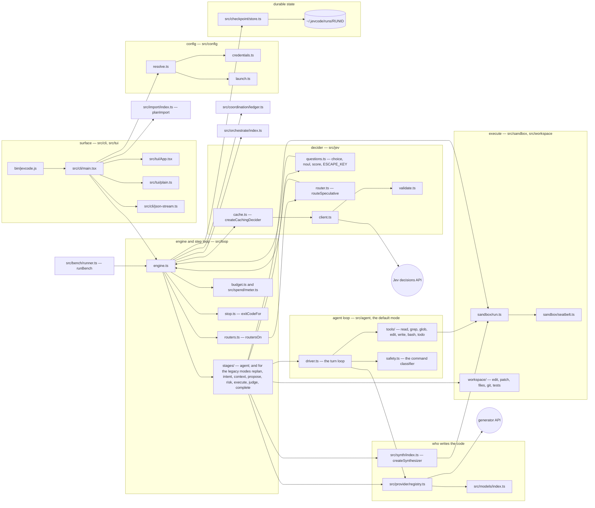

# JevCode documentation

JevCode is a streaming coding agent for the terminal. In the default mode, `agent`, the code
model drives: it reads, searches, edits and runs commands through native tool calls, and
everything it does streams to your terminal as it happens. The harness runs each call in a
sandbox, checkpoints every step so `/undo` works, and verifies the change with your own tests.
A small decision model, Jev, makes at most a few quick routing calls at the edges of a run.
Your tests decide whether the code is right. Nothing else does.

This page indexes every document in the repository.

## Where to start

**If you want to use it.** [Install](getting-started/install.md) →
[Your first run](getting-started/first-run.md) → [Keys](getting-started/keys-and-providers.md)
→ [Modes](getting-started/modes.md). Then keep
[the CLI reference](reference/cli.md) open.

**If you want to judge it.** [The agent loop](architecture/agent-loop.md) →
[What Jev is](concepts/what-is-jev.md) →
[Jev routes, never gates](concepts/jev-routes-never-gates.md) →
[Status](status/README.md) for what ships and what sits behind a switch that is off. The
[Measurements](measurements/README.md) are of the Jev-driven modes that were the default
before 2026-09-23; the agent loop has not been benchmarked.

**If you want to change it.** [System overview](architecture/overview.md) →
[The agent loop](architecture/agent-loop.md) →
[Module ownership and import rules](contributing/architecture-rules.md) →
[Contributing](contributing/README.md). The normative specifications are under
[design](design/README.md); the code cites them by section number.

## The system in one picture

In the default mode the engine hands each step to the agent driver, which samples the code
model and resolves its tool calls; the Jev stages run only in the legacy modes. Two edges are
worth reading twice. Every Jev question goes through the engine, not around it:
a stage (or one of the agent's three quick placements) builds a batch of questions and hands
it to the engine's one recorded, metered ask.
And `routeSpeculative` never talks to the decider on its own — it is handed the calling
stage's own ask as a function argument. The same picture with the module table and the import
rules is on [System overview](architecture/overview.md).

## Getting started

| Page | What it covers |
| --- | --- |
| [Install](getting-started/install.md) | Every install path in order of how well it works today, with the command that proves each one, and the measured size of a build. |
| [Your first run](getting-started/first-run.md) | A bare `jevcode` from an empty configuration: the first frame, the key wizard, where the configuration lands, and one whole task with its transcript annotated line by line. |
| [Keys](getting-started/keys-and-providers.md) | Every key variable, which model each one serves, the order they are resolved in, the four ways to save one, and the rules kept about secrets. |
| [Modes](getting-started/modes.md) | `agent` (the default) and `jev-only`, plus the three legacy modes kept for saved configs, resume and the bench; the spend caps; the four ways to switch. |
| [Status](status/README.md) | What ships, what is built but switched off, what has been measured and what has not. Start here if you are deciding whether to use it. |

## Concepts

The ideas the rest of the documentation assumes. No code required.

| Page | What it covers |
| --- | --- |
| [What Jev is](concepts/what-is-jev.md) | A calibrated decision model rather than a chat model: the question shapes, the wire format, the confidence rules, and where JevCode still asks it. |
| [Jev routes, never gates](concepts/jev-routes-never-gates.md) | The safety principle every Jev call site keeps, the four clauses that enforce it, and the lint that checks every call site. |
| [The synthesizer](concepts/the-synthesizer.md) | The engine of the legacy `llm-jev` and `jev-only` modes: how a patch gets proposed by enumerating candidates, running them and keeping what passes. |
| [Verification and the oracle](concepts/verification.md) | What actually gets run, where, and what a result is allowed to decide — in the agent loop and in the legacy modes. |

## Architecture

How the code is arranged, module by module. Each page cites the file and line it is describing.

| Page | What it covers |
| --- | --- |
| [System overview](architecture/overview.md) | The twenty-two top-level modules, who owns what, the import rules that keep the layers apart, and the run directory. |
| [The agent loop](architecture/agent-loop.md) | The default mode: the loop, the seven tools, the streaming event flow, the context policy, stop and verification, safety and autonomy, where Jev sits, and the providers. |
| [The step loop](architecture/step-loop.md) | The engine of the legacy, Jev-driven modes: one step stage by stage, and the commit rule every mode shares. |
| [The synthesizer](architecture/synthesizer.md) | The ledger, the localiser, the candidate sources, the sieve-or-rank decision, the shadow lanes, the overfit guard and the fast path. |
| [The Jev contract and its lint](architecture/jev-contract.md) | What the question builders enforce, the speculative router and its properties, the step token, and what the contract lint actually checks. |
| [The warm verification plane](architecture/warm-verification-plane.md) | A warm interpreter per verification lane: what it buys, how it stays a screen rather than an authority, and the two reasons it ships off. |
| [The relaxed context](architecture/context-policy.md) | Two windows, not one: the decider's small fixed window against the generator's derived budget, the fill order, the history tiers and compaction. |
| [The coordination ledger](architecture/coordination.md) | Several sessions in one checkout: one writer per subtree, self-checksummed records, heartbeats, leases and messages. |
| [Orchestration](architecture/orchestration.md) | A run that becomes a parent: the gate, the children in worktrees, the critic that is code rather than a model, and the landing queue. |
| [Import](architecture/import.md) | Reading memory files, rules, commands and model servers left behind by other tools — and writing only the rows you approve. |
| [Providers and the model catalogue](architecture/providers-and-models.md) | The generator providers, the two decider endpoints, how the catalogue is built and how a key is verified. |
| [The TUI](architecture/tui.md) | The interactive terminal interface: the first frame, the pane budget, the status line, the decider panel and the render targets. |

## Operations

Running it, configuring it and reading what it wrote.

| Page | What it covers |
| --- | --- |
| [Configuration](operations/configuration.md) | The six-layer precedence chain and every setting, with its flag, its variable, its file key and its default. |
| [Every `JEVCODE_*` switch](operations/environment.md) | Each variable the source reads, grouped by purpose, with the file that reads it and what it does. |
| [What a run writes](operations/records.md) | The run directory file by file, the step record, and how the inspection commands read a run back. |
| [Bench, rings and replay](operations/bench-and-rings.md) | The conditions, the suites, the output files, the statistics and the caveats that go with every number. |
| [Sandbox and security](operations/sandbox-and-security.md) | What a command can and cannot do, what a file action can touch, the git hardening settings and the two redaction layers. |
| [Exit codes](operations/exit-codes.md) | The one function that decides every exit code, with the interactive equivalent for each. |

## Measurements

Every claim made about this project, with the build it was measured on, the control it was
measured against, and the caveat it has to travel with. Every number below was measured on the
Jev-driven modes, which were the default until 2026-09-23. The agent loop, the default since,
has been verified live but not benchmarked.

| Page | What it covers |
| --- | --- |
| [Measurements](measurements/README.md) | The index. The two headline results, the cost-basis table and the five rules for reading anything here. |
| [llm-jev vs generator-only](measurements/head-to-head.md) | The same-build 28-task comparison in full, including the censoring, the same-arm noise estimate and the two correctness losses. |
| [Out of sample](measurements/out-of-sample.md) | The first measurement on tasks nothing was fitted against, and where the wall clock and the dollars actually went. |
| [Iterations 1–4](measurements/iterations.md) | Four rounds of change after that measurement, two of which measured nothing about pass rate and say so. |
| [Jev-only](measurements/jev-only.md) | A coding agent with no generating model at all: the candidate sources, the evaluation ladder, the results and the audit verdicts. |
| [The warm plane A/B](measurements/warm-plane.md) | Why a mechanism that is measurably faster ships switched off. |
| [Startup, render and harness overhead](measurements/performance.md) | The program rather than the models: first frame, per-step overhead, render blocking — including the rows that are currently failing. |
| [The side-by-side recording](media/side-by-side.md) | The recording on the front page: the task, the method, the load, the full numbers, and how to record it again. |
| [`LLM-JEV.md`](LLM-JEV.md) | The running measurement log for the `llm-jev` mode, dated entry by dated entry. The measurement pages above are the readable summary of it. |
| [`JEV-ONLY.md`](JEV-ONLY.md) | The running log for the mode with no generating model, from first hypothesis onwards. |

## Decisions

| Page | What it covers |
| --- | --- |
| [`DECISIONS.md`](DECISIONS.md) | Ninety-two dated entries, each with the decision, why it was taken and what it affects — including the ones that reversed an earlier entry. A generated table of contents sits at the top, newest first. |

## Design specifications

Ten normative documents. They are long, they carry `file:line` citations, and the code cites
them back by section number, so **their paths and section numbers never change**. They are
specifications, not tutorials.

| Page | What it specifies |
| --- | --- |
| [Design index](design/README.md) | What each of the ten specifies, how they stack, and the three conventions they are written under. Read this before opening one. |
| [`AGENT-LOOP-DESIGN.md`](AGENT-LOOP-DESIGN.md) | The default harness: the model-driven tool loop, the tools and their schemas, streaming, context, stop rules, safety and autonomy, Jev's three quick placements, the providers, and the owner's directives it implements. |
| [`DESIGN.md`](DESIGN.md) | The base: what JevCode is, the module map, the step loop, the edit formats, the sandbox, the checkpoint, exit codes and the bench. |
| [`JEV-ONLY-DESIGN.md`](JEV-ONLY-DESIGN.md) | The Ledger + Sieve search: candidate sources, localisation, the sieve-or-rank rule, the guard, budgets and the evaluation ladder. |
| [`LLM-JEV-DESIGN.md`](LLM-JEV-DESIGN.md) | The generating model as one candidate source inside that search, the seeds-versus-model race, and completion as a code fact. |
| [`HARNESS-NEXT-DESIGN.md`](HARNESS-NEXT-DESIGN.md) | Nineteen speed mechanisms and the principle that bounds them, plus the warm verification plane. |
| [`LLM-LOOP-DESIGN.md`](LLM-LOOP-DESIGN.md) | The speculative router table and the bounded fast path, with the arms and predictions registered before anything ran. The routers ship off in every mode; the fast path is `auto` under `jev-on` only. |
| [`COORDINATION-DESIGN.md`](COORDINATION-DESIGN.md) | How concurrent sessions see each other: the ledger, leases, a mailbox, heartbeats, and pause and resume from anywhere. |
| [`ORCHESTRATION-DESIGN.md`](ORCHESTRATION-DESIGN.md) | Children in worktrees, a critic made of code, and a landing queue. Ships with the split gate shut. |
| [`IMPORT-DESIGN.md`](IMPORT-DESIGN.md) | Discover, classify, plan, apply — with the first three phases writing nothing at all. |
| [`TUI-DESIGN-5.md`](TUI-DESIGN-5.md) | The current interface design: the peer surface, the context meter, the agent tree, import at onboarding, the provider and model picker. |

## Research archive

**Historical.** Dated notes taken while the project was being built. Every external claim in
them carries its source URL and the date it was fetched. None of them describes current
behaviour, and several record decisions that were later reversed.

| Page | What it covers |
| --- | --- |
| [Research archive index](research/README.md) | All seventy-three notes with a one-line summary each: the foundation surveys, five rounds of interface research, and thirteen adversarial reviews. |
| [`RESEARCH.md`](RESEARCH.md) | The synthesis of the nine foundation surveys below into one document, with the disagreements between sources stated rather than smoothed over. |
| [Ink and the terminal stack](research/01-ink-stack.md) | Rendering a terminal interface from React, and what that costs. |
| [SWE-bench Verified](research/02-swebench-verified.md) | The benchmark, its evaluation harness and its failure modes. |
| [Terminal-Bench](research/03-terminal-bench.md) | The terminal-task benchmark and how its tasks are scored. |
| [Benchmarks and harnesses](research/04-benchmarks-and-harnesses.md) | What the field measures, and how comparable any two reported numbers are. |
| [CLI architectures](research/05-cli-architectures.md) | How comparable command-line agents are built. |
| [Jev shapes and question design](research/06-jev-shapes-and-question-design.md) | What a calibrated decider can be asked, and how to shape a question so the answer means something. |
| [Generator APIs](research/07-generator-apis.md) | The provider APIs, their streaming and tool-call shapes, and their pricing. |
| [The Node toolchain](research/08-node-toolchain.md) | Bundling, packaging and shipping a single-file Node command. |
| [Edit formats and sandboxing](research/09-edit-formats-and-sandboxing.md) | How agents express an edit, and how the operating system can be asked to contain one. |

## History

**Historical.** Nothing in this section describes current behaviour.

| Page | What it covers |
| --- | --- |
| [History](history/README.md) | The round-by-round record: what each round designed, what it shipped, what its gates measured, and what the early live captures showed. |
| [`STATUS.md`](STATUS.md) | The long status report, one section per round, with the gate numbers and the honest list of what could not be verified. |
| [`TUI-DESIGN.md`](TUI-DESIGN.md) | Interface round 1, superseded: the first transcript, composer, review band, status line and packaging. |
| [`TUI-DESIGN-2.md`](TUI-DESIGN-2.md) | Interface round 2, superseded: defaults, decision providers, conversational intake, the visual redesign and the splash. |
| [`TUI-DESIGN-3.md`](TUI-DESIGN-3.md) | Interface round 3, superseded: the default-mode change, one-key onboarding, the colour theme, the persistent wordmark. |
| [`TUI-DESIGN-4.md`](TUI-DESIGN-4.md) | Interface round 4, superseded: the pinned header, one grammar for command output, resize robustness, palette navigation, file-edit rows. |

## Contributing

| Page | What it covers |
| --- | --- |
| [Contributing](contributing/README.md) | The gates a change must pass, the conventions that exist because ignoring them cost time, and the commit rules. |
| [Module ownership and import rules](contributing/architecture-rules.md) | The six dependency rules that are asserted rather than conventional, each with the command that checks it. |
| [Releasing](contributing/releasing.md) | The publish path, the pack gates, and an honest account of what is still missing before a first release. |
| [`RELEASE.md`](RELEASE.md) | The step-by-step release checklist with every command. |
| [`docs/media`](media/README.md) | The pictures the README and these pages use, where each came from, and the rules for adding another. |
| [`CONTRIBUTING.md`](../CONTRIBUTING.md) | The short version at the repository root: setup and the gate commands. |
| [`SECURITY.md`](../SECURITY.md) | How to report a problem, where keys go, and what the sandbox does **not** protect you from. |

## Reference

| Page | What it covers |
| --- | --- |
| [CLI reference](reference/cli.md) | Every command and every flag, cross-checked against the one flag table in the source and the generated manual page. |
| [`COMMANDS.md`](COMMANDS.md) | Every slash command in the interactive session. Generated from the source — do not edit by hand. |
| [`KEYS.md`](KEYS.md) | Every key binding, its context and how to rebind it. Generated from the source — do not edit by hand. |
| [Interactive session guide](TUI.md) | The long user guide to the terminal interface: panes, the composer, reviews, sessions and the plain-text mode. |
| [`CHANGELOG.md`](../CHANGELOG.md) | What changed, release by release. |

<!-- Every relative link on this page and in docs/** is checked by scripts/check-doc-links.mjs. -->
