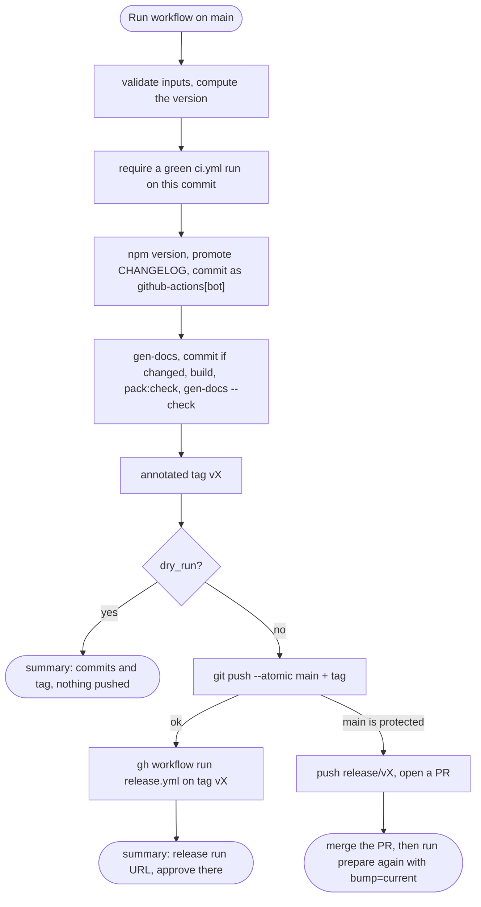
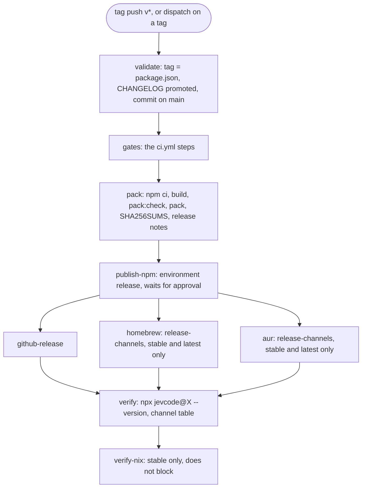

# Releasing jevcode

This is the maintainer runbook. It covers one-time setup, the steps for each release, dry runs and recovery.

Only GitHub Actions publishes. There are two ways to start a release:

- **The button (default):** the `prepare-release` workflow bumps the version, promotes the CHANGELOG, tags, pushes and
  starts `release.yml`.
- **By hand:** you push a `v*` tag yourself, and the tag push starts `release.yml`.

Either way, nothing reaches npm until a human approves the `publish-npm` job. `npm publish` from a laptop is refused
by the `prepublishOnly` guard unless `CI=true` is set.

## Current state

Checked on 2026-09-23:

- `coasty-ai/JevCode` is public and `main` is pushed.
- `package.json` reads 0.6.0. The top CHANGELOG heading is `## [0.6.0] — 2026-09-22 (not yet published)`.
- Nothing is published. `https://registry.npmjs.org/jevcode` returns 404, so the name is unclaimed.
- The Homebrew tap `coasty-ai/homebrew-jevcode` does not exist. The AUR package `jevcode` does not exist.
- The owner strings in the source already name `coasty-ai/JevCode`: `OPENROUTER_REFERER` in
  `src/provider/openrouter.ts`, `DEFAULT_REFERER` in `src/jev/types.ts` and `ISSUES_URL` in `src/cli/report.ts`.
  `package.json` `repository`, `homepage` and `bugs` point there too. npm provenance compares `repository.url`
  with the publishing repository, so these must stay in step.
- `./scripts/verify-install.sh` proves the offline chain from a clean clone: build, pack, install the tarball,
  run it. The registry round trip is the only leg not yet exercised.

## What ships

One zero-dependency package. `package.json` `files` is the allowlist:

| Path | Origin |
| --- | --- |
| `bin/jevcode.js` | launcher: Node ≥ 22.12 guard, `NO_COLOR` shim, compile cache |
| `dist/jevcode.mjs` | `scripts/build.mjs`: esbuild bundle (ink + react inlined), `minify` + `keepNames`, version injected from `package.json` via `__JEVCODE_VERSION__` |
| `THIRD_PARTY_LICENSES.txt` | `scripts/licenses.mjs`: attributions for every bundled package (the bundle strips license comments) |
| `man/jevcode.1`, `completions/jevcode.{bash,zsh,fish}` | `scripts/gen-docs.mjs` from the CLI tables |
| `README.md`, `LICENSE`, `package.json` | always included by npm |

Not shipped: `dist/jevcode.mjs.map`, `dist/meta.json`, `src/`, `docs/`, tests. `scripts/check-pack.mjs` enforces
this with nine gates: `private` absent, LICENSE present, `THIRD_PARTY_LICENSES.txt` present, `dependencies` empty,
the tarball file list equal to the `files` allowlist, no forbidden path, the two size gates, a `--version` smoke,
and no `sourceMappingURL` directive in `dist/jevcode.mjs` (the map it would point at is not shipped;
`scripts/build.mjs` writes it with `sourcemap: 'external'`, which emits no directive).

**The size gates are the script's `UNPACKED_MAX` and `TARBALL_MAX`, and this document deliberately does not restate
them.** This paragraph once carried a hand-copied 2 MB figure through two raises of the real gate, which is how a
release note comes to promise a bound the build does not enforce. Read the two constants at the top of
`scripts/check-pack.mjs`, or run it: the pass line prints the measured size against the gate.
`test/unit/hygiene/doc-claims.test.ts` fails if any byte figure printed here beside either constant's name stops
matching the script.

## Channels

| Channel | User command | Updated by | Pre-releases |
| --- | --- | --- | --- |
| npm | `npm i -g jevcode`, `npx jevcode` | `publish-npm` job (OIDC trusted publishing, provenance) | published under dist-tag `next` |
| bun / pnpm / yarn | `bunx jevcode`, `pnpm dlx jevcode`, `yarn dlx jevcode` (and `bun i -g`, `pnpm add -g`) | nothing extra: they read the npm registry | `jevcode@next` explicitly |
| mise | `mise use -g npm:jevcode` | nothing (mise's generic npm backend) | `mise use -g npm:jevcode@<v>` |
| mise shorthand | `mise use -g jevcode` | not registered; needs a PR to `jdx/mise` (deferred) | n/a |
| Homebrew | `brew install coasty-ai/jevcode/jevcode` | `homebrew` job pushes `Formula/jevcode.rb` to `coasty-ai/homebrew-jevcode` | skipped |
| AUR | `yay -S jevcode`, `paru -S jevcode` | `aur` job pushes `PKGBUILD` and `.SRCINFO` to `ssh://aur@aur.archlinux.org/jevcode.git` | skipped |
| Nix | `nix run github:coasty-ai/JevCode`, `nix profile install github:coasty-ai/JevCode` (or `.../v<x.y.z>`) | nothing per release: the flake builds from source at any ref; `flake-lock.yml` keeps `flake.lock` current | works at any ref |
| GitHub Release | tarball, `SHA256SUMS`, CHANGELOG notes | `github-release` job | marked pre-release, not latest |

### What each channel needs

| Channel | Needs | One-time step |
| --- | --- | --- |
| npm | the package to exist (first publish), then a trusted publisher | 5 |
| bun / pnpm / yarn / mise | nothing beyond npm | none |
| Homebrew | tap repo + secret `HOMEBREW_TAP_TOKEN` in environment `release-channels` | 6 |
| AUR | AUR account + secret `AUR_SSH_PRIVATE_KEY` in environment `release-channels` | 7 |
| Nix | `flake.lock` committed on `main` | 8 |
| GitHub Release | nothing (uses `GITHUB_TOKEN`) | none |

A channel whose secret is missing is **skipped**, not failed. The job summary says which secret is missing and names
the one-time step. Add it later and follow "Catch a channel up" under [Recovery](#recovery).

### Secrets and variables

| Name | Kind | Where | Used for | If absent |
| --- | --- | --- | --- | --- |
| `NPM_TOKEN` | not used | — | never: publishing uses OIDC | — |
| `NPM_BOOTSTRAP_TOKEN` | secret | environment `release` | the **first** publish only (package absent). Ignored once the package exists | the first release stops before publishing, with instructions |
| `HOMEBREW_TAP_TOKEN` | secret | environment `release-channels` | `homebrew` job push | Homebrew skipped |
| `AUR_SSH_PRIVATE_KEY` | secret | environment `release-channels` | `aur` job push | AUR skipped |
| `HOMEBREW_TAP_REPO` | variable, optional | repository variables | overrides `coasty-ai/homebrew-jevcode` | default used |
| `AUR_MAINTAINER` | variable, optional | repository variables | text after `# Maintainer:` in the PKGBUILD | `coasty-ai <https://github.com/coasty-ai/JevCode>` |
| `AUR_COMMIT_NAME`, `AUR_COMMIT_EMAIL` | variables, optional | repository variables | AUR commit identity (public in AUR git) | `coasty-ai release bot` and the github-actions noreply address |
| `GITHUB_TOKEN` | automatic | — | prepare push and dispatch, GitHub Release, flake-lock PR | — |

Environment secrets: `https://github.com/coasty-ai/JevCode/settings/environments` → pick the environment →
**Environment secrets** → **Add environment secret**.
Repository variables: `https://github.com/coasty-ai/JevCode/settings/variables/actions` → **New repository variable**.

## How a release runs

### `prepare-release.yml` (the button)

Run it from `main` only. Inputs: `bump` (`current`, `patch`, `minor`, `major`, `prepatch`, `preminor`, `premajor`,
`prerelease`), `version` (explicit `x.y.z[-pre]`, overrides `bump`), `preid` (default `rc`), `dry_run`.



A push made with `GITHUB_TOKEN` does not start other workflows. That is why prepare starts `release.yml` itself with
`gh workflow run`, and also starts `ci.yml` on the commit it pushed (or on the `release/vX` branch), so the next
prepare finds a CI run on `main`.

### `release.yml`

It runs on a `v*` tag push, or on **Run workflow** with a tag selected. The dispatch input `packaging_ref` (empty,
`main`, or a `v*` tag) picks the ref that the Homebrew and AUR jobs read `Formula/`, `packaging/` and
`scripts/release/` from. Empty means the tag itself. When it is not the tag, `validate` puts a warning in the run
summary, so the approver sees which code the channel jobs will run. A channel that already carries the version is
left alone unless `packaging_ref` is set.



`validate` picks the npm dist-tag: `next` for a pre-release, `latest` for a stable release, and `backport` for a
stable version lower than the registry's current `latest`. Homebrew and AUR run only for a stable release that is
also the latest.

### Environments

- **`release`**: required reviewers. Only `publish-npm` uses it, so each release needs one approval. Its name must
  equal the npm trusted publisher's **Environment name**.
- **`release-channels`**: no reviewers. It holds the tap and AUR credentials. Only jobs that run after
  `publish-npm` use it, so they run only after the approval.

Both allow `v*` tags only.

### `packaging.yml` and `flake-lock.yml`

- `packaging.yml` runs on pull requests and pushes to `main` that touch packaging files, and on demand. It packs the
  tarball, then installs it through a scratch Homebrew tap, builds and installs the AUR package in an Arch container,
  and builds the flake on Linux and macOS. It pushes nothing.
- `flake-lock.yml` runs weekly and on demand. It updates `flake.lock`, builds and runs the flake, and opens or updates
  a PR from `bot/flake-lock`. PRs opened with `GITHUB_TOKEN` do not start CI, so the PR body links the run that
  validated it.

## One-time setup

Only the account owner can do these. Do steps 2–4 before the first release, step 5 during it, and steps 6–8 at any
time. Each numbered step is referred to by number in job summaries.

### 1. Land the pipeline

Merge the release pipeline to `main`. Open the Actions tab and check that `ci.yml` and `packaging.yml` are green on
`main`. The Nix leg of `packaging.yml` warns until step 8.

### 2. Actions settings

Page: `https://github.com/coasty-ai/JevCode/settings/actions`

1. **Workflow permissions**: select **Read repository contents and packages permissions**.
2. Tick **Allow GitHub Actions to create and approve pull requests**. flake-lock and prepare's PR fallback need it.
3. Click **Save**.
4. Optional hardening, same page: under the actions policy, require actions to be pinned to a full-length commit SHA.
   Every workflow here already pins by SHA.

If these options are greyed out, the organization sets them:
`https://github.com/organizations/coasty-ai/settings/actions`.

### 3. Environments

Page: `https://github.com/coasty-ai/JevCode/settings/environments`

1. **New environment** → name `release` → **Configure environment**.
2. Tick **Required reviewers** and add yourself (and a second maintainer if you have one). If you are the only
   reviewer, leave **Prevent self-review** off.
3. **Deployment branches and tags** → **Selected branches and tags** → **Add deployment branch or tag rule** →
   Ref type **Tag** → pattern `v*` → **Add rule**.
4. **Save protection rules**.
5. **New environment** → name `release-channels`. No reviewers. Add the same `v*` tag rule. Save.

### 4. Branch and tag protection

Pages: `https://github.com/coasty-ai/JevCode/settings/rules` and `https://github.com/coasty-ai/JevCode/settings/branches`

- If `main` requires pull requests, change nothing. prepare-release then opens a PR instead of pushing and starts
  `ci.yml` on its branch (a PR opened with `GITHUB_TOKEN` starts no CI itself). Merge it with **Create a merge
  commit**: a squash or rebase merge re-dates the release commit, the man page date moves with it, and the next run
  opens a second PR. Then run prepare again with `bump=current`.
- If a **tag** ruleset restricts creating `v*` tags, add a bypass for GitHub Actions, or prepare cannot push the tag
  (it stops with "a tag ruleset blocks creating vX"). If the bypass list does not offer it, release with the manual
  path under [Per release](#per-release).
- Optional hardening: a tag ruleset on `v*` that only admins and GitHub Actions can bypass. Without it, anyone with
  write access can push a `v*` tag, and that tag's run can use the `release-channels` secrets. npm still needs the
  approval.
- `packaging_ref=main` makes the Homebrew and AUR jobs run `main`'s scripts with the channel secrets. The tag
  ruleset does not cover that, so the channel secrets are protected only if `main` also requires reviewed pull
  requests.

### 5. npm: claim the name with the first publish

**Path A (default): a short-lived bootstrap token, publish from CI with provenance.**

1. `https://www.npmjs.com/settings/<your-npm-user>/tfa`: enable 2FA for **Authorization and writes**.
2. `https://www.npmjs.com/settings/<your-npm-user>/tokens/granular-access-tokens/new`:
   - Name: `jevcode-bootstrap`
   - Expiration: **7 days**
   - Packages and scopes: **Read and write**, **All packages** (the package does not exist yet)
   - If the form offers a 2FA bypass for publishing, tick it. The token lives only minutes.
3. Add it as secret `NPM_BOOTSTRAP_TOKEN` in environment `release` (step 3's page → `release` → **Add environment
   secret**).
4. Run the first release (see [Per release](#per-release)) with `bump=current`, so 0.6.0 is published. Approve it.
   The `publish-npm` summary then says **"Bootstrap publish done — do these 4 things now"**. They are steps 5–8 below.
5. Configure the trusted publisher. Open `https://www.npmjs.com/package/jevcode/access` (the package's **Settings**
   tab) → **Trusted publishing** → **GitHub Actions**:
   - Organization or user: `coasty-ai`
   - Repository: `JevCode` (case-sensitive)
   - Workflow filename: `release.yml`
   - Environment name: `release`

   Save the connection. CLI alternative (npm ≥ 11.15.0; check the flags with `npm trust github --help` first):

   ```sh
   npm trust github jevcode --repo coasty-ai/JevCode --file release.yml --env release --allow-publish
   ```

6. Delete the token at `https://www.npmjs.com/settings/<your-npm-user>/tokens`.
7. Delete the `NPM_BOOTSTRAP_TOKEN` secret from environment `release`.
8. Same package **Settings** tab → **Publishing access** → **Require two-factor authentication and disallow tokens** →
   **Update Package Settings**.

**Path B: no token ever stored in GitHub. 0.6.0 gets no provenance.**

1. Run the first release. Approve `publish-npm`. It fails with "package absent" and publishes nothing.
2. Download the run's artifact `release-0.6.0` (run page → **Artifacts**). Unzip it and check it:

   ```sh
   shasum -a 256 -c SHA256SUMS
   ```

3. Publish that exact tarball from your machine (asks for your 2FA code):

   ```sh
   npm login
   CI=true npm publish ./jevcode-0.6.0.tgz --access public --provenance=false
   ```

4. Do path A steps 5 and 8 (trusted publisher, disallow tokens).
5. On the run page, click **Re-run failed jobs** and approve again. `publish-npm` sees identical bytes, skips the
   publish, and every other channel continues.

### 6. Homebrew tap

1. Create the **public** repository `coasty-ai/homebrew-jevcode` at
   `https://github.com/organizations/coasty-ai/repositories/new`. Leave it empty. The first release writes
   `Formula/jevcode.rb` and a README.
2. Create a fine-grained token at `https://github.com/settings/personal-access-tokens/new`:
   - Resource owner: **coasty-ai**
   - Expiration: at most 1 year
   - Repository access: **Only select repositories** → `homebrew-jevcode`
   - Repository permissions: **Contents: Read and write**. Nothing else.
3. If the organization requires approval, approve it at
   `https://github.com/organizations/coasty-ai/settings/personal-access-token-requests`. If fine-grained tokens are
   not allowed at all, allow them at `https://github.com/organizations/coasty-ai/settings/personal-access-tokens`.
4. Save the token as secret `HOMEBREW_TAP_TOKEN` in environment `release-channels`.
5. Set a calendar reminder before it expires. An expired token fails the `homebrew` job at clone.

### 7. AUR

1. Register at `https://aur.archlinux.org/register`.
2. Make a key for CI, **without a passphrase** (CI cannot type one):

   ```sh
   ssh-keygen -t ed25519 -N '' -C jevcode-aur-ci -f ./aur_ci
   ```

3. On the AUR, open **My Account** → paste the contents of `aur_ci.pub` into **SSH Public Key** → enter your current
   password → **Update**.
4. Check the AUR host key once:

   ```sh
   ssh-keyscan -t ed25519 aur.archlinux.org 2>/dev/null | ssh-keygen -lf -
   ```

   It must print `SHA256:RFzBCUItH9LZS0cKB5UE6ceAYhBD5C8GeOBip8Z11+4`. If it does not, stop and update
   `scripts/release/aur-host-fingerprints` from the Arch announcement before going on.
5. Save the full contents of the **private** file `aur_ci` as secret `AUR_SSH_PRIVATE_KEY` in environment
   `release-channels`. Then delete both local files:

   ```sh
   rm ./aur_ci ./aur_ci.pub
   ```

6. Optional: set the repository variable `AUR_MAINTAINER` to the text after `# Maintainer:` in the PKGBUILD, for
   example `Your Name <you at example dot com>`. The default is `coasty-ai <https://github.com/coasty-ai/JevCode>`.

The first release creates the AUR package. No manual first push is needed.

### 8. Nix lock

1. Actions → **flake-lock** → **Run workflow** (branch `main`).
2. Review and merge the PR it opens. Its body links the run that built and ran the flake.

From then on `nix run github:coasty-ai/JevCode` works at `main` and at every tag that contains `flake.lock`.

### 9. Nothing to do

- mise (`mise use -g npm:jevcode`) and bunx / pnpm dlx / yarn dlx read the npm registry. They work once npm does.
- The bare `mise use -g jevcode` shorthand needs a PR to `jdx/mise` adding `registry/jevcode.toml`. mise accepts
  npm-backed shorthands only for widely used tools, so this is deferred.

## Per release

### Before you start

- Keep curated notes in `CHANGELOG.md` under `## [<next>] — (not yet published)` or `## [Unreleased]`. That
  section becomes the GitHub Release notes. The release fails if it is missing or empty.
- `ci.yml` must be green on the `main` commit you release. prepare checks this.
- Optional: run `npm run perf` locally. CI does not run the perf gate.

### With the button (default)

1. Actions → **prepare-release** → **Run workflow**. Use workflow from: **Branch: main**.
2. Pick the version:
   - `bump=current` releases the version already in `package.json` (use this for 0.6.0).
   - `patch`, `minor`, `major` bump it.
   - For a release candidate: `preminor` + `preid=rc` gives `0.7.0-rc.0`; `prerelease` then gives `0.7.0-rc.1`.
   - Or type an exact `version`. It overrides `bump`.
3. Unsure? Tick `dry_run` first. The summary lists the commits and the tag. Nothing is pushed.
4. Run it for real. prepare pushes `release: vX` (and `docs: regenerate for vX` if needed) and the tag, starts
   `release.yml`, and prints its URL in the summary.
5. `validate`, `gates` and `pack` run unattended (about 10–15 minutes). Then the run waits at `publish-npm`.
6. Open the run → **Review deployments** → tick `release` → **Approve and deploy**.
7. The run publishes npm (`latest` or `next`), the GitHub Release, and, for a stable release, Homebrew and AUR.
8. Read the `verify` job summary. It has one row per channel: done, skipped (with the reason), or failed.
9. Check from your machine:

   ```sh
   npm view jevcode@X version dist-tags dist.attestations
   npx -y jevcode@X --version        # jevcode X
   ```

### By hand (no button)

On a clean `main` (`git status --short` prints nothing), with `X` the new version:

```sh
npm version X --no-git-tag-version
node scripts/release/changelog.mjs promote X
git add package.json package-lock.json CHANGELOG.md
git commit -m "release: vX"
node scripts/gen-docs.mjs
git add -A man completions docs/KEYS.md docs/COMMANDS.md
git diff --cached --quiet || git commit -m "docs: regenerate for vX"
npm run build && npm run pack:check && node scripts/gen-docs.mjs --check
git tag -a vX -m "jevcode X"
git push origin main vX
```

Regenerate the docs after the bump commit: the man page's `.TH` date is the commit date of `package.json`. Your tag
push starts `release.yml`. Continue at step 5 above.

## Pre-releases and promotion

- A version with a `-` (`0.7.0-rc.1`) goes to npm under dist-tag `next`, and the GitHub Release is marked
  pre-release. Users install it with `npm i -g jevcode@next`.
- Homebrew and AUR carry stable releases only. They skip pre-releases.
- Promote a tested rc on npm (owner only, asks for 2FA):

  ```sh
  npm dist-tag add jevcode@X-rc.N latest
  ```

- Homebrew and AUR update on the next **stable** tag. To ship the rc's code to them, add a `## [X]` section to
  `CHANGELOG.md` in a normal commit (the rc release used up its section, and a normal push gets a CI run), then run
  prepare-release with `version=X`.

## Dry runs

- **prepare-release with `dry_run`**: does everything up to the tag on the runner, prints the commits and tag, and
  pushes nothing.
- **`packaging.yml`**: Actions → **packaging** → **Run workflow**. It builds the Homebrew, AUR and Nix packages from
  the current tree and publishes nothing. It also runs on every PR that touches packaging files.
- **`./scripts/verify-install.sh`**: from a clean clone, builds, packs, installs the tarball into a throwaway project,
  then runs `--version`, `--help` and a no-keys first run that must exit 2 with the setup message. It prints PASS or
  FAIL per step and cleans up after itself.
- **Local renders**, to see what the tap and AUR would get (any 64-hex digest works for a look):

  ```sh
  npm run build && npm pack --ignore-scripts
  H=$(shasum -a 256 jevcode-0.6.0.tgz | cut -d' ' -f1)
  node scripts/release/render-packaging.mjs formula --version 0.6.0 --sha256 "$H"
  node scripts/release/render-packaging.mjs pkgbuild --version 0.6.0 --sha256 "$H"
  node scripts/release/changelog.mjs notes 0.6.0
  ```

- **`CI=true npm publish --dry-run`**: shows what npm would upload. It writes nothing to the registry.

## Recovery

Run pages: Actions → **release** → the run. **Re-run failed jobs** is at the top right of the run page. Re-running
`publish-npm` asks for approval again.

| Where it stopped | State | What to do |
| --- | --- | --- |
| prepare, before the push | nothing pushed (the push is atomic) | fix the cause, run prepare again |
| prepare push rejected: `main` is protected | branch `release/vX` and a PR, no tag | merge the PR with **Create a merge commit**, then run prepare with `bump=current` (it only tags) |
| prepare stopped: "a tag ruleset blocks creating vX" | nothing pushed | add GitHub Actions as a bypass actor (step 4), or use the manual path |
| prepare rejected: `main` moved | nothing pushed | run prepare again |
| prepare pushed, but no release run started | commit and tag on origin | Actions → **release** → **Run workflow** → Use workflow from **Tags: vX** |
| `validate` or `gates` failed | tag exists, nothing published | fix on `main`, delete the tag (`git push --delete origin vX`, or on the Tags page), then run prepare with `bump=current` |
| approval rejected or timed out | nothing published | **Re-run all jobs**, or dispatch `release.yml` on the tag |
| `publish-npm` failed with E404, ENEEDAUTH or E403 | nothing published | make the trusted publisher match exactly (one-time step 5, path A item 5: `coasty-ai` / `JevCode` / `release.yml` / `release`), then **Re-run failed jobs** |
| `publish-npm` failed with "package absent" | nothing published | do one-time step 5 (path A or B) |
| `publish-npm` failed after npm accepted the upload | version live | **Re-run failed jobs**. Same bytes, so it skips and the rest continues |
| "registry holds different bytes for vX" | cannot be reconciled | release the next patch version. Never unpublish |
| `github-release` failed | npm live | **Re-run failed jobs** (creates the release, or re-uploads and re-edits it) |
| `homebrew` failed at install, test or audit | tap untouched | fix `Formula/jevcode.rb` on `main`, then Actions → **release** → **Run workflow** on **Tags: vX** with `packaging_ref=main`. npm and the GitHub Release skip; one approval |
| `homebrew` failed at clone or push (401, 403, 404) | tap untouched | check the tap exists, renew `HOMEBREW_TAP_TOKEN` (step 6), **Re-run failed jobs** |
| `aur` failed at makepkg or namcap | AUR untouched (push is last) | fix `packaging/aur/PKGBUILD` on `main`, then dispatch on **Tags: vX** with `packaging_ref=main` |
| `aur` failed at SSH or host key | AUR untouched | renew the key (step 7) or update `scripts/release/aur-host-fingerprints`, then **Re-run failed jobs** |
| Catch a channel up: secret added after a release | channel was skipped | dispatch `release.yml` on the latest stable tag. Everything already done is a no-op; a channel that already has the version is left alone unless you set `packaging_ref=main` |
| `publish-npm`: "npm dist-tag latest is Y now, newer than X" | nothing published | a re-run reused a stale dist-tag choice. Dispatch `release.yml` on **Tags: vX**, so `validate` picks `backport` |
| `verify` failed: `npx jevcode@X` is broken | broken version live | `npm dist-tag add jevcode@<previous> latest`, then `npm deprecate jevcode@X "broken, use <next>"` (2FA). Release the next patch |
| Homebrew or AUR got a bad version | users of that channel affected | release a fixed version. The tooling never moves a channel backwards |
| `NPM_BOOTSTRAP_TOKEN` still set | inert once the package exists | delete it. Every run warns until you do |

## Security model

- **Approval gate.** npm publishing runs only in `publish-npm`, in environment `release`, after a reviewer approves.
- **Two environments.** `release-channels` holds the tap and AUR credentials. Its jobs need `publish-npm`, so they run
  only after the approval. Both environments accept `v*` tags only. A tag ruleset (step 4) closes the gap of a
  writer pushing a tag, and only a `main` that requires reviewed pull requests closes the gap of
  `packaging_ref=main` running unreviewed channel scripts.
- **Published bytes.** The `pack` job builds the tarball on its own runner, which runs only lockfile-pinned npm code.
  `gates` installs pytest from PyPI for the unit suite, so nothing it builds is published.
- **No long-lived npm token.** Publishing uses OIDC trusted publishing with provenance. The bootstrap token lives for
  the first publish only, and npm is then set to disallow tokens.
- **Pinned actions.** Every third-party action is pinned to a full commit SHA with its version in a comment.
  Dependabot (`.github/dependabot.yml`) proposes updates weekly.
- **Least privilege.** Every workflow starts with no or read-only permissions, and each job widens only what it
  needs. Jobs holding a write token or `id-token: write` do not use the package-manager cache, and none persists
  git credentials except flake-lock's `pr` job, which runs no dependency code. No prepare-release step that runs npm code
  holds the token: `npm ci` and the build run without it, and git gets it only in the final push step.
- **Secret hygiene.** Secrets reach scripts only through `env:`. No workflow expression is expanded inside a shell
  script. The release scripts never trace commands, and the tap token never appears in a URL.
- **Checked before pushing.** The tap formula is installed, tested and audited, and the AUR package is built and
  checked with namcap against the real registry tarball, before anything is pushed. The AUR host key is pinned in
  `scripts/release/aur-host-fingerprints`.
