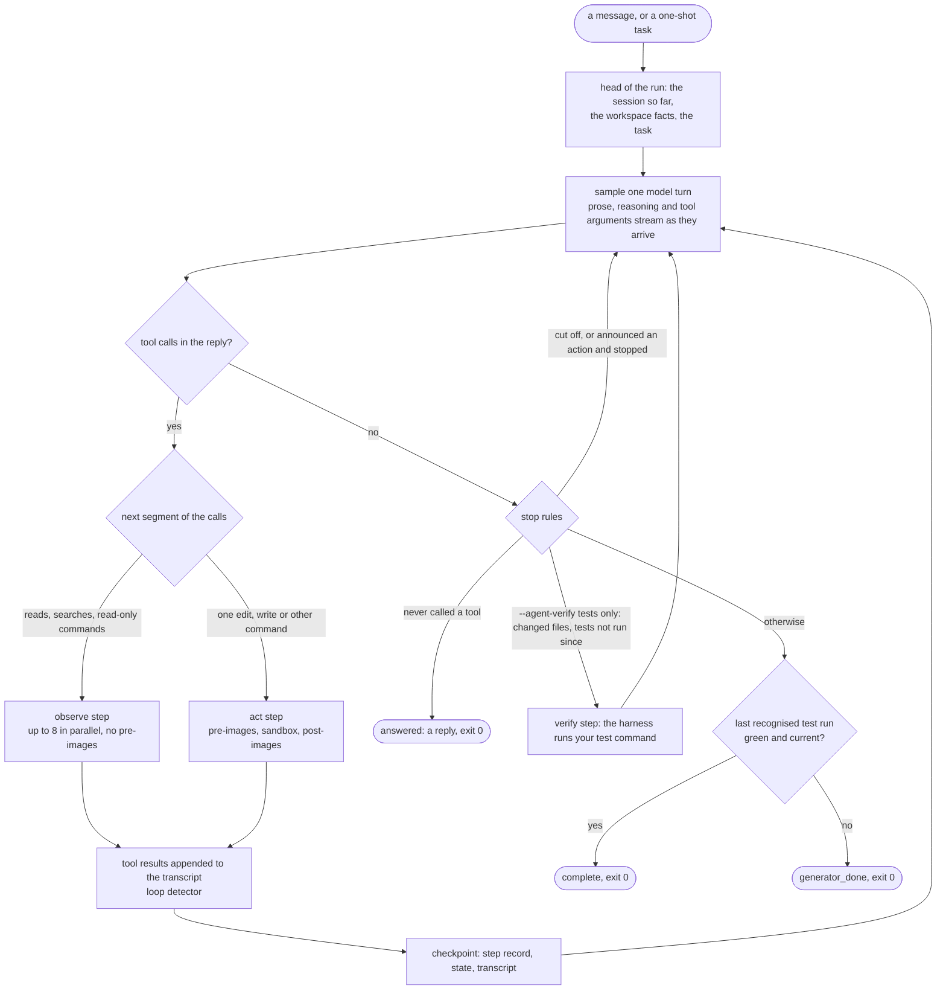
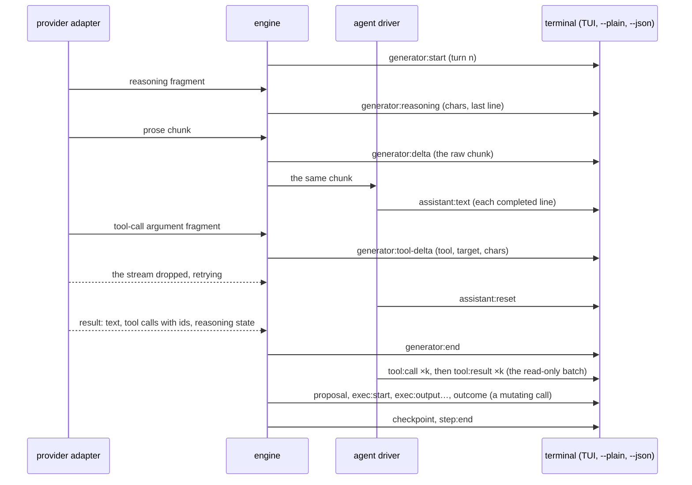

# The agent loop

`agent` is JevCode's default mode. The code model drives: it streams its reasoning and prose, calls tools natively
(several per reply), reads the results, and checks its own work in proportion to the change. The harness runs the calls,
streams everything to the terminal as it happens, checkpoints every step so `/undo` works, and reports a run `complete`
only when it has seen your tests pass after the last change. A small decision model, Jev, makes at most a few quick
routing calls at the edges of a run and never decides anything that matters.

This is the shape of the open-source harnesses studied for the redesign (Codex, Gemini CLI, OpenCode, Crush,
mini-swe-agent, the Claude Agent SDK): one model-driven loop with deterministic guards, not a side model on every step.

- The normative specification, with every constant and every rejected alternative:
  [`docs/AGENT-LOOP-DESIGN.md`](../AGENT-LOOP-DESIGN.md). The code cites it by section number.
- The code: `src/agent/` (the driver, tools, prompts, context policy, classifier), and the engine seam in
  `src/loop/stages/agent.ts`.
- The older, Jev-driven modes run on [the step loop](step-loop.md) instead.

## The loop

The model decides what a message is by what it does with it. A greeting or a question is answered in prose with no tool
call; the run stops `answered` and the interface shows it as a chat reply. A task gets tool calls, and from the first one on
the interface shows the run: tool rows, status words, the step count.

## Steps

A step is the engine's unit of pause, steer, budget, checkpoint and undo. Each step is exactly one of four kinds, so
`/undo`, `/rewind` and `/diff N` stay exact.

| Step | What happens | Takes pre-images? |
| --- | --- | --- |
| `observe` | at most one model turn, then one run of consecutive read-only calls, resolved in parallel inside the driver | no |
| `act` | at most one model turn, then **one** mutating call: an edit, a write or a command | yes |
| `verify` | only under `--agent-verify tests`: the harness runs the detected test command, because the model stopped after changing files without running it | yes |
| `finish` | the model's final answer | no |

A model turn that asks for three reads and an edit becomes an `observe` step (the three reads, concurrently) followed by
an `act` step (the edit). The default step cap in agent mode is 250 (`limits.maxSteps`), because a step is small.

## Tools

Seven tools, with flat JSON schemas that every provider accepts:

| Tool | Read-only | Runs where |
| --- | --- | --- |
| `read_file` | yes | the driver, through the workspace (boundary and secret checks apply); numbered lines, paged with `offset` / `limit` |
| `grep` | yes | `rg` in the sandbox when it is installed, else a scan of every file in the workspace's list within 20 s, which says when it stopped early; a leading `(?i)` works either way; secret, ignored and binary files never appear |
| `glob` | yes | the workspace's file list; binary and large files are listed with a tag, and a bare directory lists its files |
| `todo_write` | yes | the driver; the list becomes the run's plan (`/plan`) |
| `bash` | when the classifier proves the command read-only (`ls`, `cat`, `rg`, `git diff`, …) | read-only: the driver, in parallel; anything else: the engine, one at a time, with pre-images |
| `edit_file` | no | the driver finds the span with a tolerant matcher; the engine applies an exact edit |
| `write_file` | no | the engine |

What makes the tools robust on mid-tier models:

- **A tolerant edit matcher** (`src/agent/tools/edit-match.ts`): exact first, then line-trimmed, indentation-flexible,
  whitespace-normalised and escape-normalised matches, with the new text re-indented to fit; a placeholder guard
  (`// ... rest unchanged`); and an error that shows the closest lines when nothing matches.
- **Call repair** (`src/agent/repair.ts`): JSON repair of broken arguments, name and argument aliases (`Read`,
  `str_replace`, `file_path`, `cmd`, …), and recovery of calls a model leaked as XML or fenced JSON into its prose.
  A `bash` workdir that repeats the workspace folder's own name (`workdir: "demo"` in `…/demo`) runs at the root, and a
  missing file whose path starts with that name gets the relative form as a hint: both were seen live with GLM models.
- **Errors are results, never failed steps.** An unknown tool, invalid arguments or an unmatched edit comes back to the
  model as a precise tool result, and the loop continues.
- **Long output is spilled, not lost.** A command's output is clipped to a head and a tail inline (30,000 characters on
  success, 10,000 on failure, where the end matters most), and the whole output is written to
  `outputs/step-N.txt` in the run directory, which the model can `read_file` or `grep`.
- **Clean output.** The output the model sees has terminal escape sequences and progress redraws removed, and binary
  output is replaced by a note, so colours never hide a test count or a secret from redaction.
- **Paths and encodings.** The file tools take workspace paths and refuse one that starts with a variable such as
  `$TMPDIR` (only `bash` expands variables), and they refuse to edit or overwrite a file that is not UTF-8.
- **A post-write syntax check** for Python, JSON and existing JavaScript files reports only errors the edit introduced.

## Streaming

Everything the model produces reaches the terminal as it arrives.

What you see in the interactive terminal:

- **The reply block.** Prose streams in place above the console, under `[jevcode]`, from the first token. A line that
  has no newline yet is drawn as text, never as a character counter. When a line completes it moves into the scrollback
  without the screen jumping.
- **The live region** shows the command running now with the tail of its output, or the reads in flight
  (`Read a.ts · Grep "x" in src…`), or the call being written (`writing edit_file src/a.ts… 1.2k chars`), or, while only
  reasoning has arrived, `thinking… 1.2k chars`.
- **Tool rows**, one per step: `Read calc/core.py, tests/test_core.py`, `Edit calc/core.py (+2 −2)`,
  `Bash python -m pytest -q · 7 passed`, `Verify npm test · 12 passed`, each with its time and cost.
- **Status words**: `thinking`, `reading`, `editing`, `running`, `testing`.
- **The mini indicator.** The status row's glyph slot holds a small braille animation of what is running: a spinning
  donut for a model turn, a globe for reads, a turning cube for an edit or a command, a wave for the test run. It
  animates only while something runs, on the spinner's existing tick, and is still over SSH and under reduced motion.

`--plain` prints each prose line exactly once as it arrives, and `--json` writes every event, including the five the
agent added (`assistant:text`, `assistant:reset`, `generator:reasoning`, `tool:call`, `tool:result`), in the same `v: 1`
stream.

## Context

- **One conversation per session.** Every message in an interactive session starts a run whose transcript continues the
  previous run's, so the model sees the whole session: earlier replies, earlier runs and their tool results. The shared
  prefix keeps the provider's prompt cache warm. The transcript is `agent/transcript.jsonl` in each run directory
  (mode `0600`, append-only).
- **Budget.** `min(0.9 × the model's context window, 200,000 tokens)`.
- **Masking at 50 % of the budget.** Old tool results longer than 800 characters are replaced by a one-line stub, keeping
  the six newest. On the Anthropic adapter this is Anthropic's server-side context editing instead, because Claude's
  thinking is bound to the exact prefix.
- **Compaction at 85 %.** One user message replaces the history: the original task, a structured summary (written by the
  model, with a deterministic fallback), the last three tool results and the recently edited files, re-read.
  `/compact` forces it.
- **The meter.** `/context` and the status row show the estimate against the budget.

## Stop and verification

| The model… | The run |
| --- | --- |
| answered in prose and never called a tool | stops `answered`, exit 0. It is a reply: no run header, no step rows, and it never names the session |
| stopped mid-sentence at the output limit, or ended announcing an action (`Let me check the tests:`) | gets one "continue" note and another turn (at most twice per run) |
| changed files and did not run your test command since, under `--agent-verify tests` | gets a `verify` step: the harness runs the detected test command and hands the result back once (at most twice per run) |
| finished after a green test run, with no change since (a change to docs alone does not count) | stops `complete`, exit 0 |
| finished otherwise | stops `generator_done`, exit 0, shown as an ordinary finish |
| repeated the same call with the same result (3 in a row, or more than 5 times in the last 10 calls) | gets a nudge to change approach; the sixth trip stops the run `stuck`, exit 4, resumable |

**Who checks the work.** By default the model does, in proportion to the change, as in Codex CLI, Claude Code and
OpenCode: after a change that alters behaviour it runs the fastest check that covers it (the tests of the code it touched,
or a typecheck, lint or build of it), the whole suite only when you ask or the change is broad, and nothing for a
question, a docs edit or a simple file operation. When a check fails for a reason that is not its change, it says so
instead of repairing the environment. The harness runs no test command of its own unless you pass `--agent-verify tests`
(or set `agent.verify` / `JEVCODE_VERIFY` to `tests`): then, after changes other than docs, it runs the detected test
command before the run may finish, and hands the result back once; when the model's own run of the whole suite failed,
it hands that failure back once instead of running the suite again. See [Verification](../concepts/verification.md).

The test command is detected, never chosen by a model: `detectTestCommand()` over the workspace. Any test run the
harness recognises counts toward `complete`: the detected command, a run of one file or test, a run in a subdirectory, the
runner called directly or piped through `tail`. The step row names the command, because a green targeted test that does
not cover the change also completes. Pending todo items do not block completion; the finish row lists them. Budgets
(spend, tokens, wall time, steps) stop a run exactly as in every other mode.

## Safety and autonomy

Every command runs in the existing sandbox: a scrubbed environment with no API keys in it, a timeout, an output cap, a
process-tree kill, and on macOS a seatbelt profile that allows writes only inside the workspace and the run's temporary
directory ([Sandbox and security](../operations/sandbox-and-security.md)). Every `act` and `verify` step takes pre-images
of what it may change, so `/undo` can put it back.

**Full autonomy (the default) never asks and never refuses.** A pure-code classifier (`src/agent/safety.ts`) sorts each
command into `readonly`, `safe`, `destructive` or `unknown`. Under full autonomy that only decides where a command runs
(a read-only one joins the parallel batch) and whether its step gets a note. A destructive command — one of 13 rules such
as `rm_outside`, `git_discard`, `force_push` or `publish` — runs like any other, and its step carries one truthful line:

| Rule | The note ends with |
| --- | --- |
| the effect left the machine (`force_push`, `publish`, `exfiltrate`, `remote_exec`) | `this left the machine; /undo cannot reverse it` |
| `git_discard` of workspace files, every dirty file captured, both images whole, `HEAD` unmoved | `/undo restores the workspace` |
| anything the pre-images cannot provably cover | `/undo may not restore this` |

The system prompt asks the model not to run destructive commands the task does not need, and never to discard work it did
not make.

**Review autonomy** (`--autonomy review`, `JEVCODE_AUTONOMY=review`, or `autonomy` in the config file) shows a y/n card
for every destructive or unknown command before it runs. The card of a destructive command is titled with the rule's
sentence. A declined command comes back to the model as a tool result; five declined destructive cards pause the run.
Without a terminal the card is declined.

Validation that is not an approval applies under both: a path outside the workspace, a secret path, or an edit into
`.git/` is an error returned to the model, and nothing runs.

## Where Jev sits

Jev is a calibrated decision model: it answers code-built questions with probabilities
([What Jev is](../concepts/what-is-jev.md)). The agent loop asks it only three things, all quick, all optional:

| Id | When | What it decides | Deadline | Without an answer |
| --- | --- | --- | --- | --- |
| RA0 | the first turn of a run, only where it would change the request | whether the message is conversational, so that one turn goes at the provider's low reasoning effort | 300 ms | the default effort |
| RA1 | after a loop trip | which of four nudge wordings to send | 400 ms | "try a different approach" |
| RA2 | after 30 model turns, every 10 turns | whether to add one "step back" hint | 400 ms | no hint |

None of them can allow or block a command, stop or extend a run, or decide completion. A normal run makes at most one
Jev request (RA0), and on the default provider none: a GLM model already runs each turn at low effort, so RA0 would
change nothing and is not asked. With any other model it is asked once, before the first turn. A Jev key is optional in agent mode; with none, the three placements take their
fallbacks with no wait. Each placement carries a four-clause block that `npm run jev-contract` checks
([The Jev contract](jev-contract.md)).

## Providers

All seven generator adapters speak the agent's native tool protocol (`GenerateRequest.agent`), and each keeps its legacy
wire body byte for byte for the older modes.

| Provider | Default model | Reasoning | Notes |
| --- | --- | --- | --- |
| `openrouter` (the default) | `z-ai/glm-5.3-flash` | effort `low` for a GLM model, the model's default otherwise; the reasoning details are replayed on every turn | no provider pinning, so OpenRouter can route tool requests to accurate endpoints |
| `anthropic` | `claude-sonnet-5` | adaptive thinking, summarised, effort `high`; the signed thinking is replayed | server-side context editing instead of client masking |
| `openai` | `gpt-5.6-luna` | the model's default effort; encrypted reasoning replayed | Responses API |
| `xai` | `grok-4.7` | the model's default effort | |
| `gemini` | `gemini-3.8-flash` | the model's default thinking level; thought signatures replayed | |
| `fireworks` | `glm-5p3-flash` | effort `low` for a GLM model, the model's default otherwise; `reasoning_content` replayed | |
| `meta` | `muse-spark-1.3` | the model's default effort | a JSON transport: each turn arrives whole rather than streamed |

Reasoning effort is set only where it has to be: `high` on Anthropic, and `low` for a GLM model on any provider (its
reasoning cannot be turned off, and low keeps the default model fast). Every other model runs at its provider's default.
Tool results go back as native tool messages paired by id, parallel calls are allowed, and the session id is the cache
key where the provider has one. If a provider rejects the replayed reasoning, the turn is retried once without it and
replay stays off for the run.

## Checkpoints, resume and undo

- The transcript is written before each step's checkpoint, so a checkpoint never points past what is on disk.
  `jevcode run --resume <id>` continues a stopped run from its last committed step.
- A reply (`answered`) is not resumable; `-c` or `--resume` on one sends your message as the next turn instead.
- `/undo`, `/rewind` and `/diff N` work per step exactly as in every other mode. Pause lands between steps; `/steer`
  text reaches the model as a note before its next turn, and any calls it had queued are answered "not executed". A
  steer typed while a reply (or a task's final answer) streams is applied to that step when the turn ends, and one more
  turn answers it before the run can finish; nothing is left queued.

## The code

| Module | What it owns |
| --- | --- |
| `src/agent/driver.ts`, `turn.ts`, `calls.ts`, `stop.ts` | the turn loop, one model turn, the dispositions of its calls, the stop rules |
| `src/agent/transcript.ts`, `head.ts`, `state.ts` | the conversation on disk, the head of a run and the carry from the previous run, the checkpointed counters |
| `src/agent/context.ts`, `providers.ts` | the context policy and the per-provider settings |
| `src/agent/prompt.ts` | the system prompt, which leads with JevCode's identity, and every fixed harness message |
| `src/agent/stream.ts` | the prose stream shaper: completed lines, held code fences, a reset on a retry |
| `src/agent/repair.ts`, `json-repair.ts` | tool-call repair |
| `src/agent/tools/*` | the seven tools, the edit matcher, result formatting and spilling, the syntax check |
| `src/agent/safety*.ts`, `shlex.ts` | the command classifier |
| `src/agent/loop.ts`, `jev.ts` | the loop detector and the three Jev placements |
| `src/loop/stages/agent.ts` | the engine seam: the per-step change set, the destructive note, the command a test run is recorded under |

## Related pages

- [`docs/AGENT-LOOP-DESIGN.md`](../AGENT-LOOP-DESIGN.md) — the specification.
- [System overview](overview.md) — where the agent loop sits among the modules.
- [The step loop](step-loop.md) — the engine of the legacy, Jev-driven modes.
- [Modes](../getting-started/modes.md) — `agent`, `jev-only` and the legacy modes.
- [Sandbox and security](../operations/sandbox-and-security.md) — what a command can and cannot do.
