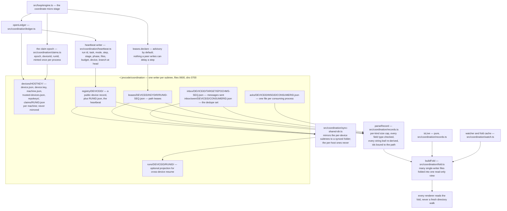

# The coordination ledger

Several JevCode sessions can work in one checkout, on one machine or on several, without
getting in each other's way. The mechanism is a small directory of self-describing files under
`~/.jevcode/coordination/`. Every session writes only its own files and reads everybody
else's. There is no server, no lock service and no shared counter.

This page describes what is on disk, how a reader turns it into one view, and what a peer
can and cannot do to your run. The normative specification is
[`../COORDINATION-DESIGN.md`](../COORDINATION-DESIGN.md); section numbers below point into it.

## The three ideas

**One writer per subtree.** A file is written by exactly one process. Two sessions never
edit one file, so any transport that copies files — a synced folder, a USB disk, a scheduled
copy job — is a correct bus. There is nothing to merge.

**Every record checks itself.** Each record carries a `checksum` over its own canonical text.
A file that is half-written, half-synced or truncated fails that check and is skipped rather
than read. The ids inside a record must equal the directory components the file was read from,
so which device wrote a record is a fact about where the file is, not about what it says.

**Advisory by default.** Knowing what a peer is doing is the point; blocking on it is opt-in.
Under the default claim mode nothing another session writes can delay one of your steps.

<!-- src/coordination/checksum.ts:9-28 canonicalText / checksumOf; src/coordination/paths.ts:1-6 layout docblock -->

## The shape of the store

<!-- verified against src/coordination/paths.ts:110-196 COMMONS_KINDS and commonsPaths. The design's internal
     spelling in §3.1, commons/<deviceId>/live/, is not the built path: the built layout is kind-first. -->

The design document calls the whole store *commons* and writes paths as
`commons/<deviceId>/live/<runId>.json`. The built layout is kind first, device second:
`registry/<deviceId>/<runId>.json`. Read the design's spelling as a synonym.

| Directory | Written by | Holds |
| --- | --- | --- |
| `devices/<hostKey>/` | this machine's command line | device identity, this machine's signing key, the repository-key cache, worktree metadata, locally minted claims. Never copied to a shared folder. |
| `registry/<deviceId>/` | each run on that device | a public device record, and one heartbeat file per run |
| `leases/<deviceId>/<keyDir>/` | each run | path leases, one file per lease |
| `inbox/<deviceId>/<target>/` | the sending device | messages, named by epoch milliseconds so no path contains a colon |
| `inbox/seen/<deviceId>/` | each consuming process | the message ids that process has already handled |
| `acks/<deviceId>/<msgId>/` | each consuming process | one receipt file per process, so no receipt file has two writers |
| `runs/<deviceId>/<runId>/` | the owning device | an optional projection of a run, for resuming it on another machine |

`hostKey` is an eight-character hash of the host name, the user name and the operating system's
own machine identifier. Two machines that share one home directory through a sync client
therefore write different `devices/` subtrees and never overwrite each other's identity.

## The heartbeat

While a run is alive it rewrites one file, `registry/<deviceId>/<runId>.json`, at six moments:
when the run becomes ready, in the tail of each checkpoint write, on a fifteen-second timer,
on a phase change, at the end, and from the process exit handler. Phase changes are coalesced
to at most one write every 250 ms.

The record carries the run id, the session id, the task, the mode, the step, the stage, the
phase, the files the run has declared and touched, the budget, the device, and the branch and
commit at the head. Nothing in a step waits for a heartbeat write: every write rides the
ledger's own promise chain, off the step path.

<!-- src/coordination/heartbeat.ts:1-9 the six write points; :17 HEARTBEAT_COALESCE_MS -->

## Liveness

`isLive(record, now, arrival, env)` is a pure function. It answers a harder question than "is
the timestamp recent", because clocks jump and a synced file can arrive minutes late.

- A record from **another** device is judged by **arrival time on this machine**, measured on a
  monotonic clock, plus a slack for sync lag. A wall-clock jump on either side cannot flip the
  verdict.
- A record from **this** device is judged by the process id together with the boot identity. A
  run parked on a prompt for five minutes is still live; a process id reused after a reboot is
  recognised as reuse rather than as the old run.
- A record whose phase is `ended` is stale immediately.

| Constant | Value | Meaning |
| --- | --- | --- |
| `HEARTBEAT_MS` | 15 s | how often a live run rewrites its record |
| `HEARTBEAT_TTL_MS` | 45 s | three missed beats and a run reads stale |
| `SYNC_SLACK_SHARED_MS` | 120 s | extra slack for a record that crossed a synced folder |
| `SKEW_MS` | 300 s | a timestamp further in the future than this is shown as skewed, and nothing more |
| `GONE_KEEP_MS` | 600 s | how long a vanished run stays visible, so a resume card can still describe it |
| `LEASE_TTL_MS` | 600 s | how long an unrenewed lease is honoured |

<!-- src/coordination/records.ts:86-114 -->

## The fold

`buildFold` reduces the whole record set to one read-only view: which sessions are live, which
leases are held, which messages are waiting. The watcher re-parses only the files that changed,
but the view is rebuilt from the whole set every time, so the result depends on the records and
not on the order in which files appeared. Every renderer reads the fold; none of them walks the
directory tree while drawing a frame.

The fold bounds itself. At most 512 heartbeats, 2,048 leases and 200 messages per target are
kept in memory, and any overflow is counted rather than silently dropped.

<!-- src/coordination/fold.ts:1-12 FOLD_CAPS -->

Before a record reaches the fold it passes `parseRecord`, which refuses rather than repairs:

- a file above that record kind's own cap — heartbeat 4 KiB, lease 8 KiB, message 2 KiB, receipt
  2 KiB, device record 2 KiB, claims projection 4 KiB — is refused, and no read pulls more than
  64 KiB into memory;
- every field is type-checked, and every counter must be a safe non-negative integer;
- every string leaf is re-derived from its own clipping rule, and the record is rejected when
  the stored text differs;
- the ids inside the record must equal the path components the file was read from.

<!-- src/coordination/records.ts:86-88 RECORD_MAX_BYTES, READ_MAX_BYTES -->

## Path leases

Before a step edits files, the run declares which paths it intends to touch. The declaration is
a lease record. Three modes exist, and the default is the first.

| `coordination.claims` | What happens on an overlap |
| --- | --- |
| `advisory` (default) | the overlap is recorded as a fact on the step record and shown as a notice. Nothing waits. |
| `strict` | the overlap is decided before any file is read or written: proceed, wait, take a worktree, or change approach. |
| `off` | leases are not consulted at all; presence only. |

Under `advisory` the per-step check is a lookup in an in-memory map built from the fold — no
file reads at all — which is why a peer's lease, a release request or a flood of messages cannot
delay a step.

Two details are worth knowing. Lease paths are relative to the repository top level, so a
session working in a subdirectory and one working at the root compare correctly. And a run that
has a repository key writes the same lease record under both the repository-key directory and
the workspace-key directory when the two differ, because two runs in one checkout can
legitimately disagree about the repository key. The fold is keyed by lease id, so the two copies
fold to one lease.

<!-- src/coordination/leases.ts:1-7; src/coordination/paths.ts:44-77 leaseRels; src/core/types.ts:1754-1755 the default -->

## Who owns a run: the claim epoch

Two different counters live in these records, and they must not be confused.

The **Lamport stamp** `(n, deviceId, runId)` orders and displays records. It rises on every fold
and every write, so two observers rarely hold the same value. It decides nothing about ownership.

The **claim epoch** `(epoch, deviceId, runId)` is minted once per process, from the run's own
stored claim history, and never changes. The later incarnation — the higher epoch — holds the
run. An engine whose claim has been superseded notices at the top of its next loop and stops,
rather than co-write a run directory with another process.

The epoch is bounded at one billion, and a record outside that range is rejected. Without the
bound, one planted record could make every future epoch unmintable and the run permanently
unresumable. A foreign claim takes a run only when its record parsed cleanly, verified against
the key of the device subtree it was read from, and that device is paired. An unverified claim
can raise a warning; it can never take the run.

<!-- src/coordination/claims.ts:1-40 FIRST_EPOCH, MAX_CLAIM_EPOCH -->

## Messages

A session can leave another one a note. Sending writes a file into
`inbox/<myDevice>/<target>/<epochMs>-<seq>.json`; the recipient folds everybody's inbox. A
target is a session id, `@<repoKey>` for everyone on a repository, or `@all`.

Three properties keep this safe and quiet:

- a message is at most 2 KiB after redaction, or it is refused rather than clipped;
- a device that sends more than sixty messages a minute mutes itself for ten minutes, with one
  notice;
- text from a peer reaches a model prompt only inside a fenced block marked as untrusted data,
  and a message can never widen the receiving session's rights.

Receipts are per **process**, not per session. A session with no run yet, a plain-output run and
a second continuation of one paused session each have their own consumer id, so no receipt file
ever has two writers.

<!-- src/coordination/mailbox.ts:1-24 -->

## Across devices

Point every machine's sync client at one folder and name that folder as the shared directory.
JevCode then copies its own per-device subtrees to `<sharedDir>/jevcode-commons/` as it writes
them, on a separate promise chain with a five-second per-operation timeout. The per-host
`devices/` subtree is never copied: it holds the machine's signing key and its private caches.

A missing or unmounted folder is reported as offline and retried on the next tick; local truth
is never touched. A torn copy fails its checksum and is skipped. The lag from a local write to
reading your own copy back byte-identical is measured and reported, so a session can say how far
behind its view of another machine might be.

The mirror refuses to run when the shared folder and the local coordination directory resolve to
paths that contain one another, which would otherwise let a mirrored file be read back as though
it were local.

<!-- src/coordination/sync-shared-dir.ts:1-35 -->

## What this costs a run

The design's targets are the ones to hold the implementation to: the per-step coordination check
under two milliseconds at the 95th percentile in `advisory` mode, under five milliseconds in
`strict` excluding any deliberate wait, and every live session's view of the others refreshed
within fifteen seconds of a change on the same device. Cross-device freshness is fifteen seconds
plus whatever the sync client takes, which on an idle consumer sync service is minutes rather
than seconds.

Those are design gates, not measurements. No end-to-end coordination timing is published in this
repository's results directory: read the numbers as the contract the code is written against,
**not yet measured** in public.

## Command-line surface today

`jevcode sessions list`, `jevcode sessions reindex`, `jevcode sessions prune` and
`jevcode sessions unlock <run-id>` are the built subcommands. The richer activity views described
in the design are read from the fold inside the interactive session.

<!-- src/cli/args.ts:520-532 the sessions subcommand parser -->

## Related pages

- [What a run writes](../operations/records.md) — the run directory these records sit beside.
- [Orchestration](orchestration.md) — delegation builds on the ledger; without it the split gate stays shut.
- [Every JEVCODE_* switch](../operations/environment.md) — `JEVCODE_HOME` moves the whole store.
- [`../COORDINATION-DESIGN.md`](../COORDINATION-DESIGN.md): §2.1 the ten rules, §3.1 layout,
  §3.3 the heartbeat, §3.4 liveness, §3.5 the watcher and the fold, §4 leases, §5 messaging,
  §9 cross-device sync.
