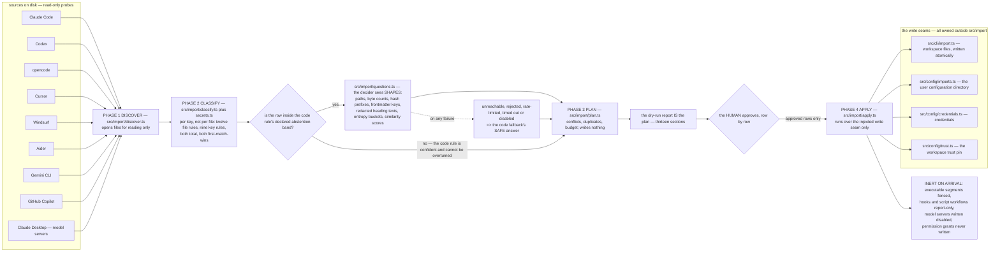

# Import: bring what you already have

If you have used another coding assistant, you already have memory files, project rules, slash
commands and configured model servers. Import reads them, tells you exactly what it found, and
writes only the rows you approve.

The engine that does the reading performs **no writes at all**. It turns the filesystem into a
plan and renders that plan; every write goes through a seam the caller supplies. The normative
specification is [`../IMPORT-DESIGN.md`](../IMPORT-DESIGN.md).

<!-- src/import/index.ts:1-11 the one-sentence contract; the only node:fs import under src/import/ is
     the read-only set in discover.ts:15 -->

## The ten principles

1. **Read-only until you say otherwise.** The first three phases open files for reading only.
   Approval is your own confirmation in the terminal, or an explicit flag on your own command
   line. An approval supplied by a script, a hook or an automated agent is never authority, and
   the batch-approve flag may never confirm a credential row.
2. **Code decides; the decider disambiguates inside a declared band.** Every classification has
   a total code rule. Each rule publishes the confidence interval inside which — and only inside
   which — the decider is consulted. The decider cannot overturn a confident code verdict.
3. **The decider sees shapes, not content.** A request carries paths, byte counts, hash
   prefixes, frontmatter *keys*, redacted and clipped heading *texts*, character-set and entropy
   *buckets*, and similarity scores. Never a file body. Never one byte of a candidate secret.
4. **Abstention takes the conservative side.** Unreachable, rejected, rate-limited, timed out,
   deliberately disabled: each returns the code fallback's safe answer. An unknown value is a
   secret. An unknown file is skipped. An uncertain duplicate keeps both. An uncertain conflict
   goes to review. Never the permissive side.
5. **Classification is per key, not per file.** One `settings.json` is simultaneously a workflow
   (its hooks), configuration (its permissions and model) and a secret (an API key under `env`).
   One file yields many rows with different classes.
6. **Provenance on every byte.** Every written file records the tool, the source path, the source
   hash, the time and the import id. Every append is wrapped in a marker pair.
7. **Scope is meaning.** User, project, project-local and path-scoped stay different
   destinations. Nothing is flattened into one file.
8. **Inert on arrival.** Executable segments are fenced. Hooks and script workflows are
   report-only. Model servers are written disabled. Permission grants are never written at all.
9. **One artefact, one lock, one manifest.** The report *is* the plan; a lock serialises every
   mutating operation; a manifest makes a re-run a no-op.
10. **The configuration layer never reaches into the interface layer.** The strings a surface
    prints live with the configuration code and are re-exported, not duplicated.

## Four phases, and the seam the engine never crosses

## What is detected

Nine tools are in the atlas, and all nine are implemented: the atlas holds 114 source rows
across them. A new tool is a block of rows in that one file and nothing else.

| Tool | Examples of what is read |
| --- | --- |
| Claude Code | user and project instructions, agent files, rules, auto-memory index and topics, skills, commands, subagents, workflows, settings at four scopes, model-server configuration, plugins, keybindings |
| Codex | global and project instructions and their overrides, memories, prompts, skills, rules, configuration |
| opencode | user and project rules, a compatibility rules file, agents, commands, skills, configuration at four scopes |
| Cursor | rules and legacy rules, agents, project and user model-server configuration |
| Windsurf | global rules, workspace rules and their legacy spellings, memories, workflows, model-server configuration |
| Aider | conventions, repository and home configuration, model settings |
| Gemini CLI | context files at three scopes, commands, settings at four scopes, ignore files |
| GitHub Copilot | repository instructions, scoped instructions, user instructions, agents, prompts, agent files, model-server configuration |
| Claude Desktop | model-server configuration |

Transcripts and session histories are **opt-in**: four source groups are never read unless you
name them. Credential stores are recognised by name and never opened for content.

A standing exclusion list keeps the walk out of dependency directories, build output, virtual
environments and JevCode's own state.

<!-- src/import/sources.ts:109-130 ALWAYS_EXCLUDED, OPT_IN_SOURCES, SOURCE_TOOLS; SOURCES holds 114 rows -->

## Phase 1: discover

Every filesystem call goes through an injected seam, so the whole phase is testable over a
temporary directory. Nothing writes, executes or fetches. A path whose base name looks like a
credential store is never opened for content, and a transcript is not read at all unless you
asked for it.

The walk is bounded, and exceeding a bound is never an error — the rows found so far come back
together with a notice naming the bound that was hit.

| Bound | Value |
| --- | --- |
| directory depth | 8 |
| entries per root | 20,000 |
| time per root | 2 s |
| files one atlas row may produce | 512 |
| bytes read from one source file | 4 MiB |
| bytes scanned in a transcript, metadata only | 256 KiB |
| bytes sniffed to decide "is this text" | 8 KiB |

<!-- src/core/limits.ts:201-218; src/import/discover.ts:1-14 -->

## Phase 2: classify, per key

Twelve file rules and nine key rules, both total, both first-match-wins.

The five *identity* rules run first: is this our own output, a third-party bundle, a file the
tool manages for itself, a credential store by name, too large to read, or not text at all? No
declared class overrides any of those, because the atlas says what a file is *about*, never
whether it is ours to read. The atlas class is rule 6, and the content rules follow it.

The classes that are never imported at all — transcripts, secrets, explicit skips — answer at
rule 2, immediately after the credential-name rule. An oversized transcript then reports
"transcript", which is the thing you can act on, rather than "too large".

Every rule publishes its own confidence. That number is used for exactly one purpose: deciding
whether the row falls inside the band where the decider is asked.

<!-- src/import/classify.ts:1-46 -->

## What the decider is asked, and what it never sees

Five question groups, all built through the shared question builder, so the batch rules hold by
construction: a definition plus at least two examples on both sides of every judgement, an
escape option on every choice, and no question that asks the decider to count.

The value module is where the "shapes, not content" rule is enforced. No function in it ever
retains a substring of a value. It returns a length, a character-set name, an entropy bucket, a
hash prefix, a family name and a reference flag. The single exception is the *name* of an
environment variable a value merely refers to, which holds no credential bytes at all and is
what travels in place of the secret.

The whole import is budgeted at 3 decider requests and 400 questions. Heading text that travels
is limited to five headings of eighty cells each, and a sentence of source text travels only
under the widest sampling setting.

<!-- src/import/secrets.ts:1-13; src/import/questions.ts:1-21; src/core/limits.ts:250-258 -->

## Phase 3: the plan, and the report that is the plan

Planning resolves conflicts, finds duplicates and applies the budget. It writes nothing.

The output is one dry-run report with thirteen sections, always all of them, in this order:
Summary, Sources, Memory, Rules, Commands, MCP, Review, Suggested permissions (not applied),
Credentials, Cannot be read from disk, Skipped, Notices, Apply. Every row lands in exactly one
section, so no row can be rendered nowhere. The Credentials section reports what was found and
states that nothing was copied.

Each import has an id of the form `imp_<compact timestamp>_<six hex characters>`, so ids sort in
time order. The ten newest import directories are kept and older ones are collected at the start
of the next import.

<!-- src/import/report.ts:51-64 REPORT_SECTIONS; src/import/index.ts:160-169 the id format;
     src/core/limits.ts:265-270 -->

## Phase 4: apply

Only the rows you approved, and only through the injected write seam. Four seams exist, and all
four live outside the import engine: workspace files, the user configuration directory,
credentials, and the workspace trust pin.

Applying is resumable and undoable. Pre-images of overwritten files are kept, an append-only log
records what happened, and a manifest makes a second run of the same import a no-op rather than
a duplicate.

Everything written is inert:

- executable segments inside imported prose are fenced as code, not left as instructions;
- hooks and script workflows are recorded in the report and never wired up;
- model servers are written with `enabled: false`;
- permission grants are listed under "Suggested permissions (not applied)" and never written.

<!-- src/import/apply.ts — every write is `opts.fs.*`, the injected seam; src/import/index.ts:1-11 -->

## Secrets are never imported

This is the rule with the fewest exceptions on this page. A candidate secret's bytes never leave
the file they were read from: not into the report, not into a decider request, not into a log
line, and not into any file JevCode writes. What travels instead is a shape — a length, a
character class, an entropy bucket, a hash prefix — or, when the value is only a reference to an
environment variable, that variable's name.

The Credentials section of the report tells you what exists and where, so you can move it
yourself. The batch-approve flag can never confirm one of those rows.

## Related pages

- [Sandbox and security guarantees](../operations/sandbox-and-security.md) — the redaction layer
  that the same rule rests on elsewhere.
- [Configuration](../operations/configuration.md) — where imported configuration ends up.
- [`../IMPORT-DESIGN.md`](../IMPORT-DESIGN.md): §0 the contract and the ten principles,
  §2 destinations, §3 the atlas, §4.1 the pipeline, §4.6 the report, §4.8 secrets.
