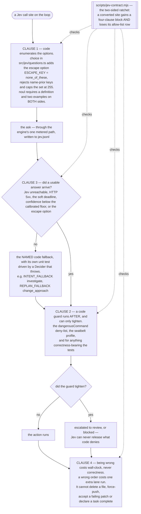
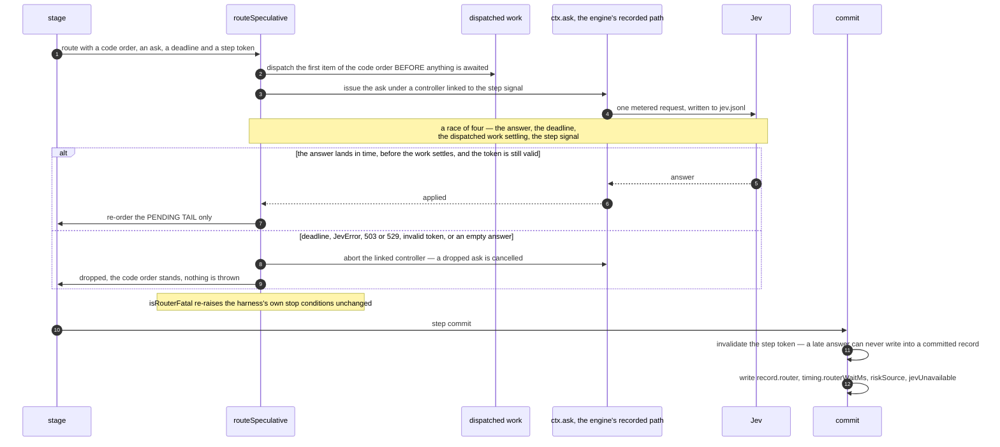

# The Jev contract and its lint

Jev is a decider. You hand it a state object and a batch of questions built by code, and it
answers them with probabilities. It is good at three things that have been measured: choosing
among a few hundred concrete options when the right one is present, ranking near-duplicates,
and answering yes/no about literal facts already in the state.

It is not an authority. Nothing it answers can delete a file, accept a failing patch or declare
a task complete. That sentence is not a policy document — it is enforced by a build-time lint, a
per-site unit test, and the shape of the question builders themselves. This page is how.

- The normative text is [`docs/HARNESS-NEXT-DESIGN.md` §1.2](../HARNESS-NEXT-DESIGN.md) (the
  four conditions) and [`docs/LLM-LOOP-DESIGN.md` §2](../LLM-LOOP-DESIGN.md) (the router table
  and the primitive).
- Where the call sites are in the loop: [The step loop](step-loop.md).

## The four clauses

Every Jev call site introduced or moved by the routing design satisfies four conditions.



### Clause 1 — code enumerates the options

Jev never invents a path, a command, a test scope or a candidate. The options come from a list
code built, and the builders in `src/jev/questions.ts` refuse anything else:

| builder | what it enforces |
|---|---|
| `choice(instructions, options)` | adds `ESCAPE_KEY = 'none_of_these'` if it is not already an option; every key must be snake-case ASCII of 2–64 characters; keys that carry a name prior (`a`, `alpha`, `option_1`, a bare number) are rejected; at most 255 options |
| `noul(instructions, criteria)` | both `criteria.true` and `criteria.false` need a non-empty definition and **at least two examples** each |
| `score(instructions, levels)` | 2 to 10 levels, each non-empty, each described as a situation |
| `pairedNouls(options, build)` | builds one `can_<option>` Noul for every non-escape option of a Choice |
| `assertQuestionBatch(qs)` | the batch-level check before sending: at least one question, at most 1,000, no empty ids |

<!-- src/jev/questions.ts:8 (ESCAPE_KEY), :31 (checkSide), :37 (noul), :63 (choice), :78 (score), :87 (pairedNouls), :102 (assertQuestionBatch) -->

A common misreading is worth correcting: `assertQuestionBatch` checks the *batch*, not the
questions. The both-sided criteria rule and the escape rule are enforced by `noul` and `choice`
at the moment each question is constructed, which means a hand-written question literal would
bypass them. That is exactly why the lint refuses hand-written literals outside this one file.

### Clause 2 — a code guard runs after, and can only tighten

A routed action still passes the code deny-list, the seatbelt profile (`src/sandbox/seatbelt.ts`)
and — for anything correctness-bearing — the tests. Jev can escalate; it cannot release.

The risk stage is the clearest instance. Two functions in two files split the job, and which is
which matters:

| function | file | kind | what it decides |
|---|---|---|---|
| `dangerousCommand(command)` | `src/jev/danger.ts:53` | **deny-list** | returns the matched rule's reason, which becomes **`review`** — an ask, which Jev's Scores may escalate further to `block`. Returns `null` when nothing matched, and `null` is *not* a safety claim |
| `codeRiskReason(proposal, …)` | `src/loop/stages/risk.ts:372` | **allow-list** | returns a reason when the proposal is safe as a matter of fact, which becomes **`ok`** |

The deny-list has six rules, and it is literal and case-sensitive by design:

| rule | why |
|---|---|
| `rm -rf` | recursive force delete: removes files with no recoverable copy |
| `git push --force` | overwrites a remote history other clones depend on |
| `sudo` | the effect reaches outside the workspace and outside the sandbox |
| `curl … \| sh` | runs code nobody in this run has read |
| `mkfs` | destroys every byte on the target device |
| `:(){` | a fork bomb: exhausts the host process table |

<!-- src/jev/danger.ts:34 DANGER_RULES -->

The module says its own misses out loud: `RM -RF /`, `rm   -rf /`, `$(echo rm) -rf /` and a
Makefile target wrapping any of them all return `null`. They are not thereby allowed. When no
code rule clears a proposal and Jev did not answer, `codeRiskVerdict` returns **`review`** —
"no opinion" means "ask a human", never "allow".
<!-- src/loop/stages/risk.ts:416 codeRiskVerdict -->

When Jev *did* answer, only the narrower `codeRiskFloor` applies: a deny-listed command cannot
be released by a Score at level 0, and everything else keeps exactly the verdict the Scores
produced. That narrowness is deliberate — a floor wide enough to second-guess every answer
would turn a routed run into a confirmation prompt on every step.

### Clause 3 — there is a deterministic code fallback, and it is exercised

Every site names its fallback, and the fallback has its own unit test driven by a `Decider` that
throws. The fallback is taken on any of: Jev unreachable, an HTTP 5xx, the site's soft deadline,
confidence below the call's calibrated floor, or the escape option being chosen.

This is not hypothetical. A real `503 no healthy upstream` / `529` outage lasting about three
minutes killed three benchmark runs outright before the fallbacks existed.

### Clause 4 — being wrong costs wall-clock, never correctness

A wrong queue order costs one extra lane run. A wrong prewarm costs slack CPU. None of them can
delete a file, force-push, accept a failing patch, or declare a task complete.

Some decisions are excluded from Jev entirely, each for a measured reason:

- **Arithmetic and counting** — deadlines, budgets, token limits, lane counts, newly-passing
  counts, compaction triggers. Spend ceilings live in `src/spend/meter.ts` and
  `src/loop/budget.ts`, outside every selection path.
- **Completion** — `isCompleteByFact()` over the harness's own green, current test run.
- **The cold confirmation of any hot-screened passer** — see
  [the warm verification plane](warm-verification-plane.md).
- **Never the sole reason a patch is committed** — the guard's code rules run first; Jev only
  breaks the residual tie among test-passing candidates in distinct behaviour clusters.

## `routeSpeculative` — the code order runs first

With the routers switched on, a routed ask does not block the step. The primitive is
`routeSpeculative` in `src/jev/router.ts`, and its whole subject is one invariant: *Jev routes,
it never gates.*



Six properties, in the order the source states them:

1. **The code order is dispatched in this tick, before anything is awaited.** It is not a
   fallback reached after a failure; it is the order the step is already executing.
2. The ask is issued in the same tick, under a controller linked to the step's abort signal.
3. An answer that lands inside the deadline, before the dispatched work settles, and while the
   step token is still valid, is applied — and it re-orders the **pending tail only**.
4. A deadline, a `JevError`, a 503/529, an invalidated token and an empty answer are **one
   branch**: the route is recorded as dropped, the code order stands, and nothing is thrown.
5. The ask function is injected. It is the stage's own `ctx.ask`, which already routes through
   the engine's one metered, recorded path. No router reaches the decider by any other road.
6. A dropped ask is **cancelled** — the router aborts the linked controller, so an answer
   nobody is waiting for stops rather than running on to write against a committed step.

<!-- src/jev/router.ts:1-40 (the docblock) and :144 (routeSpeculative) -->

### The four errors that are *not* Jev's

Clause 4 above is about Jev's failures only. Four conditions are the harness's own stop
conditions or a programming error, and `isRouterFatal` sends them back up unchanged — exactly as
they travel with the routers off:

```ts
export function isRouterFatal(e: unknown): boolean {
  return isAbortError(e) || isBudgetError(e) || e instanceof JevModelDriftError || e instanceof QuestionBuildError;
}
```
<!-- src/jev/router.ts:52 -->

An aborted step signal (a human pause, a stop), a wall-time budget, a model drift and a
malformed question batch. Swallowing any of them is how an aborted run keeps running stages.

### The step token

`routeSpeculative` introduces concurrency into a loop that had been strictly sequential. The
step token is what makes that safe. It is minted per `(runId, step)`, checked immediately before
an answer is applied, and invalidated at step commit. A late answer is recorded as `dropped` and
applied to nothing.
<!-- src/loop/routers.ts:114 stepTokenFor, src/jev/router.ts:82 invalidateStepToken -->

Two subtleties in `src/loop/routers.ts` that are easy to get wrong:

- A **committed** step's key is *closed*, and closing happens before the early return, so
  committing a step that ran no router at all still bars a late one.
- A **discarded** step's key is deliberately left *open*. A blocking pause that landed before
  anything ran means the run will replay the same step number; closing the key would make every
  router of the replayed attempt drop before it was even issued.

### `routerWaitMs` is measured, not asserted

The design requires that a router adds zero blocked wall to a step. It would be easy to satisfy
that by writing a literal `0` into the record. It is not what the code does.

`heldMs` is the clock from entry to the settled race. `waitMs` is what is left of it after the
ask's own elapsed time, minus a five-millisecond scheduler slack. It reads 0 because the router
never waits past the earliest of the answer, the deadline, the dispatched work and the step
signal — but a router that *did* wait longer would report it, which a hard-coded zero never
could.
<!-- src/jev/router.ts:66 ROUTER_SETTLE_SLACK_MS; the `held()` closure inside routeSpeculative -->

A dropped ask is also not charged. `test/unit/loop/engine-router-seam.test.ts` asserts it
directly, in a test named *"the answer of a dropped ask can never write into the step: its
`draft` mutations, its meter and its rows are all skipped"*.

## The switch

The routers are **off by default in every mode**, and the mode gate is checked first:

```ts
export function routersOn(mode: EngineMode, opt?: 'on' | 'off'): boolean {
  if (mode !== 'jev-on') return false;
  return routersEnabled(opt);
}

export function routersEnabled(opt?: 'on' | 'off', env = process.env): boolean {
  if (opt !== undefined) return opt === 'on';
  return env['JEVCODE_ROUTERS']?.trim().toLowerCase() === 'on';
}
```
<!-- src/loop/routers.ts:48, src/jev/router.ts:260 -->

Three things follow, and each was a defect at some point:

- **No environment variable can arm the routers in a control mode.** The replan stage is the one
  site with no per-mode variant, so without this gate an exported `JEVCODE_ROUTERS=on` changed
  the behaviour of `llm-jev`, `jev-only` and `jev-off` too — the very arms the comparison exists
  to measure `jev-on` against.
- **An explicit option beats the environment, in both directions.** This used to be an OR, so an
  exported `on` armed a run whose own recorded settings said `off`, with no observable difference
  in the output to give it away.
- **The environment fills an absent option only.** That is how a worker process and a bisect can
  still express the switch.

`fastPath` resolves the same way, in `resolveFastPathOption`: an explicit `auto` survives only
under `jev-on`, an absent option defaults to `auto` under `jev-on` and `off` everywhere else,
and `JEVCODE_FASTPATH=off` turns it off.
<!-- src/loop/engine.ts:442 -->

## The router table

`routers: 'off'` — the default — leaves every row exactly as it was.

| id | site | what it becomes | deadline | built in this tree? |
|---|---|---|---:|---|
| **RL1** | intent, `stages/intent.ts` | order route | 250 ms | yes |
| **RL2** | context, `stages/context.ts` | order route over the code pre-filter | 400 ms | **no** — the stage still awaits its ask |
| **RL3** | risk, `stages/risk.ts` | **not a router** — a code-first gate with Jev as a verifier | — | yes |
| **RL4** | judge, `stages/judge.ts` | recorded-only; the parsed test counts decide | 400 ms | yes |
| **RL5** | completion, decided in `engine.ts` | recorded-only on evidence-bearing steps | — | yes |
| **RL6** | replan, `stages/replan.ts` | order route for the directive; the two stop moves become recorded-only | 500 ms | yes |
| **RS1** | oracle scope order | order route | 250 ms | no |
| **RS2** | edit class prior | order route | 300 ms | no |
| **RS3** | held-partial release | order route | 300 ms | no |
| **RS4** | candidate ranking | order route | 600 ms | no |
| **RS5** | guard arbitration | **not a router** — awaited, already escape-bearing | — | n/a |
| **R9** | the bounded sieve fast path | branch route, code-decided; **no Jev question is added** | — | yes |

<!-- deadlines: src/loop/routers.ts:38-41. "built" = `grep -rl routeSpeculative src` returns
     router.ts, routers.ts, engine.ts, stages/intent.ts, stages/judge.ts, stages/replan.ts only.
     The full table with fallbacks and consumers is docs/LLM-LOOP-DESIGN.md §2.2. -->

RL2 being unconverted has a consequence worth stating plainly: a Jev outage during the context
stage of a `jev-on` run can still end that run. The "an outage costs ordering quality and
nothing else" property is true of the converted sites and is not yet true end to end.

## The lint: `scripts/jev-contract.mjs`

The contract is checked where the calls are, not in a document. The lint scans `src` for `.ask(`
call sites and requires each one to be either annotated with a four-clause comment block or
covered by an allow-list row that names its reason.

Here is a real one, above the intent stage's ask:

```
// jev-contract: RL1 intent (docs/LLM-LOOP-DESIGN.md §2.2)
//   escape:   the Choice carries `none_of_these`; resolveChoice returns the escape as a non-answer and
//             INTENT_FALLBACK stands.
//   guard:    with routers on, routeSpeculative issues under the step signal with a 250 ms deadline and a
//             step-scoped token (§2.6); the answer may only re-order the intent list, never add an option,
//             and resolveIntentWithLedger still applies the code facts on top of it.
//   fallback: codeIntentOrder()[0] (INTENT_FALLBACK = 'investigate', or `verify` when a change this run made
//             is unverified) — test: test/unit/loop/router.test.ts
//   no-gating: the answer reaches one sentence of the prompt's intent section and nothing else. It cannot
//             stop the run, block an action, or withhold a candidate.
```
<!-- src/loop/stages/intent.ts:231-239, verbatim -->

The lint requires all four keys — `escape`, `guard`, `fallback`, `no-gating` — to be present.

Three further rules:

- **Question literals are refused outside `src/jev/questions.ts`.** Any file with a Jev call
  site that also writes `{ type: 'choice' | 'noul' | 'score', instructions: … }` as an object
  literal fails, because a hand-written question bypasses the escape rule and the criteria
  shape.
- **A forbidden-id list.** Eight ids that would make Jev an authority — `allow`, `approve`,
  `approved`, `commit_ok`, `accept_patch`, `is_correct`, `task_done`, `patch_is_correct` — may
  never be a question id anywhere.
- **The ratchet is two-sided.** The allow-list rows are per file *and per count*. A file that
  grows one extra un-annotated call site fails. A site that gains a four-clause block must lose
  its allow-list row in the same commit, or the row grandfathers more than the file has and the
  lint fails on that instead.

Running it on this tree prints:

```
$ node scripts/jev-contract.mjs
jev-contract: ok (34 Jev call site(s): 10 with a four-clause block, 24 allow-listed)
```

Read those three numbers exactly: **34** call sites found in `src`, **10** carrying a
four-clause block, **24** still covered by a grandfathered allow-list row. The second number
only goes up and the third only goes down.
