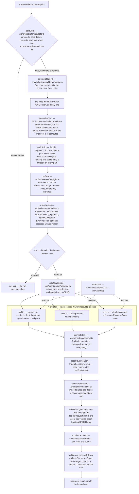

# Orchestration: a run that becomes a parent

Some tasks split cleanly. Three independent plan items over three separate directories can be
worked on at the same time by three processes, each in its own git worktree, each on its own
branch, and the results merged one at a time through a single queue.

Orchestration is that mechanism. It ships **off**: `orchestrate.split` defaults to `off`, and
with the setting off the code that decides whether to split is a handful of comparisons that
make no network request, spend no money and behave exactly as a run behaves today.

The normative specification is [`../ORCHESTRATION-DESIGN.md`](../ORCHESTRATION-DESIGN.md).

<!-- src/orchestrate/types.ts:82-107 DEFAULT_SPLIT_POLICY; src/orchestrate/split/gate.ts:84 the first check -->

## The whole path

## The gate

`splitGate` is pure. Every fact it needs — the git probe, the plan, the resource measurements,
the money — arrives as an argument. It makes no request of any kind, and when the setting is
off it returns on its first comparison.

The checks run in a fixed order and the first failure is the answer, because that reason is what
gets shown and what tests assert. In order:

1. the setting is `off`, or this run is already a child;
2. no coordination ledger is available — children's leases and heartbeats would have nowhere to live;
3. a fact the caller could not measure at all, which shuts the gate rather than widening it;
4. not a git repository, no commit on the branch yet, or git too old for worktrees;
5. fewer than three remaining plan items, or one unverified assumption blocks every remaining item;
6. no verification command could be resolved, and the work is not research-only;
7. more than 200 changed tracked files;
8. agents already live, the per-run split budget spent, or the cooldown since the last split not elapsed;
9. two agents do not fit in processors, memory and disk at once;
10. less than two agents' minimum spend available inside the session's reserve;
11. the loop detector is already re-planning, or an orchestration problem is too recent.

A **dirty** parent is deliberately not a reason to shut the gate. That is the normal case; the
dirt is kept off the agent branches instead.

If every check passes, the gate still needs a reason to split: two or more disjoint directories,
two or more failing test files, or an explicit human request.

<!-- src/orchestrate/split/gate.ts:82-146 -->

## Building the options

Five enumerators run, in a fixed order: by failing test, by layer, by directory, by plan item,
as written. `no_split` is always present and always last. The order matters because the
deterministic fallback takes the first option that survives, so the same run must enumerate the
same list in the same sequence.

An enumerator that does not apply — no failing tests, no workspace manifest, fewer than two
groups — returns nothing, and that is not a rejection. The prefix tree handed to the model is
bounded at 200 entries.

The code model contributes **one** option and no more. It never decides whether to split, never
chooses between options, and never writes the manifest.

<!-- src/orchestrate/split/enumerate.ts:1-30 PREFIX_TREE_MAX, PRELUDE_SLUG -->

## The rejection filter

`normalizeSplit` applies nine rules in order; the first failure deletes the option and records
why.

| Rule | What it requires |
| --- | --- |
| 1 | slugs: sanitised, de-duplicated, kept off the dock's own names, renamed past an existing `jevcode/<slug>` branch |
| 2 | every `own` entry is in the small ownership glob language |
| 3 | the agents' `own` sets are disjoint |
| 4 | every remaining plan item is covered exactly once |
| 5 | each agent has a verification command, or is downgraded to research-only |
| 6 | the `dependsOn` graph has no cycle |
| 7 | the per-agent caps, then the money split |
| 8 | an agent's task text must not name what the agent does not own |
| 9 | no secrets in the text — the rule takes a hit **count**, never a value |

Rule 1 runs to completion for every agent before rules 2 to 9 start, and the manifest id is
computed only after the final slugs are settled. The branch name is then derived as exactly
`jevcode/<slug>`. Renaming a slug after the id was computed would make a later resume compare
the wrong delegation.

<!-- src/orchestrate/split/normalize.ts:1-23 and the rule markers at :357-538 -->

## Exactly two decider requests

Ranking is the only place the decider enters a delegation, and it enters twice.

**Request 1, before any process is spawned.** `rankSplits` asks one Choice over the surviving
code-built options, with paired Nouls for the per-option evidence. It ranks and it gates; it
never invents an option. Every path returns a value: a decider error, a timeout, a rejected key,
a below-floor answer, the escape option, a decider-free mode or the deterministic setting each
has a code answer, and none of them raises a prompt. When only `no_split` survives, no request is
made at all — the check is the first statement of the function, before the state or the questions
are built.

**Request 2, after every agent has finished.** `buildRankQuestions` asks one Score per verified
agent, at most eight questions. `rankLandingOrder` is then a pure function from that score map
plus the dependency edges to a landing order. It decides order and nothing else: it cannot make
an agent land, unland, pass or fail.

<!-- src/orchestrate/split/rank.ts:1-14 the two invariants, :225-243 the no-request path,
     :327-349 rankLandingOrder is pure; src/orchestrate/split/questions.ts:55, :395-403 -->

## Before any worktree exists

`preflight` re-does the gate's resource arithmetic with measured numbers, because the gate's
figures are cheap estimates. It checks disk with a headroom factor of 1.1 over the measured
repository size, file descriptors at four per agent within the soft limit less a margin of 128,
and the budget reserve. This is code, and it runs before a single worktree is created.

<!-- src/orchestrate/preflight.ts:83-100, :162, :191-201 -->

`writeManifest` then records the delegation: the chosen option, every agent with its task, its
`own` set, its verification commands and its caps, **and every rejected option with its code
reason and its probability**. The manifest id is `sha256` over the task, the remaining plan
items, the split kind, the agents and the base commit.

Reading a manifest back treats the file as untrusted input. Every field is validated before the
checksum is consulted, the checksum is recomputed rather than trusted, and the manifest id is
recomputed through the same code the normaliser uses. The checksum is unkeyed, so anyone who can
edit the file can recompute it; the recomputed id is what ties the delegation a resume adopts to
the agents actually in the file. Two of the id's five inputs are not stored in the manifest, so
a manifest from a different delegation does not read back at all.

A human confirmation is always shown before anything is spawned.

<!-- src/orchestrate/canonical.ts:48-73; src/orchestrate/manifest.ts:1-21 -->

## The children

Each agent is a separate operating-system process with its own git worktree, created through the
coordination facade with git's own lock and a reason naming the run and session. Each child has
its own run id, session id, run lock, heartbeat, spend meter and checkpoint directory. Siblings
share nothing writable: no directory, no branch, no transcript, no inbox, no lease.

Depth is capped at one. `createEngine` refuses an orchestration depth above the cap, refuses a
child that was also handed a split setting, and refuses a child whose sandbox is weaker than the
parent recorded for itself. That refusal is in the engine, not only in the surface, so a
hand-typed command line cannot produce grandchildren.

<!-- src/core/limits.ts:161 ORCHESTRATION_DEPTH_MAX; src/loop/engine.ts:5969-5985 refuseOrchestration -->

`detectStall` watches the heartbeats and reports three signals — no step progress, no file
progress, and churn — plus one independent flag for a pipe that has gone quiet. A quiet pipe is
never itself acted on, and it never suppresses another signal either, because a genuinely stuck
agent is usually quiet too. Every signal is a fact and a notice. Nothing in the watchdog kills
anything.

<!-- src/orchestrate/stall.ts:1-42 -->

## Committing, verifying, landing

**JevCode** commits what an agent changed, and the commit set is computed rather than
"everything". It is the worktree's currently dirty set, minus the paths the parent was already
dirty in and the agent left byte-identical, plus any of those paths the agent's own steps
actually touched. A single definition of "left the parent's file alone" is shared by the commit
set and the critic, so the two can never disagree about one file.

`resolveVerification` picks the verification commands in six steps, first hit wins: explicit
configuration, `package.json` scripts (`test`, `typecheck`, `lint`, in that order), the
ecosystem's marker files, the synthesis oracle's own runner, the parent's last test command, and
then nothing. A step whose candidates are all dropped by the hostile-string filter does not end
the search; the next step is tried and the drop is recorded.

The **critic is code**. Five hard rules are computed from the diff between the base commit and
the pinned commit, and from the verification output:

| Rule | Name in the record |
| --- | --- |
| a test file was deleted, or renamed out of the test globs | `tests-not-weakened` |
| the collected test count dropped | `test-count-not-dropped` |
| the diff touches a forbidden path | `no-forbidden-path` |
| the diff contains conflict markers | `no-conflict-markers` |
| the branch moved after verification | `pinned-sha-unchanged` |

The decider is never consulted about a hard rule: not to rank one, not to excuse one, not to
choose between them. The only route past a real violation is an explicit human override typed
twice, which is recorded in the run metadata.

<!-- src/orchestrate/commit.ts:1-27; src/orchestrate/verify.ts:1-27; src/orchestrate/critic.ts:1-11, :73-80 -->

## The landing queue

Landing is serialised by one lock file, acquired with an exclusive create plus a liveness check
on the holder's process id. A second acquirer refuses and names the holder; it never waits and
never steals a live lock. That is what makes the landing log append-only with one writer by
construction.

Three rules matter inside the queue:

- **A pinned commit is verified and merged, never a branch name.** A sibling's sandboxed command
  can move a branch between the verification and the merge, so the commit is resolved once,
  re-checked before the merge, and anything that is not a hexadecimal object name is refused
  before git sees it.
- **Resetting the dock is not enough to clean it.** A hard reset leaves behind the build output
  and caches the verification commands just wrote, and the next merge can refuse on an untracked
  file it would overwrite. Restoring the dock is a reset followed by a scoped clean whose
  exclusions keep the dock's local environment file and its installed dependencies.
- **No fetch, and no unnamespaced branch.** Agent worktrees share one git directory with the
  dock, so the rebase names the dock branch directly, and any branch outside the `jevcode/`
  namespace is refused. A repository that already has a branch called `dock` is untouched.

<!-- src/orchestrate/land.ts:1-38 -->

## Defaults

| Setting | Default | Note |
| --- | --- | --- |
| `orchestrate.split` | `off` | with this off, the gate returns on its first comparison |
| `maxAgents` | 3 | |
| `maxChildren` | 3 | |
| `maxSplits` | 2 | per run |
| `splitEvery` | 8 | steps of cooldown between splits |
| `preludeMaxFiles` | 8 | |
| `reserveFraction` | 0.5 | share of the remaining session budget a delegation may reserve |
| `maxReserveUsd` | 2.00 | |
| `minAgentUsd` | 0.20 | |
| `agentMaxSteps` | 12 | |
| `agentMaxWallMs` | 15 min | floored at 10 min per agent when divided |
| `agentStallMs` | 10 min | |
| `onStall` | `notify` | |
| `maxKicks` | 1 | |
| `critic` | `tests` | |
| `land` | `step` | |
| `agentMode` | `worktree` | |

<!-- src/orchestrate/types.ts:82-107; src/orchestrate/split/normalize.ts:26 AGENT_WALL_FLOOR_MS -->

These are engine options with their defaults in code. They are not rows in the settings table
that `jevcode config` prints; see [Configuration](../operations/configuration.md).

## What is measured

Nothing here has a published measurement. Delegation is off by default, and no results file in
this repository reports a split run: treat the wall-clock and cost effects as **not yet
measured**.

## Related pages

- [The coordination ledger](coordination.md) — the gate stays shut without it, and the children live in it.
- [Sandbox and security guarantees](../operations/sandbox-and-security.md) — a child may never run with weaker rights than its parent.
- [Configuration](../operations/configuration.md) — what is a settings row, and what is not.
- [`../ORCHESTRATION-DESIGN.md`](../ORCHESTRATION-DESIGN.md): §0.1 scope, §1 goals, §2 principles,
  §3 the planner, §5 verification, the critic and landing.
