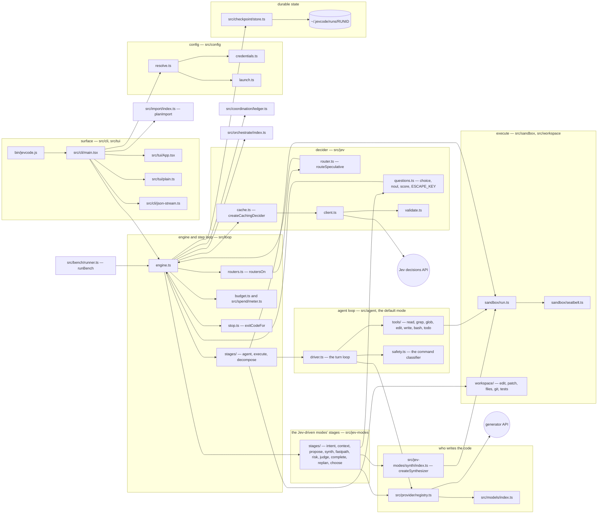

# System overview

JevCode is one Node package: a streaming coding agent for the terminal. In the default mode,
`agent`, the **code model** (a large language model) drives with native tool calls — it reads,
searches, edits and runs commands — and the harness runs each call sandboxed, checkpoints every
step and verifies the change with your tests. A **decider** called Jev, a calibrated decision
model, is asked at most a few quick routing questions at the edges of a run. The older modes,
kept for saved configs, resume and the bench, still let Jev decide every step. Either way the
tests decide whether the code is right. Nothing else does.

This page is the map. It shows the twenty-two top-level modules, who owns what, and the import
rules that keep the layers from collapsing into each other.

- Depth on the default loop: [The agent loop](agent-loop.md).
- Depth on the legacy modes' engine: [The step loop](step-loop.md).
- Depth on the code search the `llm-jev` and `jev-only` modes propose patches with:
  [The synthesizer](synthesizer.md).
- Depth on what Jev is allowed to decide: [The Jev contract](jev-contract.md).
- The normative specifications are [`docs/AGENT-LOOP-DESIGN.md`](../AGENT-LOOP-DESIGN.md) for
  the default mode and [`docs/DESIGN.md`](../DESIGN.md) for the rest; §2 of the latter is the
  package layout this page summarises.

## The picture



In the default mode the engine hands each step to the agent driver (`src/loop/stages/agent.ts`
→ `src/agent/driver.ts`), which samples the code model and resolves its tool calls; the
engine keeps the shared tail — budgets, pre- and post-images, execution, the commit and the
checkpoint. The Jev stages, in `src/jev-modes/stages/`, run only in the legacy modes. Two edges
are worth reading twice.
**Every Jev question goes through the engine**, not around it: a stage (or one of the agent's
three quick placements) builds a question batch and hands it to the engine's one recorded,
metered ask, which wraps the client in a within-run answer cache. And `routeSpeculative` does
not talk to the decider on its own — it is handed the stage's own ask as a function argument.

## The modules

Line counts are whole-file counts of `.ts` and `.tsx` under each directory, taken on
2026-09-23 from the tree with the Jev-driven modules moved under `src/jev-modes/`: **521 files,
194,112 lines** across 22 top-level modules. Reproduce with `find src \( -name '*.ts' -o -name '*.tsx' \) | xargs wc -l | tail -1`.

| module | lines | what it owns |
|---|---:|---|
| `src/jev-modes` | 48,563 | Everything only the Jev-driven modes use. `synth/` is the Ledger + Sieve synthesizer of the `llm-jev` and `jev-only` modes: localisation, candidate generation, shadow-lane verification, the overfit guard (see [The synthesizer](synthesizer.md)). `stages/` holds the Jev-mode stages — intent, context, propose, synth, fastpath, risk, judge, complete, replan, choose — and `chat/lookup.ts` the `jev-only` code lookup. |
| `src/tui` | 37,403 | The interactive terminal interface: transcript, the streaming reply block, panes, composer, slash commands, review panels, the mini indicator. |
| `src/cli` | 13,903 | Argument parsing, the command dispatch, the session controller, login, the machine-readable stream. |
| `src/loop` | 13,019 | The engine every mode runs on, the agent seam, the execute and decompose stages, the code judge (`judge-code.ts`), budgets, loop detection, the context policy, the commit rule. |
| `src/coordination` | 8,846 | The on-disk ledger several sessions on one machine use to see each other's claims and leases. |
| `src/import` | 8,591 | Reads configuration and instruction files other agents left behind and plans an import. Writes nothing itself. |
| `src/bench` | 8,296 | The benchmark runner, its conditions and its suite loaders. |
| `src/provider` | 7,673 | The seven generator adapters, each speaking both the agent's native tool protocol and the legacy one-action schema. |
| `src/perf` | 7,214 | Performance probes with recorded budgets: first frame, step overhead, render lag, stream latency, decider latency. |
| `src/core` | 5,794 | The shared contract. `types.ts` declares every interface the modules speak through; `limits.ts` holds the bounds. |
| `src/agent` | 5,691 | The default mode's loop: the driver, the seven tools, the prompts, the context policy, the command classifier, the loop detector and Jev's three quick placements. See [The agent loop](agent-loop.md). |
| `src/orchestrate` | 5,203 | Splitting one task into child agents and landing their branches. Off by default. |
| `src/config` | 3,925 | Setting resolution — flag, then environment, then file, then default — and credential storage. |
| `src/session` | 3,260 | The long-lived session around one or more runs. |
| `src/workspace` | 3,047 | File reads and writes, patches, test detection and the test-run predicates (`tests.ts`), git. `git.ts` is the only module that runs `git` through the sandbox. |
| `src/models` | 2,963 | The model catalogue, its cache and its pricing table. |
| `src/checkpoint` | 2,754 | The run directory: atomic state snapshots, the append-only records, resume. |
| `src/jev` | 2,292 | The decider: the question builders, the client, validation, confidence, the speculative router, the absent decider. |
| `src/undo` | 2,240 | Restoring the workspace from the per-step images. |
| `src/chat` | 1,681 | The chat identity and voice every reply is written in, and the legacy modes' intake. |
| `src/sandbox` | 1,089 | Running a command under a macOS seatbelt profile, and killing its process tree. |
| `src/spend` | 169 | The spend meter. Generator and decider dollars are counted separately and the cap never throws. |

Two single files sit at the root: `src/errors.ts` (the typed error hierarchy and the exit-code
table) and `src/version.ts`.

## The layering rules

The tree has no dependency-injection framework and no plugin system. What keeps it honest is a
small set of import rules, each asserted by the module that benefits from it.

1. **`src/orchestrate/**` imports nothing from `src/tui`, `src/cli`, `src/session` or
   `src/config`.** Everything environmental — the home directory, the clock, git, the ledger
   handle, the commit identity, the resolved settings — arrives as a function argument. That is
   why the module exports its seam types (`RunGit`, `Clock`, `AskFn`, `CommitIdentity`,
   `SplitPolicy`) next to the functions that take them.
   <!-- src/orchestrate/index.ts:1-15, src/orchestrate/types.ts:12-14 -->
2. **`src/coordination/**` obeys the same rule**, and adds one of its own: the facade in
   `index.ts` is the only import path for the session, the CLI, the interface and the engine.
   <!-- src/coordination/index.ts:1-6 -->
3. **`src/import/**` performs no writes.** It turns the filesystem into a plan and renders it.
   The one module that touches `node:fs` is `discover.ts`, and it is read-only by construction —
   it has no write method. Applying a plan goes through an injected write seam (`ImportWriteFs`)
   supplied by the caller, and only for the rows a human approved.
   <!-- src/import/index.ts:1-11, src/import/discover.ts:101, src/import/types.ts:216 -->
4. **`src/workspace/git.ts` is the only module that runs `git` through the sandbox.** Exactly
   one other module runs `git` at all: `src/workspace/gitstate.ts`, which makes two unsandboxed
   read-only probes at run start — `rev-parse` and `status --porcelain=v2` — because the
   seatbelt profile has to learn the git directory before it can exist. Everything else in that
   file is pure, including an in-process reader of `HEAD` that never spawns anything.
   <!-- src/workspace/git.ts:2, src/workspace/gitstate.ts:1-12; `grep -rln "node:child_process" src`
        lists no other module that runs git. -->
5. **No `any`.** `npm run typecheck` is `tsc --noEmit` followed by `scripts/no-any.mjs`, which
   fails on `: any`, `as any`, `<any>`, `any[]`, `Array<any>`, `Record<_, any>` and
   `Promise<any>` anywhere under `src`, `test`, `perf` and `scripts`. The compiler runs with
   `strict`, `noUncheckedIndexedAccess`, `exactOptionalPropertyTypes`,
   `noPropertyAccessFromIndexSignature`, `noImplicitReturns`, `verbatimModuleSyntax` and
   `erasableSyntaxOnly`.
   <!-- package.json scripts.typecheck; scripts/no-any.mjs:6; tsconfig.json -->

Rules 1–3 can be checked in a second:

```
grep -rn "from '\.\./\(tui\|cli\|session\|config\)" src/orchestrate src/coordination src/import
```

It prints nothing on this tree.

`npm run check` runs the type check, the Jev-contract lint, the documentation link check
(`scripts/check-doc-links.mjs`) and the unit tests together.

## The modes

One engine, five modes, selected by the `mode` setting. The default is **`agent`**; `jev-only`
is the other advertised mode, and the three legacy modes stay accepted for saved configs, resume
and the bench (`/mode legacy` lists them).
<!-- src/core/types.ts (EngineMode); src/config/defaults.ts (DEFAULT_MODE, ADVERTISED_MODES, LEGACY_MODES) -->

| mode | who writes the change | who decides | badge |
|---|---|---|---|
| `agent` (default) | the code model, through native tool calls | the code model, which checks its own work in proportion to the change; Jev only makes a few quick routing calls | `agent` |
| `jev-only` | the synthesizer alone — no generator is called | tests; Jev ranks and arbitrates | `jev-only` |
| `llm-jev` (legacy) | the generator, writing candidate patches **inside** the synthesizer | tests, then a harm-only risk check | `llm+jev · verified` |
| `jev-on` (legacy) | the generator, writing one action per step | Jev at every stage, tests at the judge | `jev+llm` |
| `jev-off` (legacy) | the generator alone | the generator | `llm-only` |

<!-- badge words: src/config/defaults.ts MODE_BADGE_WORD -->

`agent` dispatches each step to `src/agent/` through one branch in the engine and reuses the
whole execute-and-commit tail: budgets, pre-images, the sandbox, post-images, the checkpoint.
No Jev stage runs in it. See [The agent loop](agent-loop.md).

`jev-off` is the control arm of the legacy bench. It is not a second engine:
`createGeneratorOnlyEngine` in `src/loop/generator-only.ts` is a thin factory that forces
`mode: 'jev-off'` on the same `createEngine`, and the engine core branches on the mode. The run
gets the same prompt layout minus the Jev sections, a candidate listing instead of selected
context files, plans accepted verbatim, no risk stage and no judge stage, and a `done` proposal
stops the run. It emits the same event union, and `decision`, `jev:request`, `intent`,
`context`, `risk`, `judge` and `replan` never fire.
<!-- src/loop/generator-only.ts:1-18 -->

The measured claim for `jev-only` is worth stating exactly, because it is easy to disbelieve.
An audit parsed every `jev-only` benchmark record line by line across **21 recorded result
sets**: every finished record carries `generatorCalls: 0`, `cost.generator: 0` and zero
generator tokens, and every `summary.json` carries `spentUsd.generator: 0`. The bench itself
marks a `jev-only` record with a non-zero count `invalid`, and `src/provider/null.ts` throws if
`generate()` is reached at all.
<!-- experiments/results/jev-only-audit.md §2 rows 2 and §2.2. The records are not in the
     repository: `bench/results/` is gitignored. -->

## Durable state

Every run owns a directory under `~/.jevcode/runs/<runId>`. The names are fixed in one map,
`CHECKPOINT_FILES` in `src/checkpoint/store.ts`, so nothing writes a file the resume path does
not know about: `run.json`, `state.json`, `state.prev.json`, `steps.jsonl`, `decisions.jsonl`,
`jev.jsonl`, `generator.jsonl`, `transcript.log`, `ui.json`, `jevcode.log`, `run.lock`, and the
directories `pre/`, `post/`, `tmp/`, `drafts/`, `cache/`, `orchestrate/`, `outputs/` and
`context/`. An agent-mode run adds `agent/transcript.jsonl`, the append-only conversation the
model reads, written before each step's checkpoint.
<!-- src/checkpoint/store.ts:31-68; src/agent/transcript.ts (transcriptPath) -->

`state.json` is rotated atomically through `state.prev.json`, and the checkpoint write for step
N may overlap step N+1's early stages but is always awaited before step N+1 touches the
workspace. The workspace is therefore never more than one uncommitted step ahead of durable
state.

## What ships behind a switch

Four mechanisms in this tree are built and are not on for an ordinary run. Every page that
mentions one says so again.

| mechanism | default | how to turn it on |
|---|---|---|
| speculative routers | **off in every mode** | `routers: 'on'` on the engine options, or `JEVCODE_ROUTERS=on`; the `jev-on` gate is checked first |
| the warm verification plane | **off** | `JEVCODE_WARM=on` |
| task splitting into child agents | **off** (`split: 'off'`) | the orchestration policy |
| the bounded sieve fast path | `auto`, **but only under `jev-on`** | `JEVCODE_FASTPATH=off` disables it |

<!-- src/loop/routers.ts routersOn; src/jev/router.ts routersEnabled; src/jev-modes/synth/warm/plane.ts warmPlaneEnabled; src/orchestrate/types.ts DEFAULT_SPLIT_POLICY; src/loop/engine.ts:442 resolveFastPathOption -->
