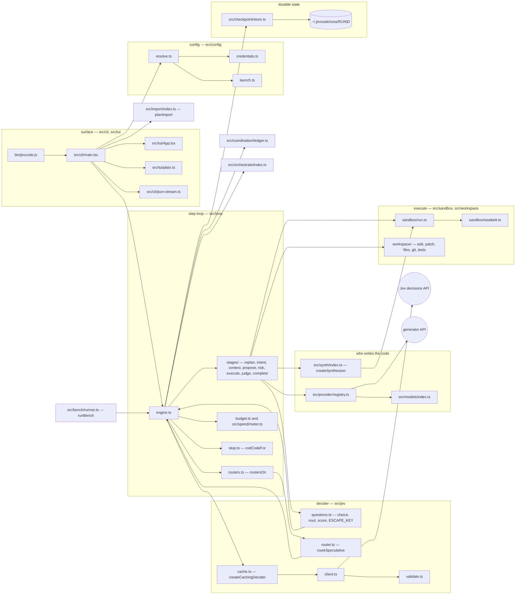

# System overview

JevCode is one Node package. It is a coding agent with an unusual split: a **generator** (a
large language model) writes code, and a **decider** called Jev answers small, code-enumerated
questions about what to do next. The tests decide whether the code is right. Nothing else does.

This page is the map. It shows the twenty-one top-level modules, who owns what, and the import
rules that keep the layers from collapsing into each other.

- Depth on the step loop: [The step loop](step-loop.md).
- Depth on the code search that can propose patches without a generator:
  [The synthesizer](synthesizer.md).
- Depth on what Jev is allowed to decide: [The Jev contract](jev-contract.md).
- The normative specification is [`docs/DESIGN.md`](../DESIGN.md); §2 of that file is the
  package layout this page summarises.

## The picture



Two edges are worth reading twice. **Every Jev question goes through the engine**, not around
it: a stage builds a question batch and hands it to the engine's one recorded, metered ask,
which wraps the client in a within-run answer cache. And `routeSpeculative` does not talk to
the decider on its own — it is handed the stage's own ask as a function argument.

## The modules

Line counts are whole-file counts of `.ts` and `.tsx` under each directory, taken from the
tree this page was written against: **454 files, 166,032 lines** across 21 top-level modules.
Reproduce with `find src \( -name '*.ts' -o -name '*.tsx' \) | xargs wc -l | tail -1`.

| module | lines | what it owns |
|---|---:|---|
| `src/synth` | 45,121 | The Ledger + Sieve synthesizer: localisation, candidate generation, shadow-lane verification, the overfit guard. See [The synthesizer](synthesizer.md). |
| `src/tui` | 28,656 | The interactive terminal interface: transcript, panes, composer, slash commands, review panels. |
| `src/loop` | 14,074 | The step loop, its eight stages, budgets, loop detection, the context policy, the commit rule. |
| `src/cli` | 9,722 | Argument parsing, the command dispatch, the session controller, login, the machine-readable stream. |
| `src/import` | 8,591 | Reads configuration and instruction files other agents left behind and plans an import. Writes nothing itself. |
| `src/coordination` | 8,381 | The on-disk ledger several sessions on one machine use to see each other's claims and leases. |
| `src/bench` | 8,047 | The benchmark runner, its conditions and its suite loaders. |
| `src/provider` | 6,309 | Generator surfaces: Anthropic, OpenRouter, OpenAI-compatible endpoints, and the prompt and action schema. |
| `src/perf` | 5,796 | Performance probes with recorded budgets: first frame, step overhead, render lag, decider latency. |
| `src/core` | 5,224 | The shared contract. `types.ts` declares every interface the modules speak through; `limits.ts` holds the bounds. |
| `src/orchestrate` | 5,202 | Splitting one task into child agents and landing their branches. Off by default. |
| `src/config` | 3,188 | Setting resolution — flag, then environment, then file, then default — and credential storage. |
| `src/models` | 2,939 | The model catalogue, its cache and its pricing table. |
| `src/workspace` | 2,939 | File reads and writes, patches, test detection, git. `git.ts` is the only module that runs `git` through the sandbox. |
| `src/checkpoint` | 2,678 | The run directory: atomic state snapshots, the append-only records, resume. |
| `src/jev` | 2,237 | The decider: the question builders, the client, validation, confidence, the speculative router. |
| `src/undo` | 2,162 | Restoring the workspace from the per-step images. |
| `src/chat` | 1,611 | The conversational surface that decides when a message is a task. |
| `src/session` | 1,439 | The long-lived session around one or more runs. |
| `src/sandbox` | 1,051 | Running a command under a macOS seatbelt profile, and killing its process tree. |
| `src/spend` | 169 | The spend meter. Generator and decider dollars are counted separately and the cap never throws. |

Two single files sit at the root: `src/errors.ts` (the typed error hierarchy and the exit-code
table) and `src/version.ts`.

## The layering rules

The tree has no dependency-injection framework and no plugin system. What keeps it honest is a
small set of import rules, each asserted by the module that benefits from it.

1. **`src/orchestrate/**` imports nothing from `src/tui`, `src/cli`, `src/session` or
   `src/config`.** Everything environmental — the home directory, the clock, git, the ledger
   handle, the commit identity, the resolved settings — arrives as a function argument. That is
   why the module exports its seam types (`RunGit`, `Clock`, `AskFn`, `CommitIdentity`,
   `SplitPolicy`) next to the functions that take them.
   <!-- src/orchestrate/index.ts:1-15, src/orchestrate/types.ts:12-14 -->
2. **`src/coordination/**` obeys the same rule**, and adds one of its own: the facade in
   `index.ts` is the only import path for the session, the CLI, the interface and the engine.
   <!-- src/coordination/index.ts:1-6 -->
3. **`src/import/**` performs no writes.** It turns the filesystem into a plan and renders it.
   The one module that touches `node:fs` is `discover.ts`, and it is read-only by construction —
   it has no write method. Applying a plan goes through an injected write seam (`ImportWriteFs`)
   supplied by the caller, and only for the rows a human approved.
   <!-- src/import/index.ts:1-11, src/import/discover.ts:101, src/import/types.ts:216 -->
4. **`src/workspace/git.ts` is the only module that runs `git` through the sandbox.** Exactly
   one other module runs `git` at all: `src/workspace/gitstate.ts`, which makes two unsandboxed
   read-only probes at run start — `rev-parse` and `status --porcelain=v2` — because the
   seatbelt profile has to learn the git directory before it can exist. Everything else in that
   file is pure, including an in-process reader of `HEAD` that never spawns anything.
   <!-- src/workspace/git.ts:2, src/workspace/gitstate.ts:1-12; `grep -rln "node:child_process" src`
        lists no other module that runs git. -->
5. **No `any`.** `npm run typecheck` is `tsc --noEmit` followed by `scripts/no-any.mjs`, which
   fails on `: any`, `as any`, `<any>`, `any[]`, `Array<any>`, `Record<_, any>` and
   `Promise<any>` anywhere under `src`, `test`, `perf` and `scripts`. The compiler runs with
   `strict`, `noUncheckedIndexedAccess`, `exactOptionalPropertyTypes`,
   `noPropertyAccessFromIndexSignature`, `noImplicitReturns`, `verbatimModuleSyntax` and
   `erasableSyntaxOnly`.
   <!-- package.json scripts.typecheck; scripts/no-any.mjs:6; tsconfig.json -->

Rules 1–3 can be checked in a second:

```
grep -rn "from '\.\./\(tui\|cli\|session\|config\)" src/orchestrate src/coordination src/import
```

It prints nothing on this tree.

`npm run check` runs the type check, the Jev-contract lint, the documentation link check
(`scripts/check-doc-links.mjs`) and the unit tests together.

## The four modes

One engine, four modes, selected by the `mode` setting. The default is **`llm-jev`**.
<!-- src/core/types.ts:808 (EngineMode); src/config/defaults.ts:60 (DEFAULT_MODE) -->

| mode | who writes the change | who decides | badge |
|---|---|---|---|
| `llm-jev` | the generator, writing candidate patches **inside** the synthesizer | tests, then a harm-only risk check | `llm+jev · verified` |
| `jev-on` | the generator, writing one action per step | Jev at every stage, tests at the judge | `jev+llm` |
| `jev-only` | the synthesizer alone — no generator is called | tests; Jev ranks and arbitrates | `jev-only` |
| `jev-off` | the generator alone | the generator | `llm-only` |

<!-- badge words: src/config/defaults.ts MODE_BADGE_WORD -->

`jev-off` is the control arm. It is not a second engine:
`createGeneratorOnlyEngine` in `src/loop/generator-only.ts` is a thin factory that forces
`mode: 'jev-off'` on the same `createEngine`, and the engine core branches on the mode. The run
gets the same prompt layout minus the Jev sections, a candidate listing instead of selected
context files, plans accepted verbatim, no risk stage and no judge stage, and a `done` proposal
stops the run. It emits the same event union, and `decision`, `jev:request`, `intent`,
`context`, `risk`, `judge` and `replan` never fire.
<!-- src/loop/generator-only.ts:1-18 -->

The measured claim for `jev-only` is worth stating exactly, because it is easy to disbelieve.
An audit parsed every `jev-only` benchmark record line by line across **21 recorded result
sets**: every finished record carries `generatorCalls: 0`, `cost.generator: 0` and zero
generator tokens, and every `summary.json` carries `spentUsd.generator: 0`. The bench itself
marks a `jev-only` record with a non-zero count `invalid`, and `src/provider/null.ts` throws if
`generate()` is reached at all.
<!-- experiments/results/jev-only-audit.md §2 rows 2 and §2.2. The records are not in the
     repository: `bench/results/` is gitignored. -->

## Durable state

Every run owns a directory under `~/.jevcode/runs/<runId>`. The names are fixed in one map,
`CHECKPOINT_FILES` in `src/checkpoint/store.ts`, so nothing writes a file the resume path does
not know about: `run.json`, `state.json`, `state.prev.json`, `steps.jsonl`, `decisions.jsonl`,
`jev.jsonl`, `generator.jsonl`, `transcript.log`, `ui.json`, `jevcode.log`, `run.lock`, and the
directories `pre/`, `post/`, `tmp/`, `drafts/`, `cache/`, `orchestrate/`, `outputs/` and
`context/`.
<!-- src/checkpoint/store.ts:31-68 -->

`state.json` is rotated atomically through `state.prev.json`, and the checkpoint write for step
N may overlap step N+1's early stages but is always awaited before step N+1 touches the
workspace. The workspace is therefore never more than one uncommitted step ahead of durable
state.

## What ships behind a switch

Four mechanisms in this tree are built and are not on for an ordinary run. Every page that
mentions one says so again.

| mechanism | default | how to turn it on |
|---|---|---|
| speculative routers | **off in every mode** | `routers: 'on'` on the engine options, or `JEVCODE_ROUTERS=on`; the `jev-on` gate is checked first |
| the warm verification plane | **off** | `JEVCODE_WARM=on` |
| task splitting into child agents | **off** (`split: 'off'`) | the orchestration policy |
| the bounded sieve fast path | `auto`, **but only under `jev-on`** | `JEVCODE_FASTPATH=off` disables it |

<!-- src/loop/routers.ts routersOn; src/jev/router.ts routersEnabled; src/synth/warm/plane.ts warmPlaneEnabled; src/orchestrate/types.ts DEFAULT_SPLIT_POLICY; src/loop/engine.ts:442 resolveFastPathOption -->
