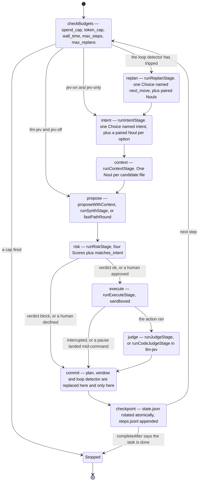
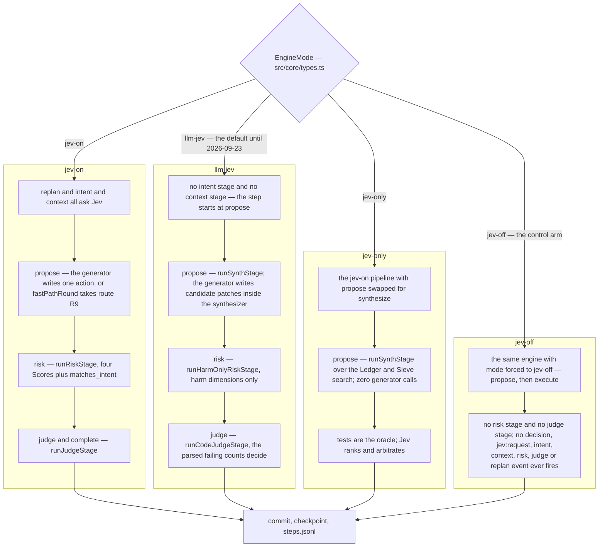

# The step loop

> **This is the engine of the legacy, Jev-driven modes** — `llm-jev`, `jev-on`, `jev-off` — and of
> `jev-only`. The default mode, `agent`, does not run these stages: it hands each step to the
> agent driver and reuses only the shared tail described below (budgets, pre- and post-images,
> execution, the commit rule and the checkpoint). Start at [The agent loop](agent-loop.md) for
> the default mode.

A run is a sequence of steps. A step proposes one action, checks it, runs it, judges the
result, and writes it down. `src/loop/engine.ts` holds the whole of it; the stages themselves
live in `src/loop/stages/`, one file each. The agent mode's branch is one more stage file,
`src/loop/stages/agent.ts`.

This page walks one step from budget check to checkpoint, names every function, and says which
stages run in which of the four Jev-driven modes.

- The interfaces every stage speaks through are in `src/core/types.ts`.
- The normative text is [`docs/DESIGN.md` §6](../DESIGN.md) (the loop) and §9.1 (the commit
  rule).
- What Jev is and is not allowed to decide at each site: [The Jev contract](jev-contract.md).

## One step, stage by stage



## Where a step starts

`checkBudgets` runs first, with a fixed order and the first match winning:
`spend_cap`, `token_cap`, `wall_time`, `max_steps`, `max_replans`.
<!-- BUDGET_ORDER, src/loop/budget.ts:11 -->
It runs twice per step: all five at step start, and `spend_cap` plus `wall_time` again
immediately before execute. The second call matters — a step that spent its whole wall budget
inside the propose stage is discarded before it can touch the workspace.

Then the entry stage is chosen, in one expression:

```ts
let stage: StageName = usesJev(this.mode)
  ? (this.detector.tripped() ? 'replan' : this.mode === 'llm-jev' ? 'propose' : 'intent')
  : 'propose';
```
<!-- src/loop/engine.ts:4101 -->

Read it carefully, because three facts hide in it.

- `jev-only` is not `llm-jev`, so it takes the **`intent`** branch. It runs the same pipeline as
  `jev-on` with only the propose stage swapped.
- `llm-jev` skips intent and context entirely and starts at propose. Its intent is derived in
  code from the proposal's action kind afterwards, and the `intent` event it emits carries
  `verdict: 'code'` to say so.
- `jev-off` runs through the same function, taking the `else` branch of every mode test in it.
  `createGeneratorOnlyEngine` in `src/loop/generator-only.ts` is a thin factory that forces
  `mode: 'jev-off'` on the same `createEngine`; there is no second engine.
  <!-- src/loop/generator-only.ts:16 -->

The `jev-off` branch of the step is short: propose, compute the action's targets, apply the
child-agent ownership refusal if this run is a child, then execute. No risk stage, no judge, no
completion question. A `done` proposal stops the run.
<!-- src/loop/engine.ts:4260-4287 -->

There is one more stage, `decompose`, which runs before `replan` and `intent` and only when
task splitting is possible at all. It short-circuits on `split: 'off'` — the default — before
it gathers a single fact.

## The four Jev-driven modes

The fifth mode, `agent` (the default), takes its own branch at propose and is described in
[The agent loop](agent-loop.md).



`runHarmOnlyRiskStage` and `runCodeJudgeStage` are not called by the engine directly. They are
private branches taken inside `runRiskStage` and `runJudgeStage` when `ctx.mode === 'llm-jev'`,
which is why the engine's call sites are identical in every mode.
<!-- src/jev-modes/stages/risk.ts:747, src/jev-modes/stages/judge.ts:218 -->

## The stages

### replan — `runReplanStage`

Runs only when the loop detector has tripped. The detector signs each committed step and trips
when one signature recurs three times (`LOOP_TRIP_COUNT = 3`, `src/loop/loopdetect.ts`). Its
signatures are deliberately narrow: a blocked or declined proposal is signed on the proposal
alone, so "declined, then blocked" copies of one proposal count once; and a failing test run is
signed by the *set of failing test ids*, so a suite going 6/10, then 8/10, then 9/10 is progress
and never trips.

The stage asks one request — a Choice of the next move plus its paired Nouls — and resolves it
through `resolveChoice`. If the answer cannot be resolved the code fallback is
`REPLAN_FALLBACK = 'change_approach'`.

### intent — `runIntentStage`

One request: a Choice over a fixed set of intents, one paired Noul per option, and
`plan_still_valid`. `resolveChoice` (`src/jev-modes/stages/choose.ts`) takes the answer's `choice`
when its paired Noul is at or above `PAIRED_NOUL_FLOOR = 0.5`; otherwise the highest paired Noul
above the floor; otherwise the stage's safe default. The verdict — `chosen`, `overridden`,
`fallback` — is written onto the decision row, so the reason is visible rather than inferred.

A `fallback` verdict also sets `draft.observed`, which is how the run records that the step was
driven by code rather than by an answer.

### context — `runContextStage`

One request: a Noul per candidate file, over a code-built shortlist. The output is
`contextFiles` and the bounded file views the prompt shows. Jev's picks come first, then the
generator's file cache, merged and de-duplicated by path.

### propose

This is the stage with four different bodies, chosen by mode and by one predicate.

| condition | what runs |
|---|---|
| a paused proposal is being replayed | the cached proposal stands; intent, context and propose are skipped, risk always re-runs |
| `jev-only`, or `llm-jev` on a workspace the synthesizer handles | `runSynthStage(ctx, synthesizer, sctx)` |
| `llm-jev` on a workspace it does not handle | `proposeWithContext` — the generic single-action prompt, with `draft.proposer = 'generic'` |
| `jev-on` with the fast path armed | `fastPathRound` — one bounded sieve round, route R9 |
| `jev-on` otherwise, and `jev-off` | `proposeWithContext` |

`synthesizerHandles` is the predicate for the third row: the workspace needs a non-test Python
source file and either a detected test command in a recognised layout or a repository shape.
<!-- src/jev-modes/synth/index.ts:299 -->

The fast path is in two halves so that declining is free. `fastPathArm` evaluates the cheap
predicate outside any stage — it costs nothing and emits nothing. Only if it fires does
`fastPathRound` run, and it runs *inside* `this.stage('propose', …)`, so a step whose round
fired and then declined has two matched propose spans rather than one unmatched one. See
[The synthesizer](synthesizer.md) for what the round does.

### risk — `runRiskStage`

Before anything is asked, a code refusal runs: `ownershipRefusal` blocks a child agent from
writing outside the paths it owns. It is decided before the targets are even stat'ed, and it
is a property of the child rather than of the mode — `jev-off` runs no risk stage, so its
branch of the step calls the same function directly.
<!-- src/jev-modes/stages/risk.ts:675 and :737; src/loop/engine.ts:4281 -->

`ownershipRefusal` returns `null` for a parent run and for any run without a delegation, which
is why nothing here changes an ordinary run.

Then the mode branches. In `llm-jev` the private `runHarmOnlyRiskStage` asks only the harm
dimensions. Everywhere else the full stage asks four Scores plus `matches_intent` in one
request and takes the maximum as the verdict.

The verdict has three outcomes:

- **`ok`** — execution continues in the same step.
- **`review`** — the engine emits `confirm:request` and awaits the confirmer. A human note
  reaches the window, and on a decline it reaches Jev and the generator too. Reviews are counted
  only once resolved, because an abort while one is pending discards the step.
- **`block`** — `draft.outcome` becomes `{ status: 'blocked', reason }` and nothing executes.

A blocked or declined step **still commits**. It does not loop back to propose inside the same
step. The reason travels to the next step through the recent window, which is where the writer
sees it. That distinction matters for reading the records: a blocked step consumes a step from
`max_steps` and appears in `steps.jsonl` like any other.
<!-- src/loop/engine.ts:4240-4258 and the `draft.outcome === null` guard at :4289 -->

### execute — `runExecuteStage`

Before the action runs, four things happen in a fixed order, and the order is the point:

1. the previous step's checkpoint write is awaited, so nothing touches the workspace while a
   snapshot is still being written;
2. the coordination gate runs, if a ledger is open;
3. `checkBudgets` runs again for `spend_cap` and `wall_time`;
4. pre-images of the action's targets are copied.

Then, and only then, the action runs — a command under the seatbelt profile
(`src/sandbox/run.ts` with `src/sandbox/seatbelt.ts`), or a workspace file action. Post-images
are taken immediately afterwards, still inside the step so the harness's own time accounting
sees them.

An image write that fails never fails the step: it emits a warning line.

### judge — `runJudgeStage`

The judge runs after any execute that was not interrupted and was not cut short by a pause. It
does **not** require `status === 'executed'`, and the shape of the request depends on the
outcome:

| outcome | what is asked |
|---|---|
| `executed` with a patch or run | the full batch: `succeeded`, `error_present`, `new_information`, `tests_pass_unparsed` when the parser read nothing, one `done_<j>` per plan claim, and `task_complete` |
| `noop` — a `done` proposal | **`task_complete` only.** `judge` is null and the claims follow the code fact |
| `read` | the same batch minus `error_present`, which is not built at all for a read: file contents are not a command failure |
| interrupted, or a pause landed during the command | the judge is skipped; the command still ran to its own end and the step still commits |

<!-- src/jev-modes/stages/judge.ts:219-223 (`reduced`, `read`), :69 (error_present is skipped for a read),
     docs/DESIGN.md §6 per-outcome table -->

When the test output parsed, the parsed counts win. Jev's judgement of the same run is recorded
in `decisions.jsonl` as data, not consulted as a verdict.

### complete

There is no separate complete stage function. `task_complete` rides in the judge request, and
the stop rule is `completeAfter(draft)` on the engine:

```ts
if (this.mode === 'llm-jev') return isCompleteByFact(this.completionFact(draft));
if (!usesJev(this.mode)) return false;
if (!routersOn(this.mode, this.opts.routers))
  return isComplete(draft.completion, this.opts.limits.completeThreshold);
return completionDecision({ routers: true, hasEvidence: …, completion: …, threshold: …, fact }).complete;
```
<!-- src/loop/engine.ts:4837 -->

In `llm-jev` completion is a **code fact**: the harness's own test run, current and green. In
`jev-on` and `jev-only` it is `task_complete` against `limits.completeThreshold`. With the
routers switched on — which is not the default — a step whose proposal carries evidence
completes on the code fact instead, and Jev's answer is recorded only.

## The commit rule

`plan`, `window` and the loop detector are replaced **at one point and no other**. Every stage
writes into a per-step draft; the commit folds that draft into engine state in a single
synchronous block. This is what makes a checkpoint taken from any entry point — a signal, a
crash handler, a pause — whole rather than half-applied.
<!-- src/loop/engine.ts:5434 `commit`; docs/DESIGN.md §9.1 -->

The first thing `commit` does is close the step's router bookkeeping:

```ts
const routerLedger = routersOn(this.mode, this.opts.routers)
  ? commitStepRouters(this.runId, step)
  : null;
```
<!-- src/loop/engine.ts:5446 -->

`commitStepRouters` invalidates the step's token — after which no in-flight answer may be
applied to it — and returns the step's rows, which become `record.router` and
`timing.routerWaitMs` later in the same commit. `record.riskSource` and `record.jevUnavailable`
come from the draft the risk stage wrote, and are behind the same switch because the routers-off
risk stage returns neither member.
<!-- src/loop/engine.ts:5640-5646; the draft members are set at :4236-4237 -->

The switch around it is not decoration. With the routers off, a run must **not** close its
`(runId, step)` keys: a closed key hands every later request for that key a dead token, so
closing keys on a routers-off run would disarm the next run that reuses the same id. A golden
test caught exactly that.

The mirror-image case is a step that was **discarded** rather than committed — a blocking pause
that landed before anything ran, with the run about to replay the same step number.
`discardStepRouters` invalidates the token but deliberately leaves the key open, so the replayed
attempt's routers are not born already dropped.
<!-- src/loop/routers.ts:127 and :145 -->

## The checkpoint overlap

After commit, the engine writes a checkpoint: `state.json` rotated atomically through
`state.prev.json`, one appended line in `steps.jsonl`, and the decision and request records.
The write is allowed to overlap the next step's early stages, but it is awaited before that step
touches the workspace and on shutdown. So the workspace is never more than one uncommitted step
ahead of durable state.

The snapshot itself is taken **synchronously** at the commit point — after the plan update,
after the step's spend is metered, after `loopDetector.observe(step)`. The write may finish
later; the object it writes is never mutated by the next step.

## Failures and stops

A stage that throws goes through `handleStepError`, which decides between discarding the step
and committing it with an error. Three consecutive stage failures end the run:
`CONSECUTIVE_STAGE_FAILURE_LIMIT = 3`.
<!-- src/loop/engine.ts:318 -->

That constant is the reason the speculative routers exist. Before them, three Jev `503`s in a
row ended a run — and a real outage did exactly that to three benchmark runs. A routed ask that
drops does not throw at all, so the stage does not fail and this counter does not move; the
exclusion is structural rather than a special case in the counter. See
[The Jev contract](jev-contract.md).

`exitCodeFor` in `src/loop/stop.ts` is the single function that turns a stop reason into a
process exit code. One rule is worth knowing: if a checkpoint could not be written, the run is
not resumable, and **every** non-error stop — including `complete` — exits with the checkpoint
code instead.

## Stage deadlines with the routers on

These apply only when the routers are switched on, which is not the default in any mode.

| site | function | deadline | code fallback |
|---|---|---:|---|
| RL1 intent | `runIntentStage` | 250 ms | `INTENT_FALLBACK = 'investigate'` |
| RL2 context | `runContextStage` | 400 ms | *not converted in this tree* — the context stage still awaits its ask |
| RL4 judge | `runJudgeStage` | 400 ms | the code comparison of the parsed test counts |
| RL6 replan | `runReplanStage` | 500 ms | `REPLAN_FALLBACK = 'change_approach'` |

<!-- deadlines: src/loop/routers.ts:37-40. Converted sites: grep routeSpeculative over src returns intent.ts, judge.ts, replan.ts only. -->

RL3, the risk site, is not in the table because it is not a router: it is a code-first gate
where Jev may only escalate. RL5, completion, is the demotion described above. Both are covered
on [The Jev contract](jev-contract.md) page.
