# The synthesizer: Ledger, Sieve, and the fast path

> **The engine of `jev-only` and the legacy `llm-jev` mode.** The default mode, `agent`, does not
> use it; see [The agent loop](agent-loop.md).

Most coding agents ask a language model for a patch and then check it. The synthesizer inverts
that. Code enumerates thousands of small, concrete edits at the places the failing tests point
at, and the **tests** rank them by running them. A model is consulted only where running
everything would cost more than asking.

At about 45,000 lines `src/synth` is the largest module in the tree. This page is the implementation
map: what the controller does per step, where the candidates come from, how the search decides
between running everything and ranking first, how it refuses a patch that passes the tests for
the wrong reason, and what the bounded fast path is.

- The normative text is [`docs/JEV-ONLY-DESIGN.md`](../JEV-ONLY-DESIGN.md) §2, §3 and §6, with
  the generator-inside-the-search variant in [`docs/LLM-JEV-DESIGN.md`](../LLM-JEV-DESIGN.md)
  §4, and the fast path in [`docs/LLM-LOOP-DESIGN.md`](../LLM-LOOP-DESIGN.md) §4.
- Where the synthesizer is called from: [The step loop](step-loop.md).
- What Jev may and may not decide inside it: [The Jev contract](jev-contract.md).

## The shape of one step

```mermaid
flowchart TD
  ENTRY["propose stage — src/loop/stages/synth.ts runSynthStage"]
  FASTGATE{"jev-on fast path armed?<br/>T1 fastPath auto and the warm plane OFF<br/>T2 synthesizerHandles<br/>T3 the last action was a test run with failures"}
  FP["fastPathRound — src/loop/stages/fastpath.ts and src/synth/search/fastpath.ts<br/>ONE bounded SIEVE round with mode jev-only, zero generator calls"]
  LLMPROP["proposeWithContext — the generator writes one action, as usual"]
  SYN["createSynthesizer — src/synth/index.ts"]
  LEDGER["the LEDGER — one goal per cluster of failing tests<br/>src/synth/search/goals.ts"]
  PICK["one goal per outer step — LedgerSieveSynthesizer, src/synth/search/index.ts"]
  ORACLE["no failing test, but a repository and an issue?<br/>the ISSUE ORACLE — src/synth/oracle/<br/>extract reproduction blocks, Jev judges which reproduces,<br/>code builds a script that must FAIL on the base commit"]
  LOC["LOCALISE — src/synth/localize/index.ts createLocalizer<br/>traceback frames first, then Jev over files, functions and lines,<br/>unioned with SBFL ranking from src/synth/sbfl"]
  SITES["SITES — physical lines, insert gaps, whole multi-line statements<br/>localize/sites.ts and search/sites.ts"]
  SEEDS["CANDIDATE SOURCES — code proposes<br/>mutation, template, donor, composite, token_beam, history<br/>plus the llm source in llm-jev only"]
  BUDGET{"src/synth/search/budget.ts decideRunPlan —<br/>does the whole pool fit the runs the step has left?"}
  SIEVE["SIEVE — run EVERY candidate through the goal tests<br/>src/synth/sieve/lanes.ts, queue.ts, runner.ts<br/>shadow lanes, never the workspace"]
  WARM["warm verification plane — src/synth/warm/plane.ts<br/>screen HOT, confirm COLD; one-way disable on any anomaly; SHIPS OFF"]
  RANK["RANK — src/synth/rank/index.ts createRanker<br/>Jev orders the pool, the top k are run"]
  PASSERS{"how many test-passing candidates?"}
  GUARD["GUARD ARBITRATION — src/synth/search/guard.ts decideForSearch<br/>cluster passers by behaviour on inputs perturbed from the visible tests<br/>code rules run FIRST"]
  JEVTIE["Jev breaks the RESIDUAL tie between distinct behaviour clusters only"]
  HOLD["a lone passer carrying a structural suspicion signal is HELD<br/>until its site's other sources have run"]
  PROP["PROPOSAL — src/synth/search/proposal.ts"]
  OUT["back to the engine as the step's proposal — then risk, execute, judge, unchanged"]

  ENTRY --> FASTGATE
  FASTGATE -->|"no, or the round declines"| LLMPROP --> OUT
  FASTGATE -->|"yes"| FP --> SYN
  ENTRY -->|"jev-only and llm-jev"| SYN
  SYN --> LEDGER --> PICK
  PICK --> ORACLE --> LOC
  PICK --> LOC
  LOC --> SITES --> SEEDS --> BUDGET
  BUDGET -->|"it fits"| SIEVE
  BUDGET -->|"it does not"| RANK --> SIEVE
  WARM -.screens, never decides.-> SIEVE
  SIEVE --> PASSERS
  PASSERS -->|"exactly one, suspicious"| HOLD --> GUARD
  PASSERS -->|"two or more"| GUARD
  PASSERS -->|"none"| PICK
  GUARD --> JEVTIE --> PROP --> OUT
```



## Two entry points, one class

`src/synth/index.ts` is the only file that names the real modules. Everything else is composed
through injected dependencies, which is why the controller's control flow is unit-tested with
fakes.

```ts
export function createSynthesizer(opts: SynthesizerOptions): Synthesizer {
  const mode: SynthesizerArmMode = opts.mode ?? 'jev-only';
  if (mode === 'jev-only') return Object.assign(new LedgerSieveSynthesizer(searchDeps()), { mode });
  if (mode !== 'llm-jev') throw new ConfigError(…);
  const generation = opts.generation ?? LLM_DEFAULT_GENERATION;
  const llm = createSearchLlm({ ...(opts.llm ?? {}), generation });
  const inner = new LedgerSieveSynthesizer(searchDeps({ llm }), { llmJev: true, generation });
  return { name: inner.name, mode, generation, synthesize: (ctx) => inner.synthesize(ctx), handles: synthesizerHandles };
}
```
<!-- src/synth/index.ts:313 -->

Read the first branch carefully: `jev-only` short-circuits to a bare `LedgerSieveSynthesizer`
with **no language-model source wired in at all**. The zero-generator-call property is not a
runtime check that could be bypassed; there is nothing to call. The measured consequence: an
audit parsed every `jev-only` benchmark record across 21 recorded result sets and found
`generatorCalls: 0`, `cost.generator: 0` and zero generator tokens on every finished one.
<!-- experiments/results/jev-only-audit.md §2.2. The records themselves are not committed:
     `bench/results/` is gitignored. -->

A third arm name, `llm-sieve`, is accepted by the type but is not wired. Asked for it, the
factory throws rather than silently running a different one.

`llm-jev` adds one more candidate source — the generator — inside the same search. It does not
change the verification, the guard, or the proposal shape.

## The ledger

A run's failing tests are clustered into **goals**, and one goal is attacked per outer step.
Clustering is code, in `src/synth/search/goals.ts`:

1. by the innermost traceback frame in a source file (file, function, ±3 lines) when the run
   printed one;
2. otherwise by the top-ranked spectrum line the tests share;
3. otherwise one goal per test.

Frames come first for a measured reason: on multi-bug tasks every hunk fixes at least one test
on its own, and the tests one hunk fixes raise or return from the same function. On the
QuixBugs-style suites the runner prints no frames, so rule 3 applies and one goal per test
reproduces the measured setting.

Goals move through `open → active → fixed` or `parked → open`. Jev is asked exactly one question
in this module — which failing behaviour to attack first — and it is asked because it is the one
thing the tests cannot answer.

## The issue oracle

A repository-shaped workspace often has no failing test at all: it has an issue report. The
oracle in `src/synth/oracle/` builds one.

Code extracts candidate code blocks and tracebacks from the task text. One Jev request judges
which block reproduces the bug, which shows the expected output, and what kind of failure it is.
Code then turns the pick into a runnable script with a machine-checkable pass criterion — and
the script must **fail on the base commit**, or it is not a reproduction and is rejected. The
result reaches the search as one synthetic failing test.

That "must fail first" check is the whole safety of the mechanism. Jev picks which snippet to
try; code decides whether the snippet actually reproduces anything.

## Localisation

`createLocalizer` in `src/synth/localize/index.ts` runs one pipeline with beams, where code
proposes and Jev decides at every level:

| level | what is asked | how it is consumed |
|---|---|---|
| files | one Noul per workspace path, at most 250 per request, concurrent | by rank, top 5 — never by threshold |
| confirm | one request of Nouls over the beam, with top-level symbol outlines | re-rank |
| functions | one Choice per beam file over its definitions, with a module-level option | global top 5 by file × function probability |
| lines | one Choice per function over its code lines, with the failing tests and what the buggy program actually did | top 3 anchors per function, unioned with the spectrum's top 3 |

A single-file workspace skips the first three levels and asks one flat line Choice: on small
files the hierarchy did not help.

Two supporting modules are infrastructure, not candidate sources, and it is worth saying so
because their names suggest otherwise:

- **`src/synth/sbfl`** is spectrum-based fault localisation — a standard-library-only Python
  tracer plus the Ochiai, Tarantula and D\* formulas. It ranks *lines*; it proposes no edits.
- **`src/synth/py`** is a dependency-free Python tokenizer, structural analyser, line editor
  and similarity toolkit. Every candidate source uses it; it is a source of none.

## Sites

A **site** is where an edit can go: a physical line, an insert gap before or after a line, or a
whole multi-line statement. Sites are ±3-line windows around the localiser's anchors, plus an
insert gap on each side of each anchor.

## The candidate sources

The type is closed. `CandidateSourceName` in `src/synth/types.ts:67` has exactly eight members,
and seven of them are produced by something in this tree:

| name | produced in | what it proposes |
|---|---|---|
| `mutation` | `src/synth/mutate/index.ts:210` | token-level variants of the site's current line: every operator in a fixed table applied, then filtered for bracket and quote balance, de-duplicated and capped. It calls neither Jev nor Python |
| `template` | `src/synth/templates/index.ts:111` | named repair templates, for example adding a guard before a dereference. Sketches filled by `src/synth/fill/beam.ts` are also tagged `template` |
| `donor` | `src/synth/donor/source.ts:179` | code mined from elsewhere in the same workspace, with holes filled |
| `composite` | `src/synth/search/composite.ts:788` | depth-2 pairs of the top single edits from the three sources above, so a pair is a pair of what the seeds actually ran |
| `token_beam` | `src/synth/beam/source.ts:73` | a grammar-guided token beam over the line; its top three distinct completions become candidates |
| `history` | `src/synth/history/source.ts:222` | edits harvested from what this run already tried, and what worked |
| `llm` | `src/synth/llm/candidates.ts:434` | the generator, in `llm-jev` only |
| `test_value` | — | declared in the union and given a queue prior, but nothing in this tree tags a candidate with it |

<!-- CandidateSourceName: src/synth/types.ts:67; queue prior src/synth/sieve/queue.ts:69.
     Wiring: src/synth/index.ts:232 createSubGoalDeps (seeds: mutation, template, donor, composite)
     and :254-255 (sketch, beam). `grep -rn "source: 'test_value'" src` returns nothing. -->

Two more modules feed the search without being sources. `src/synth/sketch` proposes line
sketches with holes, which one Jev request prunes and `src/synth/fill` completes into
`template` candidates. `src/synth/introspect` contributes observed run facts and vocabulary that
widen the site set.

The search visits five **phases** in order: `SEEDS`, `LLM`, `SKETCH`, `BEAM`, `WIDENED`.
<!-- PHASES, src/synth/search/types.ts:13 -->
`SKETCH` runs at the top 3 sites; `BEAM` at the top 2, and only when at least 35 Jev requests
remain in the step's budget, because the beam can spend up to 31 per line.
<!-- SKETCH_TOP_SITES=3, BEAM_TOP_SITES=2, BEAM_MIN_JEV_REQUESTS_LEFT=35: src/synth/search/subgoal.ts:67-71 -->

One enumeration bound is worth knowing: at most **254** candidates per site per source per
chunk — the 255-option Choice limit, minus the escape.
<!-- ENUMERATE_CAP, src/synth/search/subgoal.ts:65 -->

The candidate-source diagram above lists the sources by these names.

## SIEVE or RANK

This is the central decision, and the common description of it is out of date, so here is the
code:

```ts
export function decideRunPlan(cands, site, oracle, budget, opts = {}): RunPlan {
  const n = typeof cands === 'number' ? cands : cands.length;
  const left = runsLeft(oracle, budget);
  if (poolFitsRunBudget(n, left)) {
    const allowed = opts.sitesLeft === undefined ? n : Math.min(n, siteShare(left, opts.sitesLeft));
    return { mode: 'SIEVE', k: n, runsAllowed: allowed };
  }
  let k = site.kind === 'insert' ? RANK_K_INSERT : RANK_K_REPLACE;
  …
  return { mode: 'RANK', k, runsAllowed: k };
}
```
<!-- src/synth/search/budget.ts:952 -->

The cut is **`poolFitsRunBudget(n, left)`**, which is simply `n <= left`. It is a comparison of
the pool against the step's remaining runs, and nothing else.

- `runsLeft` divides the wall the step has left by the measured cost of one run, multiplied by
  the lane count, and caps that by the run count the step has left. An expensive oracle
  therefore shrinks `left` rather than needing a separate cost threshold.
  <!-- src/synth/search/budget.ts:911 -->
- If the pool fits, **SIEVE**: run every candidate. The tests rank them and no Jev request is
  spent, because the first passer arrives before any order would have been consulted.
- If it does not, **RANK**: `k` is 3 at a replace site and 5 at an insert site, rising to 5 once
  the pool is at least 61 candidates (large enough for compact Nouls), and on a
  repository-class oracle with a cheap reproduction rising further to the site's share of the
  remaining runs, capped at 16.
  <!-- RANK_K_REPLACE=3, RANK_K_INSERT=5, COMPACT_NOUL_MIN_CANDIDATES=61, RANK_K_COMPACT=5, RANK_K_SITE_MAX=16: src/synth/search/budget.ts:192-205 -->

`SIEVE_MAX_T_RUN_MS = 2000` still exists, but it is no longer the SIEVE cut. It is the
**oracle-class line**: at or under two seconds per goal-subset run the suite is QuixBugs-class,
above it repository-class. It also gates whether the edit-class prior is asked up front at all —
on a fast oracle the whole set runs, so the order does not matter and the question is folded
into a later request at no extra cost.

The clause was removed from the cut for a measured reason: it sent pools the goal test could
have decided whole into RANK, buying one Jev request for an order over candidates that were all
going to run anyway. `runsLeft` already prices the run cost.

Even under SIEVE the budget is spread across sites: one site may take at most `floor(left /
sitesLeft)` runs. Without that, an 18-candidate pool at the first source of the first site could
take all 20 runs of a slow-oracle step and starve the other eleven sites.

## The sieve

Candidates run on **shadow lanes** — never in the workspace. `src/synth/sieve/lanes.ts` has four
lane modes:

| mode | when | how a lane is reset |
|---|---|---|
| `candidate_file` | the per-file Python runner | no copy at all; the candidate file is written into the lane and passed to the runner |
| `worktree` | a git workspace | `git worktree add --detach` once per run; `git checkout -- . && git clean -fdq` between candidates, then the run's uncommitted changes are re-synced |
| `copy` | non-git, at most 50 MB | one `cp -R` of the workspace; touched files restored between candidates |
| `inplace` | non-git, over 50 MB | one lane on the workspace itself, apply and revert, with the revert in a `finally` |

Lane counts are sized from the measured run cost: 8 lanes when one run is under a second, 4 on
pytest modules, 2 on a large non-git workspace.
<!-- LANES_FAST_SUITE=8, LANES_PYTEST=4, LANES_LARGE_NON_GIT=2, LARGE_WORKSPACE_BYTES=50 MiB: src/synth/search/budget.ts:34-40 -->

`src/synth/sieve/queue.ts` is code only — no Jev question — and does the free pre-checks once,
at enqueue time, so the runner only ever sees jobs worth a test run: one job per (base, site,
canonical text), ordered by whether the base passed, then the candidate probability, then the
source prior, with insertion order as a deterministic tiebreak.

`src/synth/sieve/runner.ts` pops jobs, applies each to a free lane, runs the goal-subset command,
runs the full suite only for subset passers, and classifies every candidate **in code**:

| class | meaning |
|---|---|
| `plausible` | passes every goal test, and the full-suite run shows no newly failing test |
| `partial` | newly passing tests, nothing newly failing, the goal not fully fixed — held, never committed here |
| `regressed` | a newly failing test, or fewer passing than before |
| `unchanged` | no newly passing test |
| `timeout` | the run was killed on its timeout, or every failing case hit the per-case timeout |
| `apply_failed` | the site is stale, or the lane could not take the edit |

The per-test timeout is adaptive rather than fixed: three times the *tail* of the baseline's
finished-case times, clamped to between 0.5 s and 2 s, with the tail being the maximum for 20 or
fewer cases and the 95th percentile above that. Timed-out cases never vote, because a hang says
nothing about how long a case takes.
<!-- src/synth/search/budget.ts:61-70 -->

## The guard

Passing the tests is necessary and not sufficient. A candidate can pass by special-casing the
exact inputs the visible tests use. `src/synth/search/guard.ts decideForSearch` is where that is
caught, and its rule is: **code first, Jev only where tests cannot decide.**

| passers | what happens |
|---|---|
| 0 | hold the best partial and keep searching |
| 1 | commit — the tests are the oracle and no probability threshold withholds a clean lone passer. Two holds can delay it (below) |
| 2 or more | cluster by behaviour, then arbitrate |

### The two holds on a lone passer

1. **The site batch hold.** In SIEVE mode a lone passer waits until its site's other seed sources
   have run, so the decision sees the whole site batch. Without it, a step could commit the first
   lone passer while the site that holds the real fix was still unvisited — which is exactly what
   two recorded runs did.
2. **The structural suspicion hold.** A lone passer that is structurally suspicious by
   code-computed signals — it deletes a statement, duplicates a block, guards a different
   variable than the failing traceback dereferences, guards an expression nothing reads, or adds
   a special-case guard or literal — is put to an advisory Jev question whenever a request is
   left. Below the hold threshold it is held as a suspect, and **that hold is never released**:
   not on the budget reserve, not at step end. The step ends on its honest partial, or parks.

There are also **structural refusals** that run before any of it: a passer that adds an
implicit-`None` exit to a function whose every other exit returns a value, or that mutates in
place a parameter the pre-patch code left alone, is dropped. Both are read off the patched
file's source before and after the patch, so they have no threshold, no task name and no Jev
cost.

### Clustering and arbitration

With two or more passers, `src/synth/search/perturb.ts` derives perturbed inputs **from the
visible tests, in code** — integers ±1, dropped and duplicated list elements, the empty and
singleton list, string edits, swapped same-typed arguments; for linked-list programs the chain
lengths the tests build, ±1 to ±3, each acyclic and each with the tail linked back to the head;
for module-and-test-file workspaces the test calls are harvested by wrapping every public
function on the committed tree and replaying the goal's tests.

Passers are clustered by their behaviour on those inputs. Then the code rules run, in order:

1. one cluster mixing a code seed and a generator candidate → take its generator member;
2. a cluster holding a strict **majority of the independent support** (distinct source × site
   pairs) → take its representative;
3. clusters split, with a generator member present or the supports differing → take the
   representative adding the **fewest special cases** (conditionals and literals beyond the
   replaced line);
4. clusters split with no generator member and equal support → take the cluster agreeing with
   the passers' majority on the perturbed inputs, and **never** the count;
5. a residual tie, or a single all-seed cluster of two or more → **one** Jev request: a Choice
   over at most 20 representatives plus one Noul each, with the perturbation table — which
   inputs differ, and each output — in the state.

One signature overrides all of it: when the escape probability is high **and** the best Noul is
low, the whole set is dropped. Nothing is held and nothing is committed; the search continues
with the batch's best partial.

The guard never overrides the tests upward. A candidate that fails a goal test is never
proposed.

## Ranking

When RANK is chosen, `src/synth/rank/index.ts createRanker` asks Jev which candidate is the fix.
The method is chosen by candidate count, from a measured probe:

| candidates | method |
|---|---|
| at most 10 | one Choice plus the escape option |
| 11 to 60 | the same Choice plus one compact Noul per candidate in the **same** request; ranked by the Nouls, with the Choice supplying the escape probability |
| over 60 | two stages: compact Nouls over everything in concurrent chunks of at most 254, then one Choice over the five highest |

Two rules make the ranking honest: the unchanged line is never an option, and duplicate
candidates are folded into one option.

## The proposal

`src/synth/search/proposal.ts` is the single place the synthesizer builds what it hands back, so
the shape is the same every step. The action is one of `patch`, `run` or `done` — never `read`,
never `edit`, never `write`. A `patch` carries its multi-line follow-up edits atomically and the
engine runs `git apply --check` on it.

The plan item follows a fixed grammar, `fix <first_test_id>[, +N more] in <path>`, so the
engine's own stages can read it and a resumed run can parse it back.

## Route R9: the bounded sieve fast path

In `jev-on` — the mode where the generator normally writes one action per step — there is one
shape the search provably wins: a single-file workspace with a handful of failing tests and a
fast test run. Route R9 takes one bounded sieve round on that shape **before** asking the
generator to guess.

It is a branch, not a race. When it declines — which is every step where the predicate does not
hold, at no cost — the ordinary generator propose runs unchanged.

### Stage 1 is free

`fastPathStage1Free` in `src/loop/stages/fastpath.ts` is pure, reads only engine state, and
returns the first reason to decline:

| clause | declines when |
|---|---|
| T1 | `fastPath` is not `auto`, or the mode is not `jev-on` |
| I8 | the warm verification plane is enabled — reason `warm_plane`, checked before anything can spend |
| T11 | the fast path was disarmed earlier in this run |
| T3 | there is no parsed test run of the workspace's own test command, or its scope is unusable, or everything passed |
| T7 | more than 8 failing tests — that is a broken build, not one cluster |
| T4 | the workspace was written to since that run |
| T5 | the run took longer than 800 ms |
| T12 | the loop detector tripped, or a pause is pending |
| T9 | no spend left |

<!-- FASTPATH_MAX_FAILING=8, FASTPATH_MAX_T_RUN_MS=800: src/loop/stages/fastpath.ts:27-29 -->

`fastPathStage1Workspace` then adds the clauses that cost a workspace listing: exactly one
non-test source file implicated (T6), not a repository shape (T8), no lease conflict, the
synthesizer handles this workspace (T2), this failing-test fingerprint has not been seen and has
not already cost two rounds (T10, T11), and enough wall left to cover the round's share and its
confirm reserve twice over (T9).

### Stage 2 costs one baseline run

Once the round's own baseline has fitted an oracle, `fastPathStage2` applies three more clauses
in cost order: the oracle must be QuixBugs-class, the localiser must have returned between 1 and
16 sites, and the run plan at the first site must come out **SIEVE**. RANK is ineligible by
construction — the fast path can never pay for ranking thousands of candidates it will not run.
<!-- src/synth/search/fastpath.ts:98 -->

### The budget

One round's share is bounded four ways:

| bound | value |
|---|---|
| share of the step's remaining wall | 35 %, capped at 45 s |
| share of the whole run's wall, across every round | 25 % |
| test runs in one round | 400 |
| Jev requests in one round | 6 — up to 5 for the localiser and one for arbitration; zero is legal |

<!-- FASTPATH_WALL_SHARE=0.35, FASTPATH_WALL_MAX_MS=45_000, FASTPATH_RUN_WALL_SHARE=0.25: src/loop/stages/fastpath.ts:33-47. FASTPATH_TEST_RUNS_MAX=400, FASTPATH_JEV_MAX=6, FASTPATH_GRACE_MS=2_000: src/synth/search/fastpath.ts:36-40 -->

The cold-confirm reserve is held **outside** the wall share and published to the sieve, so the
sieve stops dispatching new candidates into it. A passer without its confirm run is not a
result.

### What it builds

The round constructs its own synthesizer, one per run id, with exactly the body
`createSynthesizer({ mode: 'jev-only' })` uses — `new LedgerSieveSynthesizer(searchDeps())` —
plus a one-round budget clamp. Zero generator calls, zero generator dollars. The synthesizer and
its search memory are disposed at run end.
<!-- src/synth/search/fastpath.ts:337-339 (the constructor's default `create`), :291 (the per-runId map), :499-527 (`synthFor`), :369-371 (`dispose`) -->

An accepted result becomes the step's proposal at the normal place and goes through the
unchanged risk, confirm, coordinate, budget, execute and judge path. The fast path proposes; it
never applies.

## Where the wall goes

One number frames the whole module. Verification of candidates is 99 % of wall on the
per-file-runner suites, 99 % on the module suites and 84 % on the repository suite, measured over
28 tasks with 13,746, 26,948 and 2,128 candidate runs respectively.
<!-- docs/HARNESS-NEXT-DESIGN.md §1.1 queue 1, from the head-to-head report §6 -->

That is why [the warm verification plane](warm-verification-plane.md) exists — and why it is
still off.
