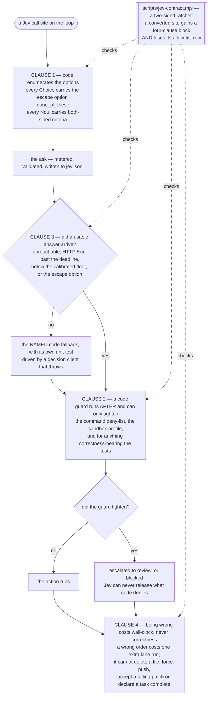

# Jev routes, never gates

This is the one safety principle the whole harness is built around, and it is short enough to
state in a sentence:

> **A decision model can change the order in which work happens. It can never change whether
> work is allowed, whether a patch is accepted, or whether a task is finished.**

Being wrong therefore costs wall-clock time. It does not cost correctness.

## In the default mode: hints at the edges

The default mode, `agent`, takes the principle to its end. The code model drives with its own
tool calls, and nothing that matters is left to a decision model at all: which command runs,
whether a change is kept, and whether the task is done are decided by the model's own calls,
the harness's code and your tests ([The agent loop](../architecture/agent-loop.md)). Jev keeps
three hints, each trivial by construction:

| Id | What an answer can change | What it can never change |
| --- | --- | --- |
| RA0 | the reasoning effort of the run's **first** turn (low when the message is conversational) | the tool set, any later turn, any action, the stop |
| RA1 | the **wording** of one loop nudge, among four code-written texts | whether the loop detector trips, or when a looping run stops (`stuck` is code) |
| RA2 | whether **one** "step back" hint is added, at most once per 10 turns after turn 30 | anything else |

Each has a short deadline (300 ms for RA0, 400 ms for the others), a named code fallback, no
retry chain, and is skipped outright when no Jev key is configured. A served-model drift or a
malformed question turns Jev off for the rest of the run with one transcript line; it never
opens a pane or ends the run. A normal run makes at most one Jev request, and on the default
provider none.

Safety in agent mode is code alone. Under the default `--autonomy full` nothing asks and nothing
is refused; every command runs in the sandbox with pre-images, and a destructive one carries a
truthful note about what `/undo` can restore. `--autonomy review` shows a card for destructive
and unknown commands. No Jev answer is involved in either
([Sandbox and security](../operations/sandbox-and-security.md)).

The rest of this page describes the Jev-driven modes (`jev-only`, and the legacy `llm-jev` and
`jev-on`), where Jev answers on every step and the principle has to be enforced site by site.

## The four clauses

Every Jev call site on the loop satisfies four conditions, the agent's three placements
included. They are checked twice: by a lint rule, `scripts/jev-contract.mjs`, which runs as
part of `npm run check`, and by at least one unit test per site.

**1. Code enumerates the options.** Jev never invents a path, a command, a test scope or a
candidate. Every Choice carries the escape option `none_of_these`, and the question builders
refuse a Choice without one and a Noul without both-sided criteria — at construction time, not
at response time.

**2. A code guard runs after, and can only tighten.** A routed action still has to pass the
command deny-list, the sandbox profile, and — for anything that bears on correctness — the
tests. Jev can escalate a verdict. It can never release what code denied. What runs on a live
step in the Jev-driven modes is spelled out in *the risk stage is a gate* below.

**3. There is a deterministic code fallback, and it is exercised.** Every router names its
fallback and the test that drives it, and the test drives it with a decision client that
throws. The fallback is taken on any of: Jev unreachable, an HTTP 5xx, the site's soft
deadline, confidence below the site's calibrated floor, or the escape option.

**4. Being wrong costs wall-clock, never correctness.** A wrong queue order costs one extra
lane run. A wrong file ordering costs one worse prompt. None of it can delete a file,
force-push, accept a failing patch, or declare a task complete.



## The ratchet

`node scripts/jev-contract.mjs` counts the Jev call sites in the tree and classifies each one.
On the tree this page was written against it reports:

```
jev-contract: ok (37 Jev call site(s): 14 with a four-clause block, 23 allow-listed)
```

Read that as: 37 places in the source ask Jev something; 14 of them carry a written four-clause
block in a comment directly above the call (the agent's RA0, RA1 and RA2 among them); 23 are
grandfathered by an explicit allow-list row.

The ratchet is two-sided. A site that gains a four-clause block must **lose** its allow-list row
in the same commit, and the lint fails when a row grandfathers more sites than its file actually
has. The allow-list can only shrink.

Run it yourself:

```sh
npm run jev-contract
```

## In the Jev-driven modes, the risk stage is a gate, not a router

The risk stage is the one place where a Jev answer could plausibly stop something, so it is
deliberately **not** treated as a router. What runs there depends on the mode, and it is worth
being exact rather than reassuring. (The default `agent` mode has no risk stage; see above.)

**In `llm-jev`**, code decides first and Jev is asked only about harm:

- `codeRiskReason()` is an **allow-list of cases that are safe as a matter of fact**: a read, a
  verification run of the workspace's own test command, a verified regression-free patch, a
  recoverable revert, and a `done` that the harness's own passing run verified. A match is `ok`
  and **no Jev request is made at all**.
- Everything else is gated by two harm questions, `destructive` and `irreversible`, and only
  when the action is a command that is not the workspace's test command. The two alignment
  dimensions are recorded at level 0 and do not gate.
- The documented and tested fallback at that site is **ask-or-decline, never allow**. An
  unanswered harm question leaves the scores at their top level, which reviews or blocks.

**In `jev-on` and `jev-only`**, four dimensions are scored — `destructive`, `irreversible`,
`out_of_scope`, `plan_mismatch` — plus a `matches_intent` question. The verdict is the maximum
over the gating dimensions against bands of **0.3** for review and **0.7** for block.

**With the routers switch on** — which is off by default and `jev-on` only — that stage becomes
code-first in both directions. A code verdict is computed **before** the request is made, so a
failed ask has something to fall back to:

- `dangerousCommand()` is a **deny-list, not a proof**. Six literal shapes: `rm -rf`,
  `git push --force`, `sudo`, `curl … | sh`, `mkfs`, and a fork bomb. A match yields `review` —
  an ask — which Jev's scores may escalate to `block`. A non-match means *this list does not
  recognise it*, never *this is harmless*. Its own documentation lists what it misses: the
  match is literal and case-sensitive, so `RM -RF /`, `rm   -rf /`, `$(echo rm) -rf /` and a
  Makefile target wrapping any of them are all non-matches.
- The allow-list above yields `ok`.
- Anything matching neither is `review`. When Jev does not answer, the code has no opinion, and
  *no opinion means ask* — **a Jev outage costs confirmations, never correctness**.
- When Jev **does** answer, only the narrower deny-list floor applies: a deny-listed command
  cannot be released by a score at level 0, and every other step keeps exactly the verdict the
  scores produced.

So the deny-list is production code and it is wired, but the path that consults it on a live
run is behind a switch that ships off. Today the guards that run on every step in every
Jev-driven mode are the sandbox profile and — for anything correctness-bearing — the tests.

<!-- src/jev/danger.ts (DANGER_RULES, dangerousCommand); src/loop/stages/risk.ts runRiskStage / runHarmOnlyRiskStage / codeRiskReason / codeRiskVerdict / codeRiskFloor / escalateVerdict; src/jev/confidence.ts RISK_REVIEW 0.3, RISK_BLOCK 0.7. Two design-doc drifts: docs/LLM-LOOP-DESIGN.md §2.2 places codeRiskReason in danger.ts (it is in risk.ts), and dangerousCommand is reached from production only through codeRiskVerdict / codeRiskFloor, which run only when routersOn() is true. -->

## What is structurally excluded, and why

Each of these is kept away from Jev for a measured reason, not a stylistic one.

| Excluded | Reason |
| --- | --- |
| **Arithmetic and counting** — deadlines, budgets, token limits, lane counts, run sizing, newly-passing counts, compaction triggers | measured: asked how many `r`s are in "strawberry", Jev answers 0.52; asked whether something is within 1 %, 0.73. Spend ceilings live in the meter and the budget module, **outside every router** — which is exactly the failure another harness shipped, where a bare `except Exception` swallowed a cost-limit error and silently defaulted to option index 0 |
| **The destructive gate** | the code deny-list is the first half of the risk verdict, above Jev rather than behind it; the harm questions cover only the ambiguous band; a failed or timed-out harm question means *ask*, and under a non-interactive renderer the safe default is *decline*. Never *allow* |
| **Completion** | `isCompleteByFact()` over the harness's own green run. The completion question stays recorded-only in the mode that uses the code fact |
| **The cold confirmation of any screened result** | a speculatively-screened result is only ever validated by a fresh, isolated run |
| **Plan and intent judgment** | measured: 100 % of one mode's 223 benchmark refusals came from the alignment dimensions; the intent Choice fell back 46 % of the time; that arm scored 9/29 against the control's 10/29. The mode that deleted both stages, `llm-jev`, became the default on that evidence, and the agent loop that replaced it as the default on 2026-09-23 has no such stage either |
| **Being the sole reason a patch is committed** | the guard's code rules run first — majority independent support, fewest special cases, the all-overfit drop signature. Jev only breaks the residual tie among *test-passing candidates in distinct behaviour clusters*, which is its best-measured job |

<!-- docs/HARNESS-NEXT-DESIGN.md §1.2 carries these six rows with their sources. -->

## The switches, and their defaults

Two engine options control the newer routing machinery. **Both ship off**, and the mode gate is
checked before either.

| Option | Default | Environment override |
| --- | --- | --- |
| `routers` | **`off` in every mode** | `JEVCODE_ROUTERS=on\|off` |
| `fastPath` | `auto` when the mode is `jev-on`, `off` in every other mode | `JEVCODE_FASTPATH=off\|auto` |

`routersOn(mode, option)` returns false for **every mode but `jev-on`** before it reads the
option or the environment variable at all. That gate is not decoration: the replan stage is the
one replan site shared by the four Jev-driven modes, so without it a process-wide environment variable
would change behaviour in the control arms that exist to measure `jev-on` against.

Where both a switch and an environment variable are present, the **explicit option wins** and
the environment variable fills only an absent option. That direction matters: when it was the
other way round, an exported `on` could arm an arm whose own results file said `off`.

The warm verification plane is a third default-off switch — see
[Verification and the oracle](verification.md).

## Why a router cannot end a run

Four properties, each enforced in one place:

- **No late write.** Every router result is applied through a token scoped to one step and
  invalidated the moment that step commits. An answer that arrives after its step is recorded
  as `dropped` and applied to nothing. A dropped ask also charges no meter, writes no
  `jev.jsonl` row and emits no decision — asserted by
  `test/unit/loop/engine-router-seam.test.ts` › *the answer of a dropped ask can never write
  into the step*.
- **Router failures are not stage failures.** Three consecutive stage failures end a run. A
  router timeout, a decision-service error, a 503 or an abandoned ask do not count towards
  that limit. This is the single change that makes "a Jev outage costs no run" true.
- **Only four things are re-raised.** `isRouterFatal` sends exactly four conditions back up
  unchanged — an abort (a human pause or a stop), a budget error, a model-drift error, and a
  malformed question batch. Everything else is a Jev failure and is absorbed. Those four are
  not outages; swallowing them is how an aborted run keeps running stages.
- **Zero blocked wall.** A router contributes no waiting time to a step beyond the ask it was
  already making. It is **measured, never hard-coded**: the wall is clocked and written to the
  step record, so a router that did start waiting would report it.

## The switch that keeps it honest

The principle is only worth what it is tested at, so there is a switch that removes Jev's
opinions while leaving the rest of the machine running. It is reached from the environment:

```sh
JEVCODE_JEV=escape        # Jev has no opinion
JEVCODE_JEV=unreachable   # every ask fails with a 503
```

`escape` answers every Choice with all its mass on the escape option, every Noul with an inert
0.5, and every Score at its **top** level. `unreachable` reproduces the real outage that once
killed three runs — the per-router fallback tests are driven by it.

The Score polarity is the one place where "no opinion" is not symmetric, and it is chosen
deliberately. Every Score in the tree is a risk dimension with levels ascending in severity, so
level 0 of `destructive` reads "nothing existing is lost". Answering level 0 would be the most
permissive reading available — which is exactly what clause 2 forbids. The **top** level is the
only inert answer that cannot release anything: it can cost a confirmation, never correctness.

This switch is not the same thing as the `jev-off` mode, which removes the synthesizer and Jev
entirely. It keeps the whole machine and removes only the opinions, which is the comparison
worth making. The design makes "with Jev off the run still finishes, only slower" a release
gate; the accept rule that reports it lives in the benchmark tooling.

A `--jev off` command-line flag is named in the design but is **not wired in the argument
parser today**. Use the environment variable.

## Depth

- [`../HARNESS-NEXT-DESIGN.md`](../HARNESS-NEXT-DESIGN.md) §1.2 — the four conditions, verbatim,
  with the exclusion table
- [`../LLM-LOOP-DESIGN.md`](../LLM-LOOP-DESIGN.md) §0.3 and §0.4 — the switches and the eleven
  invariants
- [`../LLM-LOOP-DESIGN.md`](../LLM-LOOP-DESIGN.md) §2.2 — the router table, site by site
- `scripts/jev-contract.mjs` — the lint

## Next

- [The agent loop](../architecture/agent-loop.md) — the default mode, and its three Jev hints
- [Verification and the oracle](verification.md) — what counts as evidence
- [The synthesizer](the-synthesizer.md) — where Jev breaks ties and where it does not
- [Status and roadmap](../status/README.md) — what ships, and what is behind a switch
