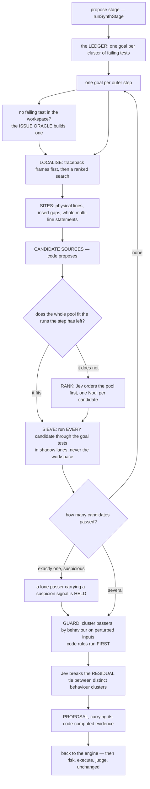

# The synthesizer: Ledger + Sieve

> **The engine of the Jev-driven modes.** The synthesizer is what `jev-only` runs, and what the
> legacy `llm-jev` mode (the default until 2026-09-23) runs with a code model inside it. The
> default mode, `agent`, does not use it: there the code model edits through tools and your tests
> verify ([The agent loop](../architecture/agent-loop.md)). The synthesizer is kept, unchanged,
> for `jev-only`, saved configs, resume and the bench.

How do you propose a code fix without a model that writes code?

You enumerate. Code generates thousands of candidate edits from the failing test and the source
around it, runs them, and keeps the ones that pass. Tests are the oracle. The decision model is
used only where running the tests cannot settle the question — which candidate to try first,
and which of several passing candidates is the general fix rather than the lucky one.

That is the synthesizer. It is what `jev-only` mode uses instead of a generating model, and
what the legacy `llm-jev` mode uses **with** a generating model as one more candidate source
among many.

## The shape

## The ledger

A **goal** is one cluster of failing tests. The ledger holds one goal per cluster, and each
outer step of the loop attacks exactly one of them.

Partial progress is kept: a candidate that fixes some of a goal's tests without breaking
anything becomes a second base for the next round, and survives being parked. Regressions are
never kept — a candidate that makes anything newly fail is discarded no matter what else it
fixed.

## Localising

Before anything can be enumerated, the search has to decide **where** to edit. The pipeline has
four levels, and code proposes the options at every one:

1. **Files.** One Noul per workspace path: *must this file change to accomplish the task?* Up
   to 250 questions per request, sent concurrently. The result is consumed by **rank**, never
   by threshold — the top five go forward.
2. **Confirm.** One request of Nouls over that beam, this time with each file's top-level
   symbol outline attached. Re-rank.
3. **Functions.** One Choice per surviving file over its definitions, with a module-level
   option. The global top five by file-probability times function-probability go forward.
4. **Lines.** One Choice per function over its code lines, with the failing tests and what the
   buggy program actually did in the state. Top three anchors per function, unioned with the
   top three from spectrum-based fault localisation when a spectrum was collected.

A single-file workspace skips the first three levels and asks one flat line Choice, because
the hierarchy did not help on small files.

Spectrum-based fault localisation is infrastructure here, not a candidate source: a stdlib-only
Python tracer builds a coverage spectrum from the passing and failing runs and ranks lines by
suspiciousness. Its ranking feeds the localiser and the site builder.

A **site** is a ±3-line window around an anchor, plus an insert gap before and after it.

## The candidate sources

Every source is code. Each one takes a site and produces candidate edits for it.

| Source | What it produces |
| --- | --- |
| `mutate` | first-order mutations of the line |
| `templates` | fix templates, including substituting a sibling standard-library callee and carrying its import, and depth-2 wraps |
| `donor` | lines borrowed from elsewhere in the file with identifiers re-bound |
| `search/composite` | pairs and units built from two simpler candidates |
| `sketch` + `fill` + `beam` | sketch productions with their slots filled, and a token beam |
| `introspect` | names introspected from the failing call |
| `history` | reversals drawn from the repository's git history |
| `llm/source` | samples from the code model — **only in `llm-jev`**, never in `jev-only` |

`src/jev-modes/synth/py` is infrastructure rather than a source: it is the Python structure parser the
sources and the patch applier share.

In `jev-only` the factory short-circuits: it returns a plain Ledger-plus-Sieve synthesizer with
no model source wired at all. That is why the zero-generator-calls claim is structural and not
a matter of discipline.

## Sieve or rank

With thousands of candidates and a test suite that takes real time, you cannot run everything.
The choice between the two strategies is one comparison: **does the pool fit the test runs the
step has left?**

| Condition | Strategy |
| --- | --- |
| the pool fits the runs left | **SIEVE** — run every candidate and let the tests rank them. No Jev request is spent: the first passer arrives before any order would have been consulted |
| it does not | **RANK** — ask Jev to order the pool first, then run down the order as far as the budget reaches |

The cut is `poolFitsRunBudget(n, left)` in `src/jev-modes/synth/search/budget.ts`, which is simply
`n <= left`. `runsLeft` divides the wall the step has left by the *measured* cost of one run,
multiplied by the lane count, and caps that by the run count the step has left — so an
expensive test suite shrinks `left` rather than needing a threshold of its own.
<!-- src/jev-modes/synth/search/budget.ts:222 poolFitsRunBudget, :911 runsLeft, :952 decideRunPlan -->

`SIEVE_MAX_T_RUN_MS = 2000` still exists and is still worth knowing, but it is **no longer the
cut**. It is the oracle-class line: at or under two seconds per goal-subset run the suite is
QuixBugs-class, above it repository-class, and that class decides how candidates are ordered
and whether the edit-class prior is asked up front. The clause was removed from the cut because
it sent pools the goal test could have decided whole into RANK, buying one Jev request for an
order over candidates that were all going to run anyway.

There is hysteresis on that class line for loaded machines. A measured batch median up to 1.5×
it does **not** move a sieve-eligible suite to the slower class: the lanes are loaded, not the
suite slow.
<!-- SIEVE_MAX_T_RUN_MS src/jev-modes/synth/search/budget.ts:27, SIEVE_KEEP_FACTOR :128, the class line :638 -->

## Shadow lanes

Candidates never run in your workspace. Each lane lives under the run directory, inside the
sandbox's writable roots, in one of four modes:

| Mode | When | How |
| --- | --- | --- |
| `candidate_file` | the per-program runner | no copy at all — the candidate file is handed to the runner |
| `worktree` | a git workspace | `git worktree add --detach` once per run, reset between candidates, with the workspace's uncommitted changes re-synced after each reset |
| `copy` | non-git, at most 50 MB | one `cp -R` of the workspace, touched files restored between candidates |
| `inplace` | non-git, over 50 MB | one lane on the workspace itself, apply and revert with the revert in a `finally` |

Lane count follows the run cost: **8** lanes when a run is under 1 s, **4** on pytest modules,
**2** when the workspace is over 50 MB and not a git repository.

Nothing in the lane machinery asks Jev anything.

## The guard: which passer is the real fix?

A candidate that passes the visible tests may still be wrong. A `return 90` passes a grading
test. This is the part of the system that exists to catch that.

**Zero passers.** Hold the best partial and keep searching.

**Exactly one passer.** Commit it — tests are the oracle, and no probability threshold withholds
a clean lone passer. Two things delay it inside the step:

- in SIEVE mode, a lone passer waits until the other seed sources for its site have run, so
  that the decision sees the whole site batch rather than whichever candidate happened to be
  first;
- a lone passer that is **structurally suspicious** by code-computed signals is held. The
  signals are things code can see: the candidate deletes a statement, duplicates a block,
  guards a different variable than the failing traceback dereferences, guards an expression
  nothing reads, or adds a special-case guard or literal. Below a floor this hold is **never**
  released — not on the budget reserve and not at step end. The step ends on its honest partial
  instead.

**Two or more passers.** Cluster them by behaviour on inputs code generated by perturbing the
visible tests. Then, in order:

1. a cluster mixing a code seed and a model candidate → take its model member;
2. a cluster holding a strict majority of the **independent support** — distinct source × site
   pairs — → take its representative;
3. otherwise → the representative that adds the **fewest special cases**, counted as
   conditionals plus literals beyond the replaced line;
4. clusters split with no model member and equal support → the cluster that agrees with the
   passers' majority on the perturbed inputs, and never simply the largest count;
5. only a **residual** tie reaches Jev: one request, a Choice over at most 20 representatives
   plus one generality Noul each, with the perturbation table — which inputs differ and what
   each candidate output — in the state.

There is also an all-overfit signature. When the escape option carries enough mass and no
candidate's generality Noul clears a floor, the whole set is **dropped**: nothing is held,
nothing is committed, and the search goes on.

Jev's contribution here is the one job it measures best — ranking near-duplicates, top-3 40/40
at up to 50 candidates. It is never the sole reason a patch is committed.

## The fast path

In `jev-on` mode there is a shortcut: before asking the code model to guess, run **one bounded
sieve round** on the single shape the search provably wins — a one-line bug in a single file
with a cheap test suite.

It is a branch, not a race. When the predicate does not hold the round never starts, at zero
cost, and the ordinary path runs unchanged. The predicate is pure code: no Jev, no model, no
test runs. It is split in two so that the free half can refuse before anything is spent.

The free half declines unless **all** of these hold:

- the fast-path option is `auto`, and the mode is `jev-on`;
- the warm verification plane is off;
- the run has not been disarmed by an earlier round;
- the last action was a parsed run of the workspace's own test command, with something failing;
- at most 8 failing tests — more is a broken build, not one cluster;
- no workspace write since that run;
- that run took at most 800 ms;
- no loop trip, no pending pause, and spend left.

The costed half then requires exactly one non-test source file in the code-derived suspect set,
a recognised project layout that is not repository-class, and no lease conflict on that file.

Inside a round the caps are hard: at most 6 Jev requests, at most 400 test runs, at most 45 s
of wall, at most 35 % of the step's remaining wall, and at most 25 % of the whole run's wall
across every round together. A cold-confirmation reserve is held **outside** the wall share,
because a passer without its confirmation run is not a result.

The round builds its **own** synthesizer with mode `jev-only`, one per run id, so it makes zero
generating-model calls even though the surrounding mode has a code model available.

And it only ever proposes. An accepted result becomes the step's proposal at the normal place
and goes through the unchanged risk, confirm, execute and judge path. It never executes and
never commits.

## Where it sits in the loop

The synthesizer hands back a `Proposal` carrying its code-computed evidence — which tests were
failing before, which pass now, which are newly failing. The risk stage reads that evidence,
the loop detector reads it, and the completion fact reads it. See
[Verification and the oracle](verification.md).

## Depth

- [`../JEV-ONLY-DESIGN.md`](../JEV-ONLY-DESIGN.md) §1–§4 — the normative design
- [`../JEV-ONLY.md`](../JEV-ONLY.md) — the dated measurement log
- [`../LLM-LOOP-DESIGN.md`](../LLM-LOOP-DESIGN.md) §4 — the fast path, clause by clause

## Next

- [Verification and the oracle](verification.md)
- [Jev routes, never gates](jev-routes-never-gates.md)
- [Modes](../getting-started/modes.md)
