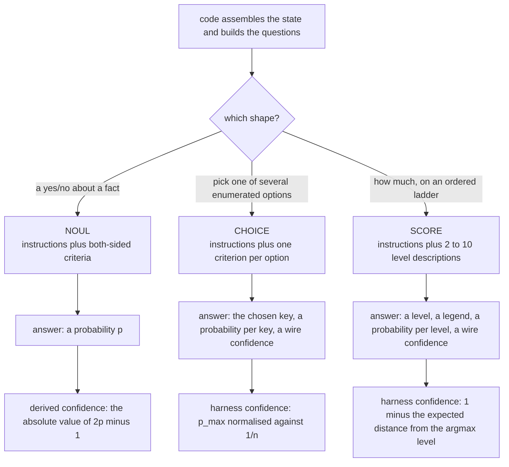

# What Jev is

Jev is a **calibrated decision model**, not a chat model. You do not send it a prompt and read
a sentence back. You send it a state and a set of questions with a fixed shape, and it returns
a probability for every one of them.

That difference is the whole reason this harness exists. A model that answers "which of these
seven files matters" with a number you can threshold is a different engineering object from a
model that answers it with a paragraph.

## The request

One request carries three things:

```
{ model, state, questions }
```

`state` is JSON that code assembled — the task, the plan, the recent window, the workspace
facts. `questions` is a map from an id to a question. A single request may carry up to **1,000**
questions, and latency is close to flat in the question count, which is why the harness merges
as many questions into one request as the dependency order allows.

The response is `{ model, answers, usage }` with one answer per question id.

Wire probabilities are two-decimal. The harness validates every response against the request it
sent: unknown ids, the wrong answer type, an option key that was never offered, or a `choice`
that is not the argmax of its own probability map are all rejected as **deterministic** failures
and never retried, because the same request would fail the same way. Only shape failures a
retry could plausibly fix — a missing `usage`, a non-finite number, probabilities that do not
sum to 1 within tolerance — are treated as transient.

## The three question shapes



### Noul — a calibrated yes/no

A Noul asks one question whose answer is a probability. It carries **both-sided criteria**: a
definition and at least two examples for the true side, and a definition and at least two
examples for the false side. The builder refuses a Noul whose criteria are one-sided or whose
examples are missing. That refusal happens when the question is constructed, not when the
response comes back, so a badly specified question cannot reach the wire at all.

A Noul answer carries no confidence on the wire. The harness derives one: `|2p − 1|`. The
display labels it *derived*, so nobody mistakes it for something the model said.

### Choice — argmax over code-enumerated options

A Choice asks the model to pick one of a set of options that **code enumerated**. Three rules
are enforced at build time:

- Option keys must be descriptive snake_case, 2 to 64 characters. Keys that carry a name prior
  — a single letter, `alpha`, `beta`, a bare number, `option_3` — are rejected, because a model
  has priors about those strings that have nothing to do with your problem.
- Every Choice gets an **escape option**. Its key is `none_of_these`, and it is added
  automatically if the caller did not include one. There is always a way for the model to say
  *none of these*, and the harness treats that answer as "fall back to the code order".
- At most 255 options.

A Choice may also carry **paired Nouls**: one `can_<option>` Noul per non-escape option, asking
directly whether that option is applicable. Where a paired Noul is stronger than the Choice's
own pick, the harness records the verdict as `overridden` rather than `chosen`. Every resolved
Choice carries one of four verdicts — `chosen`, `overridden`, `fallback`, or `code` — so the
record says not just what was decided but who decided it.

The harness computes Choice confidence as `(p_chosen − 1/n) / (1 − 1/n)`: how far above uniform
the pick sits. One option gives 1.

### Score — a distribution over ordered levels

A Score asks about **one quantity** on a ladder of 2 to 10 levels, each described as a
situation rather than as a number. The answer is a distribution over levels.

Score confidence is `1 − Σ_k p_k·|k − k*| / U_n`, where `k*` is the smallest argmax level and
`U_n` is the mean distance from the middle under a uniform distribution. It is 1 when all the
mass is on one level and near 0 when the distribution is flat.

Ties are broken deterministically: the smallest level index attaining the maximum wins.

## Where the rules live

| Rule | Enforced by |
| --- | --- |
| both-sided criteria, at least two examples per side | the `noul` builder |
| no name-prior option keys; escape option present; at most 255 options | the `choice` builder |
| 2 to 10 non-empty levels | the `score` builder |
| unique, non-empty question ids; at most 1,000 per request | `assertQuestionBatch`, before the request is sent |
| the response matches the request | the response validator |

All four builders throw a `QuestionBuildError`. Because they run at construction time, a
malformed question is a crash in your own process, not a bad answer you have to notice later.

<!-- src/jev/questions.ts (builders, ESCAPE_KEY at :8, assertQuestionBatch); src/jev/validate.ts (response validation); src/jev/confidence.ts (the three confidence formulas). Note: docs/HARNESS-NEXT-DESIGN.md §1.2 attributes the criteria and escape rules to assertQuestionBatch; in the built tree they are in the individual builders and assertQuestionBatch checks the batch. -->

## The two endpoints

| Provider | Endpoint | Default model |
| --- | --- | --- |
| TypeSafe, natively | `https://api.typesafe.ai/v1/systemone` | `jev-1.13.0` |
| OpenRouter's decisions router | `https://openrouter.ai/api/alpha/decisions` | `typesafe/jev-1.13-20260917` |

The two are described by one table in the source, so nothing branches on the provider outside
it. The default is `auto`: TypeSafe when a TypeSafe key is set, OpenRouter otherwise. See
[Keys](../getting-started/keys-and-providers.md).

A dated model id pins the model, which is what makes a tuned threshold reproducible. An undated
alias is accepted and resolved on the first call.

## What Jev is measurably good at

Three abilities are measured, and every place the harness uses Jev is one of the three:

| Ability | Measurement |
| --- | --- |
| choosing among up to 255 concrete options when the right one is present | 36/40 top-1 at 10 options; 100 % on a 200-option city-to-country set |
| ranking near-duplicates, one full-criteria Noul each | top-3 40/40 at up to 50 candidates |
| yes/no on literal facts already in the state | accuracy 0.983; 240/240 on code-computed counts |

Latency, measured on the harness's own traffic: p50 237 ms, p95 547 ms per request — and close
to flat in the number of questions, so a request with a thousand Nouls is not a thousand times
slower than one with a single Noul.

The reasons those three shapes and not others are the digest in
[`../RESEARCH.md`](../RESEARCH.md) §5 and [`../DESIGN.md`](../DESIGN.md) §5.

## What Jev is not used for

Arithmetic, budget ceilings, the destructive gate, completion, and plan judgment are all
structurally excluded — each for a measured reason. That is the subject of the next page.

## Next

- [Jev routes, never gates](jev-routes-never-gates.md) — the safety principle, and what is
  excluded from Jev and why
- [The synthesizer](the-synthesizer.md) — how a fix gets proposed with no generating model
- [Verification and the oracle](verification.md) — what counts as evidence
- [`../DESIGN.md`](../DESIGN.md) §5 — the normative account of the Jev integration
