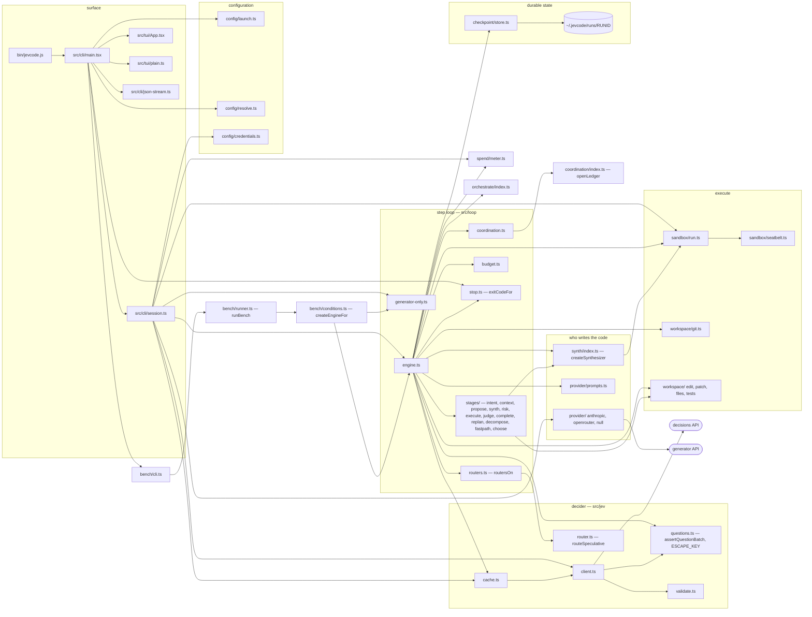

# Module ownership and import rules

Most projects have architecture conventions. This one has a handful of rules that are **asserted** — by a
docblock the reviewer reads, by a lint script, or by a unit test — because each of them was broken once and
cost something.

This page lists those rules, how to check each one yourself, and a map of the system.

## The map



Three things the map is careful about.

**`src/cli/main.tsx` is the argv entry point.** The file extension is `.tsx`, there is no `main.ts`, and the
bundler's entry point is `src/cli/main.tsx`. `bin/jevcode.js` is a dependency-free launcher: it checks the Node
version, maps the no-colour convention onto the colour library's own variable, enables the compile cache and
loads the bundle. It never touches the network.
<!-- scripts/build.mjs: entryPoints: ['src/cli/main.tsx']. `ls src/cli` has main.tsx and no main.ts. -->

**The bench does not construct an engine itself.** `src/bench/runner.ts` goes through `buildEngineOptions` and
`createEngineFor` in `src/bench/conditions.ts`, and that function is what routes one condition to the
generator-only engine and everything else to the main one.

**The decision cache is on the client path, not only on the router path.** It is a memoising decorator that
forwards the caller's own state and questions to the decider it wraps, keyed by a request hash. Both the
interactive session and the engine wrap their decider in it.

## The rules, and how to check each one

### 1. One module spawns git

`src/workspace/git.ts` is the only module that spawns git through the sandbox.

An executed command can plant a filesystem monitor, a hook, an external diff tool or a pager in the workspace's
git configuration. An ordinary git call would then execute those with the harness's environment. So every
sandboxed git call goes through one function with a scrubbed environment, the system and global configuration
files disabled, and command-line overrides that neutralise every executable knob.

**One documented exception.** Two read-only probes at run start — asking whether this is a repository, and
asking for its status — run *outside* the sandbox, because the sandbox profile needs their answer before it can
be built. They live in `src/workspace/gitstate.ts` and use exactly the same base flags and environment.

Check it:

```sh
grep -rn "'git'" src --include='*.ts' --include='*.tsx' | grep -v '^src/perf/'
```

Everything that comes back should be a type, a string union member or a settings key — plus
`src/workspace/gitstate.ts`. The performance directory is excluded because it builds a throwaway repository as
a test fixture.

### 2. No `any`

Not in `src/`, not in `test/`, not in `perf/`, not in `scripts/`. A line carrying the marker `no-any-ok` is
exempt and should be rare.

```sh
node scripts/no-any.mjs
```

### 3. Three modules never import the surface or the configuration layer

`src/orchestrate/**`, `src/coordination/**` and `src/import/**` import nothing from `src/tui/**`,
`src/cli/**`, `src/session/**` or `src/config/**`.

Every environmental fact — the home directory, the clock, the command runner, the ledger handle, the commit
identity, the resolved settings — arrives as an **argument**. That is what makes each of them unit-testable
over a temporary directory with no engine, no session and no network, and it is why each exports its seam
types next to the functions that take them.

The surface reaches each of them through exactly one facade: `src/orchestrate/index.ts`,
`src/coordination/index.ts`, `src/import/index.ts`.

```sh
grep -rnE "from '\.\./(tui|cli|session|config)/" src/orchestrate src/coordination src/import
```

That must print nothing.

### 4. The import engine performs no writes

`src/import/**` turns the filesystem into a plan and renders it. The first three phases — discover, classify,
plan — write nothing at all. The fourth applies exactly the rows a human approved, and it does so through an
injected write seam supplied by the caller.

Exactly one module in the directory touches the filesystem module at all, and it has no write method:
`src/import/discover.ts`.

```sh
grep -rn "node:fs" src/import
```

Four hits, all in `src/import/discover.ts` or a comment saying the rule. Every write in `src/import/apply.ts`
goes through the injected seam, never through a direct filesystem call.

### 5. One contract file

`src/core/types.ts` is the single contract file. Nothing in `src/provider/**`, `src/synth/**`,
`src/orchestrate/**` or `src/import/**` declares a contract shape of its own; where a module used to, it now
re-exports from core.

The file's header carries one numbered block per wave of additions, each saying what it added and whether
anything it added was required rather than optional. The blocks present are **1.1, 1.2 (twice — two different
waves landed under the same number), 1.3, 1.4, 1.5, 1.6, 1.7 and 1.9**.

**There is no 1.8.** That is not a typo and not a missing block; the number was assigned and the wave did not
land under it. Blocks are numbered by assignment and ordered ascending in the file, whatever order they arrive
in.

```sh
grep -n "^// contract 1\." src/core/types.ts
```

### 6. The decision model routes; it never gates

This is the rule the build-time lint exists for. It has its own section in
[Contributing](README.md#a-new-decision-call-site-carries-its-own-proof): four clauses per call site, a comment
block that proves them, an allow-list that ratchets in both directions, and a set of question ids that are
forbidden outright.

```sh
node scripts/jev-contract.mjs
```

## Built ahead of their callers

Three modules were built and tested before any command reached them. All three are reached now, each through a
dynamic import so that none of them sits on the first-frame path.

| module | reached from |
| --- | --- |
| `src/models/**` | the live model catalogue — an instant bundled snapshot, a background refresh per provider, and a synchronous ranking for each keystroke. The model picker (`src/tui/App.tsx`) loads it. |
| `src/provider/registry.ts` | one row per generator surface, with the key's environment variable, base URL, factory, catalogue endpoint, default model and capability flags. The session (`src/cli/session.ts`) and the bench build every generator through it. |
| `src/import/index.ts` | the import engine's entry point: `jevcode import` (`src/cli/main.tsx`) and the session's import at onboarding (`src/cli/session.ts`). |

## Default-off switches

Four mechanisms exist and are switched off. A page that quotes a number measured with one of them on says so.

| mechanism | switch | default | note |
| --- | --- | --- | --- |
| speculative routers | `EngineOptions.routers`, or `JEVCODE_ROUTERS` | **off** | the mode gate comes first and is unconditional: `routersOn` returns false for every mode except `jev-on` before it reads the option or the environment at all |
| warm verification plane | `JEVCODE_WARM` | **off** | see [the warm plane page](../measurements/warm-plane.md) |
| bounded sieve fast path | `EngineOptions.fastPath`, or `JEVCODE_FASTPATH` | `auto` only under mode `jev-on`; otherwise off | |
| delegation splitting | the `orchestrate.split` setting | **off** | with a one-time hint |

For the first and third, the explicit option wins and the environment variable fills only an **absent** option.
That ordering is deliberate: a process-wide environment variable must not be able to change what a control arm
in a measurement does.

## Related

- [Contributing](README.md) — the gates and the conventions.
- [Normative design documents](../design/README.md) — the specifications these rules come from, in particular
  `DESIGN.md` §2 for the module map and `ORCHESTRATION-DESIGN.md` §8.1 for the ownership table.
- [Releasing](releasing.md).
