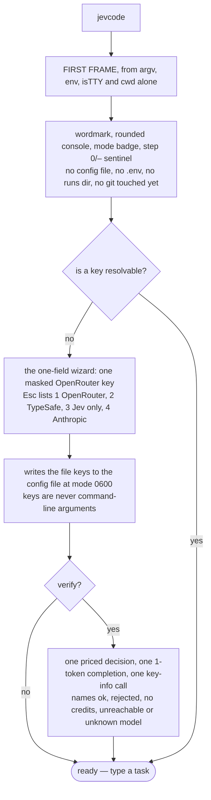
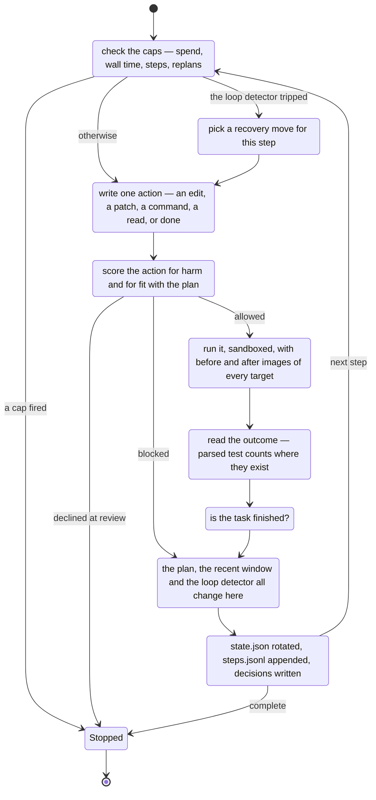

# Your first run

This page follows a bare `jevcode` from an empty configuration: what the first frame shows,
what the key wizard asks, and then one whole task with the transcript annotated line by line.

You need an installed `jevcode` ([Install](install.md)) and one API key
([Keys](keys-and-providers.md)).

## Type `jevcode`

A bare `jevcode` is `jevcode chat`: an interactive session in the current directory. So is a
`jevcode` with only flags, and so is `jevcode run` with no task on a terminal.

Nothing runs and no money is spent until you submit something the harness reads as a task. A
greeting gets a reply, not a run.

## The first frame

The first frame is drawn from the command line, the environment, whether the streams are a
terminal, and the current directory — **and nothing else**. No configuration file, no `.env`
file, no runs directory and no git command has been touched when it appears.

It contains:

- the header row and the rule;
- the wordmark, revealed left to right, with the version caption beside it;
- the rounded console: a top edge carrying the **mode badge** and the workspace name, the
  composer row with its placeholder, a divider, and the status row;
- a `step 0/–` sentinel in the status row, because no run exists yet.

The splash settles after about 0.7 s. Pressing a key completes it immediately rather than
waiting.

The configuration arrives a few frames later, and with it the session spend meter and the git
zone. Under `--no-animation`, `--screen-reader` or `--plain` there is no splash at all.

The order in which the rest of the session wakes up is fixed: keybindings and prompt history,
then the configuration, then any configuration warnings, then the key wizard if a key is
missing, then the workspace trust question if the directory carries instruction files, a
`./.env` or a `jevcode.json`, then the sandbox line, then the file-mention candidate list, then
the session index.

## The one-field key wizard

If no key resolves, the session opens a wizard with exactly one field: a masked **OpenRouter API
key**. One key is enough — it runs both the decision model and the code model.

Press <kbd>Esc</kbd> on the empty field and it lists the other ways to start:

```
  1 OpenRouter for both   2 TypeSafe for Jev   3 Jev only, no LLM   4 Anthropic for code
```

Option 3 also persists `mode: jev-only`, which is the mode that needs no generating model at
all. If a TypeSafe or Anthropic key is already resolvable, the field says so and asks only for
the half that is missing.

What the wizard writes goes to `${XDG_CONFIG_HOME:-~/.config}/jevcode/config.json` with file
mode `0600`. **Keys are never accepted as command-line arguments in this flow**, and
`jevcode config set` refuses secret settings outright.

Answering `y` at the wizard's verify prompt — or running `jevcode login --verify` later — makes
three calls and names the outcome: one real priced decision (about $0.00002), one 1-token
completion from the code model, and one free key-info request. The outcome is one of `ok`,
`rejected`, `no credits`, `unreachable` or `unknown model`.



## One task, end to end

Type a task and press <kbd>Enter</kbd>. The loop then repeats one **step** until it stops.



The exact stages differ by mode — see [The four modes](modes.md) — and the normative account is
[`../DESIGN.md`](../DESIGN.md) §6.

## A recorded transcript, annotated

Below is a real recorded run, trimmed. It is a `jev-on` run on a small Python workspace: the
task was *"Fix the failing tests in tests/test_core.py without changing the tests."* Your own
default mode is `llm-jev`, which prints fewer decision lines, but the shape is the same.

The whole run directory it comes from is not part of the published repository — see
[History](../history/README.md) for what those early captures showed. The capture that does ship is
the [side-by-side recording](../media/side-by-side.md).

```
[run] start 20260920-052929-tjopfdiw mode=jev-on task: Fix the failing tests ...
[run] ready 20260920-052929-tjopfdiw step 0/15
```

The run has an id. Everything below is written under `~/.jevcode/runs/<that id>/`, so the run
survives the process.

```
[step 1] intent=verify p=0.91 c=0.89
```

The **intent** stage. The harness enumerated the intents; the decision model picked `verify`
with probability 0.91. `c` is the confidence the harness derived from the probabilities — it is
computed locally, not returned on the wire.

```
[step 1] context 2 files 1.5kB of 6 candidates: tests/test_core.py, calc/core.py
```

The **context** stage. Code pre-filtered the workspace down to 6 candidate files; 2 of them
were put in the prompt, 1.5 kB in total. The model never names a file that code did not offer.

```
[step 1] proposal edit calc/core.py: Fix mean() division bug ... | plan done=0 remaining=1 open=0
```

The **propose** stage. One action per step. The trailing counts are the plan as it stands.

```
[step 1] risk=0.38 review: risk 0.38 (review) from plan_mismatch: expected level 1.52 of 4;
         dominant level 2 "skips a planned verification step"; ... (matches_intent=0.08)
```

The **risk** stage. Four risk dimensions are scored — `destructive`, `irreversible`,
`out_of_scope`, `plan_mismatch` — plus a `matches_intent` question. The overall risk is the
maximum over the dimensions that gate this step. At or above 0.3 the action goes to human
review; at or above 0.7 it is blocked outright. This one landed at 0.38, so:

```
[step 1] confirm 20260920-052929-tjopfdiw:1 approved
[step 1] outcome executed: edit applied to calc/core.py (1 match) changed=1: calc/core.py
```

A review card appeared with the unified diff; it was approved; the edit was applied.

```
[step 1] judge succeeded=0.68 error_present=0.04 new_info=0.05 tests=none claims=0/0 completion=0.03
```

The **judge** and **complete** stages. `tests=none` because this step ran no tests, so
completion stays near zero.

```
[step 7] loop tripped: run:86461310da68:48e78467afad x3
[step 8] replan change_approach p=0.66 c=0.59 impossible=0.08: ...
```

The **loop detector** is code, not a model: it noticed the same command producing the same
result three times. That forces a **replan** stage on the next step, which picks a recovery
move from a code-enumerated list.

```
[step 9] judge succeeded=0.91 ... tests=7p/0f/0e pass claims=2/2 completion=0.86
[run] stop: complete at step 9
[run] end complete steps=9 wall=54s cost=$0.115 (gen $0.110, jev $0.005)
```

`tests=7p/0f/0e` is the harness's own parse of the test output: 7 passed, 0 failed, 0 errors.
Completion reached 0.86, above the default threshold of 0.85, so the run stopped. The whole run
cost $0.115 — $0.110 of it the code model, $0.005 the decision model.

## What is on disk afterwards

Every run leaves a directory under `~/.jevcode/runs/<run-id>/` containing `run.json`,
`state.json`, `steps.jsonl`, `decisions.jsonl`, `jev.jsonl`, `transcript.log` and the before and
after images of every file the run touched.

Three commands read it back:

```sh
jevcode why <run-id> <step> <ref>   # explain one decision of a stored run
jevcode calibration                 # how well the probabilities matched reality, over this workspace
jevcode report <run-id>             # a redacted support bundle; nothing is sent anywhere
```

## Next

- [The four modes](modes.md) — which of the stages above actually run, and what each mode costs.
- [What Jev is](../concepts/what-is-jev.md) — the decision model, and the three question shapes.
- [Jev routes, never gates](../concepts/jev-routes-never-gates.md) — why a wrong answer costs
  time and not correctness.
- [CLI reference](../reference/cli.md) — every command and flag.
