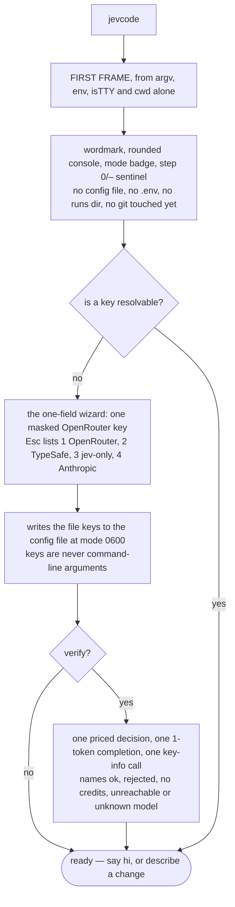

# Your first run

This page follows a bare `jevcode` from an empty configuration: what the first frame shows,
what the key wizard asks, and then one whole task with the transcript annotated line by line.

You need an installed `jevcode` ([Install](install.md)) and one API key
([Keys](keys-and-providers.md)).

## Type `jevcode`

A bare `jevcode` is `jevcode chat`: an interactive session in the current directory. So is a
`jevcode` with only flags, and so is `jevcode run` with no task on a terminal.

Nothing runs and no money is spent until you send a message. Then every message gets a streamed
reply from the code model: a greeting costs one short model turn, and a task becomes a run in
the same conversation.

## The first frame

The first frame is drawn from the command line, the environment, whether the streams are a
terminal, and the current directory — **and nothing else**. No configuration file, no `.env`
file, no runs directory and no git command has been touched when it appears.

It contains exactly two things:

- the wordmark, revealed left to right, with the version caption beside it, pinned at the top for
  the whole session;
- the rounded console: a top edge carrying the **mode badge** and the workspace name, the
  composer row with its placeholder — `Say hi`, or `Say hi · /resume continues "<title>"` when a
  recent session exists — a divider, and the status row.

The run header, the sandbox summary and the recent-session hint are not drawn in the interactive
session; `--plain` and `--json` still print them, and `jevcode doctor` and `/status` carry the facts.

The splash settles after about 0.7 s. Pressing a key completes it immediately rather than
waiting. After that the wordmark stays pinned at the top and the conversation grows below it.

The configuration arrives a few frames later, and with it the session spend meter and the git
zone. Under `--no-animation`, `--screen-reader` or `--plain` there is no splash at all.

The order in which the rest of the session wakes up is fixed: keybindings and prompt history,
then the configuration, then any configuration warnings, then the key wizard if a key is
missing, then the workspace trust question if the directory carries instruction files, a
`./.env` or a `jevcode.json`, then the sandbox facts (kept off the interactive screen), then the
file-mention candidate list, then the session index.

## Just talk

The session is one conversation with the code model. Every message you type is sent to it as the
next turn, and its reply streams in as it is written — a line appears before it is finished,
under the `[jevcode]` label. It knows it is JevCode, built by coasty-ai, which model it runs on,
which workspace it is in and how the git tree stands, so `hi`, `what can you do?` and
`who made you` get real answers, never canned text.

There is no "is this a task?" step. The model decides by what it does: a greeting or a question
is answered in prose, and a request for a change is answered with tool calls — reads, edits,
commands — which turn the reply into a run. From the first tool call you see the run: tool rows
such as `Read calc/core.py`, `Edit calc/core.py (+1 −1)` and `Bash python -m pytest -q · 7 passed`,
and the status row's words `thinking`, `reading`, `editing`, `running` and `testing`. Beside
them, in the status row's first cell, a small animation shows what is happening: a spinning donut
while the model thinks, a globe while it reads, a turning cube while it edits or runs a command,
a wave while your tests run. It stops when nothing is running.

Follow-ups see everything before them. After a run, `did it pass?` or `now do the same for
parse_date` continue the same conversation, with the earlier tool results in view.

**The agent acts on its own.** Under the default `autonomy: full`, nothing asks and nothing is
refused: every command runs inside the sandbox with a pre-image of what it may change, so
`/undo` can put it back. A command that matches a destructive rule (deleting outside the
workspace, discarding uncommitted work, a force push, publishing, …) still runs, and its step
carries one line saying what happened and whether `/undo` can restore it — for example
`this left the machine; /undo cannot reverse it` for a push. To be asked first, start with
`jevcode --autonomy review` (or `JEVCODE_AUTONOMY=review`, or `jevcode config set autonomy
review`): destructive and unrecognised commands then wait for a y/n card, and a declined one
goes back to the model.

Esc or Ctrl-C while a reply is still only prose stops the reply and keeps the session. Once the
run has started, Esc pauses it and Esc Esc aborts it.

## The one-field key wizard

If no key resolves, the session opens a wizard with exactly one field: a masked **OpenRouter API
key**. One key is enough — it runs the code model, and an OpenRouter key also serves Jev's few
quick routing calls. In the default mode Jev is optional: a code-model key from any of the seven
providers is all a run needs.

Press <kbd>Esc</kbd> on the empty field and it lists the other ways to start:

```
  1 OpenRouter   2 TypeSafe for Jev   3 jev-only (no code model)   4 Anthropic for code
```

Option 3 also persists `mode: jev-only`, the mode that needs no generating model at all. If a
TypeSafe or Anthropic key is already resolvable, the field says so and asks only for what is
missing.

What the wizard writes goes to `${XDG_CONFIG_HOME:-~/.config}/jevcode/config.json` with file
mode `0600`. **Keys are never accepted as command-line arguments in this flow**, and
`jevcode config set` refuses secret settings outright.

Answering `y` at the wizard's verify prompt — or running `jevcode login --verify` later — makes
three calls and names the outcome: one real priced decision (about $0.00002), one 1-token
completion from the code model, and one free key-info request. The outcome is one of `ok`,
`rejected`, `no credits`, `unreachable` or `unknown model`.



## One task, end to end

Describe a change and press <kbd>Enter</kbd>. The model reads, edits and runs commands through
tools until it answers without one, and checks its work in proportion to the change; the harness
checkpoints every step and reads every test run itself.

```mermaid
stateDiagram-v2
    direction TB
    [*] --> Turn
    Turn: the model's turn — prose, reasoning and tool arguments stream as they arrive
    Turn --> Reads: reads, searches, read-only commands
    Turn --> Act: an edit, a write or another command
    Turn --> Stop: no tool call
    Reads: observe step — up to 8 at once, no pre-images
    Act: act step — pre-images, the sandbox, post-images
    Reads --> Checkpoint
    Act --> Checkpoint
    Checkpoint: tool results into the conversation · step record · state.json
    Checkpoint --> Turn: budgets permitting
    Stop: stop rules
    Stop --> Verify: --agent-verify tests only, files changed and the tests were not run since
    Verify: the harness runs your test command
    Verify --> Turn
    Stop --> Answered: no tool was ever called
    Stop --> Finished: otherwise
    Answered: answered — a reply
    Finished: complete when the last test run is green and current; else generator_done
    Answered --> [*]
    Finished --> [*]
```



The whole loop is on [The agent loop](../architecture/agent-loop.md), and its specification is
[`../AGENT-LOOP-DESIGN.md`](../AGENT-LOOP-DESIGN.md).

## What a task looks like

This is the shape of the demo task from the README (`examples/demo-py`, two planted bugs) in
the transcript. The prose is the model's own and will read differently on your machine; the
rows are the harness's.

```
[you]      Fix the failing tests in tests/test_core.py without changing the tests.
[jevcode]  I'll read the tests and the module they exercise.
[step 1]   Read tests/test_core.py, calc/core.py · 1.9s · $0.0003
[jevcode]  mean() divides by len(items) + 1, and parse_expression() rejects spaces
           around the operator. Fixing both.
[step 2]   Edit calc/core.py (+1 −1) · 1.2s · $0.0002
[step 3]   Edit calc/core.py (+2 −1) · 1.4s · $0.0002
[step 4]   Bash python -m pytest -q · 7 passed · 2.3s · $0.0002
[jevcode]  Both bugs are fixed and all 7 tests pass.
```

- **`[jevcode]`** rows are the model's prose. They stream in as they are written, and each line
  is committed to the scrollback once, when it is complete.
- **`[step 1]`** is an observe step: both files were read at once, in parallel, with no
  pre-images, because reading changes nothing.
- **`[step 2]`** and **`[step 3]`** are act steps: one edit each, with a pre-image of
  `calc/core.py` taken first. `/undo` reverts the last one, `/rewind` picks a step, `/diff 2`
  shows one.
- **`[step 4]`** is the model checking its change by running your tests. `7 passed` is the
  harness's own parse of the output, not the model's claim. The model picks the check the change
  calls for, usually the tests of what it touched; for a question or a new empty file it runs
  nothing. With `--agent-verify tests`, a model that stopped without running the tests would have
  seen the harness run `python -m pytest` itself and hand the result back.
- The run ends `complete` because the last test run was green and came after the last edit; a
  run that ends without one ends `generator_done`, which exits 0 too. On the live check of
  2026-09-23 this task took about 9 seconds and a tenth of a cent, with no Jev spend at all.

`--plain` prints the same rows as they happen, and `--json` writes every underlying event as
one JSON object per line.

## What is on disk afterwards

Every run leaves a directory under `~/.jevcode/runs/<run-id>/` containing `run.json`,
`state.json`, `steps.jsonl`, `transcript.log`, `agent/transcript.jsonl` (the conversation the
model read, tool results included) and the before and after images of every file the run
touched. The decision logs (`decisions.jsonl`, `jev.jsonl`) are written when Jev was asked
anything.

Three commands read it back:

```sh
jevcode report <run-id>             # a redacted support bundle; nothing is sent anywhere
jevcode run --resume <run-id>       # continue a stopped run from its last step
jevcode why <run-id> <step> <ref>   # explain one Jev decision of a stored run
```

## Next

- [The agent loop](../architecture/agent-loop.md) — the loop, the tools, the stop rules and
  the safety model in full.
- [Modes](modes.md) — `agent`, `jev-only` and the legacy modes, and what each costs.
- [What Jev is](../concepts/what-is-jev.md) — the decision model, and where it is still asked.
- [CLI reference](../reference/cli.md) — every command and flag.
