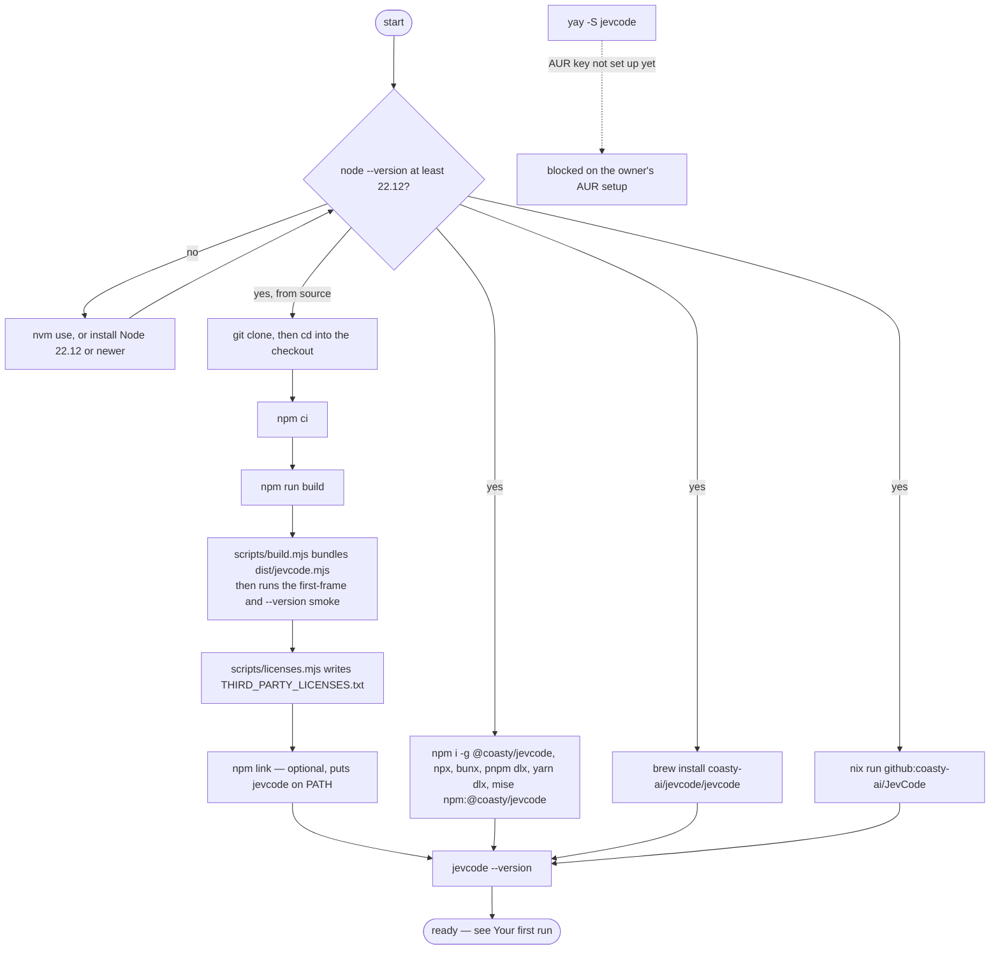

# Install

JevCode is one command, `jevcode`. This page lists every install path, says which ones are live,
and gives the command that proves each one succeeded. The short version:

```sh
npm i -g @coasty/jevcode
```

## What you need

| Requirement | Why | Check |
| --- | --- | --- |
| Node 22.12 or newer | the launcher refuses to start below it and exits with code 2 | `node --version` |
| `git` | shadow worktrees, checkpoints, the diff in a review card | `git --version` |
| `/bin/sh` | every sandboxed command runs through a shell | present on macOS and Linux |
| Python 3 | the benchmark suites, and any workspace whose own tests are Python | `python3 --version` |

The repository pins **22.23.2** in `.nvmrc`, so `nvm use` in a clone picks a version that is
known to work. `.npmrc` sets `engine-strict=true`, which turns a too-old Node into an install
error rather than a surprise at runtime.

Windows is not supported. Use WSL2.

## Zero runtime dependencies

`package.json` declares no `dependencies` at all. The build inlines `ink` and `react` into a
single ECMAScript module, `dist/jevcode.mjs`, so installing JevCode adds exactly one package to
your machine and nothing else. `THIRD_PARTY_LICENSES.txt` carries the attributions for
everything that was bundled in, because the bundler strips license comments from its output.

## From source

```sh
git clone https://github.com/coasty-ai/JevCode && cd JevCode
npm ci
npm run build
npm link            # optional: puts `jevcode` on PATH
```

`npm run build` does two things in order. `scripts/build.mjs` bundles `dist/jevcode.mjs`, then
runs a smoke test: it starts the bundle with `JEVCODE_ASSERT_NO_NETWORK=1`, which makes any HTTP
request before the first frame throw, and asserts both that the first frame renders and that
`--version` prints the version in `package.json`. Then `scripts/licenses.mjs` regenerates
`THIRD_PARTY_LICENSES.txt`.

Proof that it worked:

```sh
jevcode --version     # jevcode <version>, as in package.json
jevcode --help        # the command list
jevcode config        # the resolved configuration, with the source of every value
```

`jevcode config` is the most useful of the three: it prints every setting, the value it resolved
to, and where that value came from. Secrets appear as fingerprints, never as keys.

## Install channels

Checked on 2026-09-25: the package is on npm, so npm, the one-shot runners and mise work; the Homebrew
tap exists and carries the latest stable release; `flake.lock` is committed for Nix. The AUR package
does not exist yet: it needs a one-time step by the repository owner. The owner's steps are in
[`../RELEASE.md`](../RELEASE.md#one-time-setup).

| Channel | Command | Available |
| --- | --- | --- |
| npm / npx | `npm i -g @coasty/jevcode`, `npx @coasty/jevcode` | yes |
| bun / pnpm / yarn | `bunx @coasty/jevcode`, `pnpm dlx @coasty/jevcode`, `yarn dlx @coasty/jevcode` | yes |
| mise | `mise use -g npm:@coasty/jevcode` | yes |
| Homebrew | `brew install coasty-ai/jevcode/jevcode` | yes, stable releases |
| AUR | `yay -S jevcode` or `paru -S jevcode` | not yet: waits for the owner's AUR setup (step 7) |
| Nix | `nix run github:coasty-ai/JevCode` | yes; it builds from source, not from npm |

Every channel still runs the launcher under Node, so Node 22.12 or newer must be on `PATH` (Homebrew, AUR and Nix
install it for you).

The npm package is scoped, `@coasty/jevcode`; the command it installs is `jevcode`. Homebrew, the AUR and Nix call
the package `jevcode`.

Pre-releases: `npm i -g @coasty/jevcode@next`. Homebrew and AUR carry stable releases only.

### npm and npx

```sh
npm i -g @coasty/jevcode
npx @coasty/jevcode           # run once without installing
```

Proof: `jevcode --version` prints `jevcode <version>`. Update with `jevcode upgrade` or `npm i -g @coasty/jevcode@latest`.

**Status:** available.

### bun, pnpm and yarn

They read the same npm package.

```sh
bunx @coasty/jevcode          # or: bun i -g @coasty/jevcode
pnpm dlx @coasty/jevcode      # or: pnpm add -g @coasty/jevcode
yarn dlx @coasty/jevcode      # Yarn 2 or newer
```

Proof: `bunx @coasty/jevcode --version` prints `jevcode <version>`.

**Status:** available.

### mise

Use mise's `npm:` backend. mise needs `npm` on `PATH` for it.

```sh
mise use -g npm:@coasty/jevcode
mise use -g npm:@coasty/jevcode@<version>     # a pinned version
```

Proof: `mise exec -- jevcode --version`. Update with `mise upgrade npm:@coasty/jevcode`.

The bare shorthand `mise use -g jevcode` does not work: the name is not in mise's registry.

**Status:** available.

### Homebrew

```sh
brew install coasty-ai/jevcode/jevcode
```

Proof: `jevcode --version` and `brew test jevcode`. Update with `brew upgrade jevcode`. The formula also installs
the man page and the bash, zsh and fish completions.

**Status:** available. The owner's tap setup (one-time step 6 in
[`../RELEASE.md`](../RELEASE.md#6-homebrew-tap)) is done, and the tap takes stable releases only.

### AUR (Arch Linux)

```sh
yay -S jevcode        # or: paru -S jevcode
```

Without an AUR helper:

```sh
git clone https://aur.archlinux.org/jevcode.git
cd jevcode
makepkg -si
```

Proof: `jevcode --version` and `pacman -Qi jevcode`. Update through your AUR helper.

**Status:** not available yet. The package appears with the first stable release after the owner sets up the
AUR key (one-time step 7 in [`../RELEASE.md`](../RELEASE.md#7-aur)). Until then the package does not exist.

### Nix

The flake builds JevCode from source, so it does not depend on npm.

```sh
nix run github:coasty-ai/JevCode -- --version
nix profile install github:coasty-ai/JevCode
nix run github:coasty-ai/JevCode/v<x.y.z>       # a pinned release tag
```

If flakes are not enabled, add `--extra-experimental-features 'nix-command flakes'`. There is no binary cache, so
the first run builds for a few minutes.

Proof: `nix run github:coasty-ai/JevCode -- --version` prints `jevcode <version>`. Update with
`nix profile upgrade JevCode` (the element name nix gives a `github:coasty-ai/JevCode` install), or
`nix profile upgrade --all`.

**Status:** available: `flake.lock` is committed (one-time step 8 in
[`../RELEASE.md`](../RELEASE.md#8-nix-lock)). A pinned tag works when that tag contains `flake.lock`.

For mise, AUR and Nix installs, update with the tool you installed with.

## The whole path, as a picture



## Measured build facts

These come from one `npm run build` plus `node scripts/check-pack.mjs` on this tree at version
0.5.0. They are a measurement, not a promise: the bundler's own version moves the byte counts,
and `README.md` is inside the tarball, so re-run both commands to get your own.

| Quantity | Value |
| --- | --- |
| `dist/jevcode.mjs`, minified | 2,854,413 bytes |
| unpacked package | 2,991,973 bytes, against a gate of 3,500,000 |
| gzipped tarball | 1,009,511 bytes, against a gate of 1,500,000 |
| files in the package | 10 |
| runtime dependencies | 0 |

`node scripts/check-pack.mjs` re-checks all of those, plus the file allowlist and a `--version`
smoke, before a release.

## If something goes wrong

**`jevcode: Node 22.12 or newer is required`** — the launcher, `bin/jevcode.js`, checks the Node
version before it loads anything else and exits 2. Nothing else ran.

**Colour where you did not want it** — set `NO_COLOR`. The launcher maps it onto the colour
library's own switch before the bundle is evaluated, so it takes effect on the very first frame.

**A build that fails at the smoke step** — the smoke runs with network access denied. A failure
there means something on the startup path is trying to reach the network before the first frame,
which is worth reporting as a bug.

## Next

- [Your first run](first-run.md) — a bare `jevcode` from an empty configuration, end to end.
- [Keys](keys-and-providers.md) — which key you need, and where each one is read from.
- [The four modes](modes.md) — what actually runs, and what it costs.
- [CLI reference](../reference/cli.md) — every command and flag.
