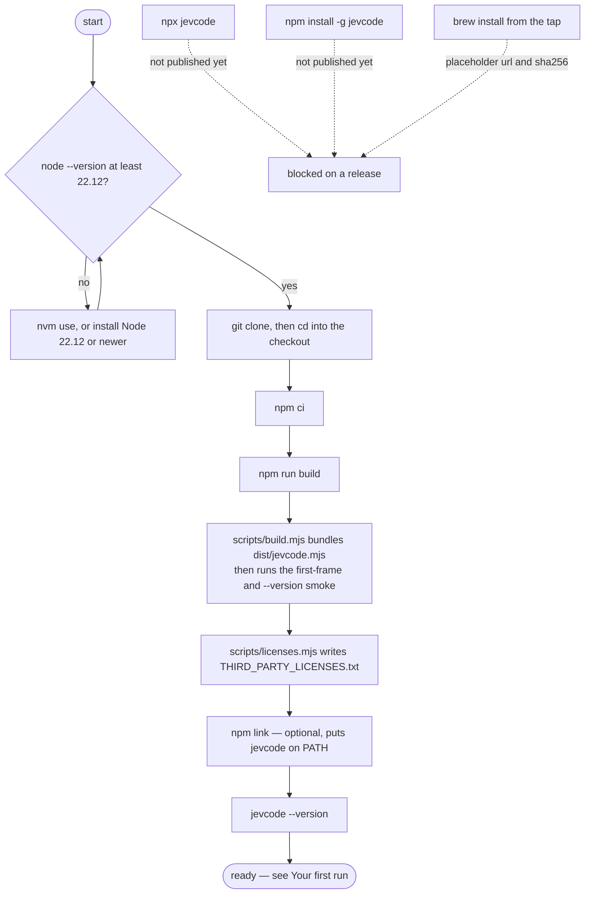

# Install

JevCode is one command, `jevcode`. This page lists every install path, in order of how well it
works today, and gives the command that proves each one succeeded.

## What you need

| Requirement | Why | Check |
| --- | --- | --- |
| Node 22.12 or newer | the launcher refuses to start below it and exits with code 2 | `node --version` |
| `git` | shadow worktrees, checkpoints, the diff in a review card | `git --version` |
| `/bin/sh` | every sandboxed command runs through a shell | present on macOS and Linux |
| Python 3 | the benchmark suites, and any workspace whose own tests are Python | `python3 --version` |

The repository pins **22.23.2** in `.nvmrc`, so `nvm use` in a clone picks a version that is
known to work. `.npmrc` sets `engine-strict=true`, which turns a too-old Node into an install
error rather than a surprise at runtime.

Windows is not supported. Use WSL2.

## Zero runtime dependencies

`package.json` declares no `dependencies` at all. The build inlines `ink` and `react` into a
single ECMAScript module, `dist/jevcode.mjs`, so installing JevCode adds exactly one package to
your machine and nothing else. `THIRD_PARTY_LICENSES.txt` carries the attributions for
everything that was bundled in, because the bundler strips license comments from its output.

## From source — the path that works today

```sh
git clone <this repository> && cd JevCode
npm ci
npm run build
npm link            # optional: puts `jevcode` on PATH
```

`npm run build` does two things in order. `scripts/build.mjs` bundles `dist/jevcode.mjs`, then
runs a smoke test: it starts the bundle with `JEVCODE_ASSERT_NO_NETWORK=1`, which makes any HTTP
request before the first frame throw, and asserts both that the first frame renders and that
`--version` prints the version in `package.json`. Then `scripts/licenses.mjs` regenerates
`THIRD_PARTY_LICENSES.txt`.

Proof that it worked:

```sh
jevcode --version     # jevcode 0.5.0
jevcode --help        # the command list
jevcode config        # the resolved configuration, with the source of every value
```

`jevcode config` is the most useful of the three: it prints every setting, the value it resolved
to, and where that value came from. Secrets appear as fingerprints, never as keys.

## Not available yet

The package has not been published. These three paths are written down so that you know they
are planned, not so that you can use them:

| Path | State |
| --- | --- |
| `npx jevcode` | unavailable — nothing is on the npm registry |
| `npm install -g jevcode` | unavailable — same reason |
| `brew install <owner>/jevcode/jevcode` | unavailable — `Formula/jevcode.rb` still carries a placeholder `url` and a deliberately invalid `sha256`, so an unreleased copy cannot install by accident |

The release procedure that turns these on is [`../RELEASE.md`](../RELEASE.md).

## The whole path, as a picture



## Measured build facts

These come from one `npm run build` plus `node scripts/check-pack.mjs` on this tree at version
0.5.0. They are a measurement, not a promise: the bundler's own version moves the byte counts,
and `README.md` is inside the tarball, so re-run both commands to get your own.

| Quantity | Value |
| --- | --- |
| `dist/jevcode.mjs`, minified | 2,854,413 bytes |
| unpacked package | 2,991,973 bytes, against a gate of 3,500,000 |
| gzipped tarball | 1,009,511 bytes, against a gate of 1,500,000 |
| files in the package | 10 |
| runtime dependencies | 0 |

`node scripts/check-pack.mjs` re-checks all of those, plus the file allowlist and a `--version`
smoke, before a release.

## If something goes wrong

**`jevcode: Node 22.12 or newer is required`** — the launcher, `bin/jevcode.js`, checks the Node
version before it loads anything else and exits 2. Nothing else ran.

**Colour where you did not want it** — set `NO_COLOR`. The launcher maps it onto the colour
library's own switch before the bundle is evaluated, so it takes effect on the very first frame.

**A build that fails at the smoke step** — the smoke runs with network access denied. A failure
there means something on the startup path is trying to reach the network before the first frame,
which is worth reporting as a bug.

## Next

- [Your first run](first-run.md) — a bare `jevcode` from an empty configuration, end to end.
- [Keys](keys-and-providers.md) — which key you need, and where each one is read from.
- [The four modes](modes.md) — what actually runs, and what it costs.
- [CLI reference](../reference/cli.md) — every command and flag.
