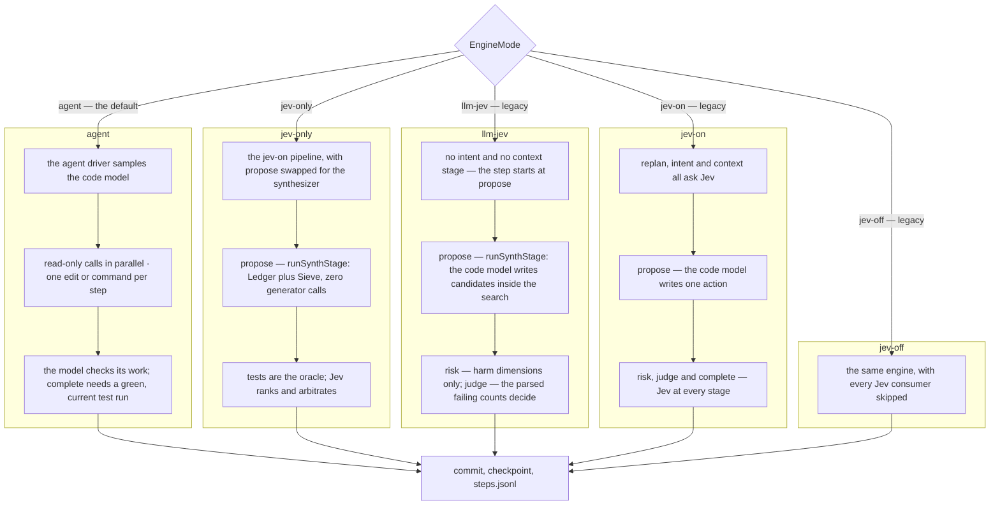

# Modes

A mode decides **who proposes the code** and **who decides what happens to it**. `agent` is the
default. `jev-only` is the other mode on offer, and three older modes stay accepted for saved
configurations, resuming old runs and the bench. All five share one engine and one set of
records.

## At a glance

| Mode | Badge | Who writes the code | Who decides | Keys | Default run cap |
| --- | --- | --- | --- | --- | --- |
| `agent` *(default)* | `agent` | the code model, through tools | the code model, which checks its own work in proportion to the change; Jev makes a few quick routing calls | a code-model key (Jev optional) | $10.00 |
| `jev-only` | `jev-only` | nobody — code enumerates candidates | tests verify, Jev ranks | a Jev key | $1.00 |

**Legacy modes** — accepted by `--mode`, `config set mode`, resume and the bench, listed by
`/mode legacy`, no longer offered anywhere else:

| Mode | Badge | Who writes the code | Who decides | Default run cap |
| --- | --- | --- | --- | --- |
| `llm-jev` | `llm+jev · verified` | the code model, inside the search | tests verify, Jev arbitrates | $10.00 |
| `jev-on` | `jev+llm` | the code model, one action per step | Jev, at every stage | $10.00 |
| `jev-off` | `llm-only` | the code model alone | nobody | $10.00 |

The session cap is five times the run cap in every mode, so $50.00 by default and $5.00 under
`jev-only`.

## How to switch

| Where | How |
| --- | --- |
| launch | `jevcode --mode jev-only` |
| inside a session | `/mode jev-only` — takes effect on the **next** run; the badge reads `jev-only · next run` until it does. `/llm on` is `/mode agent`, `/llm off` is `/mode jev-only` |
| environment | `JEVCODE_MODE=jev-only` |
| persistently | `jevcode config set mode jev-only` |

The precedence is the usual one: flag, then the environment, then `./.env`, then the config
file, then the default. One constant in `src/config/defaults.ts` names the default, and every
message that mentions it reads that constant, so the two can never disagree. A saved
`mode llm-jev` keeps working.

## What each mode is for

### `agent` — the default

The code model drives. It streams its prose, calls tools natively — `read_file`, `grep`, `glob`,
`edit_file`, `write_file`, `bash`, `todo_write`, several per reply, reads in parallel — checks its
own work in proportion to the change, and the harness runs each call in the sandbox and checkpoints
every step for `/undo`. `--agent-verify tests` makes the harness also run your test command after
changes. Every chat message is a turn of one conversation: a greeting gets
a streamed reply, a task gets tool calls, and a follow-up sees everything that came before.

Jev is asked at most one quick question in a normal run, and none on the default provider. A Jev
key is therefore optional: one code-model key is enough. The step cap defaults to 250 in this
mode, because a step is one read-only batch, one edit or command, one test run or the final
answer. See [The agent loop](../architecture/agent-loop.md).

### `jev-only` — no generating model at all

The propose stage is a synthesizer instead of a model: code enumerates candidate fixes, the
tests are the oracle, and Jev ranks and arbitrates. See
[The synthesizer](../concepts/the-synthesizer.md).

The claim that this makes **zero** generating-model calls is a property of every record, not a
slogan. In one recorded 40-program run, all 40 records carry `generatorCalls: 0`, all of
`generatorTokensPerStep` zero, and `cost.generator` exactly 0.

Its run cap defaults to $1.00 rather than $10.00 because there is no code model to pay for.

### `llm-jev` — legacy, the default until 2026-09-23

The code model writes candidate patches **inside** the search. Tests verify them, and Jev only
arbitrates between candidates that already pass.

There is no intent stage and no context stage: the step starts at propose. Risk asks only the
harm dimensions — `destructive` and `irreversible` — and records the two alignment dimensions
at level 0 without letting them gate. Judge is code: the parsed failing counts decide, and
Jev's judge answers are recorded rather than consulted. Completion is a code fact about the
harness's own green run, not a probability.

If the search does not cover a workspace — not Python, no tests, feature work rather than a
bug — that step falls back to the ordinary "the code model writes one action" path.

### `jev-on` — legacy, Jev decides every step

The full pipeline: replan, intent, context, propose, risk, judge, complete. The code model
writes one action per step and Jev is asked at every stage.

### `jev-off` — legacy, the control arm

The code model alone, in the step loop. No decision, no intent, no context, no risk, no judge
and no replan event ever fires. It exists so that every claim about the Jev-driven modes has
something to be measured against. `src/loop/generator-only.ts` is a thin factory that pins the
mode; the engine is the same one, taking the branch where the decision model is absent.

## The dispatch, as a picture

## What is measured

The agent loop has been verified live but not benchmarked. The measurements below are of the
legacy `llm-jev` mode, taken while it was the default. Two head-to-heads, both from the same
frozen build, both recorded in
[`../LLM-JEV.md`](../LLM-JEV.md) under the dated 2026-09-22 entries. Read them with their
caveats, which are given below the table.

| Slice | `llm-jev` | control | Notes |
| --- | --- | --- | --- |
| same-build, 28 tasks | **28/28**, Wilson [88 %, 100 %] | plain `jev-off` **21/28**, [57 %, 87 %] | discordance b = 7 / c = 0, exact sign p = 0.0078 |
| — median wall, pooled | 63.0 s | 246.3 s | one-sided censoring: 8 of 28 control runs hit the wall cap, 0 of 28 candidate runs did |
| — median wall, the 21 both solved | 39.5 s | 175.3 s | per-task ratio median 0.291; the candidate was slower on 1 of 21 |
| — cost | $0.1441 | $0.5875 | see the cost-basis caveat |
| out of sample, 22 tasks | **13/22**, [39 %, 77 %] | tuned `jev-off` **12/22**, [35 %, 73 %] | discordance b = 2 / c = 1, p = 0.500 |
| — median wall, pooled | 190.7 s | 137.7 s | **1.385× against** the candidate |
| — cost | $0.7918 | $0.2959 | **2.68×** the control |

**Caveats that travel with those numbers.** One run per arm. The in-sample 28 include the tasks
some thresholds were tuned on, so that row is in-sample and does not generalise as a capability
claim. The out-of-sample 22 were chosen by fixed rules to exclude every tuned name. The
SWE-bench evaluator is a local-virtualenv replica, not the official container. The warm
verification plane was off for every number. And the cost basis is not symmetric: **78 % of
`llm-jev`'s dollars are an estimate or a rate card** (88.4 % on the out-of-sample slice), while
the baseline's are 100 % provider-reported. Any dollar comparison has to carry that sentence.

The honest reading: inside the one-line-bug regime the mode transfers — same pass rate, about a
third of the wall, about a third of the dollars, and zero overfits on ten programs it was never
fitted to. Outside it, the extra decision traffic bought one extra ladder task and no SWE
instance for roughly three times the time and money.

`jev-only` and `jev-on` have their own measurement logs: [`../JEV-ONLY.md`](../JEV-ONLY.md) and
the rows in [`../STATUS.md`](../STATUS.md).

## Depth

- [`../AGENT-LOOP-DESIGN.md`](../AGENT-LOOP-DESIGN.md) — `agent`, normative
- [`../DESIGN.md`](../DESIGN.md) §21 — `jev-only`, normative
- [`../DESIGN.md`](../DESIGN.md) §22 — `llm-jev`, normative
- [`../JEV-ONLY.md`](../JEV-ONLY.md) — the dated measurement log for `jev-only`
- [`../LLM-JEV-DESIGN.md`](../LLM-JEV-DESIGN.md) §1 — why `llm-jev` exists

## Next

- [The agent loop](../architecture/agent-loop.md)
- [What Jev is](../concepts/what-is-jev.md)
- [The synthesizer](../concepts/the-synthesizer.md)
- [Verification and the oracle](../concepts/verification.md)
