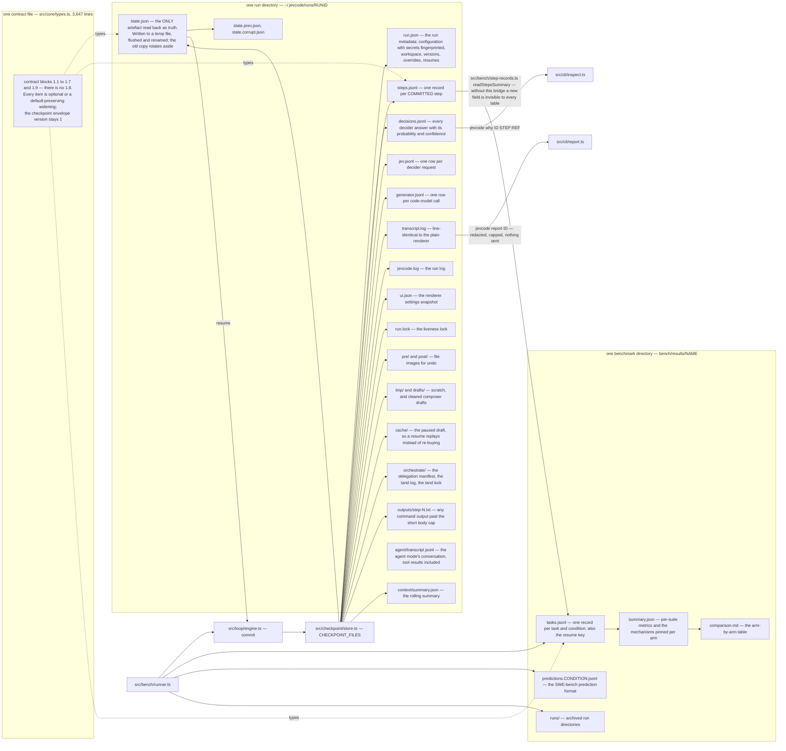

# What a run writes

Every run gets a directory under `~/.jevcode/runs/<run-id>/`. Everything the run decided, spent,
changed and printed is in it, and it is all plain JSON, newline-delimited JSON or text.

Two properties shape the whole layout. One file, `state.json`, is the **only** artefact read
back as truth, so it is written to a temporary file, flushed, and renamed into place, with the
previous copy rotated aside. Everything else is an append-only log that a reader may find with
a torn last line and must tolerate. And every string leaf passes the redactor before it is
serialised, so no configured secret can reach disk through any artefact.

<!-- src/checkpoint/store.ts:1-9 -->

## The directory

<!-- src/checkpoint/store.ts:31-69 CHECKPOINT_FILES, the full map -->

## The files, one by one

| Name | Shape | What is in it |
| --- | --- | --- |
| `run.json` | JSON object | run id, task, workspace, mode, the resolved configuration with every secret replaced by a fingerprint, the JevCode and Node versions, when it started, every override with the step it happened at, every resume, the resolved decider model, and — when they apply — the session id, the parent run, the title, the git metadata, the instruction files folded into the prompt, and the delegation record |
| `state.json` | JSON object | the only file read back as truth: the plan, the prompt window, the committed step count, cumulative spend and wall time, the loop detector, any interrupted step and its draft, the tiered history, the files in view, the rolling-summary marker |
| `state.prev.json` | JSON object | the previous `state.json`, moved aside by rename rather than copied |
| `state.corrupt.json` | JSON object | a `state.json` that failed to parse, kept rather than deleted |
| `steps.jsonl` | one JSON object per line | one record per **committed** step |
| `decisions.jsonl` | one JSON object per line | every decider answer with its probability and its derived confidence |
| `jev.jsonl` | one JSON object per line | one row per decider request |
| `generator.jsonl` | one JSON object per line | one row per code-model call; absent when no code model ran |
| `transcript.log` | text | line-identical to the plain renderer's output and to the interactive transcript |
| `jevcode.log` | text | the run log at the configured level; rotated, with the rotated half kept |
| `ui.json` | JSON object | the renderer settings the session mounted with |
| `run.lock` | JSON object | the liveness lock, holding the process id, boot identity and claim |
| `pre/`, `post/` | files | file images before and after a step, for undo and rewind |
| `tmp/`, `drafts/` | files | scratch files, and cleared composer drafts, redacted |
| `cache/` | JSON files | `step-<n>.json`, the paused draft, so a resume replays what already arrived instead of buying it again |
| `orchestrate/` | JSON and log files | the delegation manifest, the agent seeds, the review records, the land log and the land lock |
| `outputs/` | text files | `step-<n>.txt`, the whole output of a command whose body was too long to inline (in agent mode, `step-<n>-<k>.txt` for the k-th command of a read-only batch) |
| `agent/transcript.jsonl` | one JSON object per line | agent mode only: the append-only conversation the model reads — user and harness notes, the model's replies with their tool calls, one record per tool result, masking and compaction marks, and a `carry` record when the run continues the previous run of the session. Mode `0600`; written before each step's checkpoint, and truncated back to the checkpoint on resume. The reasoning state some providers need replayed is kept here unredacted and never emitted anywhere else |
| `context/summary.json` | JSON object | the rolling summary the compactor produced |

Two caps are worth knowing. An output longer than the inline body — 600 characters — gets its own
file, so there is no size band with neither a file nor an inline body. One output file is at
most 1 MiB, and the whole `outputs/` directory at most 64 MiB per run; past that the oldest are
dropped.

<!-- src/checkpoint/store.ts:31-69; src/core/limits.ts:42-45 -->

Command output is stored cleaned, never raw. `outputs/step-<n>.txt`, the step's outcome in
`steps.jsonl` and the tool result in `agent/transcript.jsonl` are all built from the one cleaned
text the model reads:

- escape sequences are removed whole, so coloured test output reads as its plain form and its
  counts parse;
- a carriage-return progress redraw keeps only its final state, and one closing line says how
  many redraws were collapsed. A segment counts as a redraw only when the program erased the line
  or the segment repeats the same words with other numbers. Text after a carriage return that is
  neither, such as a file with old Mac line endings, is kept with one part per line;
- backspaces are applied, a NUL byte reads as a line break (so `find -print0` and
  `git status -z` keep their separators), and every other control character is dropped (tabs
  and line breaks stay);
- a stream that looks binary is replaced by one line that names its size and suggests
  `xxd | head` or `file`.

The cleaning runs before redaction, so a key that sits right after a colour code is still
recognised and masked. File contents are never cleaned: `read_file` and edits work on the exact
bytes, and so does the harness's own git.

<!-- src/core/ansi.ts cleanCommandStreams; src/loop/stages/execute.ts and src/agent/tools/shell.ts the run paths -->

## One step record

A step record carries everything about one committed step: the effective intent and the raw
answer behind it, the context files, the proposal, the risk assessment, the action outcome, the
judge's verdict, the completion probability, the decisions and decider requests of the step, its
token usage, its per-stage timings, the loop-detection signatures, and — when they apply — the
coordination facts, the verification counts, the decider cache hits, and who proposed the step.

Nothing is written for a step that did not commit. A step interrupted mid-stage leaves its
record in `state.json` as an interruption, not in `steps.jsonl`.

<!-- src/core/types.ts:504-560 StepRecord -->

## The contract blocks, and why there is no 1.8

All the shapes above are declared in one file, `src/core/types.ts`, 3,647 lines. Its header
lists the waves of additions as numbered contract blocks:

| Block | What it added |
| --- | --- |
| 1.1 | the interactive session's extensions |
| 1.2 | conversational intake, decider providers, the mode setting, chat labels |
| 1.2 again | the generator-channel fields — a second block written the same day under the same number |
| 1.3 | renderer bindings, the setup wizard's mode outcome, host dispatch context |
| 1.4 | coordination: pause points, the context meter, the registry API |
| 1.5 | orchestration: the decompose stage, the manifest, agents, the landing queue |
| 1.6 | import: memory, rules, commands, model servers and the import plan |
| 1.7 | interface round four: block rows, diff detail, the renderer setting, the peer view |
| 1.9 | speculative routers, the bounded fast path, the generation-path counters |

**There is no 1.8.** The numbering skips it; that is not a typo on this page.

Every block obeys one rule: each item is optional, a new union member, or a widening that
preserves the existing default. The checkpoint envelope version has stayed at 1 throughout, so
a run directory written by an older build still loads.

<!-- src/core/types.ts:1-20 -->

## Reading a run back

**`jevcode why <run-id> <step> <ref>`** prints the worked block behind one decision: every level
or option with its probability, the most likely answer, the expected level, the tail mass, the
confidence formula, and the code rule that consumed the answer. It reads `decisions.jsonl` for
that run — not `steps.jsonl` — and it exits 2 when there is no such run or no such decision.

**`jevcode calibration`** streams the newest runs' `decisions.jsonl` and `steps.jsonl` for this
workspace and prints reliability bins, calibration error, near-threshold counts and sharpness.

**`jevcode report <run-id>`** assembles a redacted support bundle under
`~/.jevcode/reports/<run-id>/`: the run metadata, the state file, the transcript, the run log and
its rotated half, the last 20 step records, the last 200 decisions, the renderer snapshot, the
resolved configuration, a versions file and a short read-me with the issue tracker URL.
Everything passes the redactor. Decider request bodies are included only when you ask for them.
**Nothing is sent anywhere** — the command writes a directory and tells you where it is.

Two caps keep the command usable on a long run: each file contributes at most its first 2 MiB
and its last 2 MiB with an elision marker between, and each read is bounded by a ten-second
timeout so a run directory on a stalled network mount does not hang the command at the exact
moment you are filing a bug.

<!-- src/cli/inspect.ts:1-4, :44; src/cli/report.ts:1-40 -->

## How a run reaches a benchmark table

The benchmark harness reads the engine's own result object for a task, and it never re-derives
a field from the run directory — with one deliberate exception. Fields that the frozen per-task
record cannot carry are folded out of `steps.jsonl` by one bridge module and summed over the
run: the synthesis timings, the verification counts, the fast-path counters, the router
counters, the risk-source counts and the generation-path timings.

That bridge is load-bearing in an unobvious way. Without it, a newly added step field is written
to the run directory correctly and is invisible to every table, so a row reads zero for a reason
that has nothing to do with the mechanism being measured.

The bridge reads rows loosely — only the fields it sums are dereferenced — so a run written by
an older engine contributes zeros rather than an error.

<!-- src/bench/step-records.ts:1-40 -->

## Related pages

- [Bench, rings and replay](bench-and-rings.md) — what the benchmark directory holds.
- [The coordination ledger](../architecture/coordination.md) — the other directory a run writes to.
- [Sandbox and security guarantees](sandbox-and-security.md) — why nothing here contains a key.
- [Exit codes](exit-codes.md) — the checkpoint is written before every exit.
- [`../DESIGN.md`](../DESIGN.md) §9 checkpoints and resume, §11 exit codes.
